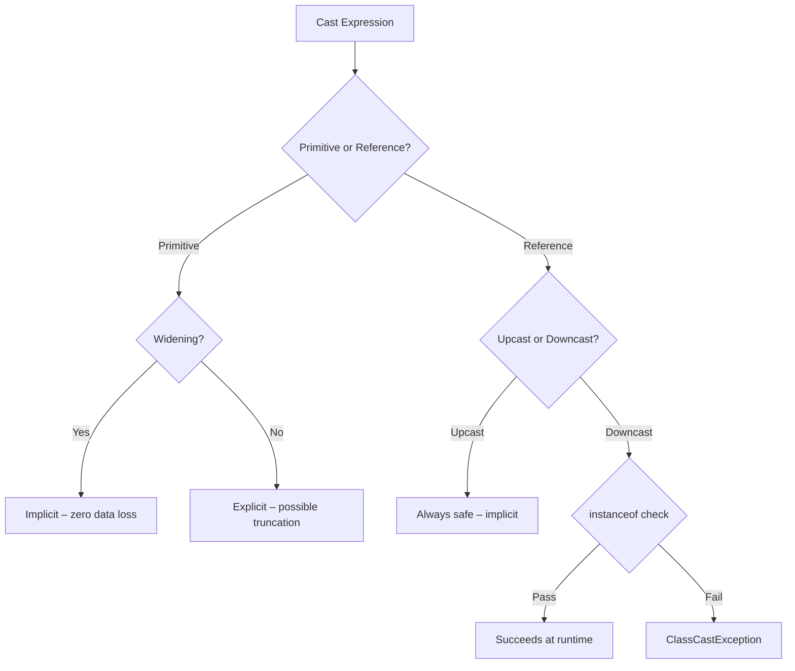
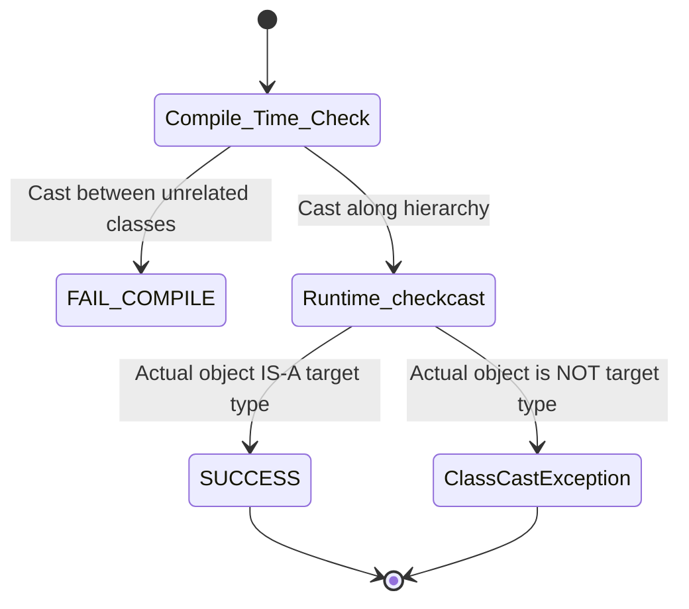
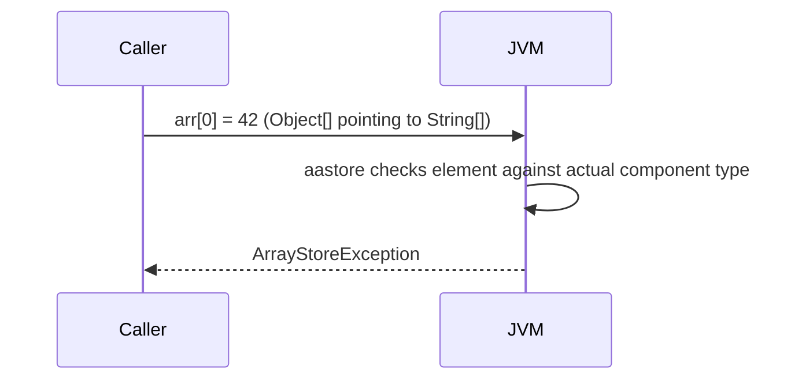

<!-- tldr -->
# Type Casting in Java

Java's type system is statically typed but allows controlled escape hatches via casting. Casting falls into two axes: **primitive vs. reference** and **widening vs. narrowing**. The JVM enforces reference-type casts at runtime via `checkcast` bytecode, throwing `ClassCastException` on violation. Generics complicate this further because type erasure eliminates parameterized type information at runtime.



<!-- standard -->

## What It Is and Why It Matters

Casting is the mechanism by which a value of type `S` is treated as type `T`. In Java, legality is checked at compile time for obvious violations and enforced at runtime for reference downcasts. Getting this wrong produces silent data corruption (primitive narrowing) or loud `ClassCastException` crashes (bad reference casts) — both are classic interview trap questions.

### Primitive Casting

| Direction | Example | Implicit? | Risk |
|---|---|---|---|
| Widening | `int → long` | ✅ Yes | None |
| Widening (lossy float) | `long → double` | ✅ Yes | Precision loss for >53-bit integers |
| Narrowing | `long → int` | ❌ Must be explicit | Truncation (high bits discarded) |
| Narrowing | `double → int` | ❌ Must be explicit | Truncation (fractional part dropped) |
| `char ↔ int` | `(char) 65 → 'A'` | Context-dependent | Implicit in widening direction only |

**Key gotcha:** `(int) 3.9` yields `3`, not `4` — truncation, not rounding.

### Reference Casting

- **Upcasting** (`Dog → Animal`): always implicit; no `checkcast` emitted.
- **Downcasting** (`Animal → Dog`): explicit; JVM emits `checkcast`; throws `ClassCastException` if the actual heap object is not a `Dog`.
- **Pattern matching `instanceof`** (Java 16+): combines test + cast in one expression — `if (obj instanceof Dog d) { d.bark(); }` — eliminates the redundant cast and is the idiomatic modern style.

### Autoboxing Interaction

```java
Integer a = 127;   // cached — same reference
Integer b = 127;
a == b;            // true (cache hit)

Integer x = 128;
Integer y = 128;
x == y;            // false — separate heap objects
```

Narrowing through unboxing: `long l = integerObj;` → unboxes to `int`, then widens to `long`. If `integerObj` is `null`, you get `NullPointerException`, not `ClassCastException`.

---

<!-- deep -->

## Deep Dive: Internals, Failure Modes, and Interview Traps

### JVM Bytecode Level

The compiler emits one of three instructions:

| Bytecode | Meaning |
|---|---|
| `i2l`, `l2i`, `d2i` … | Primitive conversion (widening/narrowing) |
| `checkcast <type>` | Reference downcast — throws `ClassCastException` on failure |
| `instanceof <type>` | Reference test — returns boolean, no throw |

A pure upcast emits **no bytecode at all** — it is a compile-time fiction.

### Numeric Precision Traps

#### `long → double` silent precision loss

```java
long big = 9_999_999_999_999_999L;  // 16 significant digits
double d  = (double) big;           // IEEE 754 has 15-16 decimal digits
long back = (long) d;               // 9_999_999_999_999_998L — off by 1
```

`double` has 52-bit mantissa ⟹ integers > 2^53 (≈ 9 × 10^15) cannot be represented exactly.

#### Byte overflow wrap-around

```java
int  i = 200;
byte b = (byte) i;   // -56  (200 - 256)
```

Narrowing discards high bits and **sign-extends** the remaining bits. This bites engineers writing serialization or crypto code.

### Reference Casting: The Type Hierarchy Machine



The compiler only rejects casts between **provably disjoint** types (e.g., `String` → `Integer`). For interface types, the compiler almost always defers to runtime because any class could implement the interface.

```java
Object o = "hello";
Number n = (Number) o;  // Compiles fine — compiler can't prove o isn't a Number subclass
                         // ClassCastException at runtime
```

### Generics and Heap Pollution

Type erasure means generic parameters are removed at compile time. The compiler inserts synthetic `checkcast` instructions at the **use site**, not the cast site.

```java
List<Integer> ints = new ArrayList<>();
List raw = ints;              // unchecked — heap pollution begins
raw.add("oops");              // compiles with warning
int val = ints.get(0);        // ClassCastException HERE — at the get(), not the add()
```

This is why `@SuppressWarnings("unchecked")` on raw-type casts is a code smell that can detonate far from its origin.

#### Safe generic cast pattern

```java
@SuppressWarnings("unchecked")
public static <T> T safeCast(Object o, Class<T> clazz) {
    if (!clazz.isInstance(o)) throw new ClassCastException(...);
    return clazz.cast(o);     // cast() internally calls checkcast
}
```

`Class<T>.cast()` is the idiomatic, type-safe way to cast generics at runtime.

### Covariance, Contravariance, and Arrays

Java arrays are **covariant**: `String[]` is-a `Object[]`. This is a known design mistake.

```java
Object[] arr = new String[3];
arr[0] = 42;   // ArrayStoreException at runtime — JVM checks element type on write
```

Generic collections are **invariant** — `List<String>` is NOT a `List<Object>` — which prevents `ArrayStoreException` at the cost of flexibility. Use `? extends T` / `? super T` wildcards (PECS) when you need variance in APIs.



### Pattern Matching `instanceof` (Java 16+, stable)

```java
// Old style — error-prone
if (shape instanceof Circle) {
    Circle c = (Circle) shape;  // redundant cast
    c.radius();
}

// Modern — single logical check, binding variable scoped to true branch
if (shape instanceof Circle c) {
    c.radius();
}

// Java 21 sealed + pattern switch — exhaustive, no default needed
switch (shape) {
    case Circle c    -> Math.PI * c.radius() * c.radius();
    case Rectangle r -> r.width() * r.height();
}
```

Sealed classes + pattern matching eliminate the `ClassCastException` failure class entirely for closed hierarchies.

### Performance Numbers

| Operation | Cost |
|---|---|
| Widening primitive cast | 0–1 CPU instruction (`cvtsi2sd` etc.) |
| `checkcast` (cache-warm JIT) | ~1 ns — branch prediction makes it near-free on happy path |
| `checkcast` (polymorphic, megamorphic) | 5–20 ns — JIT de-optimizes to v-table walk |
| `Class.cast()` (reflective) | ~15 ns — one `isInstance` call + cast |

`checkcast` is effectively free in monomorphic call sites; it hurts in hot loops with many subtypes.

### Real-World Systems

- **Jackson / Gson**: deserialize JSON into `Object`, then cast to `Map<String, Object>` or specific domain types — heap pollution is the main bug vector.
- **Hibernate**: proxy objects extend your entity class — `(MyEntity) session.load(...)` requires downcast; Hibernate relies on CGLIB-generated subclasses passing `instanceof`.
- **Kafka Streams**: `Serde<T>` uses raw bytes ↔ Java objects via explicit casts internally; incorrect Serde wiring causes `ClassCastException` in the stream topology — a common ops incident.
- **Spring Framework**: `ApplicationContext.getBean("name")` returns `Object`; idiomatic usage is `ctx.getBean("name", MyService.class)` which calls `Class.cast()` internally.

### Failure Mode Taxonomy

| Failure | Cause | Detection |
|---|---|---|
| `ClassCastException` | Bad reference downcast | Runtime |
| Silent data truncation | Narrowing primitive cast | None — logic bug |
| `ArrayStoreException` | Covariant array write | Runtime |
| `NullPointerException` on unbox | Null `Integer`/`Long` unboxed in arithmetic | Runtime |
| Heap pollution + delayed CCE | Unchecked generic cast | Runtime, far from cast site |

### Interview Pitfalls

1. **"Is `(int)(3.9 + 0.5)` the same as `Math.round(3.9)`?"** — Yes for this value, but `(int)` truncates, `Math.round` rounds half-up; they diverge at `x.5` boundaries and for negative numbers.
2. **"Can you cast `List<Integer>` to `List<Number>`?"** — No. Invariant. Use `List<? extends Number>`.
3. **"Why does `Integer.valueOf(127) == Integer.valueOf(127)` return `true`?"** — Integer cache (`-128` to `127`). Always use `.equals()` for boxed types.
4. **"Where is the `ClassCastException` thrown in a heap-polluted list?"** — At the **read** site (where the synthesized cast is), not the write site.

### When to Reach for Casting

```
Need to cast? Ask:
├── Reference type?
│   ├── Can you redesign with generics? → YES: prefer generics
│   ├── Closed hierarchy? → YES: sealed classes + pattern switch
│   └── Open hierarchy, dynamic dispatch needed? → instanceof + pattern binding
└── Primitive type?
    ├── Widening? → let it be implicit
    └── Narrowing? → explicit + add a range assertion in debug builds
```

**Rule of thumb:** An explicit downcast is a signal that your type hierarchy or API contract has a gap. Treat every `(Foo)` as a code-review checkpoint.