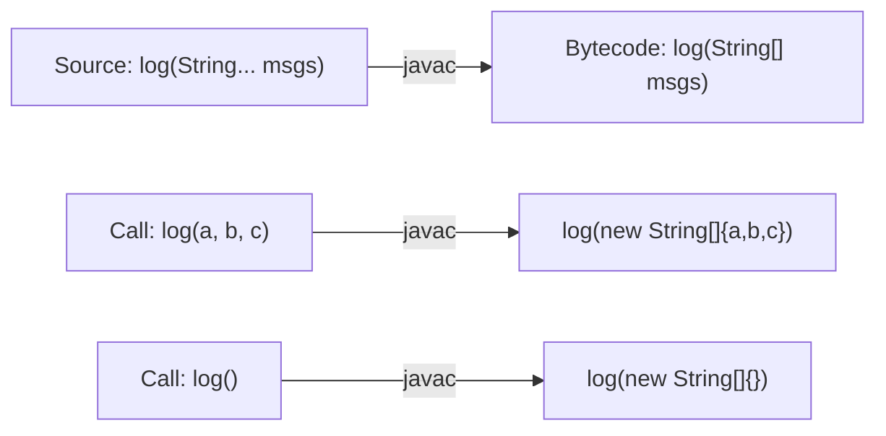
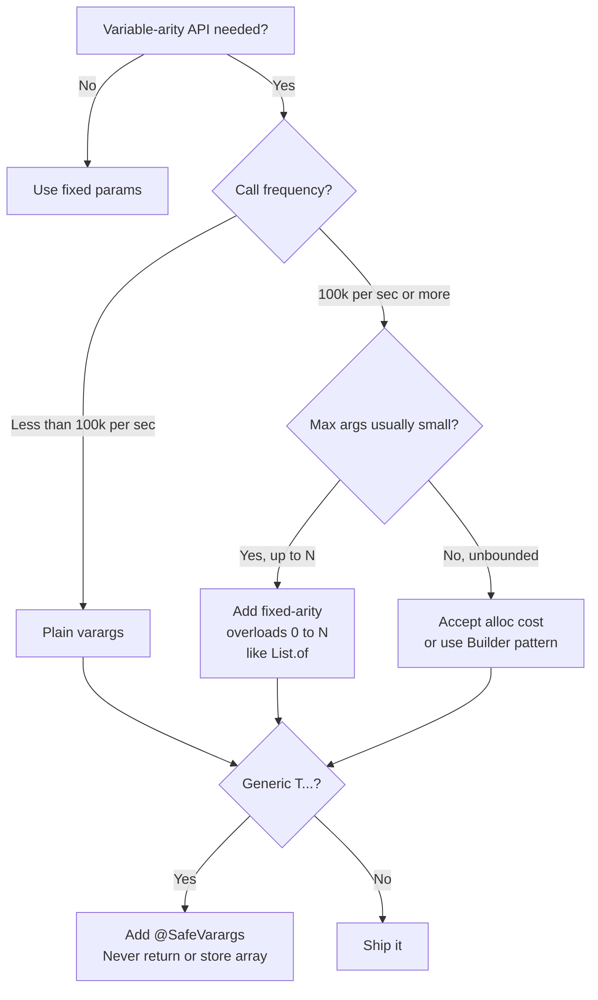

<!-- tldr -->
# Varargs

`Type... args` is pure syntactic sugar introduced in Java 5: `javac` converts every call site into `new Type[]{...}` and rewrites the method descriptor to `Type[]`. Exactly one vararg parameter is allowed per method and it must appear last. The primary interview traps are overload resolution order, `null`-array ambiguity, generic heap pollution, and per-call allocation cost.



<!-- standard -->

## What It Is

The compiler sets the `ACC_VARARGS` flag (`0x0080`) in the method's access flags. Reflection exposes this via `Method.isVarArgs()`, but `getParameterTypes()` still returns `String[].class`. The JVM itself has zero knowledge of varargs; it's entirely a `javac` transformation.

```java
void log(String format, Object... args) { }

log("done");                        // new Object[]{}
log("x=%d", 42);                   // new Object[]{42}
log("msg", new Object[]{"explicit"}); // existing array passed directly — no re-wrap
```

## Why It Matters

- **API ergonomics** — `List.of(a, b, c)` vs. `Arrays.asList(new Object[]{a, b, c})`.
- **printf family** — `String.format`, `PrintStream.printf`, `MessageFormat.format`.
- **Framework integration** — JUnit 5 `assertAll(Executable...)`, Mockito `thenReturn(T, T...)`, SLF4J `logger.info(String, Object...)`.

## Primary Techniques

| Technique | When to Use |
|---|---|
| `T... args` | Standard variable-arity API |
| Fixed-arity overloads 0–N | Hot paths; eliminates array alloc (see `List.of`) |
| `@SafeVarargs` | Generic varargs with no array escape |
| Explicit array passthrough | Caller already holds an array |

## Key Tradeoffs

- **Overload resolution** — Fixed-arity methods always win over vararg methods (Phase 1/2 vs. Phase 3 of JLS §15.12.2). Mixing both in an overload set creates confusing call sites.
- **Null trap** — `method(null)` passes `null` as the array itself, not a single-element array. Cast to `(T) null` or `new T[]{null}` to disambiguate.
- **Allocation cost** — Every call allocates a new array. JVM escape analysis can eliminate it, but is unreliable for megamorphic or non-inlined call sites.
- **Generic heap pollution** — `T... args` compiles to `Object[]` after erasure; assigning the array to `T[]` throws `ClassCastException` silently at a distant point.

```mermaid
flowchart TD
    A[Call site] --> B{Phase 1 or 2\nfixed-arity match?}
    B -->|Yes| C[Fixed-arity wins\nno array alloc]
    B -->|No| D{Phase 3\nvararg applicable?}
    D -->|Yes| E[Vararg selected\nnew T[] allocated]
    D -->|No| F[Compile error]
```

<!-- deep -->

## Bytecode Internals

```
// javap -verbose output for: static void log(String... msgs)
descriptor: ([Ljava/lang/String;)V
flags: ACC_PUBLIC, ACC_STATIC, ACC_VARARGS
```

The descriptor is identical to a plain array method. Only the flag distinguishes them. Consequently, calling a vararg method via reflection requires `Method.invoke(obj, new Object[]{ new String[]{"a","b"} })` — double-wrapping — because reflection itself wraps varargs again.

## Overload Resolution: JLS §15.12.2

The compiler runs three phases and stops at the first one that finds at least one applicable method:

| Phase | Allows boxing? | Allows varargs? |
|---|---|---|
| 1 | No | No |
| 2 | Yes | No |
| 3 | Yes | Yes |

**Implication:** This is why `java.util.List` (Java 9+) defines 11 fixed-arity `of()` overloads (0–10 elements). Callers with ≤ 10 args match in Phase 1; only 11+ args fall through to the vararg overload. This eliminates array allocation for 99%+ of practical call sites.

```java
// java.util.List — exact signatures in JDK source
static <E> List<E> of()
static <E> List<E> of(E e1)
// ... through e10
static <E> List<E> of(E... elements)  // Phase 3 fallback only
```

## Heap Pollution: Full Anatomy

```java
// Annotated @SafeVarargs but STILL unsafe — array type is Object[], not String[]
@SafeVarargs
static <T> T[] danger(T... args) { return args; }   // leaks the array

String[] result = danger("a", "b");  // ClassCastException here, not inside danger()
```

**Why:** After erasure, `T[] args` is `Object[] args`. Returning it and assigning to `String[]` inserts a compiler-generated `checkcast String[]` that fails at runtime. `@SafeVarargs` suppresses the `unchecked` warning — it does not fix the type unsafety.

**Safe contract for `@SafeVarargs`:**
1. Never return the vararg array.
2. Never store it in a field of a different generic type.
3. Only pass it to other `@SafeVarargs` or fixed-arity methods.
4. Only applicable to `final`, `static`, or constructor methods (cannot be overridden).

## Real-World Systems

| System / API | Varargs Pattern | Notes |
|---|---|---|
| `java.util.List.of` (Java 9+) | 11 fixed + 1 vararg | Eliminates alloc for ≤ 10 args |
| SLF4J `logger.info(String, Object, Object)` | Fixed-2 + vararg fallback | Saves ~15 ns per call at 1M+ calls/sec |
| JUnit 5 `assertAll(Executable...)` | Pure vararg | Collects all failures before throwing |
| Mockito `thenReturn(T first, T... next)` | 1 required + vararg | Prevents zero-arg mistake at compile time |
| `String.format(String, Object...)` | Pure vararg | Hot in logging; use SLF4J lazy form instead |
| Protobuf generated builders | Fixed-arity | Avoids vararg for performance-critical paths |

## Failure Modes

### Silent Null Array
```java
void print(String... vals) { System.out.println(vals.length); }

print(null);          // NullPointerException — vals itself is null
print((String) null); // prints 1 — vals = new String[]{null}
print((String[]) null); // same NPE as first form
```

### Autoboxing + Varargs = Ambiguous Overload
```java
void foo(int... xs)     {}
void foo(Integer... xs) {}
foo(1, 2); // Compile error: ambiguous — both match Phase 3
```

### Varargs in Overridden Methods
```java
class Base  { void log(Object... args) {} }
class Child extends Base {
    @Override void log(Object... args) {}
    // @SafeVarargs is NOT legal here — method is overridable
}
```

## Capacity & Latency Numbers

- **Array allocation cost**: ~10–20 ns per call (HotSpot C2 with young-gen GC pressure factored in).
- **Escape Analysis success rate**: reliable for small leaf methods with ≤ 4 args, unreliable for megamorphic virtual call sites or methods that exceed JIT inlining thresholds (~35 bytecodes).
- **SLF4J `isDebugEnabled()` pattern**: at 5M log calls/sec where 99% are no-ops, eliminating the `Object[]` allocation saves ~100 MB/s of allocation pressure.
- **Verify EA decisions**: `-XX:+PrintEscapeAnalysis -XX:+PrintEliminateAllocations`.

## Interview Pitfalls

1. **"It's just an array"** — True, but candidates miss Phase 1/2/3 ordering and get the `null` behavior wrong.
2. **Treating `@SafeVarargs` as a fix** — It's a suppressor, not a cure. Demonstrate you know the difference.
3. **Putting varargs in the wrong position** — `void foo(int... xs, String s)` is a compile error, no exceptions, no workarounds.
4. **Forgetting reflection double-wrapping** — A common source of `IllegalArgumentException` when invoking vararg methods reflectively.
5. **Missing the `List.of` rationale** — Interviewers often ask why `List.of` has so many overloads; connecting it to Phase 3 overhead shows depth.

## Decision Rubric



**Reach for varargs when:**
- Arity is genuinely unknown at API design time.
- The method is not on a hot loop (< 100k calls/sec).
- Generic use is confined: no array return, no field storage.

**Avoid or supplement with fixed-arity when:**
- Call volume exceeds 100k/sec and array escape analysis is unreliable.
- Overload set already involves boxing, making Phase 3 ambiguity a risk.
- The API is public and generics are involved — heap pollution becomes a user-facing hazard.