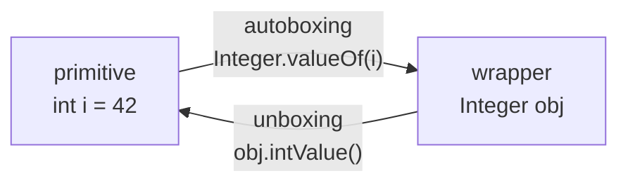
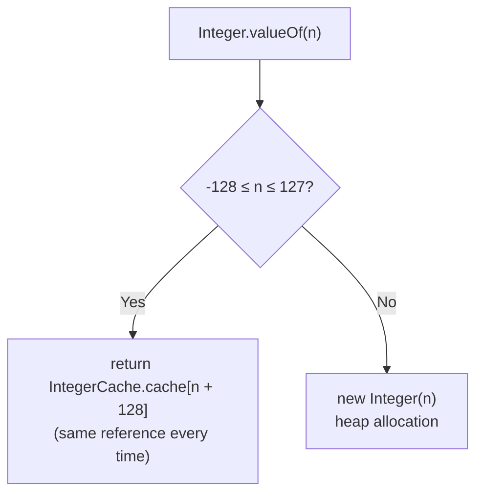
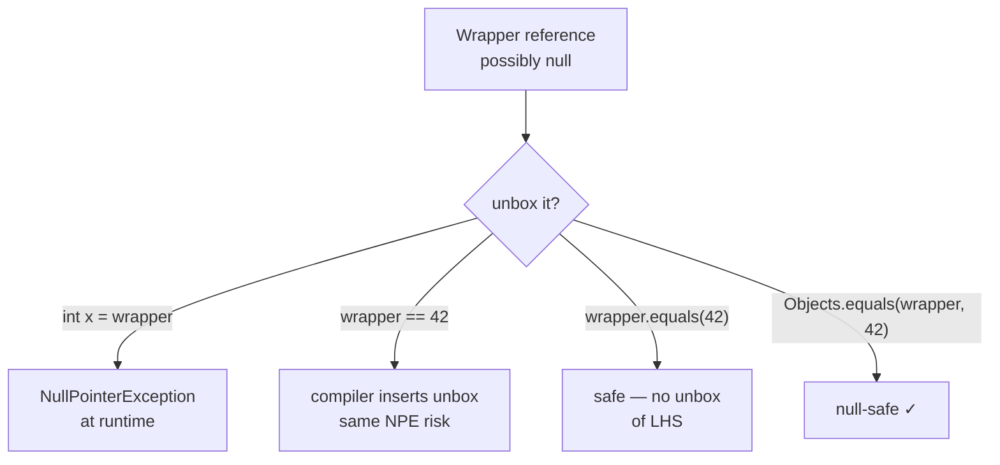

<!-- tldr -->
# Wrapper Classes & Autoboxing / Unboxing

Java's eight primitives (`int`, `long`, `double`, `boolean`, `char`, `byte`, `short`, `float`) each have an immutable, `final` counterpart in `java.lang` (`Integer`, `Long`, `Double`, …). These wrappers are required wherever the type system demands an `Object`—collections, generics, reflection, `Optional`. Autoboxing (primitive → wrapper) and unboxing (wrapper → primitive) are compiler transformations inserted at compile time, not JVM magic; the bytecode still calls `Integer.valueOf()` and `.intValue()`.



<!-- standard -->

## What It Is & Why It Matters

Wrapper classes let primitives participate in the object graph: `List<Integer>`, `Map<String, Long>`, `Optional<Double>`. They also carry utility APIs (`Integer.parseInt`, `Integer.toBinaryString`, `Integer.compare`) and implement `Comparable`, `Serializable`, and `Number`.

**Autoboxing** — compiler rewrites `Integer x = 5` → `Integer x = Integer.valueOf(5)`.  
**Unboxing** — compiler rewrites `int y = integerObj` → `int y = integerObj.intValue()`.

Both were introduced in **Java 5**. Neither changes bytecode semantics; they are purely a syntactic convenience.

## Primary Techniques & Key Tradeoffs

| Concern | Primitive | Wrapper |
|---|---|---|
| Memory | Stack / inline | Heap object (~16 bytes each) |
| Null safety | ✗ (no null) | ✓ (but unboxing null → NPE) |
| Collections / Generics | ✗ (requires wrapper) | ✓ |
| `==` semantics | Value equality | Reference equality (trap!) |
| Performance | Fast | GC pressure on hot paths |

### The Integer Cache

`Integer.valueOf()` caches instances for values **−128 to 127** (inclusive). Outside that window, each call allocates a new object on the heap.



`Long`, `Short`, `Byte`, and `Character` have similar fixed caches. `Double` and `Float` do **not** cache at all.

### Core Pitfalls

- **`==` on wrappers** compares references; use `.equals()` or `Integer.compare()`.
- **Unboxing `null`** throws `NullPointerException` silently inside an expression.
- **Autoboxing in loops** creates O(n) short-lived objects → GC pressure.
- **`Long sum = 0L; sum += i`** in a tight loop boxes a new `Long` every iteration.

---

<!-- deep -->

## Deep Dive

### Compiler Desugaring — What the Bytecode Actually Says

Given:
```java
List<Integer> list = new ArrayList<>();
list.add(42);           // autoboxing
int v = list.get(0);    // unboxing
```

`javap -c` reveals:
```
invokestatic  Integer.valueOf:(I)Ljava/lang/Integer;   // add()
invokevirtual Integer.intValue:()I                     // get() assign
```

The JVM never sees "autoboxing." It only sees `invokestatic` / `invokevirtual`. The compiler does all the work.

### Integer Cache — Exact Mechanics

`IntegerCache` is a private static inner class inside `java.lang.Integer`. Its upper bound is configurable:

```
-XX:AutoBoxCacheMax=<N>        # sets Integer upper cache bound to N (≥127)
# or equivalently:
-Djava.lang.Integer.IntegerCache.high=<N>
```

`Long`, `Short`, `Byte` caches are **fixed** (−128..127). `Boolean` has two singleton constants: `Boolean.TRUE` / `Boolean.FALSE`.

```java
Integer a = 127,  b = 127;   a == b  // true  — same cached ref
Integer c = 128,  d = 128;   c == d  // false — different heap objects
Long    e = 127L, f = 127L;  e == f  // true  — Long cache
Double  g = 1.0,  h = 1.0;   g == h  // false — no Double cache
```

### Performance & Memory Numbers

| Scenario | Allocation per element | Typical throughput impact |
|---|---|---|
| `int[]` (1 M elements) | 0 extra bytes | Baseline |
| `Integer[]` / `List<Integer>` | ~16 bytes/object + ref | 3–5× slower iteration; GC pauses at scale |
| `sum += i` in loop (boxed Long) | 1 Long / iteration | ~200 M allocs/sec → minor GC every ~50 ms at 1 M iterations/sec |

For hot paths producing **> 10 M boxes/sec**, switch to primitive arrays or a specialized library (Eclipse Collections `IntList`, Trove `TIntArrayList`, Koloboke).

### Real-World Systems

**Kafka** — `ProducerRecord` offsets and partition IDs flow through generic APIs as `Integer`/`Long`; the critical path inside the broker uses primitive arrays to avoid per-message allocation.

**DynamoDB SDK v2** — Attribute maps (`Map<String, AttributeValue>`) trigger autoboxing when callers extract numeric values naively; AWS recommends the enhanced client with `@DynamoDbAttribute` to avoid it.

**Spring Framework** — `@Value`-injected `Integer` fields unbox during bean lifecycle; a misconfigured property resolving to `null` causes a silent NPE at context startup.

**JVM JIT (C2)** — Escape analysis can **scalar-replace** short-lived wrapper objects so they never hit the heap. This is not guaranteed; profile before assuming JIT will save you.

### Failure Modes



**Top failure modes ranked by interview relevance:**

1. **NPE on unboxing** — `Integer n = map.get(missingKey); int v = n;` — classic interview trap.
2. **`==` reference comparison** — the cache range lulls engineers into thinking `==` is reliable for small integers.
3. **Ternary type promotion** — `Integer x = condition ? 1 : null` — compiler unboxes `null` to satisfy the ternary type, NPE at runtime.
4. **Varargs boxing** — `printf`-style methods receive `Object...`; passing primitives boxes all arguments.
5. **`switch` on `Integer`** — compiler unboxes before branching; a null value throws NPE before any case is evaluated.

### Ternary NPE — The Sneakiest Case

```java
Integer val = null;
// Compiler sees mixed types (Integer, int) → promotes both to int → unboxes null
int result = condition ? val : 0;   // NPE even if condition == false
```

Fix: make both branches the same type (`Integer`) or null-check before the ternary.

### Capacity & Latency Rules of Thumb

- A boxed `Integer` is **~16 bytes** on a 64-bit JVM with compressed oops (12-byte header + 4-byte field).
- A `Long` is **~24 bytes**.
- `Integer[]` of 1 M elements: ~16 MB objects + 4 MB reference array = **~20 MB** vs `int[]` = **4 MB**.
- JIT escape-analysis elimination kicks in reliably only for objects that don't cross method boundaries. Across an interface call → allocation likely.

### Interview Pitfalls Checklist

| Question | Trap | Correct Answer |
|---|---|---|
| `Integer.valueOf(127) == Integer.valueOf(127)` | Assume always true | True only within cache range |
| Performance of `Map<Integer, Integer>` | "Same as int[]" | 3–5× more memory; extra indirection |
| Why does `sum += i` (Long sum) allocate? | "It doesn't" | Unbox, add, re-box every iteration |
| Can autoboxing throw? | "No" | Yes: NPE on unboxing null |
| Is `new Integer(5)` deprecated? | "No" | Deprecated since Java 9; removed in Java 17 |

### When to Reach for Wrappers

```
Use wrappers when:
  ✓ You must satisfy a generic type bound (Collection<T>, Optional<T>)
  ✓ You need null to carry semantic meaning (absent vs zero)
  ✓ You need utility methods (Integer.bitCount, Integer.reverse)
  ✓ You need Comparable / Serializable without custom code

Avoid wrappers (use primitives / primitive collections) when:
  ✗ Hot path with > 1 M operations/sec
  ✗ Large arrays where memory footprint matters (>100K elements)
  ✗ Tight numerical loops (DSP, simulation, ML inference)
  ✗ Cache-sensitive data structures (primitives are contiguous; boxed refs are scattered)
```

### Quick Reference: All Eight Wrappers

| Primitive | Wrapper | Cache Range | `parseXxx` method |
|---|---|---|---|
| `byte` | `Byte` | −128..127 | `Byte.parseByte(s)` |
| `short` | `Short` | −128..127 | `Short.parseShort(s)` |
| `int` | `Integer` | −128..127 (upper configurable) | `Integer.parseInt(s)` |
| `long` | `Long` | −128..127 | `Long.parseLong(s)` |
| `float` | `Float` | none | `Float.parseFloat(s)` |
| `double` | `Double` | none | `Double.parseDouble(s)` |
| `char` | `Character` | 0..127 | — |
| `boolean` | `Boolean` | TRUE / FALSE singletons | `Boolean.parseBoolean(s)` |