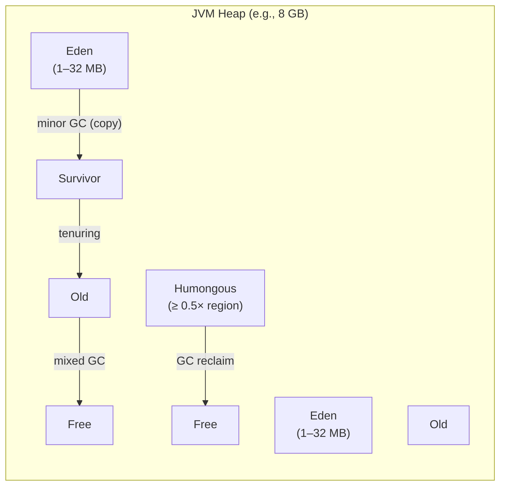
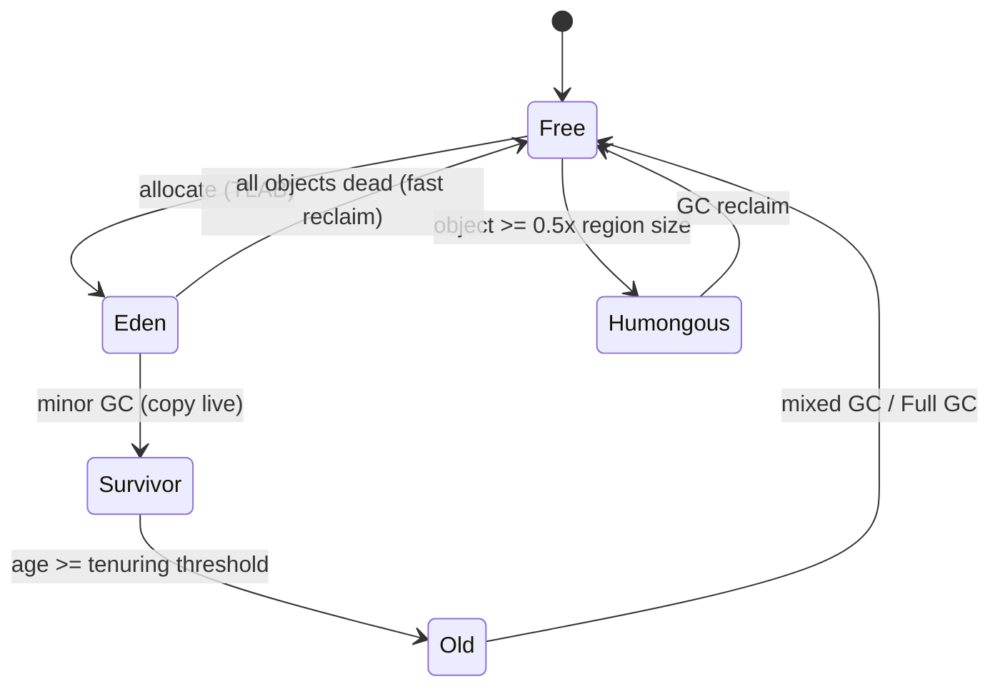
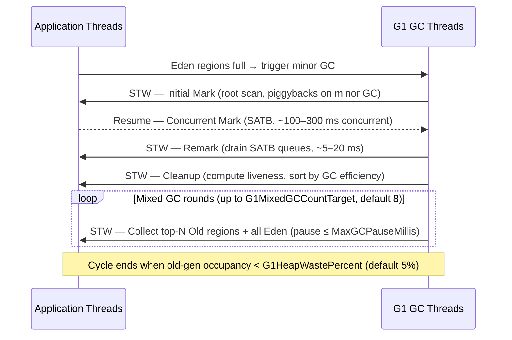

<!-- tldr -->
# Heap Regions

Region-based heaps replace a monolithic contiguous memory space with a uniform grid of equal-sized chunks (1–32 MB in G1GC). Each chunk carries a *role* (Eden, Survivor, Old, Humongous, Free) that can be reassigned after collection. The GC scheduler picks the highest-garbage-density regions first — "Garbage-First" — so it can reliably hit a user-specified pause-time target instead of collecting the entire old generation at once.



<!-- standard -->

## What It Is

A *heap region* is the atomic unit of GC work. G1GC divides the heap into 2,048 equal-sized regions; ZGC uses *ZPages* (small 2 MB / medium 32 MB / large variable). Because each region is independent, the collector can:

- **Evacuate** a region by copying live objects out, then **reclaim** the whole region in one step — no compaction in-place.
- **Prioritize** regions with the highest dead-object ratio (liveness bitmap + remembered set cost vs. expected reclaim bytes).
- **Bound** STW pauses by limiting the collection set to however many regions fit in the pause budget.

## Why It Matters

Pre-region collectors (CMS, Parallel GC) treat the old generation as a single contiguous slab. A full GC scans and compacts gigabytes atomically, producing multi-second pauses at scale. Region granularity makes pauses **proportional to the pause target**, not to heap size.

## Primary Techniques

| Collector | Region Model | Pause Strategy | Max Heap Tested |
|-----------|-------------|----------------|-----------------|
| **G1GC** (JDK 9+ default) | 1–32 MB regions, generational roles | STW mixed GC, 200 ms default target | ~512 GB |
| **ZGC** (JDK 15+ production) | ZPages (2 / 32 MB / large) | Concurrent relocation; STW < 1 ms | 16 TB |
| **Shenandoah** | Fixed regions, no generational | Concurrent evacuation | ~512 GB |

## Key Tradeoffs

- **Remembered Sets (RSets):** Each region tracks incoming cross-region references. RSets enable independent collection but consume 5–20% of heap as metadata overhead.
- **Humongous objects** (≥ ½ region size) skip Eden, land in contiguous Old regions, and can cause premature Full GCs if they fragment free space.
- **Write barriers:** Every reference store fires a barrier to maintain RSets and SATB (Snapshot-At-The-Beginning) marking queues — ~2–5% CPU overhead.
- **Evacuation failures:** If no free region exists during a minor GC, G1 promotes in-place and risks a Full GC. Headroom of 10–15% free regions is essential.



<!-- deep -->

## Deep Dive: Algorithms, Systems, and Failure Modes

### G1GC Collection Cycle — Step by Step



### Region Sizing Formula

```
region_size = roundUpToPowerOf2(heapSize / 2048)
             clamped to [1 MB, 32 MB]
```

For an 8 GB heap → 4 MB regions × 2,048 = 8,192 MB.  
Tune with `-XX:G1HeapRegionSize=<n>m` when you have many large objects.

### Remembered Sets — Mechanics

Each region owns an RSet: a sparse hash table mapping `from_region → card_offsets` (cards are 512-byte blocks). On every reference store, the **post-write barrier** marks the card dirty and enqueues it for the *Concurrent Refinement* threads (default 4 threads) that update RSets without stopping the world.

- **RSet overhead:** 100–300 bytes per live cross-region pointer.  
- **High-connection objects** (e.g., a `HashMap` in Old referenced by 10k other regions) create "hot cards" — use `-XX:G1RSetRegionEntries` to size buckets.

### SATB Marking Invariant

G1 and Shenandoah use SATB: at mark-start, snapshot all live objects. During concurrent marking, any object *deleted* from the reference graph is still treated as live for this cycle (the pre-write barrier enqueues it). This trades **floating garbage** for correctness without a second STW stop.

### ZGC's Load-Barrier / Colored Pointer Model

ZGC stores GC metadata (finalizable, remapped, marked0, marked1) in the **high 4 bits** of 64-bit pointers. A **load barrier** fires on every heap reference read, self-heals stale pointers on the fly. Result: no RSets, no SATB — just concurrent relocation with pauses consistently under **1 ms** regardless of heap size, at the cost of ~15% throughput overhead from barriers.

### Real-World Systems

| System | GC Choice | Rationale |
|--------|-----------|-----------|
| **Kafka broker (JVM)** | G1GC | Large heap (6–12 GB), bursty allocation from page-cache reads; G1 mixed GC keeps p99 < 50 ms |
| **Elasticsearch** | G1GC (≥7.x) | Multi-GB field caches; `-XX:MaxGCPauseMillis=200` with 30% old-gen headroom |
| **Cassandra 4.x** | G1GC / ZGC | Memtable flushes create Old-gen pressure; ZGC on large nodes (64 GB+) for < 1 ms pauses |
| **HBase RegionServer** | G1GC | Coincidence of naming — HBase "regions" are data shards; GC regions manage BlockCache (4–20 GB) |
| **Android Runtime (ART)** | Region-based, generational | Rosalloc regions + CC collector; design mirrors G1 at mobile scale |

### Capacity & Latency Reference Numbers

- **G1 minor GC pause:** 5–50 ms for 512 MB Eden at 4 MB regions.
- **G1 mixed GC pause:** 50–200 ms collecting 20–40 Old regions.
- **Full GC (evacuation failure):** 1–10 s on a 32 GB heap — treat as a production incident.
- **ZGC STW:** < 1 ms (root scan only); concurrent phase 10–200 ms on 64 GB heap.
- **RSet rebuild cost:** roughly 10 MB/s per Refinement thread; add threads if dirty card queue > 10k entries.
- **Throughput tax (ZGC vs G1):** ~10–15% lower ops/sec due to load barriers.

### Failure Modes

1. **Humongous allocation churn:** Objects ≥ 4 MB on a 8 MB region heap skip Eden, land in Old, and fragment free lists. Symptom: frequent Full GCs despite low live-set. Fix: increase region size or pool large objects.
2. **Concurrent Mark Overflow:** SATB mark queues overflow if the application mutates the object graph faster than GC threads drain them. Triggers a stop-the-world remark with unbounded pause. Fix: increase `-XX:G1ConcMarkStepDurationMillis` or add GC threads.
3. **RSet storm:** A single highly-connected Old object (e.g., global registry) causes thousands of RSet entries across regions. Mixed GC cost inflates non-linearly. Fix: move the hot object to a separate region via object pooling or cache partitioning.
4. **To-space exhaustion (ZGC):** If the application allocates faster than concurrent relocation frees regions, ZGC stalls the allocator. A 10–20% free-heap headroom is non-negotiable.

### Interview Pitfalls

- **"G1 is always better than CMS"** — Wrong framing. G1 has higher CPU overhead (write barriers, RSet maintenance). At < 4 GB heaps or latency-insensitive batch workloads, ParallelGC often wins on throughput.
- **Confusing GC regions with application partitions** — HBase/Kafka also call their data shards "regions." Clarify context immediately.
- **Ignoring `-XX:InitiatingHeapOccupancyPercent` (IHOP, default 45%)** — G1 starts concurrent marking when old-gen hits this threshold. Setting it too high causes back-to-back Full GCs; too low wastes CPU on unnecessary marking cycles.
- **Assuming ZGC is always sub-millisecond** — Under allocation pressure or with a severely fragmented heap, ZGC can degrade. Monitor `gc+relocation` logs.

### When to Reach for Region-Based GC

```
heap < 1 GB, throughput-critical, batch workload
    → ParallelGC

heap 1–32 GB, p99 latency target 100–300 ms
    → G1GC (tune MaxGCPauseMillis, IHOP, region size)

heap > 32 GB OR p99 latency target < 10 ms, Java 17+
    → ZGC

heap > 4 GB, want generational ZGC benefits, Java 21+
    → ZGC with generational mode (-XX:+ZGenerational)

non-JVM (Go, C++), custom allocator with explicit free
    → slab/arena allocators (region concept still applies)
```

### Tuning Checklist for FAANG Interviews

1. Set `-Xms == -Xmx` to prevent heap resizing pauses.
2. Reserve 20–30% of heap as free-region headroom (`-XX:G1ReservePercent`).
3. Watch `gc+heap+region` logs: if > 2% Humongous regions, increase region size.
4. Profile RSet size with `G1SummarizeRSetStats`; if per-region average > 512 KB, investigate hot objects.
5. Target mixed GC rounds (8 by default) finishing before the next marking cycle starts.