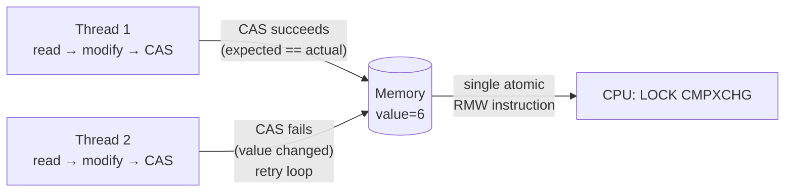
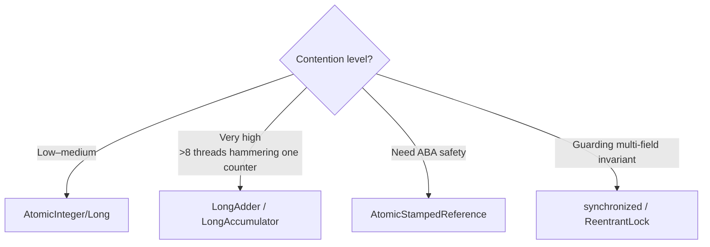
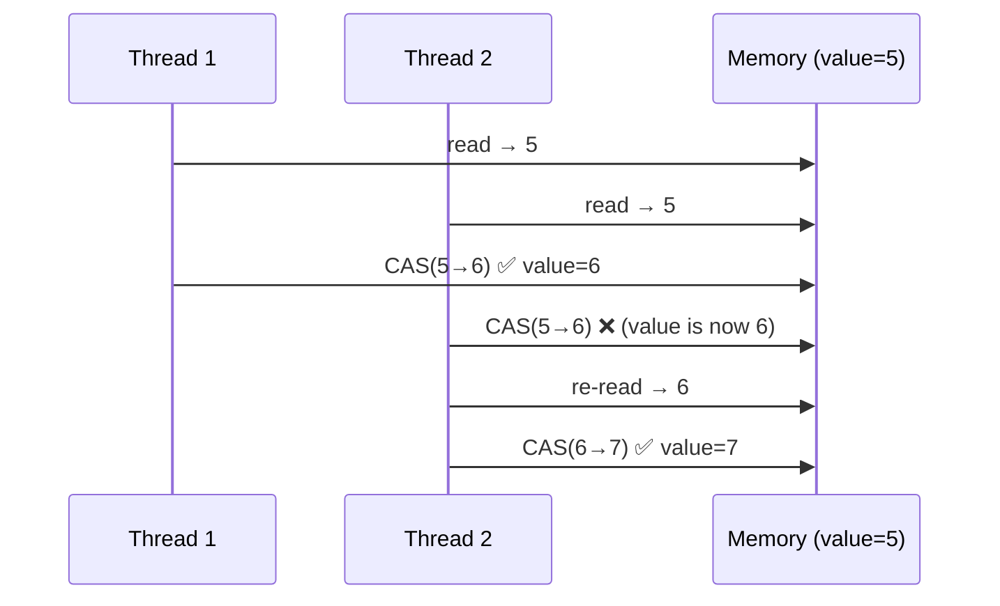
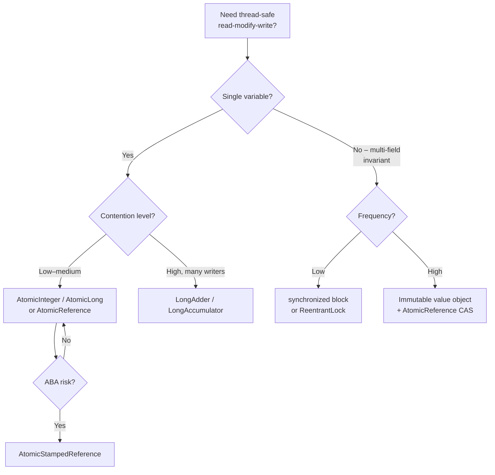

<!-- tldr -->
# Atomic Classes

`java.util.concurrent.atomic` provides lock-free, thread-safe wrappers around primitives and references by delegating to a single CPU instruction — Compare-And-Swap (CAS). They give you the visibility guarantees of `volatile` plus atomicity of compound operations (read-modify-write), without the throughput cost of `synchronized`. Under contention, they degrade gracefully because CAS spins at user-space rather than blocking in the kernel.



<!-- standard -->

## What They Are

The `java.util.concurrent.atomic` package (Java 5+) ships a family of classes that wrap a `volatile` field and expose compound operations as single atomic steps:

| Class | Wraps | Key Operations |
|---|---|---|
| `AtomicInteger` / `AtomicLong` | `int` / `long` | `getAndIncrement`, `compareAndSet`, `addAndGet` |
| `AtomicBoolean` | `boolean` | `compareAndSet` |
| `AtomicReference<V>` | Object ref | `compareAndSet`, `getAndUpdate` |
| `AtomicStampedReference<V>` | ref + int stamp | `compareAndSet` (solves ABA) |
| `AtomicMarkableReference<V>` | ref + boolean mark | `compareAndSet` |
| `AtomicIntegerArray` / `AtomicLongArray` | array | Per-element atomic ops |
| `LongAdder` / `LongAccumulator` | `long` (striped) | `add`, `sum` (high-contention counters) |

- All operations map to **`sun.misc.Unsafe.compareAndSwapXxx`** (or `VarHandle` CAS in Java 9+).
- CAS is **optimistic**: read, compute, swap only if the value hasn't changed. On failure, retry.

## Why It Matters

- **No kernel transitions** — no mutex, no thread parking. Throughput on uncontended or low-contended paths is ~5–10× faster than `synchronized`.
- **Progress guarantee** — individual threads can starve under extreme contention, but the system as a whole always makes progress (lock-free, not wait-free).
- **Composability** — lambdas (`updateAndGet`, `accumulateAndGet`) let you express arbitrary RMW atomically.

## Key Tradeoffs

| | `synchronized` | `AtomicXxx` | `LongAdder` |
|---|---|---|---|
| Contention model | Blocking | Spinning (CAS retry) | Striped cells |
| Best for | Guarding compound invariants | Low–medium contention counters | Very high-contention counters |
| Read cost | Low | Low | `sum()` aggregates cells |
| Write cost (high contention) | High (park/unpark) | High (spin loop) | Low |



<!-- deep -->

## Deep Dive: Atomic Classes

### The CAS Instruction

At the hardware level, x86 exposes `LOCK CMPXCHG`. The JVM maps `AtomicInteger.compareAndSet(expected, update)` to:

```
// Pseudocode of what Unsafe.compareAndSwapInt does
if (memory[offset] == expected) {
    memory[offset] = update;
    return true;
}
return false;   // caller retries
```

This is **a single bus-locked read-modify-write cycle** — no other core can observe a partial state. The JMM guarantees sequential consistency for the CAS and all operations that precede or follow it in program order.

### VarHandle (Java 9+)

`VarHandle` replaces `Unsafe` as the preferred low-level API:

```java
private static final VarHandle VALUE;
static {
    VALUE = MethodHandles.lookup()
        .findVarHandle(MyClass.class, "value", int.class);
}

// Plain, opaque, acquire/release, volatile — choose your memory fence
VALUE.compareAndSet(this, expected, update);        // volatile CAS
VALUE.setRelease(this, newValue);                   // release fence only
```

`VarHandle` access modes map directly to C++11 memory orders, giving you fine-grained control over fence strength and avoiding over-fencing.

### The ABA Problem

CAS checks *value equality*, not *identity history*:

1. Thread A reads `ref = X`.
2. Thread B changes `ref: X → Y → X`.
3. Thread A's CAS sees `X == X`, succeeds — but the state has changed underneath.

**Solutions:**
- `AtomicStampedReference<V>` — pairs the reference with a monotone integer stamp; CAS checks both.
- `AtomicMarkableReference<V>` — pairs with a boolean "deleted" mark (common in lock-free linked lists).
- Epoch-based reclamation or hazard pointers in hand-rolled structures.

### LongAdder Internals (Striped Counters)

`LongAdder` (Lea, Lev, and friends, Java 8) maintains a `base` field plus a `Cell[]` array sized to a power-of-two ≥ number of CPUs. Each thread hashes to a cell and CASes only that cell. On contention it expands the array (up to `Runtime.getRuntime().availableProcessors()`).

```
sum() = base + Σ cells[i].value
```

- **Write throughput**: near-linear scaling to ~32–64 cores with zero inter-core CAS conflict.
- **Trade-off**: `sum()` is not instantaneous — it's a point-in-time snapshot across cells; use only when eventual consistency of the count is acceptable (metrics, rate limiters).

### Sequence: AtomicInteger.incrementAndGet Under Contention



Each failed CAS costs ~1–5 ns on a modern CPU. Retry loops burn CPU cycles but never block, so P99 latency stays bounded even at 1 M QPS if contention is moderate.

### Real-World Usage

| System | Atomic usage |
|---|---|
| **Kafka** | `KafkaProducer` uses `AtomicInteger` for sequence numbers; `RecordAccumulator` uses `LongAdder` for byte-level metrics |
| **Netty** | Channel pipeline state, reference counting (`AbstractReferenceCountedByteBuf`) — `AtomicIntegerFieldUpdater` to avoid object overhead |
| **Cassandra** | `AtomicReference` for `Memtable` swaps; `LongAdder` in metrics subsystem |
| **JVM itself** | GC card tables, thread-local allocation buffers use CAS for bump-pointer allocation |
| **Akka** | Actor mailbox state machine implemented with `AtomicInteger` states |

### AtomicXxxFieldUpdater — Memory-Efficient Variant

When you have millions of objects, wrapping each field in `AtomicInteger` costs 16 bytes of object overhead. Use `AtomicIntegerFieldUpdater` instead:

```java
private static final AtomicIntegerFieldUpdater<Node> REF_COUNT =
    AtomicIntegerFieldUpdater.newUpdater(Node.class, "refCount");

volatile int refCount = 1;  // must be volatile
```

This delegates to `Unsafe` CAS on the raw field offset — zero per-instance overhead.

### Failure Modes & Pitfalls

1. **Livelock under extreme contention** — A tight CAS retry loop on a shared counter with 64 threads can consume 100% CPU with near-zero throughput. Prefer `LongAdder` or exponential back-off.
2. **False sharing** — `AtomicLong[]` elements on adjacent cache lines thrash. Pad to 64 bytes (use `@Contended` / `sun.misc.Contended` in Java 8+).
3. **Visibility misconception** — `AtomicReference.set` is a volatile write; it establishes a happens-before edge. But reading the reference and *then* reading the object's fields is only safe if those fields are also safely published.
4. **Non-atomic compound operations** — `atomicRef.get().someField++` is *not* atomic. You need `updateAndGet` with a lambda or an external lock around the compound invariant.
5. **Overusing CAS for multi-variable invariants** — If you need to update two fields atomically, CAS on one field at a time is not sufficient. Encapsulate both into an immutable value object and use `AtomicReference<State>`.

### Capacity & Latency Numbers (Ballpark, Skylake-class Server)

| Scenario | Latency |
|---|---|
| Uncontended CAS on cached line | ~4–6 ns |
| Contended CAS, 4 threads | ~20–40 ns |
| Contended CAS, 32 threads | ~200–500 ns (spin waste) |
| `LongAdder.add()`, 32 threads | ~10–15 ns (cell isolation) |
| `synchronized` uncontended | ~15–25 ns |
| `synchronized` contended, 32 threads | ~500 ns–2 µs (park/unpark) |

### Decision Rubric



### Interview Pitfalls

- **"Is `volatile` enough?"** — No. `volatile` gives visibility and ordering but not atomicity of RMW. `count++` on a volatile field is still three non-atomic steps.
- **"When would you use `AtomicReference` over `synchronized`?"** — When the critical section is a single CAS (state machine transition, lazy init) and you want lock-free progress. If the section touches multiple variables, `synchronized` is safer.
- **"How does `LongAdder` differ from `AtomicLong`?"** — `LongAdder` trades read-time aggregation cost for dramatically lower write contention via cell striping. Use it for high-frequency counters where you read rarely (metrics flush every second, not every op).
- **"What memory ordering does CAS provide?"** — Full sequential-consistency fence on x86 (implicit `MFENCE` equivalent). On ARM, explicit acquire/release fences around `LDXR`/`STXR` pairs. VarHandle lets you choose weaker modes for performance.