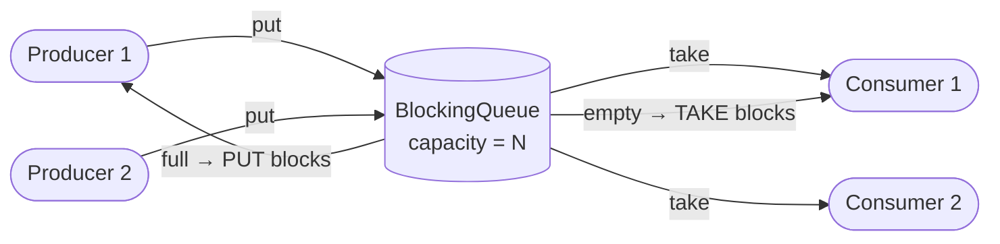
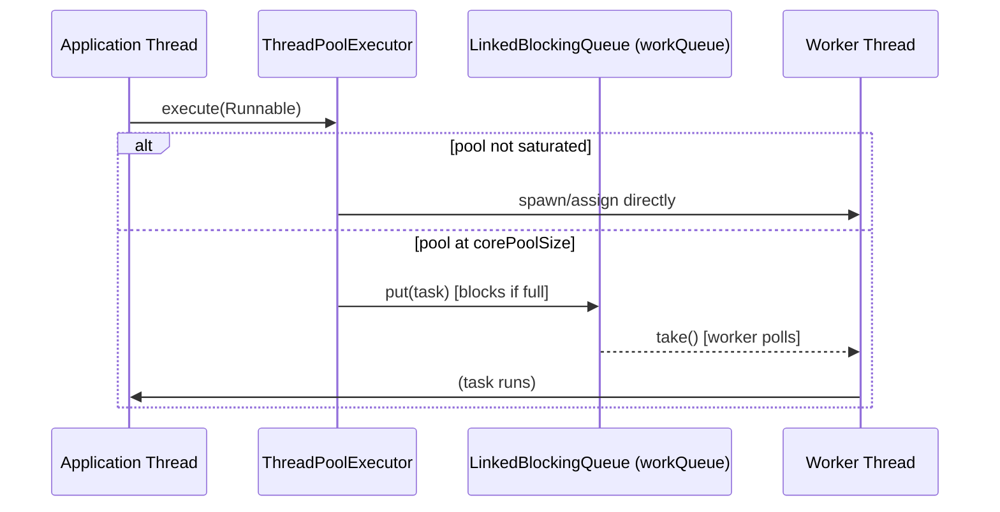
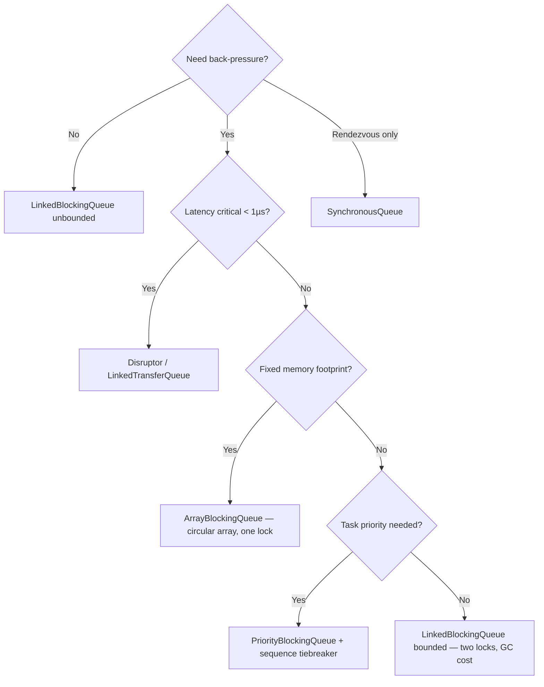

<!-- tldr -->
# BlockingQueue

`BlockingQueue` (`java.util.concurrent`) is a thread-safe FIFO data structure that decouples producers from consumers by providing built-in back-pressure: `put()` blocks when the queue is at capacity, and `take()` blocks when it is empty. It is the canonical building block of the Producer-Consumer pattern in Java and is used internally by `ThreadPoolExecutor` to hold pending tasks. Every method falls into one of four policies—throw, return special value, block, or timed block—giving you fine-grained flow-control semantics without writing a single `synchronized` block.



<!-- standard -->

## What, Why, and When

A `BlockingQueue` sits between any number of producer threads and any number of consumer threads, acting as a bounded buffer. Without it you must manually pair a `Lock` with two `Condition` variables (`notFull`, `notEmpty`) and call `await()`/`signal()` correctly—a notoriously error-prone pattern. `BlockingQueue` encapsulates that logic and exposes a clean API.

### The Four Operation Families

| Action | Throws | Returns Special | Blocks | Times Out |
|--------|--------|-----------------|--------|-----------|
| Insert | `add()` | `offer()` → `false` | `put()` | `offer(e, t, unit)` |
| Remove | `remove()` | `poll()` → `null` | `take()` | `poll(t, unit)` |
| Inspect | `element()` | `peek()` → `null` | — | — |

**Rule of thumb:** Use `put`/`take` inside a dedicated worker loop; use `offer`/`poll` with a timeout when you need a shutdown signal or circuit-breaker.

### Concrete Implementations

| Class | Bounded? | Ordering | Lock strategy | Best for |
|-------|----------|----------|---------------|----------|
| `ArrayBlockingQueue` | Yes (fixed) | FIFO | Single `ReentrantLock` | Low GC, predictable latency |
| `LinkedBlockingQueue` | Optional (`Integer.MAX_VALUE`) | FIFO | Two locks (head/tail) | High throughput |
| `PriorityBlockingQueue` | No | Priority heap | Single lock | Task scheduling |
| `SynchronousQueue` | 0 (rendezvous) | N/A | CAS / LockSupport | Direct hand-off |
| `DelayQueue` | No | Delay expiry | Single lock + heap | Retry/TTL schedulers |
| `LinkedTransferQueue` | No | FIFO + transfer | Lock-free CAS | Lowest latency hand-off |

### Key Tradeoffs

- **Bounded vs unbounded:** Bounded queues give back-pressure; unbounded queues shift memory pressure to the heap and can cause OOM under load spikes.
- `ArrayBlockingQueue` uses **one** lock for both ends → simpler, less throughput under high concurrency. `LinkedBlockingQueue` uses **two** locks → better throughput, extra node allocation per enqueue.
- `SynchronousQueue` has **zero** internal storage; every `put` waits for a matching `take`, making it ideal for `Executors.newCachedThreadPool()` where task hand-off latency matters more than buffering.

---

<!-- deep -->

## Deep Dive

### Internal Mechanics

`ArrayBlockingQueue` inlines everything in a single `ReentrantLock` with two `Condition`s:

```java
// Pseudocode matching OpenJDK source
final ReentrantLock lock = new ReentrantLock(fair);
final Condition notEmpty = lock.newCondition();
final Condition notFull  = lock.newCondition();

void put(E e) throws InterruptedException {
    lock.lockInterruptibly();
    try {
        while (count == items.length) notFull.await();  // back-pressure
        enqueue(e);                                      // circular array insert
        notEmpty.signal();
    } finally { lock.unlock(); }
}

E take() throws InterruptedException {
    lock.lockInterruptibly();
    try {
        while (count == 0) notEmpty.await();            // consumer waits
        return dequeue();                               // circular array remove
    } finally { lock.unlock(); }
}
```

`LinkedBlockingQueue` splits into a `putLock` (guards `last`) and a `takeLock` (guards `head`), allowing one concurrent put and one concurrent take simultaneously—roughly **2× throughput** at high contention.

`LinkedTransferQueue` goes further with a **dual-queue** algorithm (Scherer/Scott 2006): nodes store either data or a waiting thread reference. `transfer()` delivers directly to a spinning consumer, bypassing the queue entirely. P99 hand-off latency is in the **100–300 ns** range on modern hardware.

### Capacity Planning

| Scenario | Recommended implementation | Capacity sizing |
|----------|---------------------------|-----------------|
| CPU-bound task pool | `LinkedBlockingQueue(bounded)` | `2–4 × core count` |
| I/O-bound tasks (DB calls) | `ArrayBlockingQueue` | `RTT_ms × QPS / 1000` |
| Retry scheduler | `DelayQueue` | Unbounded + heap guard |
| Caller-runs back-pressure | `SynchronousQueue` | N/A |

**Example:** At 10,000 RPS with average DB RTT of 50 ms you need a queue of at least `10000 × 0.050 = 500` slots to absorb a one-second spike without dropping.

### Where Real Systems Use BlockingQueue



- **`ThreadPoolExecutor`** — Its `workQueue` is a `BlockingQueue`; `Executors.newFixedThreadPool` uses an unbounded `LinkedBlockingQueue`, which is a common OOM bug in production.
- **Kafka Consumer** — Each partition's fetch result is handed to processing threads via an internal blocking queue, decoupling network I/O from deserialization.
- **Disruptor (LMAX)** — Intentionally *replaces* `BlockingQueue` with a ring buffer + busy-spin to achieve sub-microsecond latency; knowing when NOT to use `BlockingQueue` is as important as knowing when to use it.
- **Netty's NioEventLoop** — Uses `LinkedBlockingQueue` to buffer tasks submitted from outside the I/O thread.
- **RxJava / Reactor backpressure** — `SynchronousQueue` semantics underpin reactive `onBackpressureBuffer` operators.

### Failure Modes

| Failure | Root cause | Mitigation |
|---------|-----------|------------|
| `OutOfMemoryError` | Unbounded `LinkedBlockingQueue` in `ThreadPoolExecutor` | Set explicit capacity; use `CallerRunsPolicy` |
| Deadlock on shutdown | Worker blocked in `take()` forever | Use `offer(task, timeout)` + poison-pill shutdown token |
| Priority inversion | `PriorityBlockingQueue` with many equal-priority tasks | Add sequence number as tiebreaker |
| `InterruptedException` swallowed | `catch (IE e) {}` in worker loop | Re-interrupt: `Thread.currentThread().interrupt()` then exit |
| Head-of-line blocking | Single slow consumer draining FIFO | Partition into multiple queues or use `PriorityBlockingQueue` |

### Performance Numbers (JVM, commodity hardware, JDK 21)

- `ArrayBlockingQueue` uncontended throughput: ~**80–120 M ops/s**
- `LinkedBlockingQueue` at 8-thread contention: ~**20–40 M ops/s**
- `SynchronousQueue` (fair mode): ~**5–10 M ops/s** (lock overhead from fair ReentrantLock)
- Context switch cost on a blocked `take()`: ~**1–5 µs** (varies by scheduler)
- If you need < 1 µs latency, evaluate Disruptor or `LinkedTransferQueue` in spin-wait mode.

### Interview Pitfalls

1. **"Use `LinkedBlockingQueue` for everything"** — Interviewers probe whether you know unbounded queues shift OOM risk to runtime. Always ask: *what happens at peak load?*
2. **Confusing `offer()` and `put()`** — `offer()` returns `false` silently; misusing it in a fire-and-forget producer drops tasks without any signal.
3. **Forgetting fairness cost** — `new ArrayBlockingQueue(n, true)` uses a fair `ReentrantLock` that can cut throughput by **3–5×** versus the unfair default.
4. **`size()` as a flow-control signal** — `size()` on `LinkedBlockingQueue` is an `AtomicInteger` read (cheap), but on `ArrayBlockingQueue` it requires the lock. Never spin on `size()` to avoid blocking.
5. **Not handling `InterruptedException`** — In a worker loop, swallowing it causes threads to loop forever after `shutdownNow()`.

### Decision Rubric



- **Reach for `ArrayBlockingQueue`** when you want predictable memory usage and can tolerate a single-lock bottleneck.
- **Reach for `LinkedBlockingQueue(capacity)`** when producer/consumer rates are unequal and you want higher throughput at the cost of GC noise.
- **Reach for `SynchronousQueue`** in cached thread pools or pipelines where you want strict back-pressure with zero buffering.
- **Step outside `BlockingQueue`** entirely (Disruptor, custom ring buffer) when you measure queue latency > 5% of your total request budget.