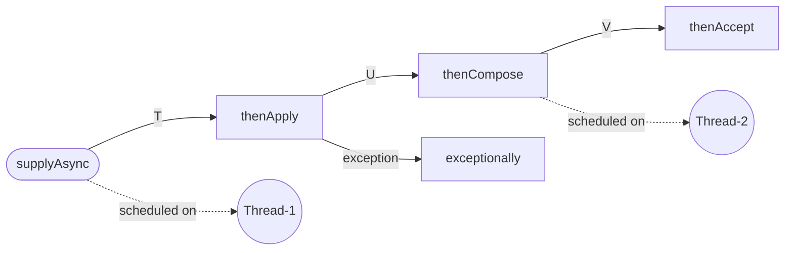
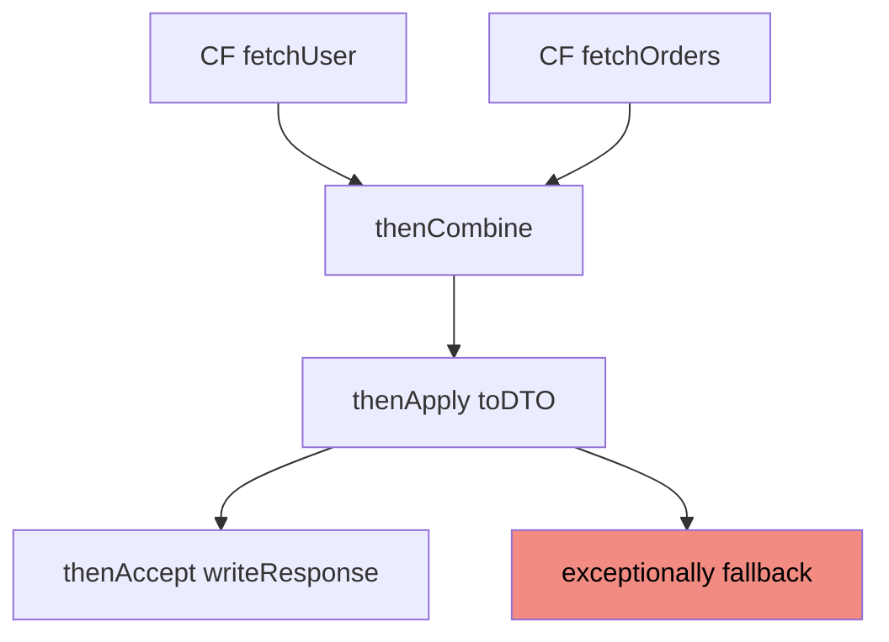
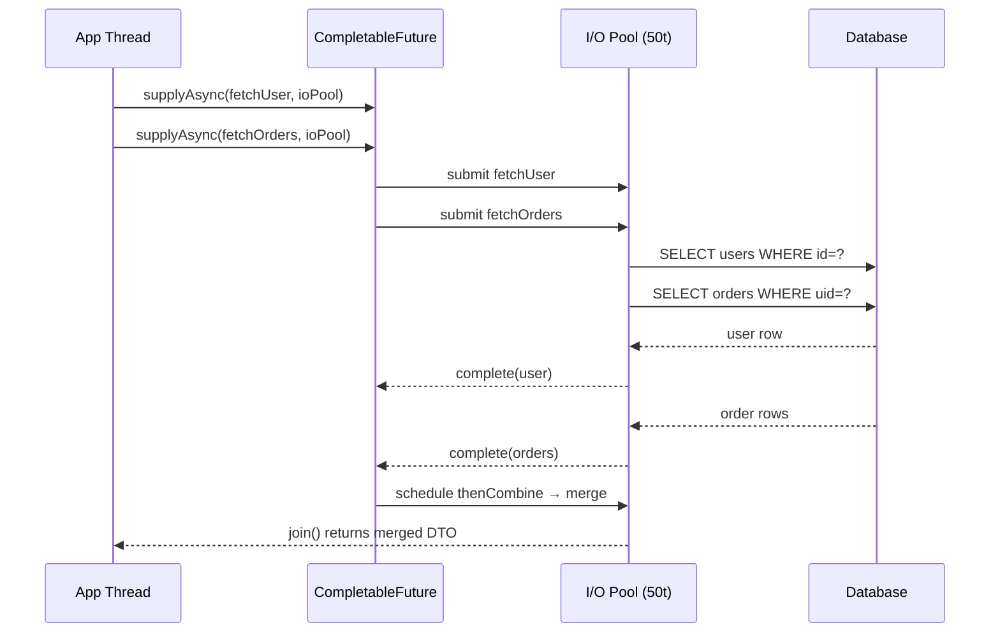

<!-- tldr -->
# CompletableFuture

`CompletableFuture<T>` (Java 8+) implements both `Future<T>` and `CompletionStage<T>`, enabling non-blocking async computation with chainable transformation stages. Unlike raw `Future`, it can be completed externally, composed with other futures, and wired with exception handlers — all without occupying a thread. It is the JVM's primary idiom for request-scoped async orchestration before reaching for a full reactive framework like Project Reactor.



<!-- standard -->

## What It Is

A `CompletableFuture` is a handle to an async result that models a **directed computation pipeline**. Each stage is a `CompletionStage` node; when upstream completes, downstream is atomically enqueued to an executor. The whole chain is lazy — nothing executes until `supplyAsync` or `runAsync` fires the first task.

### Core API Surface

| Method | Analogue | Key Behavior |
|---|---|---|
| `supplyAsync(Supplier, exec)` | Start | Returns `CF<T>`; defaults to FJP common pool |
| `thenApply(fn)` | `map` | Runs on completing thread |
| `thenApplyAsync(fn, exec)` | `map` | Offloads to `exec` |
| `thenCompose(fn)` | `flatMap` | `fn` returns `CF<U>`; flattens to `CF<U>` |
| `thenCombine(cf2, fn)` | zip | Waits for two CFs, merges results |
| `allOf(CF...)` | barrier | Returns `CF<Void>`; collect results from originals |
| `anyOf(CF...)` | race | Completes on first finished CF |
| `exceptionally(fn)` | catch | Recovery; provides fallback value |
| `handle(BiFunction)` | finally | Receives `(result, ex)`; handles both paths |
| `orTimeout(n, unit)` | timeout | Java 9+; completes exceptionally with `TimeoutException` |
| `join()` | blocking get | Throws unchecked `CompletionException` |

### Why It Matters

- **Thread efficiency**: Fan-out/fan-in without pinning a thread per in-flight request.
- **Async client integration**: AWS SDK v2, Cassandra Driver 4.x, and OkHttp all return `CompletionStage`/`CompletableFuture` natively.
- **Lower operational overhead**: Avoids Reactor/RxJava's learning curve for request-scoped parallelism that doesn't need backpressure.

### Key Tradeoffs

- **Default pool is CPU-sized**: `ForkJoinPool.commonPool()` has `nCPUs − 1` threads. One blocking call starves all other tasks on that pool.
- **Silent exception swallowing**: Unchecked exceptions in a stage complete the CF exceptionally; without an attached error handler they disappear silently.
- **Opaque stack traces**: Async continuations break causality chains — debugging requires correlation IDs or structured logging.
- **Unbounded queues by default**: `Executors.newFixedThreadPool` uses an unbounded `LinkedBlockingQueue`; under load this causes OOM before rejecting work.



<!-- deep -->

## Deep Dive

### Execution Model Internals

Each `CompletableFuture` object carries a volatile `result` field and a Treiber-stack of `Completion` objects (pending callbacks). When `complete(T)` is called:

1. CAS the `result` field from `null` to the value.
2. Pop and dispatch each `Completion` to its designated executor.
3. If no executor is specified (`thenApply`), the completing thread runs the callback inline — or the caller thread does, if the CF was already complete when the stage was registered.

**Implication**: `thenApply` has **no executor contract** — which thread runs it is non-deterministic. In latency-sensitive code, always use `thenApplyAsync(fn, exec)` to own the thread assignment.

### Thread Pool Strategy

| Work Type | Recommended Executor | Why |
|---|---|---|
| CPU-bound transforms | `ForkJoinPool.commonPool()` | Work-stealing; matches core count |
| I/O-bound (DB, HTTP) | `newFixedThreadPool(N)` or virtual threads (Java 21+) | Blocking must not starve FJP |
| Mixed pipeline | Separate pools per stage | Prevents resource contention |

```java
ExecutorService ioPool = new ThreadPoolExecutor(
    10, 200, 60L, TimeUnit.SECONDS,
    new ArrayBlockingQueue<>(1000),          // bounded — reject before OOM
    new CallerRunsPolicy());

CompletableFuture
    .supplyAsync(() -> db.fetchUser(id), ioPool)
    .thenApplyAsync(user -> enrich(user), ioPool)
    .thenApply(dto -> serialize(dto))         // CPU-tiny; inline is fine
    .exceptionally(ex -> fallback(ex))
    .orTimeout(500, TimeUnit.MILLISECONDS);   // Java 9+
```

### Real-World Systems

**AWS DynamoDB Async SDK v2**
`dynamoClient.getItem(req)` returns `CompletableFuture<GetItemResponse>`. The SDK completes it on a Netty event-loop thread — never block or do CPU work there; chain to a dedicated pool immediately.

**Cassandra Java Driver 4.x**
`session.executeAsync()` returns `CompletionStage<AsyncResultSet>`. Common pattern: fan-out one query per partition key, then `allOf` to aggregate — achieving ~10× throughput vs sequential execution at the same P99.

**Spring MVC Async**
A `@RequestMapping` returning `CompletableFuture<ResponseEntity<T>>` releases the Tomcat thread immediately; the Servlet container resumes when the CF completes. Zero code change to NIO servlet infrastructure.

**gRPC Java (non-blocking stubs)**
Returns Guava `ListenableFuture`; bridge with `CompletableFutureUtils.toCompletableFuture()` or use the newer `FutureStub.futureCall()` wrappers that return CF directly in grpc-java 1.57+.

**Spring Kafka `KafkaTemplate`**
`kafkaTemplate.send(record)` returns `CompletableFuture<SendResult<K,V>>` (Spring Kafka 3+, replacing the old `ListenableFuture`). Attach `whenComplete` to handle delivery confirmations asynchronously.

### Patterns & Algorithms

#### Fan-out / Fan-in
```java
List<CompletableFuture<Price>> futs = skuIds.stream()
    .map(id -> supplyAsync(() -> priceService.fetch(id), ioPool))
    .toList();

List<Price> prices = CompletableFuture
    .allOf(futs.toArray(new CompletableFuture[0]))
    .thenApply(v -> futs.stream().map(CompletableFuture::join).toList())
    .join();
```

`allOf` returns `CF<Void>` — you **must** re-stream the original list to collect typed results.

#### Speculative Execution (Hedging)
```java
CompletableFuture<Response> primary   = supplyAsync(() -> callReplica(0), pool);
CompletableFuture<Response> secondary = supplyAsync(() -> callReplica(1), pool);
Response r = CompletableFuture.anyOf(primary, secondary)
    .thenApply(o -> (Response) o)
    .join();
```
Cuts P99 latency at the cost of doubled load. Used by Cassandra speculative execution policy.

#### Retry with Exponential Backoff
```java
static <T> CompletableFuture<T> withRetry(
    Supplier<CompletableFuture<T>> task, int attempts, long delayMs) {
  return task.get().exceptionallyCompose(ex ->
      attempts > 0
          ? delayedCF(delayMs).thenCompose(v ->
                withRetry(task, attempts - 1, delayMs * 2))
          : CompletableFuture.failedFuture(ex));
}
```

### Failure Modes

| Failure | Root Cause | Mitigation |
|---|---|---|
| Silent data loss | Unhandled exceptional completion | Attach `whenComplete((r, ex) -> log(ex))` globally |
| Thread starvation | Blocking I/O inside FJP common pool | Dedicated `ExecutorService` for all I/O |
| Managed deadlock | `join()` inside FJP thread waiting on another FJP task | Never call `join()` in an async stage; use `ManagedBlocker` |
| OOM under spike | Unbounded task queue | `ThreadPoolExecutor` + `ArrayBlockingQueue(N)` + `CallerRunsPolicy` |
| Nested futures | `thenApply` returning a `CF<U>` → yields `CF<CF<U>>` | Use `thenCompose` to flatten |
| Exception wrapping | `join()` wraps in `CompletionException`; `get()` in `ExecutionException` | Unwrap with `.getCause()` |

### Capacity & Latency Numbers

- **FJP common pool on 32-core host**: 31 threads. At 50ms avg I/O latency → max throughput ≈ 31 / 0.05 s = **620 RPS** before starvation.
- **200-thread dedicated I/O pool**: 200 / 0.05 s = **4,000 RPS** at the same latency.
- **`allOf(1,000 CFs)`**: Scheduling overhead ~1–2 ms; bottleneck is the slowest downstream call.
- **Virtual threads (Java 21+)**: `Executors.newVirtualThreadPerTaskExecutor()` as the executor eliminates starvation risk for blocking I/O entirely — CF API stays identical.
- **`orTimeout` internal scheduler**: One shared `ScheduledThreadPoolExecutor` per JVM; negligible overhead at < 100k timeouts/sec.

### Sequence Flow: Fan-out Request



### Interview Pitfalls

1. **`thenApply` vs `thenCompose`**: `thenApply(f)` where `f` returns `CF<U>` gives `CF<CF<U>>`. Use `thenCompose` to flatten. This is the most common senior-level mistake.

2. **`join()` inside a FJP thread**: FJP will try to compensate by spinning up extra threads up to its limit, then deadlock. Never call `join()` inside a stage running on FJP.

3. **`allOf` result type**: It returns `CF<Void>`. There is no built-in way to collect typed results from it — you must retain references to the original futures and stream `.join()` on them inside the `thenApply`.

4. **Thread identity of `thenApply`**: If the upstream CF is *already complete* when `thenApply` is called, the **calling thread** executes the callback synchronously. This causes subtle ordering bugs in tests.

5. **`exceptionally` vs `handle`**: `exceptionally` only fires on failure; `handle` fires on both success and failure. Forgetting this means success paths accidentally pass through `exceptionally` when chained carelessly.

6. **`completeExceptionally` after `complete`**: The first `complete*` call wins (CAS); subsequent ones are no-ops. Rely on this for timeout-vs-result races.

### Decision Rubric

```
Async fan-out/fan-in within a single request?
  └─ CompletableFuture + dedicated ExecutorService ✓

Need backpressure, infinite event streams, or operator fusion?
  └─ Project Reactor (Mono/Flux) or RxJava

Orchestrating calls with retries + circuit breakers?
  └─ Wrap CompletableFuture with Resilience4j decorators

Kotlin codebase?
  └─ Kotlin coroutines + suspend functions (better DX, same JVM primitives)

Blocking I/O + Java 21+?
  └─ Virtual threads + synchronous code; skip CF entirely

Simple fire-and-forget background job?
  └─ ExecutorService.submit() is sufficient; CF is overkill
```

**Reach for `CompletableFuture` when**: you need request-scoped parallelism, are wrapping async SDK/driver calls, or optimizing fan-out latency and a full reactive stack is unwarranted.

**Avoid it when**: your team is already on Project Reactor, you need streaming semantics, or the complexity of manual executor wiring outweighs the gain.