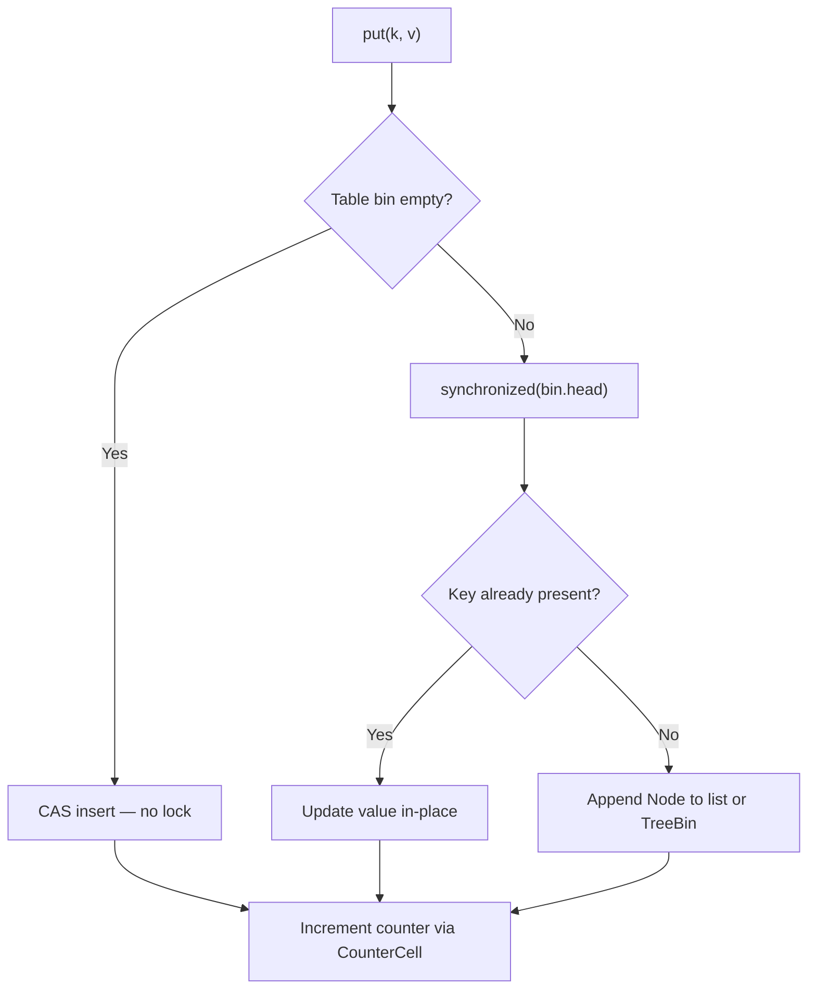
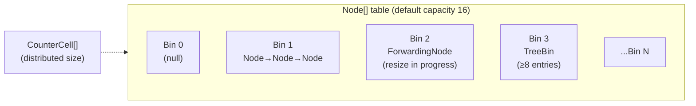
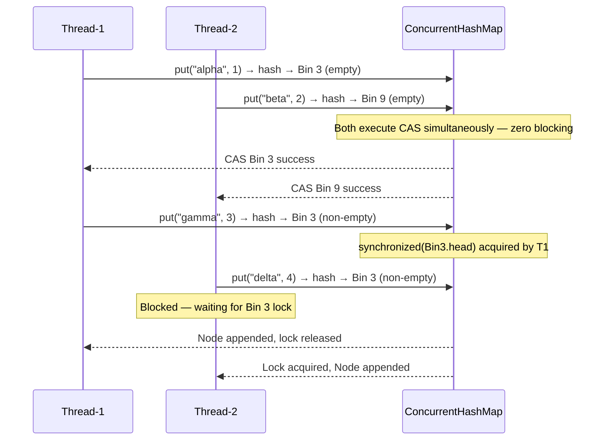

<!-- tldr -->
# ConcurrentHashMap

`ConcurrentHashMap` (CHM) is the go-to thread-safe `Map` in Java. Unlike `Hashtable` or `Collections.synchronizedMap`, it never locks the entire table: in Java 8+ it uses CAS for empty-bin writes and per-bin `synchronized` only for collisions, making `get()` lock-free by design. `size()` is eventually consistent, iterators are weakly consistent, and `null` keys/values are forbidden — all intentional tradeoffs for throughput.



<!-- standard -->

## What It Is

`ConcurrentHashMap<K,V>` implements `ConcurrentMap` and provides full thread safety for individual operations without a global mutex. Under Java 8+ it is backed by a `volatile Node<K,V>[]` table. Each index (bin) is independently locked, giving concurrency that scales with the number of distinct hash buckets.

## Why It Matters

A `HashMap` under concurrent access corrupts silently (infinite loops, lost updates). `Hashtable` serializes all access on `this`. CHM lets thousands of threads operate simultaneously with throughput proportional to core count, not inversely proportional to it.

## Primary Techniques

| Mechanism | When Used | Lock Cost |
|---|---|---|
| CAS (`U.compareAndSetReference`) | First insert into empty bin | Zero — spin once |
| `synchronized(f)` on bin head | Collision / update in non-empty bin | Per-bin, short-lived |
| `ForwardingNode` sentinel | Table resize in progress | Threads help transfer |
| `CounterCell[]` (LongAdder-like) | Maintaining `size()` | Distributed, near-zero |
| Red-black `TreeBin` | Bin length ≥ 8 (TREEIFY_THRESHOLD) | O(log n) worst case |

## Internal Structure (Java 8+)



## Key Tradeoffs

- **`get()` is never locked** — reads `volatile` fields; stale data is theoretically possible within the same nanosecond but reads are consistent for any value that was fully published before the read.
- **Compound operations are NOT atomic** — `if (!map.containsKey(k)) map.put(k, v)` races; use `putIfAbsent` / `computeIfAbsent` instead.
- **`size()` is approximate** — counter cells are summed lazily; between the sum and your use, another thread may have mutated the map.
- **No null keys or values** — throws `NullPointerException`; unlike `HashMap`, this is enforced to prevent ambiguity in `get()` returning null.
- **Weakly consistent iterators** — reflect some, all, or none of modifications made after iterator creation; never throw `ConcurrentModificationException`.

---

<!-- deep -->

## Internals Deep-Dive

### Java 7 vs Java 8 Architecture

| | Java 7 | Java 8+ |
|---|---|---|
| Locking unit | Segment (ReentrantLock) | Individual bin head |
| Default segments | 16 | N/A — per-bin locking |
| Memory overhead | High (Segment objects) | Low |
| Max concurrency | `concurrencyLevel` (16) | Number of bins (up to capacity) |
| `size()` | Sum per segment under lock | `baseCount` + `CounterCell[]` sum |

In Java 7, `Segment` extended `ReentrantLock` and owned a sub-table. Java 8 deleted segments entirely, shrinking memory footprint and dramatically improving scalability under high thread counts.

### The `put()` Algorithm (Java 8 Pseudocode)

```
loop:
  if table == null → initTable() via CAS on sizeCtl
  if bin[i] == null → CAS(bin[i], null, new Node) → break
  if bin[i].hash == MOVED → helpTransfer() → retry
  else:
    synchronized(bin[i]):
      if list node: walk chain, insert/update
      if TreeBin:   tree insert/update
addCount(1, binCount)
if binCount >= TREEIFY_THRESHOLD: treeifyBin()
```

`sizeCtl` is a single `volatile int` that encodes three states: `-1` (initializing), `-(1 + nThreads)` (resizing), or the next resize threshold.

### Resize: Incremental and Cooperative

When load factor is breached (default 0.75), CHM doubles the table. Rather than one thread doing all the work:

- The resizing thread sets `sizeCtl` to `-(1 + 1)`.
- Each `put()` that encounters a `ForwardingNode` calls `helpTransfer()`, joining the resize.
- Bins are claimed atomically in stripes (default stride = `(n >>> 3) / nCPUs`, min 16).
- This keeps resize latency distributed across writers — no single GC-pause-like stall.

### Sequence: Two Threads, Different Bins (No Contention)



### `computeIfAbsent` — Power and Pitfall

```java
// Correct memoization pattern
cache.computeIfAbsent(key, k -> expensiveCompute(k));
```

**Deadlock risk**: If `expensiveCompute` calls `computeIfAbsent` on the *same map with the same key* (directly or via recursion), the thread hangs — it already holds the bin lock and tries to re-acquire it. This is a real production bug seen in graph traversal caches.

**Java 9+ note**: `computeIfAbsent` was given a fast path that avoids locking when the key is absent and the bin is empty (CAS path), aligning it with `putIfAbsent` performance.

### Real-World Usage

| System | Usage |
|---|---|
| **Netty** | `Channel` registry mapping channel IDs to pipeline references |
| **Kafka Producer** | `topicPartitionLeaderCache` — per-partition leader metadata |
| **Spring Framework** | `DefaultListableBeanFactory` — bean definition registry |
| **Guava Cache** | Internal segment structure mirrors CHM's design philosophy |
| **HikariCP** | Connection bag uses a `CopyOnWriteArrayList` hybrid but CHM for pool stats |
| **JVM itself** | String intern table in OpenJDK uses a similar striped-lock design |

### Capacity & Latency Numbers

- **`get()` throughput**: 50–200M ops/sec on a 16-core box; essentially memory-bound, not lock-bound.
- **`put()` throughput (write-heavy, 16 threads)**: ~20–40M ops/sec vs ~1–2M for `synchronizedMap` — 10–20× advantage.
- **P99 `put()` latency**: < 1 µs for populated bins without resize; resize adds ~5–50 µs amortized depending on table size.
- **Memory**: ~48 bytes per `Node` (key ref, value ref, hash, next ptr) + 8 bytes per table slot.
- **CounterCell contention**: Under 1M QPS writes across 16 threads, `CounterCell[]` keeps CAS retry rate < 1%.

### Failure Modes

1. **Lost compound updates**: `map.get(k) == null ? map.put(k, new ArrayList()) : map.get(k)` races — always use `computeIfAbsent`.
2. **Stale `size()` in control flow**: Using `map.size() == 0` as a drain signal is racy; prefer a `CountDownLatch` or `AtomicInteger` sentinel.
3. **NPE on null value**: Passing `null` as a value blows up immediately — use `Optional` or a sentinel object.
4. **Iterator + structural mutation**: Iterating and removing concurrently works but may skip or double-visit entries; if exact traversal matters, snapshot with `new HashMap<>(chm)`.
5. **Hot bin under poor hash distribution**: All keys hashing to the same bin serialize on one lock, degrading to O(log n) per op (TreeBin) and single-threaded throughput. Ensure `hashCode()` distributes uniformly.

### Interview Pitfalls

- **"Is CHM fully thread-safe?"** — Yes for *individual* operations; no for multi-step compound operations. Distinguish clearly.
- **"What changed in Java 8?"** — Segments → per-bin locking + CAS. Know why: lower memory, higher max concurrency.
- **"How does `size()` work?"** — `baseCount` (uncontended updates) + sum of `CounterCell[]` (contended updates). Approximate, not atomic.
- **"Can you use CHM for check-then-act?"** — Only if using the atomic methods: `putIfAbsent`, `replace(k,old,new)`, `computeIfAbsent`, `merge`.
- **"Why no null?"** — `get(k)` returning `null` would be ambiguous: missing key vs. null value. HashMap tolerates this ambiguity; CHM deliberately does not.

### When to Reach for This

```
Need thread-safe map?
├── Read-heavy (>95% reads)?          → ConcurrentHashMap (get is lock-free)
├── Write-heavy, many distinct keys?  → ConcurrentHashMap (per-bin locking)
├── Write-heavy, few distinct keys?   → Consider Striped<Lock> + HashMap
├── Need sorted order?                → ConcurrentSkipListMap
├── Need snapshot isolation?          → Copy-on-write or explicit ReadWriteLock + HashMap
├── Single-threaded or externally
│   synchronized?                    → Plain HashMap (faster, no overhead)
└── Legacy API compatibility?        → Collections.synchronizedMap (last resort)
```

`ConcurrentHashMap` is the right default for any shared mutable map. Deviate only when its consistency model (eventual `size()`, weakly consistent iteration, non-atomic compound ops) is genuinely insufficient for your use case.