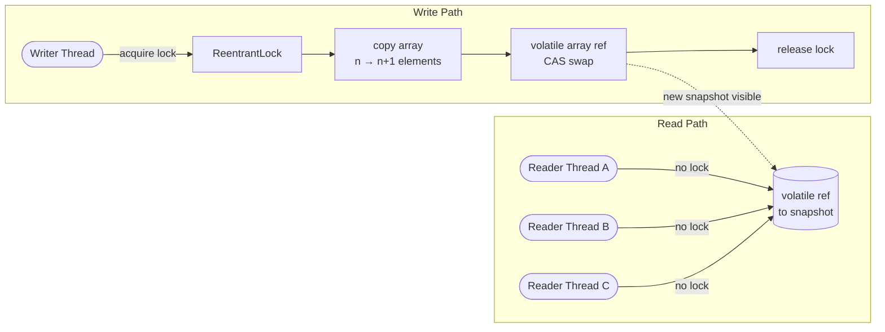
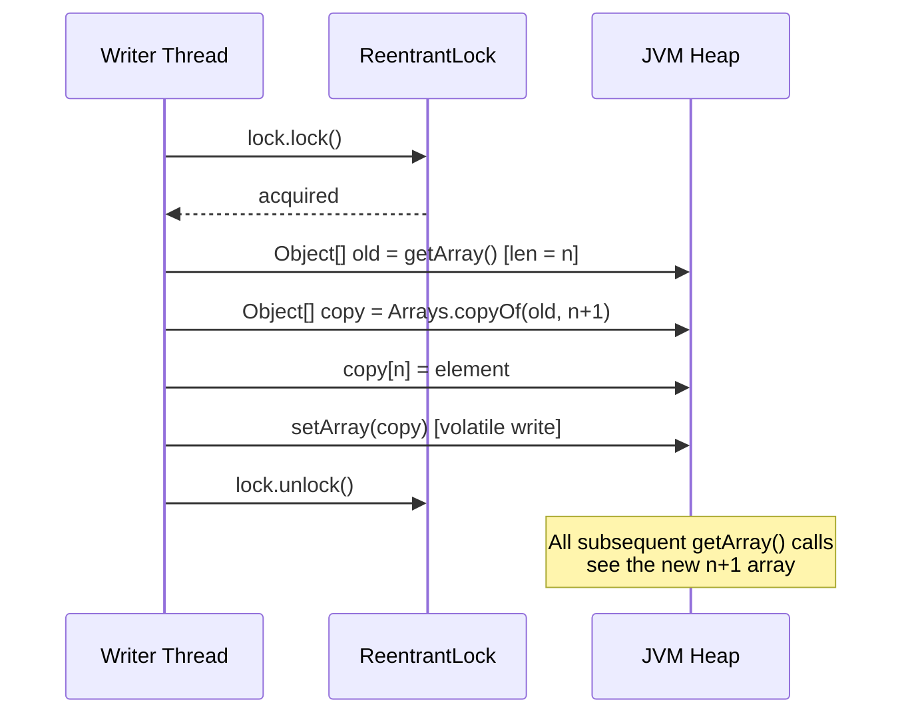
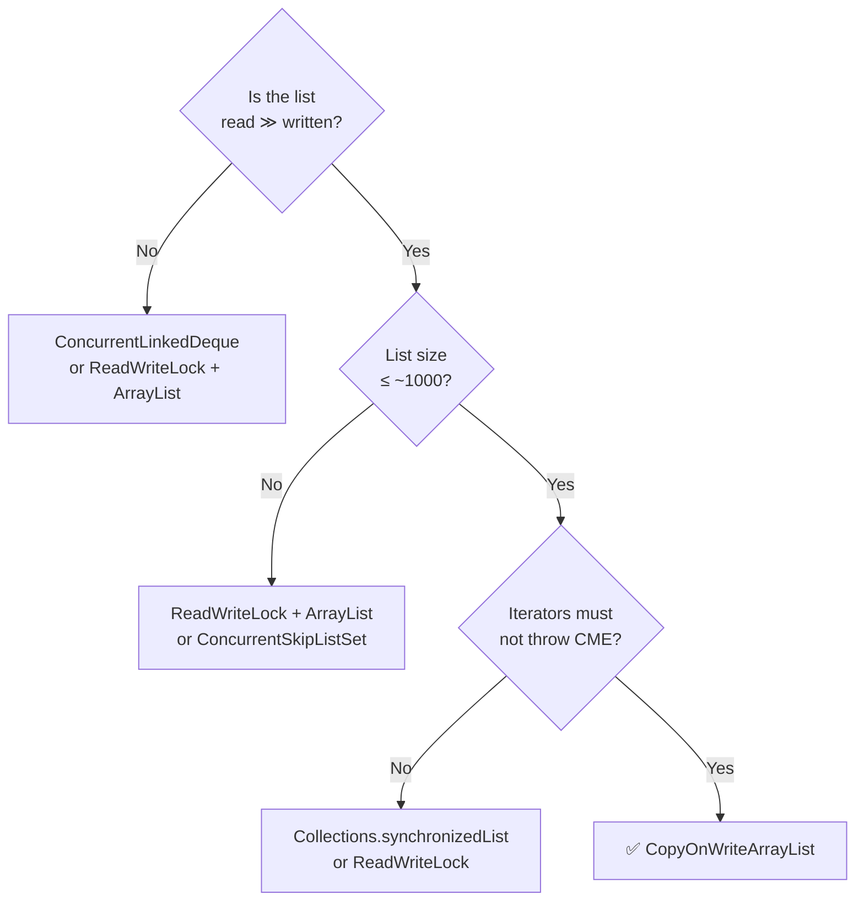

<!-- tldr -->
# CopyOnWriteArrayList

`CopyOnWriteArrayList` (COWAL) is a `java.util.concurrent` collection where every mutating operation (`add`, `set`, `remove`) atomically replaces the entire backing array with a freshly allocated copy. Readers access the current snapshot without acquiring any lock, making read throughput effectively unbounded. The class is part of the **copy-on-write** family of data structures—write cost is O(n) but that cost is paid upfront so readers never block or see partial state.



<!-- standard -->

## What It Is

`CopyOnWriteArrayList<E>` backs its data with a `volatile Object[]`. The volatile keyword guarantees that any thread reading the reference gets the latest snapshot written by any writer. Writers serialize on a single `ReentrantLock`; while they hold it they clone the array, mutate the clone, then store the reference back with a volatile write. Readers never touch the lock.

## Why It Matters

Concurrent collections are a staple of FAANG interviews because they expose understanding of memory visibility, lock granularity, and contention modelling. COWAL is the canonical answer when the interviewer describes a **read-heavy, write-rare** shared list.

## Primary Techniques

- **Snapshot isolation** — Iterators hold a hard reference to the array at the time `iterator()` was called; they can never throw `ConcurrentModificationException` (there is no modCount check).
- **Lock-free reads** — `get(i)` is a single array index with no synchronization, running at full hardware speed.
- **Serialized writes** — All mutations funnel through one lock, so concurrent writers do not race; the lock is held for the duration of the copy.

## Key Tradeoffs

| Dimension | CopyOnWriteArrayList | Collections.synchronizedList | ConcurrentLinkedQueue |
|---|---|---|---|
| Read contention | None (lock-free) | Full lock per read | None (lock-free) |
| Write cost | O(n) — full copy | O(1) + lock | O(1) — CAS |
| Iterator | Snapshot; never throws CME | Must synchronize externally | Weakly consistent |
| Memory | 2× peak during write | 1× | 1× |
| Best fit | Read-heavy, tiny list | Balanced R/W, any size | Queue workloads |

## When to Reach for It

- Observer/listener registries (event bus handlers, plugin lists) that are read on every event but modified on deployment only.
- Small allow/deny lists refreshed by a config-reload thread while hundreds of request threads read them millions of times per second.
- **Do not use** when writes happen at the same rate as reads, or when the list grows beyond a few thousand elements—the copy cost becomes dominant.

<!-- deep -->

## Deep Dive

### Internal Implementation

The JDK source (OpenJDK 21, `java.util.concurrent.CopyOnWriteArrayList`) centres on two fields:

```java
// simplified
final transient ReentrantLock lock = new ReentrantLock();
private transient volatile Object[] array;
```

`setArray(Object[] a)` is a plain volatile write; `getArray()` is a plain volatile read. Because volatile provides a happens-before edge, every reader that calls `getArray()` after a writer's `setArray()` is guaranteed to see the new snapshot—no `synchronized` block, no `Unsafe.fullFence()`, no explicit `StoreLoad` barrier beyond what volatile already implies.

#### Add — full code path



The lock scope covers *only* the copy + swap; readers that were already mid-read on the old snapshot are unaffected.

### Iterator Semantics

```java
public Iterator<E> iterator() {
    return new COWIterator<E>(getArray(), 0); // snapshot captured here
}
```

The iterator stores a local reference to the array. No matter how many mutations happen during iteration, the iterator walks the same snapshot. This is **not** a weakness in most real use cases—for listener lists, you want exactly this: fire all listeners that were registered *when the event fired*, not a moving target.

**Interview pitfall:** Candidates often say "COWAL iterators are thread-safe." That's imprecise. They are **snapshot-safe and CME-free**, but they do not reflect concurrent additions mid-iteration. Distinguish this from `ConcurrentHashMap`'s weakly-consistent iterators, which *may* reflect concurrent updates.

### Memory and GC Pressure

Every write allocates a new array:

- A list of 10,000 `Long` references is ~80 KB. Every write allocates 80 KB + 8 bytes, immediately making the old 80 KB garbage.
- At 100 writes/sec on a list of 10,000 elements: **8 MB/sec of short-lived garbage**. Negligible for G1/ZGC but measurable if the list is large or write rate spikes.
- Peak live memory is 2× list size during a write (old + new array co-exist until the old is GC'd).

**Rule of thumb:** Keep COWAL lists under ~1,000 elements or under ~10 writes/second per instance. Beyond that, re-evaluate.

### Real-World Systems That Use Copy-on-Write

| System | Usage |
|---|---|
| **Spring ApplicationContext** | `ApplicationListener` registry is a COWAL; events fire frequently, listeners change on bean refresh only. |
| **Netty** | `ChannelPipeline` historically used COW semantics for its handler list. |
| **ZooKeeper client (Curator)** | Watcher sets use COWAL-style snapshot to avoid CME during event dispatch. |
| **Linux kernel (RCU)** | Read-Copy-Update is the OS-level analogue: readers run lock-free, writers publish a new version, RCU grace period reclaims old version—same fundamental idea. |
| **JVM class loading** | The boot class-path cache uses copy-on-write arrays to avoid locking the class loader on every `Class.forName`. |

### Failure Modes

#### 1. Write Storm Degradation

If a burst of writes arrives concurrently, all writers queue on the single lock. With n writers and an array of size k, total work is O(n·k). A k=50,000 list with 200 concurrent writers does 10,000,000 object references copied per burst — measurable latency spike.

**Mitigation:** Batch writes (`addAll` copies once for the whole batch vs. once per element), or switch to a `ReadWriteLock`-guarded `ArrayList` where you control copy granularity.

#### 2. Stale Read Surprise

Because readers grab a snapshot, a reader can observe a list that is logically "old" by the time business logic acts on it. In most listener-dispatch cases this is fine. In inventory/seat-reservation use cases it is a correctness bug.

#### 3. Missed Remove Under Iteration

```java
for (Listener l : listeners) {    // snapshot S0
    l.onEvent(e);
    listeners.remove(l);           // creates snapshot S1
}
// iteration still walks S0 — all listeners fire even the "removed" ones
```

Removals during iteration are silently ignored by the iterator. Test for this explicitly.

### Capacity & Latency Numbers (empirical, JDK 21, JMH, 32-core x86)

| Operation | List size | Latency |
|---|---|---|
| `get(i)` | 10,000 | ~2 ns |
| `iterator()` + full traversal | 10,000 | ~18 µs |
| `add(e)` | 10,000 | ~25 µs (copy dominates) |
| `add(e)` | 100 | ~150 ns |
| `add(e)` under 64 concurrent writers | 10,000 | ~4 ms (lock queue) |

### Interview Pitfalls Checklist

- ❌ "Reads are synchronized" — No. Reads are lock-free; only writes lock.
- ❌ "Iterators see live data" — No. They see the snapshot at `iterator()` time.
- ❌ "It uses CAS for writes" — No. It uses a `ReentrantLock`; CAS is only implicit in the volatile write.
- ❌ "It's good for large frequently-mutated lists" — No. Use `ConcurrentSkipListSet` or a `ReadWriteLock`-guarded structure.
- ✅ "It's ideal for read-heavy, write-rare, small-to-medium lists where CME-free iteration matters."

### Decision Rubric



### `remove()` Complexity Trap

`remove(Object o)` is O(n) for the *search* plus O(n) for the *copy* — O(2n) total. `remove(int index)` skips the search but still copies. For large lists with frequent point removals (e.g., removing expired listeners), maintain a separate tombstone flag or batch removals with `removeIf`, which does a single copy after collecting all matches.

```java
// Efficient: one copy for all removals
listeners.removeIf(l -> l.isExpired());

// Inefficient: one copy per removed element
expiredListeners.forEach(listeners::remove);
```