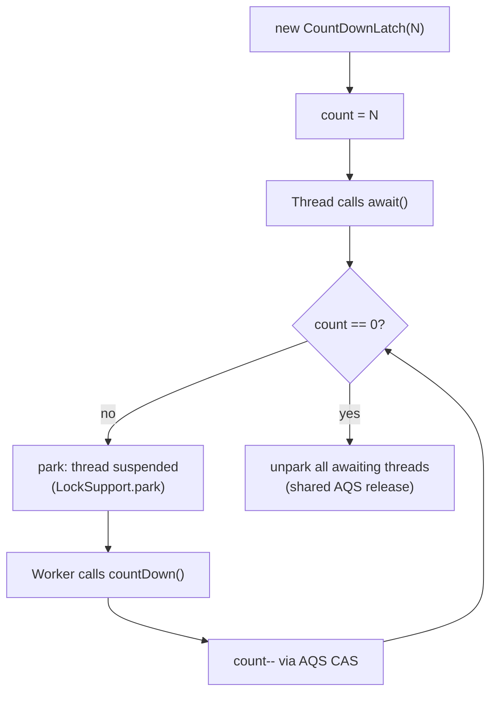
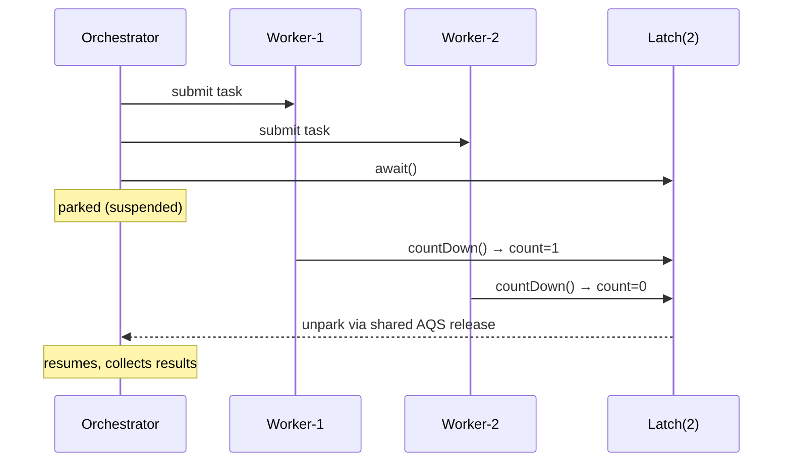
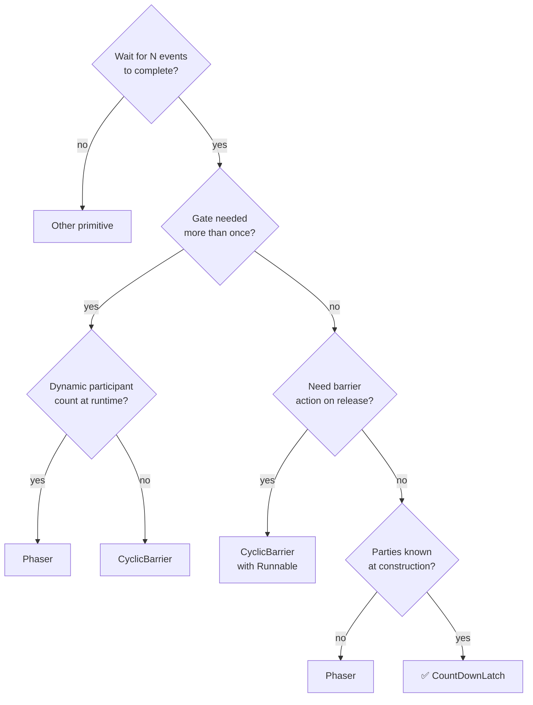

<!-- tldr -->
# CountDownLatch

`CountDownLatch` (`java.util.concurrent`) lets one or more threads block at `await()` until other threads call `countDown()` enough times to drive an internal counter to zero. Unlike `Thread.join()`, it decouples the waiter from the actual threads doing the work — any code can call `countDown()`, including callbacks, event handlers, or partially-completed tasks. It is **non-reusable**: once the count reaches zero it stays there permanently and all subsequent `await()` calls return immediately.



<!-- standard -->

## What It Is

`CountDownLatch` holds a single inner class `Sync extends AbstractQueuedSynchronizer`. The count is stored in AQS's `state` field. `countDown()` issues `releaseShared(1)`, decrementing `state` atomically (CAS). When `state` hits 0, AQS's shared-release propagation wakes every parked thread in the wait queue. `await()` calls `acquireSharedInterruptibly(1)`, which parks the calling thread if `state > 0`.

## Why It Matters

It solves three canonical synchronization patterns:

- **Fan-out / collect** — spawn N workers, block until all complete.
- **Starting gun** — initialize with `count=1`; N workers call `await()`, coordinator calls `countDown()` to release all simultaneously.
- **Staged startup** — gate a service from accepting traffic until N dependencies (DB, cache, config) are healthy.

## Primary Techniques

| Pattern | `count` init | Who calls `countDown()` | Who calls `await()` |
|---|---|---|---|
| Fan-out / collect | N workers | Each worker on finish | Orchestrator thread |
| Starting gun | 1 | Coordinator / test harness | N workers |
| Staged startup | N dependencies | Each dep on healthy signal | Main / server thread |
| Timeout await | any | Workers | Main with deadline |

`await(long timeout, TimeUnit unit)` returns `false` if the latch hasn't opened by the deadline — useful for circuit-breaking during startup.

## Key Tradeoffs

- **Non-reusable** — if you need repeated barriers, use `CyclicBarrier` or `Phaser`.
- **No "uncount"** — count can only decrease; use `Semaphore` for bidirectional permit management.
- **Leaked latch** — any thread that should call `countDown()` but throws without doing so causes permanent starvation unless `await(timeout, unit)` is used.
- **Count = 0 is sticky** — `await()` on an already-zeroed latch returns immediately; useful for late-joining threads.



<!-- deep -->

## Deep Dive

### AQS Internals

The full call chain on a count-reaching-zero event:

```
countDown():
  releaseShared(1)
    → tryReleaseShared(1):
        loop: c = getState(); if c==0 return false;
              CAS(state, c, c-1); if c-1==0 return true
    → if true: doReleaseShared()
        iterates CLH queue, unparks head.next, sets PROPAGATE,
        cascades until no more successors

await():
  acquireSharedInterruptibly(1)
    → tryAcquireShared(1): return (state == 0) ? 1 : -1
    → if -1: doAcquireSharedInterruptibly
        enqueue node (SHARED mode), LockSupport.park(this)
        on wakeup: if state==0, setHeadAndPropagate → unpark next
```

Shared release **propagates**: each unparked thread immediately tries to unpark its successor. The cascade unblocks all waiters in O(waiters) time with ~1–5 µs between consecutive unparks on x86.

### Real-World Systems

| System | Usage |
|---|---|
| **Netty** | `DefaultChannelGroupFuture` tracks N channel close futures; each close calls `countDown` |
| **Spring Boot** | `SmartLifecycle` orchestration waits for parallel context refresh phases |
| **HBase RegionServer** | Startup barrier: blocks HTTP before WAL replay, ZooKeeper lease, and block cache are all ready |
| **JUnit 5 parallel tests** | `ParallelExecutionStrategy` collects N test completion events before teardown |
| **Kafka Streams** | `StreamThread` shutdown uses a latch to coordinate graceful topology close across threads |
| **Elasticsearch** | Node startup gate waits for shard allocation, cluster state apply, and transport bind |

### Failure Modes

**1. Leaked `countDown` — always use `finally`:**

```java
try {
    doWork();
} finally {
    latch.countDown(); // never skip this
}
```

An uncaught exception without `finally` leaves count > 0 permanently. The orchestrator blocks forever (or until `await(timeout, unit)` fires).

**2. Off-by-one on initialization:**
Submitting N tasks conditionally (e.g., skipping empty partitions) while initializing the latch to N causes it to never reach zero. Track actual submitted task count before constructing the latch.

**3. Thundering herd on release:**
Releasing 10,000+ threads simultaneously from a single latch can spike scheduler overhead. Measure with `jstack` — if thread-resume throughput saturates CPU, consider `Phaser` with sub-phases or a bounded thread pool.

**4. Spurious reuse:**
Storing a zeroed latch in a field and expecting it to gate again. `await()` returns immediately — correct per spec, but silently breaks the intended gate. Always construct a fresh instance per gate event.

### Capacity & Latency Numbers

| Operation | Cost |
|---|---|
| `countDown()` uncontended | ~15–25 ns (single CAS) |
| `await()` park | ~1–5 µs (OS scheduler wakeup) |
| Latch-open → first thread resumed | ~2–10 µs |
| Memory per instance | ~48 bytes (header + Sync + AQS fields) |
| Max throughput | Millions of `countDown()` calls/sec |

No lock inflation, no monitor enter/exit — pure CAS + park. Suitable for high-frequency parallel task coordination inside a `ForkJoinPool`.

### `CountDownLatch` vs. Alternatives

| | CountDownLatch | CyclicBarrier | Phaser | Semaphore |
|---|---|---|---|---|
| **Reusable** | ✗ | ✓ | ✓ | ✓ |
| **Count direction** | Down only | N parties meet | Register / arrive | Up & down |
| **Barrier action** | ✗ | ✓ (Runnable callback) | ✓ | ✗ |
| **Dynamic parties** | ✗ | ✗ | ✓ | ✓ |
| **Interrupted waiter** | Propagates | Breaks barrier | Deregisters | Propagates |
| **Best for** | One-shot fan-out | Iterative phases | Tiered pipelines | Resource limits |

### Interview Pitfalls

1. **"Is `CountDownLatch` thread-safe?"** — Yes. `countDown()` uses CAS; `await()` uses `LockSupport.park`. No explicit locking needed.
2. **"What if `countDown()` is called more times than the initial count?"** — No-op. `tryReleaseShared` short-circuits when `state` is already 0; the method simply returns `false`.
3. **"How does AQS avoid busy-waiting?"** — `LockSupport.park` suspends the thread at the OS level via `FUTEX_WAIT` (Linux) or equivalent. Zero CPU spin.
4. **"Can I reset it?"** — No. The correct answer is `CyclicBarrier` (fixed parties, reusable) or `Phaser` (dynamic parties, multi-phase).
5. **"Difference from `Thread.join()`?"** — `join()` ties you to a specific `Thread` object; `CountDownLatch` decouples waiters from executors entirely. Works with `ExecutorService`, `CompletableFuture`, reactive callbacks — any context where you don't hold a thread reference.
6. **"Can `await()` return spuriously?"** — No. It only returns when count is 0 or the thread is interrupted. No spurious wakeups unlike raw `Object.wait()`.

### Decision Rubric — When to Reach for `CountDownLatch`



Reach for `CountDownLatch` when the synchronization point is **exactly once**, **party count is fixed at construction**, and **no post-release callback** is required. The gold-standard use case: an integration test that fans out N `ExecutorService` tasks and asserts all completed before verifying system state.