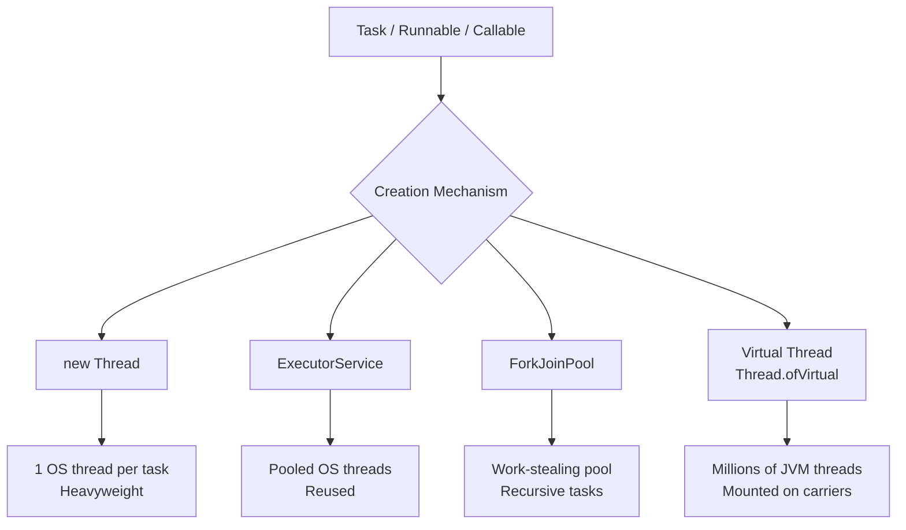
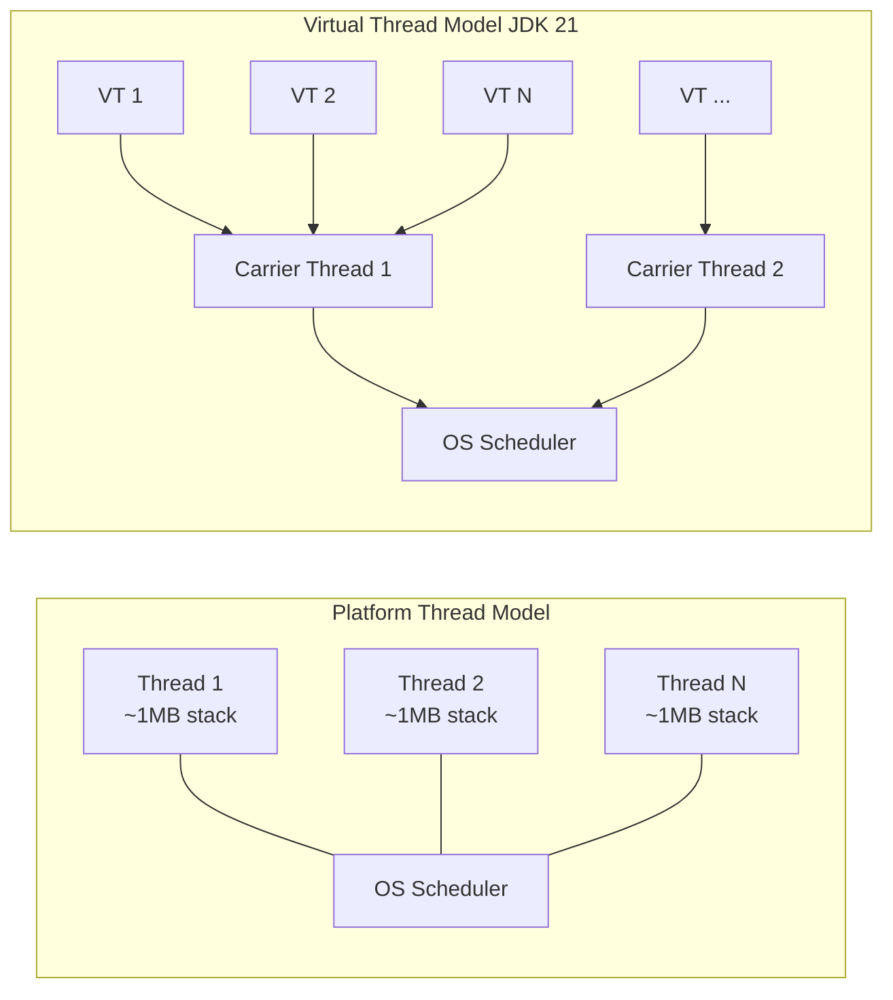
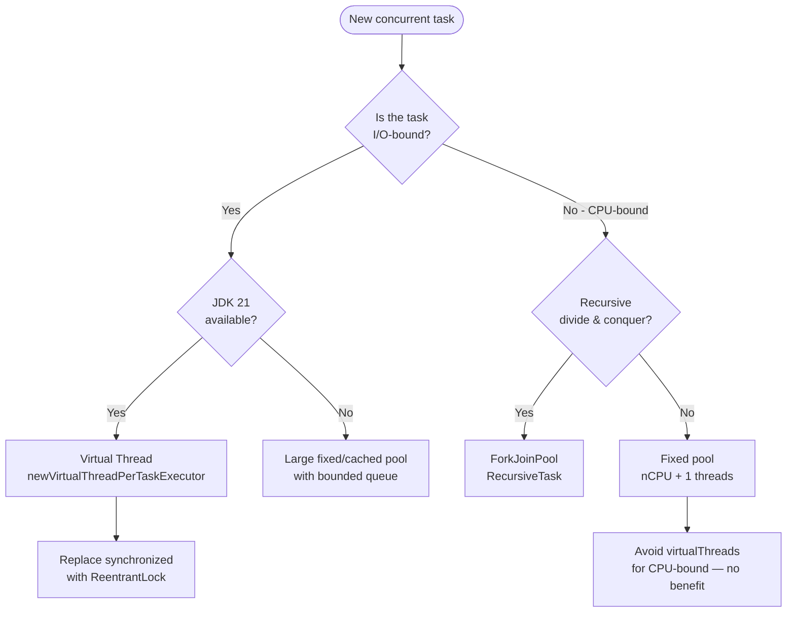

<!-- tldr -->
# Creating Threads

In Java, a thread is a lightweight unit of CPU scheduling backed by an OS thread (platform thread) or a JVM-managed carrier (virtual thread, JDK 21+). Raw `Thread` objects give full control but impose lifecycle-management overhead; `Executor`/`ExecutorService` abstractions pool and reuse threads at the cost of slight indirection. Virtual threads (Project Loom) flip the cost model entirely — you can create millions of them without worrying about native stack allocation.



<!-- standard -->

## What It Is & Why It Matters

Thread creation is the entry point to all concurrent Java code. Choosing the wrong abstraction leads to thread-explosion OOMs, starvation, or unnecessary context-switch overhead — all classic interview red flags.

### The Four Mechanisms

| Mechanism | API | Thread Type | Best For |
|---|---|---|---|
| Extend `Thread` | `class T extends Thread` | Platform | Quick demos only |
| Implement `Runnable` | `new Thread(runnable)` | Platform | Legacy, simple fire-and-forget |
| `Callable` + `Future` | `executor.submit(callable)` | Platform (pooled) | Tasks with return values / exceptions |
| Virtual Thread | `Thread.ofVirtual().start(r)` | Virtual | High-concurrency I/O-bound workloads |

### Key Tradeoffs

- **Raw `Thread`**: Each instance maps 1:1 to an OS thread (~1 MB stack by default). Spawning thousands causes RSS bloat and scheduler thrash.
- **`ExecutorService` (fixed/cached/scheduled pools)**: Reuses threads; bounded pools prevent runaway resource use. `newCachedThreadPool()` is deceptively dangerous — unbounded under bursty load.
- **`ForkJoinPool`**: Work-stealing scheduler; shines for recursive divide-and-conquer (`RecursiveTask`). Backs `CompletableFuture` pipelines and parallel streams.
- **Virtual Threads (JDK 21)**: Scheduled onto a small set of carrier (OS) threads. Blocking a virtual thread parks it without blocking the carrier — ~1 µs mount/unmount overhead, ~few KB heap per thread vs. ~1 MB native stack.



- **Prefer `Runnable` over subclassing `Thread`** — Java is single-inheritance; keeping the task separate from the thread lets you swap executors.
- **Always name your threads** (`ThreadFactory`) for debuggability in thread dumps.

<!-- deep -->

## Deep Dive: Creating Threads

### 1. Raw Thread Creation — Under the Hood

```java
// Pattern 1: Subclass (avoid)
class MyThread extends Thread {
    public void run() { /* task */ }
}
new MyThread().start(); // calls native start0()

// Pattern 2: Runnable (preferred for platform threads)
Thread t = new Thread(() -> doWork(), "worker-1");
t.setDaemon(true);       // dies with JVM; use for background housekeeping
t.setPriority(Thread.NORM_PRIORITY); // hint only; OS may ignore
t.start();
```

`Thread.start()` → JVM calls `pthread_create` (Linux) / `CreateThread` (Windows). Stack size defaults to `-Xss` (typically 512 KB–1 MB). Each thread gets its own PC register, native stack, and Java stack frames.

**Stack sizing math**: 500 threads × 1 MB = 500 MB RSS. At 5,000 threads you've consumed 5 GB just for stacks — before any heap allocation.

---

### 2. ExecutorService — Production Pattern

```java
// Bounded pool — production default
ExecutorService pool = Executors.newFixedThreadPool(
    Runtime.getRuntime().availableProcessors() * 2,
    new ThreadFactoryBuilder().setNameFormat("svc-worker-%d").build()
);

// Callable with timeout
Future<Result> f = pool.submit(() -> callRemoteService());
try {
    Result r = f.get(200, TimeUnit.MILLISECONDS); // P99 SLA guard
} catch (TimeoutException e) {
    f.cancel(true);
}

// Always shut down
pool.shutdown();
pool.awaitTermination(5, TimeUnit.SECONDS);
```

**`ThreadPoolExecutor` knobs** (know these cold for interviews):

| Parameter | Meaning | Tuning tip |
|---|---|---|
| `corePoolSize` | Threads kept alive always | Set to expected steady-state concurrency |
| `maximumPoolSize` | Hard ceiling | CPU-bound: `nCPU+1`; I/O-bound: higher |
| `keepAliveTime` | Idle thread TTL | 60 s typical |
| `workQueue` | Task buffer | `LinkedBlockingQueue(bounded!)` preferred |
| `RejectedExecutionHandler` | Overflow policy | `CallerRunsPolicy` for back-pressure |

**Danger**: `Executors.newCachedThreadPool()` uses `SynchronousQueue` (no buffering) and unbounded `maximumPoolSize`. Under a traffic spike it can create thousands of threads in milliseconds → OOM.

---

### 3. ForkJoinPool & Work Stealing

```java
ForkJoinPool pool = new ForkJoinPool(8); // parallelism = 8
pool.invoke(new RecursiveTask<Long>() {
    protected Long compute() {
        if (size <= THRESHOLD) return computeDirectly();
        RecursiveTask<Long> left = new Subtask(lo, mid);
        left.fork();                     // push to work queue
        return new Subtask(mid, hi).compute() + left.join();
    }
});
```

Work-stealing: idle threads steal tasks from the *tail* of peer deques. Achieves near-linear speedup for balanced trees. `commonPool()` (the JVM-global FJP) backs `CompletableFuture.supplyAsync()` — avoid blocking ops inside it.

---

### 4. Virtual Threads (JDK 21 — Project Loom)

```java
// One-liner creation
Thread vt = Thread.ofVirtual().name("vt-", 0).start(() -> handleRequest());

// Factory for executors
ExecutorService vtPool = Executors.newVirtualThreadPerTaskExecutor();
// Submit 1M tasks — each gets a virtual thread, total carrier threads = nCPU
IntStream.range(0, 1_000_000)
    .forEach(i -> vtPool.submit(() -> blockingDbCall()));
```

**Throughput numbers (JEP 444 benchmarks)**: A simple HTTP server handling blocking I/O with platform threads saturates at ~10K concurrent requests (thread-per-request model). Same server with virtual threads sustains 1M+ concurrent connections on the same hardware.

**Pinning (the gotcha)**: A virtual thread is *pinned* to its carrier when:
1. Inside a `synchronized` block/method (use `ReentrantLock` instead)
2. Calling native code (`JNI`)

Pinning defeats the scheduler — the carrier thread blocks too. Detect with `-Djdk.tracePinnedThreads=full`.

---

### 5. Real-World Usage

| System | Strategy | Why |
|---|---|---|
| **Tomcat (classic)** | `ThreadPoolExecutor`, 200 threads default | One thread per HTTP request |
| **Netty** | Small `NioEventLoopGroup` (2×nCPU) + async | Reactor pattern; no blocking |
| **Kafka consumer** | Fixed pool per partition | Ordered processing within partition |
| **gRPC-Java** | `ForkJoinPool` for non-blocking; separate pool for blocking stubs | Isolates blocking from event loop |
| **Spring Boot 3.2+** | Virtual thread executor opt-in | Replaces servlet thread pool transparently |

---

### 6. Failure Modes

- **Thread leak**: `ExecutorService` not shut down → GC can't collect threads → slow RSS creep.
- **Deadlock at creation time**: Thread A creates Thread B and joins it; Thread B tries to join A → `Thread.join()` deadlock, shows as `WAITING` in thread dump.
- **Context classloader pollution**: Long-lived pool threads retain classloaders of the task that set them → permgen/metaspace leak in OSGi / app-server redeploy cycles.
- **Virtual thread + synchronized pinning**: Latency spikes when all carriers are pinned; manifests as P99 blowout while P50 is fine.

---

### 7. Capacity & Latency Reference Numbers

- Platform thread creation: **~50–100 µs** (includes `pthread_create`, stack mmap)
- Virtual thread creation: **~1–2 µs** (heap allocation only)
- `ThreadPoolExecutor` task submission (queue + wakeup): **~1–5 µs**
- Context switch (OS): **~1–10 µs** depending on CPU / scheduler
- Max safe platform threads (JVM default stack): **~4,000–8,000** on a 4 GB heap host

---

### 8. Interview Pitfalls

1. **"Just use `newCachedThreadPool`"** — interviewers will probe the unbounded thread creation risk immediately.
2. Forgetting that `Thread.run()` does nothing on its own — only `start()` spawns a new thread.
3. Conflating `Runnable` (no return, no checked exception) with `Callable` (returns value, throws checked exception).
4. Not knowing that `ForkJoinPool.commonPool()` has a fixed parallelism and blocking it stalls `CompletableFuture` chains globally.
5. Missing the virtual thread pinning issue with `synchronized` — a top Loom interview question in 2024–2026 cycles.

---

### 9. Decision Rubric — When to Reach for Each



**Rule of thumb**: match thread count to the bottleneck resource — for CPU-bound work that's cores (`nCPU + 1`); for I/O-bound work it's the I/O concurrency ceiling (connections, file descriptors) — and virtual threads make that ceiling effectively infinite.