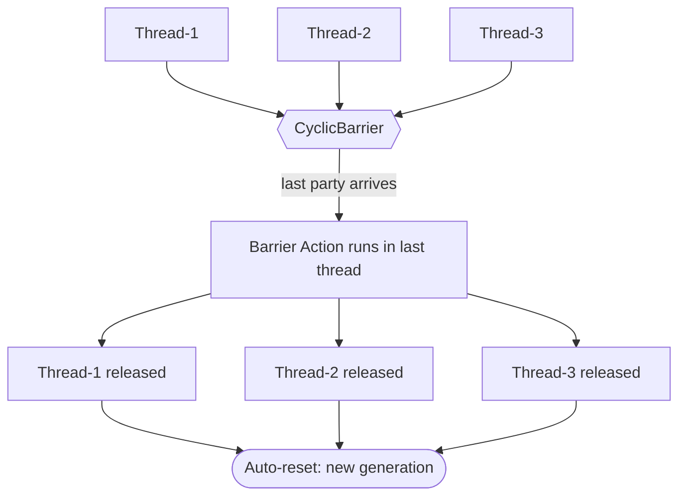
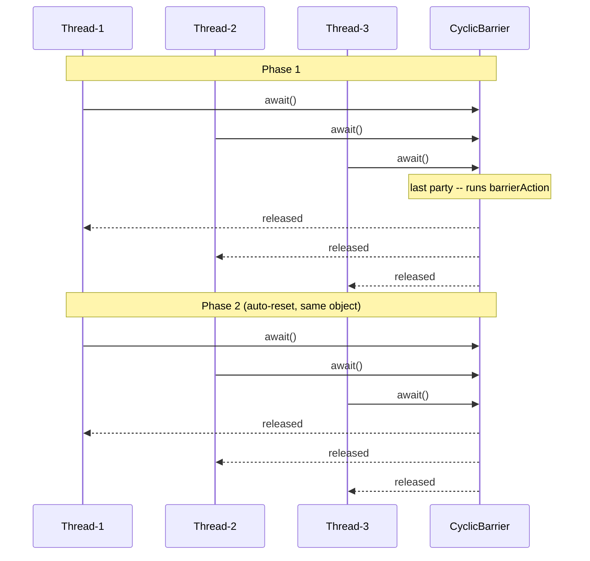
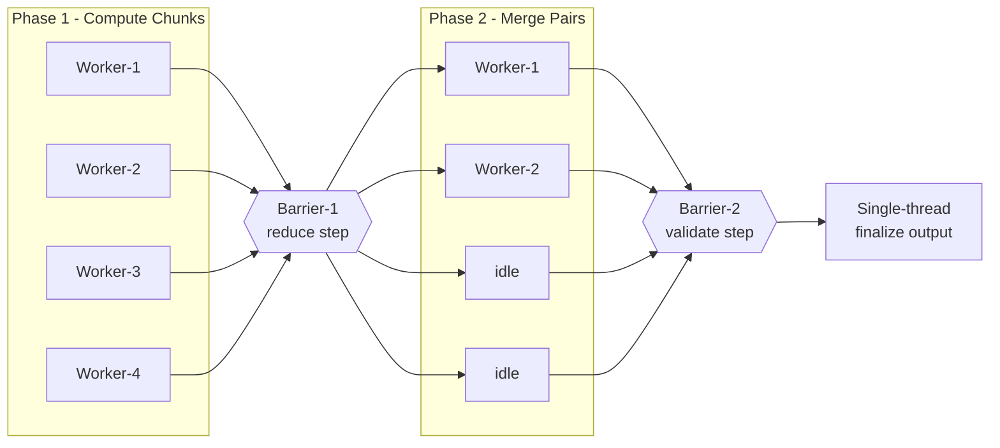

<!-- tldr -->
# CyclicBarrier

`CyclicBarrier` (`java.util.concurrent`) lets a fixed number of *parties* (threads) rendezvous at a barrier point. When the last party calls `await()`, an optional barrier action fires in that thread, then all blocked threads are released simultaneously. The barrier resets automatically after each trip—hence *cyclic*—making it purpose-built for phased, iterative parallel work.



<!-- standard -->

## What It Is

`CyclicBarrier(int parties)` or `CyclicBarrier(int parties, Runnable barrierAction)` creates a synchronization gate that opens only when exactly `parties` threads have each called `await()`. After release, the barrier resets internally (advances to a new *generation*), ready for the next phase without reconstruction.

## Why It Matters

Iterative parallel algorithms share a structural constraint: *all workers must finish Phase N before any starts Phase N+1*. Without a barrier, workers race into the next phase with stale data. `CyclicBarrier` enforces the checkpoint with minimal boilerplate and zero manual condition variables.

## Primary API

| Method | Behaviour |
|---|---|
| `await()` | Block until all parties arrive; throws `InterruptedException`, `BrokenBarrierException` |
| `await(timeout, unit)` | Timed variant; throws `TimeoutException` on expiry |
| `reset()` | Break current generation; all waiters get `BrokenBarrierException` |
| `isBroken()` | `true` if barrier was broken by interrupt, timeout, or `reset()` |
| `getNumberWaiting()` | Snapshot of currently blocked parties |
| `getParties()` | Immutable party count set at construction |

## Key Tradeoffs

- **Barrier action runs in the last arriving thread** — it blocks release of all waiting threads; keep it sub-millisecond.
- **Broken barrier is sticky** — any subsequent `await()` throws `BrokenBarrierException` until `reset()` is called.
- **Fixed party count only** — use `Phaser` when threads join or leave the computation dynamically.
- **`reset()` during active waiting is destructive** — only safe when you control all parties and know none are currently blocked.

## CyclicBarrier vs CountDownLatch vs Phaser

| Feature | `CyclicBarrier` | `CountDownLatch` | `Phaser` |
|---|---|---|---|
| Reusable | ✅ Auto-reset | ❌ Single-use | ✅ Multi-phase |
| Party count | Fixed | Fixed | Dynamic |
| Barrier action | ✅ Runnable | ❌ | ✅ `onAdvance()` |
| Arrival symmetry | All-to-all | N counters → M waiters | All-to-all |
| Non-participant wait | ❌ | ✅ `await()` | ✅ `awaitAdvance()` |
| Since Java | 5 | 5 | 7 |



<!-- deep -->

## Internal Implementation

`CyclicBarrier` is built entirely on one `ReentrantLock` + one `Condition` (`trip`). A mutable inner static class `Generation` carries a single `boolean broken` field. The core private method `dowait(boolean timed, long nanos)`:

1. Acquires the lock.
2. Checks `generation.broken` → throws `BrokenBarrierException`.
3. Checks thread interrupt → breaks generation, signals all, throws `InterruptedException`.
4. Decrements `count`; if `count == 0`:
   - Runs `barrierCommand` (barrier action) *inside the lock* — exception breaks the generation.
   - Calls `nextGeneration()`: signals all on `trip`, resets `count = parties`, `generation = new Generation()`.
   - Returns 0 (index of last-in thread).
5. Otherwise loops on `trip.await()` / `trip.awaitNanos()`, re-checking generation identity and broken state on each wake-up.
6. Returns `parties - 1 - index` as the arrival index (0 = last in).

**No `volatile` needed** — the `ReentrantLock` provides all required happens-before edges.

## Concrete Algorithms

### Parallel Iterative Solver (Jacobi / Gauss-Seidel)

```java
CyclicBarrier barrier = new CyclicBarrier(N, () -> {
    converged.set(checkConvergence(writeBuffer));
    swapBuffers(); // atomic under barrier guarantee
});

// Each of N workers:
while (!converged.get()) {
    computeRows(myStart, myEnd, readBuffer, writeBuffer);
    barrier.await(); // O(1) coordination cost per phase
}
// All phases: O(K × rows/N) compute + O(K) barrier overhead
// where K = iterations to convergence
```

### Parallel Merge Sort (log₂ N phases)

```
Phase 0: N workers sort N sub-arrays  (size S each)    → barrier.await()
Phase 1: N/2 workers merge pairs      (size 2S each)   → barrier.await()
Phase 2: N/4 workers merge pairs      (size 4S each)   → barrier.await()
...
Phase log₂N: 1 worker merges final pair                → done
```
The same `CyclicBarrier` object services all `log₂N` phases. Total coordination overhead: `log₂N` barrier trips at ~5–80 μs each ≪ sort time for large N.

## Real-World Systems

| System | How CyclicBarrier Appears |
|---|---|
| **Apache Spark** | `BarrierTaskContext.barrier()` in barrier execution mode synchronizes all tasks in a stage—required for collective ML ops (`torch.distributed` AllReduce). |
| **JMH** | Aligns warmup and measurement epochs across forked threads; each epoch is a barrier generation. |
| **Simulation frameworks (e.g., MASON, Repast)** | Tick-based simulations barrier all agent threads at the end of each simulation step before advancing the clock. |
| **Parallel GC (JVM internals)** | GC worker threads use barrier-like rendezvous between STW sub-phases (initial mark → concurrent mark → remark → compact). Not `CyclicBarrier` directly, but the same coordination pattern. |
| **Game engines (fixed-step loop)** | Physics, AI, and render threads barrier at frame end (~16 ms budget at 60 FPS) to prevent frame tearing. |

## Failure Modes

### Broken Barrier Cascade

One interrupted or timed-out thread breaks the entire generation. Every thread currently in `await()`, and every subsequent caller until `reset()`, gets `BrokenBarrierException`.

**Robust recovery pattern:**
```java
try {
    barrier.await(5, TimeUnit.SECONDS);
} catch (TimeoutException | BrokenBarrierException e) {
    // Only reset if you can guarantee all parties have exited await()
    if (!barrier.isBroken() || allPartiesAccountedFor()) {
        barrier.reset();
    }
    restartPhase();
} catch (InterruptedException e) {
    Thread.currentThread().interrupt(); // always re-set interrupt flag
}
```

### Permanent Deadlock: Party Count Mismatch

If a thread dies (uncaught exception, `Thread.stop()`) before calling `await()`, the barrier **never trips**—all remaining threads block forever. Mitigation:

```java
try {
    doWork();
    barrier.await(30, TimeUnit.SECONDS); // timeout as safety net
} catch (Exception e) {
    barrier.reset(); // unblock peers; they must handle BrokenBarrierException
    throw e;
}
```

### Barrier Action Exception

An unchecked exception in the barrier action breaks the generation before any thread is released. All `await()` callers get `BrokenBarrierException`.

```java
new CyclicBarrier(N, () -> {
    try { aggregateResults(); }
    catch (RuntimeException e) {
        log.error("barrier action failed", e);
        // Rethrowing here breaks the barrier — intentional or not?
        // Swallowing preserves the release. Choose deliberately.
    }
});
```

## Capacity & Latency Numbers

| Scenario | Observed Overhead |
|---|---|
| N=4, uncontended, trivial action | ~1–5 μs / barrier trip |
| N=16, moderate thread scheduling jitter | ~10–30 μs / barrier trip |
| N=64, heavy OS scheduling pressure | ~50–200 μs / barrier trip |
| `Phaser` equivalent (N=64) | ~60–250 μs / barrier trip (tree mode reduces this) |
| `CountDownLatch` equivalent (N=64) | ~15–60 μs (no cyclic overhead) |

*x86-64, OpenJDK 21, `-server -XX:+UseG1GC`, 3.2 GHz. Order-of-magnitude guides only.*

At N=8 workers, 1M iterations/sec/worker: barrier overhead is **< 0.1%** of total CPU time. At N=128 with OS jitter, it can climb to **1–3%**.

## Architecture: Multi-Phase Parallel Pipeline



## Interview Pitfalls

### 1. "Which thread runs the barrier action?"
**Answer:** The **last** thread to call `await()` in a given generation — non-deterministic across phases. It runs *synchronously inside the lock before anyone is released*, so it has exclusive visibility over all work done in that phase. This is the entire point of the barrier action: safe aggregation without additional synchronization.

### 2. "What happens if you call `reset()` while threads are waiting?"
**Answer:** `reset()` internally calls `breakBarrier()` (waking waiters with `BrokenBarrierException`), then immediately starts a new generation. It is *intentionally destructive*. It is only safe to call when you have confirmed all parties have exited `await()`, typically in a catch block after receiving `BrokenBarrierException` yourself.

### 3. "Happens-before guarantees?"
**Answer:** Actions before `await()` in *any* party happen-before actions after `await()` in *all* parties. The barrier action itself happens-before the release of all waiting threads. Guaranteed by the `ReentrantLock` unlock/lock sequence in `nextGeneration()`.

### 4. "Why not just use `CountDownLatch`?"
**Answer:** `CountDownLatch` is single-use and asymmetric—N threads decrement, M threads wait (they can be different sets). `CyclicBarrier` enforces that the *same* N threads synchronize *with each other* and can repeat. For iterative algorithms, reconstructing a `CountDownLatch` each phase is both wasteful and error-prone.

### 5. "When would `Phaser` beat `CyclicBarrier`?"
Answer with three scenarios:
- **Dynamic parties** — threads register/deregister mid-computation (`Phaser.register()` / `arriveAndDeregister()`).
- **Tiered coordination** — `Phaser` supports a tree structure reducing O(N) contention on the root lock to O(log N).
- **Non-participant observation** — a monitoring thread calls `phaser.awaitAdvance(phase)` without being a registered party, impossible with `CyclicBarrier`.

## When to Reach for `CyclicBarrier`

```
Is the party count fixed for the lifetime of the computation?
  YES → candidate
  NO  → use Phaser

Do all N threads need to synchronize with each other (all-to-all)?
  YES → candidate
  NO  → use CountDownLatch

Is this a multi-phase / iterative computation?
  YES → strong candidate for CyclicBarrier
  NO (single shot) → use CountDownLatch

Do you need to aggregate results between phases in a thread-safe way?
  YES → use CyclicBarrier with barrierAction
  NO  → plain CyclicBarrier or CountDownLatch

Party count > ~64 threads with tight latency requirements?
  YES → consider Phaser (tree mode) or custom Disruptor-style coordination
```

**Sweet spot:** Fixed-size thread pool performing iterative, phased work (simulations, parallel numerical solvers, staged data-processing pipelines) where the barrier action aggregates per-phase results before the next phase begins.