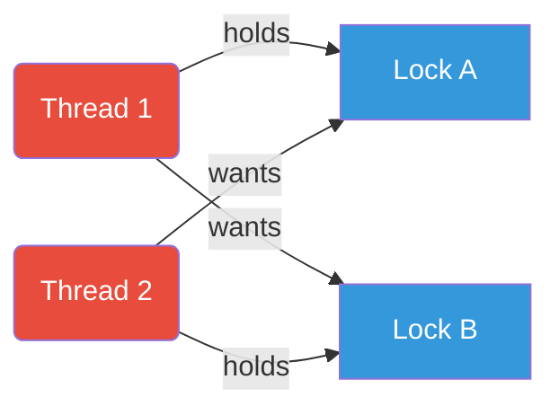
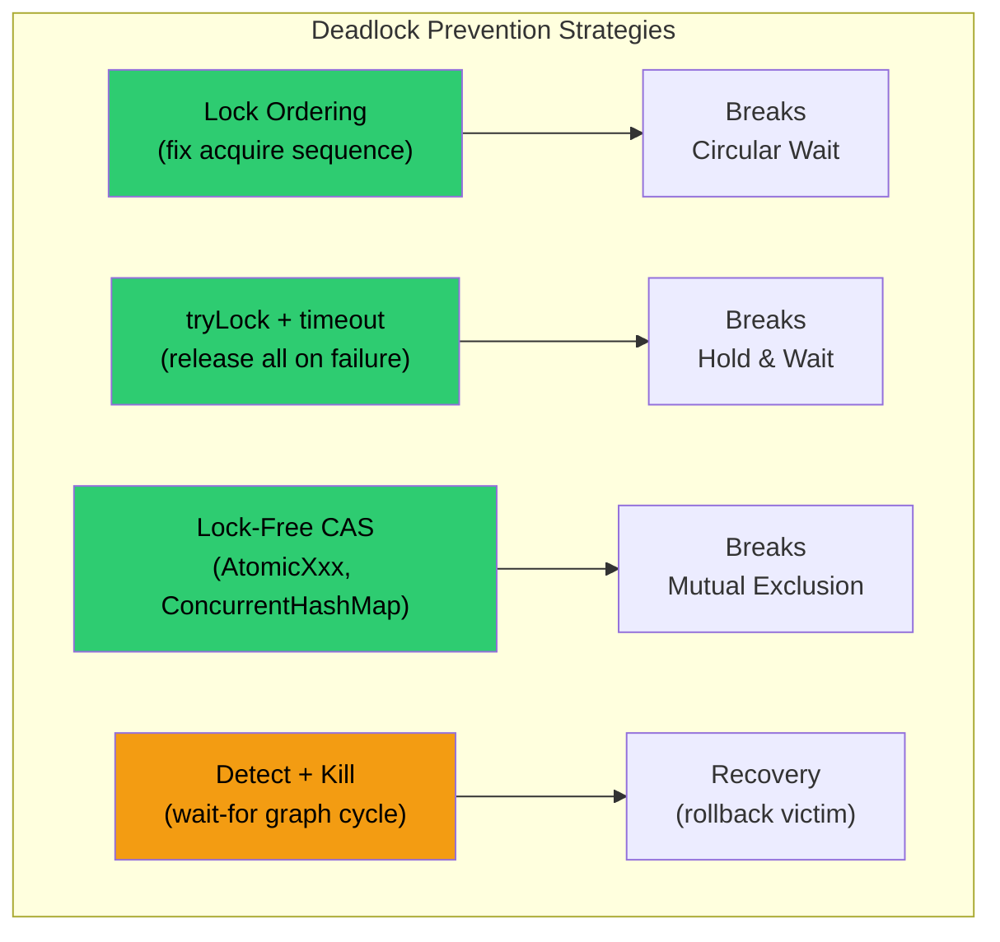
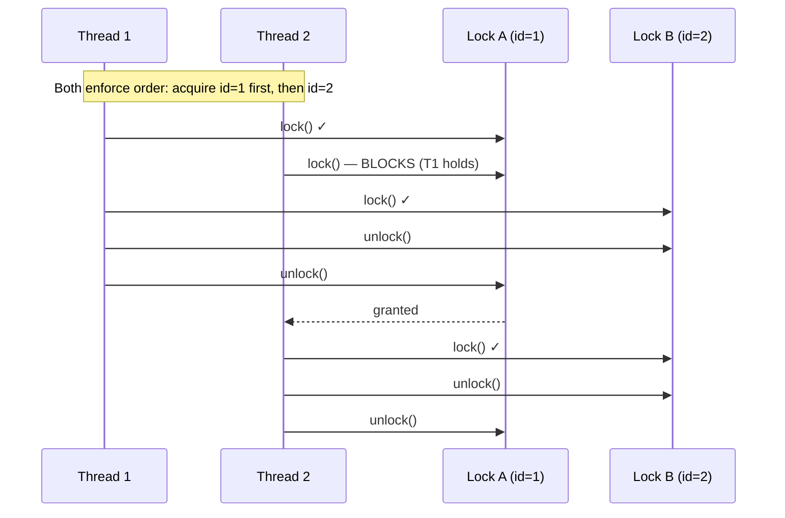
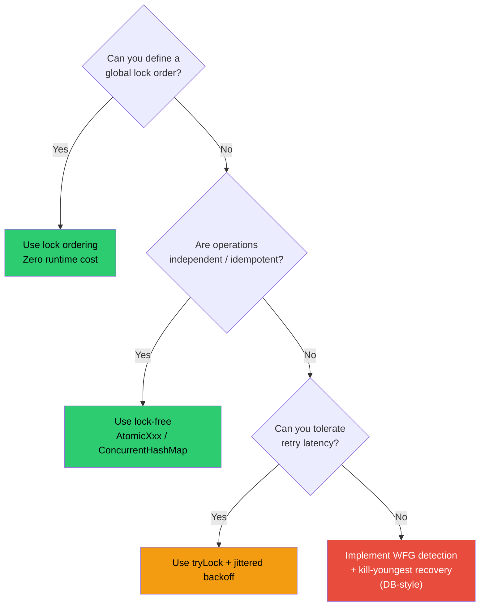

<!-- tldr -->
# Deadlock

A deadlock is a state where N ≥ 2 threads are each waiting for a resource held by another thread in the cycle — none can ever proceed. All four Coffman conditions must hold simultaneously for a deadlock to exist; eliminating any one of them prevents it. In Java, deadlocks are silent: threads neither throw exceptions nor time out unless you explicitly code for it.



<!-- standard -->

## What It Is

A deadlock is a **circular-wait** condition among threads competing for exclusive resources. It is distinct from:

| Condition | Threads progress? | Eventually resolves? |
|-----------|-------------------|----------------------|
| **Deadlock** | No | No — permanent |
| **Livelock** | Yes (spinning) | No — perpetual retry |
| **Starvation** | Some do | Theoretically yes |
| **Lock contention** | Yes (blocked, not stuck) | Yes — once lock free |

## The Four Coffman Conditions

Breaking **any one** is sufficient to prevent deadlock:

1. **Mutual Exclusion** — resource can only be held by one thread at a time.
2. **Hold and Wait** — a thread holds ≥1 resource while requesting more.
3. **No Preemption** — locks cannot be forcibly taken; only voluntarily released.
4. **Circular Wait** — a cycle T1→T2→…→Tn→T1 exists in the wait-for graph.

## Primary Prevention Techniques

- **Lock ordering** — assign a global total order to all locks; always acquire in ascending order. Eliminates circular wait.
- **`tryLock` with timeout** — `ReentrantLock.tryLock(500, MILLISECONDS)`; if acquisition fails, release all held locks, back off, retry. Eliminates hold-and-wait.
- **Lock-free / compare-and-swap** — `AtomicReference`, `ConcurrentHashMap` internals use CAS loops; no mutex means no deadlock.
- **Single global lock / coarse-grained locking** — trivially deadlock-free but destroys concurrency.
- **Deadlock detection + recovery** — used by RDBMS (InnoDB, PostgreSQL); maintain a wait-for graph, detect cycles at runtime, kill the "youngest" transaction.



## Key Tradeoffs

- Lock ordering is zero-runtime-cost but requires **global discipline** — one violation anywhere re-introduces the bug.
- `tryLock` with backoff can degrade to livelock under high contention if backoff is uniform (use jittered exponential).
- Lock-free structures have higher throughput at scale but are far harder to reason about and compose.

<!-- deep -->

## Deep Dive: Deadlock

### Formal Model — Wait-For Graph (WFG)

Represent each thread as a node. Draw a directed edge **T_i → T_j** if T_i is waiting for a lock currently held by T_j. A deadlock exists **iff the WFG contains a cycle**.

For resource instances (e.g., a pool of N identical connections), use a **Resource-Allocation Graph (RAG)**:

- **Request edge**: T → R (thread wants the resource)
- **Assignment edge**: R → T (resource assigned to thread)

A cycle in a RAG with single-instance resources is a necessary **and** sufficient condition for deadlock.

### Java: `synchronized` vs `ReentrantLock`

| Feature | `synchronized` | `ReentrantLock` |
|---|---|---|
| Trylock with timeout | ❌ | ✅ `tryLock(long, TimeUnit)` |
| Interruptible wait | ❌ | ✅ `lockInterruptibly()` |
| Fairness policy | ❌ | ✅ `new ReentrantLock(true)` |
| Condition variables | 1 per object | Multiple per lock |
| Deadlock visibility | Thread dump | Thread dump |

**Canonical lock-ordering pattern in Java:**

```java
// Always sort by System.identityHashCode to impose a total order
void transfer(Account from, Account to, int amount) {
    Account first  = from.id() < to.id() ? from : to;
    Account second = from.id() < to.id() ? to   : from;
    synchronized (first) {
        synchronized (second) {
            from.debit(amount);
            to.credit(amount);
        }
    }
}
```

**tryLock pattern (breaks hold-and-wait):**

```java
boolean transferred = false;
while (!transferred) {
    if (lockA.tryLock(50, MILLISECONDS)) {
        try {
            if (lockB.tryLock(50, MILLISECONDS)) {
                try {
                    // critical section
                    transferred = true;
                } finally { lockB.unlock(); }
            }
        } finally { lockA.unlock(); }
    }
    if (!transferred) Thread.sleep(ThreadLocalRandom.current().nextInt(10, 100)); // jitter
}
```

### Detection: Thread Dumps & `jstack`

```
Found one Java-level deadlock:
"Thread-1":
  waiting to lock monitor 0x00007f... (object 0x..., a java.lang.Object),
  which is held by "Thread-0"
"Thread-0":
  waiting to lock monitor 0x00007f... (object 0x..., a java.lang.Object),
  which is held by "Thread-1"
```

- `jstack <pid>` — standard JDK tool, prints full WFG analysis.
- `ThreadMXBean.findDeadlockedThreads()` — programmatic detection at runtime; returns `null` if no deadlock. Poll in a watchdog thread every 5–10 seconds.
- JFR (Java Flight Recorder) + JMC captures lock contention events continuously with < 1% overhead.

### Real-World Systems

#### InnoDB (MySQL)
- Maintains an in-memory wait-for graph per transaction.
- Runs cycle detection after **every lock request**.
- On cycle detected: kills the transaction with the **fewest undo log records** (cheapest rollback).
- Exposed via `SHOW ENGINE INNODB STATUS` → `LATEST DETECTED DEADLOCK`.
- Typical deadlock rate in high-throughput OLTP: 10–500/sec under heavy write contention; applications must retry on `1213 ER_LOCK_DEADLOCK`.

#### PostgreSQL
- Uses a **lightweight deadlock check** delayed 1 second after a lock wait begins (configurable via `deadlock_timeout`, default 1 s).
- Kills the process that initiated the deadlock detection (not necessarily the "youngest").

#### Cassandra / DynamoDB
- Single-partition operations are lock-free by design (CAS via Paxos LWT in Cassandra, conditional writes in DynamoDB).
- Multi-item transactions (Cassandra 4+ Accord, DynamoDB Transactions) use optimistic concurrency with version checks — deadlock-free by construction.

#### Kafka Broker
- Broker-level deadlock historically appeared in `ReplicaManager` ↔ `LogManager` lock inversion (KAFKA-3061). Fixed via lock ordering. Still a canary: subscribe to Apache Kafka JIRA for `deadlock` label — appears ~2/year.

### Sequence: Deadlock-Free Transfer via Lock Ordering



### Capacity & Latency Numbers

| Scenario | Number |
|---|---|
| InnoDB deadlock detection overhead | ~10 µs per lock request in WFG traversal |
| `ThreadMXBean.findDeadlockedThreads()` poll | ~50 µs; safe at 1 Hz per watchdog |
| `jstack` generation on 500-thread JVM | ~200–500 ms (stop-the-world) |
| Typical `tryLock` timeout to avoid deadlock | 50–500 ms depending on SLO |
| JDBC connection pool starvation → effective deadlock | < 5 s with pool size = max concurrent txn depth |

### Failure Modes Beyond the Obvious

1. **JDBC connection pool deadlock** — Thread A holds connection 1 and waits for connection 2; Thread B holds connection 2 and waits for connection 1. Not a JVM lock deadlock — `jstack` shows threads blocked on pool queue. Fix: pool size ≥ (max nested connection depth × thread count), or use flat single-connection transactions.

2. **Classloader deadlock** — Two threads trigger class initialization of classes that circularly reference each other. JVM detects this and throws `ClassCircularityError`. Rare but appears in OSGi/plugin systems.

3. **Distributed deadlock** — Microservice A holds a distributed lock in Redis/ZooKeeper and calls service B; B holds a lock and calls A. No single WFG — requires cross-service tracing (distributed deadlock detection is NP-hard in the general case; most teams just use lease timeouts of 1–30 s).

4. **Thread pool induced deadlock** — A task submitted to a fixed-size thread pool blocks waiting for another task that can never be scheduled because the pool is full. Fixed-size `ExecutorService` with subtask fan-out is a classic interview trap.

### Interview Pitfalls

- **"Deadlocks are rare in production"** — Wrong. Any shared mutable state without disciplined lock ordering can produce them; InnoDB sees them constantly.
- **Forgetting lock ordering applies to object identity, not variable name** — Two threads passing `(a, b)` and `(b, a)` to the same method need `identityHashCode`-based ordering, not alphabetical.
- **Using `synchronized` and assuming `interrupt()` works** — `synchronized` blocks are **not interruptible**. Use `ReentrantLock.lockInterruptibly()` for cancellable lock acquisition.
- **Proposing `Thread.stop()` for recovery** — Deprecated, unsafe, leaves monitors in inconsistent state.
- **Ignoring pool starvation as deadlock** — Interviewers often describe this scenario; recognize it as a resource deadlock, not a lock deadlock.

### When to Reach for Each Technique



> **Rule of thumb**: Default to lock ordering. Add `tryLock` only when ordering is architecturally impossible (e.g., user-supplied lock objects). Reserve WFG detection for systems where throughput justifies the bookkeeping overhead — primarily databases and transaction managers, not application code.