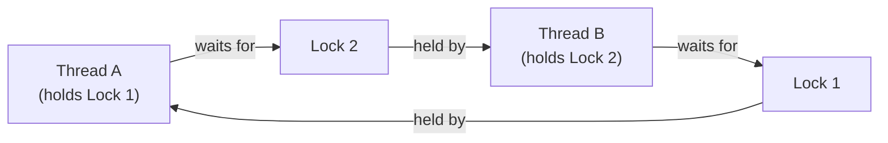
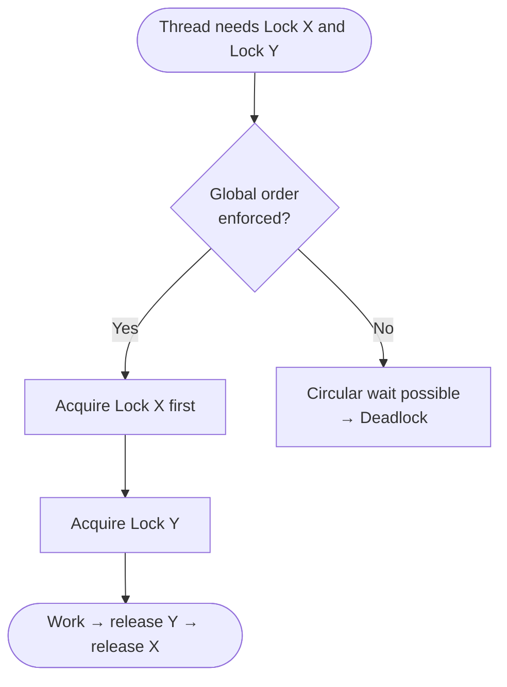

<!-- tldr -->
# Deadlock

Deadlock is a state where a set of threads are permanently suspended because each is waiting for a resource held by another in the set. It is not a race condition — no progress is made at all. The four Coffman conditions must all hold simultaneously for deadlock to occur: mutual exclusion, hold-and-wait, no preemption, and circular wait. Breaking any one of them eliminates deadlock.



<!-- standard -->

## What It Is

A deadlock freezes a subset of threads indefinitely. Unlike livelock (threads keep spinning) or starvation (a thread is perpetually skipped), deadlocked threads consume no CPU — they are simply parked, waiting forever.

### The Four Coffman Conditions

| Condition | Meaning | Break it by… |
|---|---|---|
| **Mutual exclusion** | Resource can't be shared | Use concurrent data structures (e.g., `ConcurrentHashMap`) |
| **Hold-and-wait** | Thread holds ≥1 resource while requesting more | Acquire all locks atomically upfront |
| **No preemption** | Locks can't be forcibly taken | Use `tryLock(timeout)` to release and retry |
| **Circular wait** | A cycle exists in the wait-for graph | Enforce a global lock-ordering protocol |

### Primary Techniques

- **Lock ordering** — always acquire locks in a deterministic global order (e.g., by object identity hash or assigned ID). Zero runtime overhead; most commonly applied technique.
- **`tryLock` with timeout** — `ReentrantLock.tryLock(100, MILLISECONDS)` lets a thread back off and retry instead of blocking forever.
- **Lock-free / non-blocking structures** — `AtomicReference`, `LongAdder`, `ConcurrentLinkedQueue` eliminate mutually exclusive locking entirely.
- **Single-lock redesign** — restructure ownership so one entity owns the resource hierarchy (common fix in producer–consumer pipelines).
- **Deadlock detection** — build a wait-for graph at runtime; detect cycles and recover (rollback one victim thread). Used in databases, rarely in application code.

### Key Tradeoffs

| Approach | Pros | Cons |
|---|---|---|
| Lock ordering | Zero overhead, simple | Must be enforced globally; breaks with dynamic lock sets |
| `tryLock` + retry | Works with dynamic lock sets | Livelock risk if all threads back off simultaneously |
| Lock-free structures | Highest throughput | Harder to write correctly; limited to specific patterns |
| Detection + rollback | Handles any lock topology | Adds graph maintenance overhead; recovery is complex |



<!-- deep -->

## Deep Dive

### The Coffman Conditions — Formally

Let **R** be a set of resources, **T** a set of threads, and **W(t)** the set of resources thread *t* waits for. A deadlock exists iff the **wait-for graph** G = (T, E) where edge t₁ → t₂ means "t₁ waits for a lock held by t₂" contains a **cycle**.

Detection complexity: **O(V + E)** with DFS. For *n* threads each holding one lock, V = n, E ≤ n — detection is cheap. The expensive part is maintaining the graph incrementally under high concurrency.

---

### Java-Specific Tools and APIs

#### Detection at Runtime

```java
ThreadMXBean bean = ManagementFactory.getThreadMXBean();
long[] deadlocked = bean.findDeadlockedThreads(); // returns null if none
if (deadlocked != null) {
    ThreadInfo[] info = bean.getThreadInfo(deadlocked, true, true);
    // log stack traces, alert, trigger graceful shutdown
}
```

`findDeadlockedThreads()` covers both `synchronized` monitors **and** `java.util.concurrent` locks. `findMonitorDeadlockedThreads()` covers only `synchronized`.

#### Prevention with `tryLock`

```java
ReentrantLock lockA = new ReentrantLock();
ReentrantLock lockB = new ReentrantLock();

boolean acquired = false;
while (!acquired) {
    boolean gotA = lockA.tryLock(50, MILLISECONDS);
    if (gotA) {
        boolean gotB = lockB.tryLock(50, MILLISECONDS);
        if (gotB) {
            acquired = true;
            try { /* critical section */ }
            finally { lockB.unlock(); lockA.unlock(); }
        } else {
            lockA.unlock(); // back off
        }
    }
    if (!acquired) Thread.sleep(ThreadLocalRandom.current().nextLong(10, 50)); // jitter
}
```

**Caution:** without random jitter, all contending threads back off and retry in lockstep → **livelock**. Add `ThreadLocalRandom` jitter.

#### Lock Ordering by System Identity Hash

```java
// Prevents circular wait without any coordination overhead
void transfer(Account from, Account to, int amount) {
    Account first  = System.identityHashCode(from) < System.identityHashCode(to) ? from : to;
    Account second = first == from ? to : from;
    synchronized (first) {
        synchronized (second) {
            from.debit(amount);
            to.credit(amount);
        }
    }
}
```

If `identityHashCode` ties (extremely rare), introduce a **tie-breaking lock** (a single global mutex) to guard the ordering decision.

---

### Real-World Systems

#### MySQL InnoDB
- Maintains a wait-for graph in memory and runs cycle detection after **every** lock grant.
- On cycle detected, it rolls back the **transaction with the fewest undo log records** (cheapest victim).
- Configurable via `innodb_deadlock_detect` (default ON). Disabling it shifts responsibility to `innodb_lock_wait_timeout` (default 50 s).
- Production rate: well-tuned OLTP schemas see < 1 deadlock/min at 50K TPS. Poorly designed schemas can see hundreds/sec.

#### PostgreSQL
- Uses a **lightweight deadlock detector** that runs whenever a lock request blocks for > `deadlock_timeout` (default 1 s).
- Detects cycles via DFS; aborts one transaction with `ERROR 40P01: deadlock detected`.

#### Apache Kafka (broker internals)
- Avoids deadlock by using **partitioned, single-threaded log segments** — each partition's log is owned by one thread; no cross-partition locks.
- Controller-to-broker coordination uses ZooKeeper/KRaft leader election to serialize state changes rather than holding concurrent locks.

#### HikariCP (JDBC connection pool)
- A common application-level deadlock: Thread A holds a DB connection and requests a second from an exhausted pool; Thread B is identical. Fix: `maximumPoolSize` ≥ max concurrent nested connection requests per request path. HikariCP logs this scenario explicitly.

#### Java `ForkJoinPool`
- Work-stealing design avoids deadlock by having blocked workers **compensate**: spin up extra threads up to `parallelism * 2` when all workers are blocked on `ManagedBlocker`.

---

### Sequence: Deadlock Formation and Detection

```mermaid
sequenceDiagram
    participant TA as Thread A
    participant L1 as Lock 1
    participant L2 as Lock 2
    participant TB as Thread B
    participant DT as Detector

    TA->>L1: lock() ✓
    TB->>L2: lock() ✓
    TA-->>L2: lock() — BLOCKED
    TB-->>L1: lock() — BLOCKED
    Note over TA,TB: Both parked; CPU = 0

    DT->>DT: Build wait-for graph
    DT->>DT: DFS — cycle found: A→B→A
    DT->>TB: Interrupt / rollback victim
    TB->>L1: release()
    L1-->>TA: granted ✓
    TA->>L2: lock() ✓
```

---

### Failure Modes and Capacity Numbers

| Scenario | Symptom | Typical MTTR |
|---|---|---|
| App-level deadlock (`synchronized`) | Threads stuck in BLOCKED; heap flat; CPU ~0% | Minutes — requires restart or `ThreadMXBean` alert |
| DB deadlock storm | Error rate spikes; latency bimodal (fast + 50s timeouts) | Seconds if auto-detected; minutes if timeout-based |
| Connection pool deadlock | `Connection timeout` errors at load peak; pool at max | Hours if not instrumented |
| ForkJoin task deadlock | Executor saturated; all threads WAITING | Requires code fix; no runtime escape |

**Latency impact:** a deadlocked thread holding a heavily contended lock can chain-stall hundreds of other threads within milliseconds at 100K+ QPS. At P99, a single deadlock event can spike latency from 5 ms to 30 s (lock-wait timeout).

---

### Interview Pitfalls

1. **"Just use `synchronized`"** — Interviewers penalize this for any system requiring timeouts or tryLock semantics. Mention `ReentrantLock` explicitly.
2. **Confusing deadlock with livelock** — Deadlock: threads parked, zero progress. Livelock: threads active, zero progress. CPU profile distinguishes them (100% vs 0%).
3. **Ignoring `identityHashCode` ties** — Missing the tie-breaking lock in a lock-ordering scheme is a subtle bug that interviewers probe.
4. **"Banker's Algorithm in production"** — Dijkstra's Banker's Algorithm is theoretically correct for avoidance but requires knowing maximum resource claims upfront — impractical for general-purpose servers. Say you'd use detection + recovery or lock ordering instead.
5. **Forgetting hidden locks** — `String.intern()`, class loading (`ClassLoader` holds a lock), and serialization (`ObjectOutputStream`) can all participate in deadlocks invisibly. Thread dumps via `jstack -l <pid>` reveal lock owners for all monitors.

---

### Diagnosis Checklist (Production)

```
1. jstack -l <pid>            # look for "Found one Java-level deadlock"
2. ThreadMXBean alert         # instrument; alert on non-null findDeadlockedThreads()
3. Java Flight Recorder       # jcmd <pid> JFR.start; analyze MonitorEnterEvent
4. Heap/CPU baseline          # deadlock = CPU ≈ 0, live threads BLOCKED
5. DB slow query log          # "Deadlock found when trying to get lock"
```

---

### When to Reach for Each Strategy

```
Is the lock set static (known at compile time)?
├── Yes → Lock ordering (by ID or identityHashCode). Done.
└── No  → Is max wait time acceptable?
           ├── Yes → tryLock(timeout) + jitter backoff
           └── No  → Redesign to eliminate shared mutable state
                      (lock-free structures, actor model, STM)

Running a database or resource manager?
└── Build wait-for graph + cycle detection + cheapest-victim rollback
    (same pattern as InnoDB, PostgreSQL, OS deadlock detectors)
```

**Rule of thumb:** lock ordering eliminates 90% of application-level deadlocks with zero runtime cost. Reach for `tryLock` only when locks are dynamically determined. Reach for lock-free structures when throughput requirements exceed ~500K ops/sec under contention.