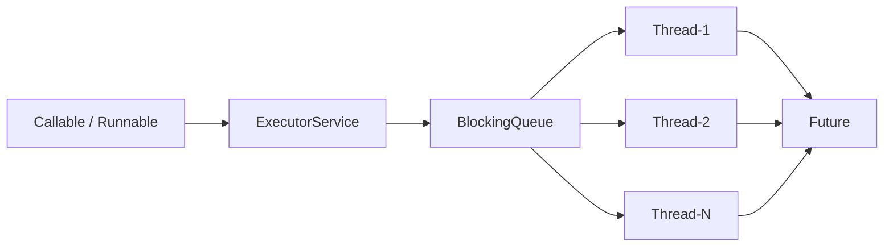
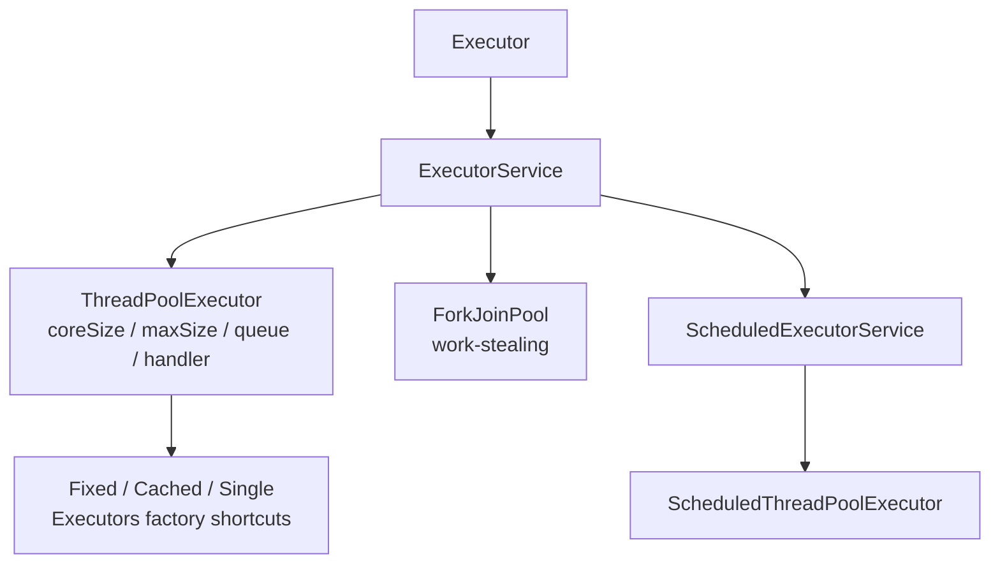
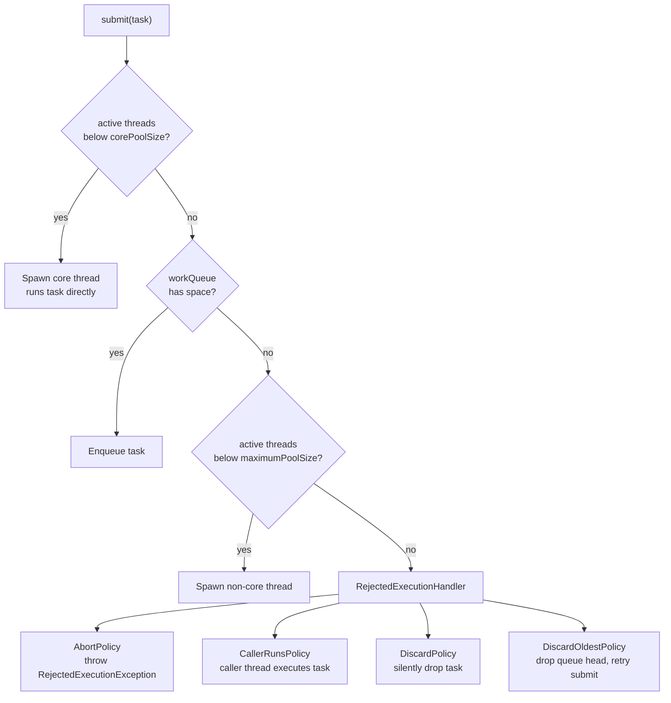

<!-- tldr -->
# Java Executor Framework

The `java.util.concurrent` Executor framework separates *what* runs (a `Runnable`/`Callable`) from *how* it runs (thread lifecycle, pooling, scheduling). `ThreadPoolExecutor` is the central implementation: it holds a pool of worker threads, a `BlockingQueue` of pending work, and a configurable rejection policy. You almost never construct raw `Thread` objects in production Java—you submit work to an `ExecutorService` and receive a `Future<V>` back.



<!-- standard -->

## What It Is & Why It Matters

Creating a raw `Thread` per request is catastrophic at scale: a service at 10 k RPS would spawn 10 k threads, each consuming ~256 KB–1 MB of stack (up to 10 GB total), plus ~1–10 µs of context-switch overhead per switch. `ExecutorService` caps concurrency, reuses threads, and provides lifecycle control (`shutdown`, `awaitTermination`).

## Core Interfaces

- **`Executor`** — single method `execute(Runnable)`.
- **`ExecutorService`** — adds `submit`, `invokeAll`, `invokeAny`, `shutdown`, `shutdownNow`.
- **`ScheduledExecutorService`** — adds `schedule`, `scheduleAtFixedRate`, `scheduleWithFixedDelay`.

## Executor Types at a Glance

| Factory / Class | Queue | Max Threads | Hazard |
|---|---|---|---|
| `newFixedThreadPool(n)` | Unbounded `LinkedBlockingQueue` | `n` | OOM — queue grows forever under load |
| `newCachedThreadPool()` | `SynchronousQueue` (no buffer) | `Integer.MAX_VALUE` | Thread explosion / OOM |
| `newSingleThreadExecutor()` | Unbounded `LinkedBlockingQueue` | 1 | Single throughput bottleneck |
| `newScheduledThreadPool(n)` | `DelayedWorkQueue` | `Integer.MAX_VALUE` | Thread explosion |
| `ForkJoinPool.commonPool()` | Work-stealing deques | `N_cpu − 1` | Starvation from blocking tasks |
| `ThreadPoolExecutor` (manual) | Any bounded `BlockingQueue` | Configurable | **Safest for production** |

**Rule:** In production, always build `ThreadPoolExecutor` directly with a bounded `ArrayBlockingQueue` or `LinkedBlockingQueue(capacity)`.

## Key `ThreadPoolExecutor` Constructor Parameters

- `corePoolSize` — threads kept alive even when idle.
- `maximumPoolSize` — ceiling, activated only after the queue is full.
- `keepAliveTime` — idle non-core thread TTL before termination.
- `workQueue` — the back-pressure knob; sizing this is the most important tuning decision.
- `RejectedExecutionHandler` — strategy when both queue and pool are saturated.



## Key Tradeoffs

- **Bounded queue + `CallerRunsPolicy`** → natural back-pressure; the caller slows down rather than crashing the service.
- **Unbounded queue** → never rejects work but latency grows without bound under sustained overload.
- **Large pool on IO-bound tasks** → high throughput; on CPU-bound tasks → context-switch overhead dominates beyond `N_cpu + 1`.

<!-- deep -->

## Deep Dive: Internals, Sizing, and Production Patterns

### ThreadPoolExecutor Task Submission State Machine



**Counter-intuitive detail:** A newly submitted task spawns a fresh thread *and runs directly on it* rather than queuing—even if idle threads exist—until `corePoolSize` is reached. Threads only pull from the queue once they finish their first task.

---

### Thread Pool Sizing Formulas

#### CPU-Bound Tasks
```
N_threads = N_cpu + 1
```
The `+1` absorbs rare page faults or GC pauses. Exceeding `N_cpu` adds context-switch cost with zero throughput gain. `ForkJoinPool.commonPool()` defaults to `Runtime.getRuntime().availableProcessors() − 1`.

#### IO-Bound Tasks (Little's Law)
```
N_threads = N_cpu × (1 + W / C)
```
- `W` = average wait time (network / disk IO latency)
- `C` = average compute time per task

A service with 10 ms DB round-trips and 1 ms CPU work on an 8-core host: `8 × (1 + 10/1) = 88 threads`. Common production REST service values: **50–200 threads**; tune with load testing, not intuition.

#### Queue Depth
```
Queue capacity ≈ N_threads × burst_duration_seconds × arrivals_per_second_per_thread
```
For a 100-thread pool at 500 RPS with P99 = 50 ms service time: `100 × 0.05 × 5 = 25` tasks queued at peak. A capacity of **500–5 000** typically absorbs short bursts without memory risk.

---

### Real-World Systems

| System | Pool Type | Notes |
|---|---|---|
| **Tomcat NIO** | `ThreadPoolExecutor` (`maxThreads=200` default) | One thread per in-flight request; bounded queue returns HTTP 503 when saturated |
| **Netty** | Two `NioEventLoopGroup` pools | Boss pool (1–2 threads) accepts connections; worker pool (`2×N_cpu`) handles IO |
| **Kafka Consumer** | Single-threaded per partition | Guarantees ordering; burst parallel work offloaded to a separate `ThreadPoolExecutor` |
| **Hystrix / Resilience4j** | One `ThreadPoolExecutor` per downstream dependency | Bulkhead pattern; `CallerRunsPolicy` provides natural back-pressure on the caller |
| **Elasticsearch** | Named pools: `search`, `write`, `management` | Separate queues prevent slow bulk writes from starving low-latency search queries |
| **HikariCP** | Tiny internal `ThreadPoolExecutor` (1–2 threads) | Connection housekeeping; demonstrates how pools compose inside libraries |

---

### `ForkJoinPool` and Work Stealing

Each worker thread owns a `Deque<ForkJoinTask>`. When a thread's deque is empty it **steals from the tail** of another thread's deque. Victims push and pop from the head; thieves steal from the tail—minimising CAS contention.

**Reach for `ForkJoinPool` when:**
- Tasks subdivide recursively (merge sort, tree aggregation, parallel scan).
- Average task granularity is **< 1 ms**; `RecursiveTask.fork()` overhead is ~hundreds of nanoseconds.
- Execution order is irrelevant.

**Avoid `ForkJoinPool.commonPool()` for:**
- Blocking IO — a single blocking task can park a carrier thread and starve all `parallelStream()` and `CompletableFuture.supplyAsync()` calls that share it.
- Long-running tasks — use a dedicated, separate pool or `ManagedBlocker`.

---

### Lifecycle Management

```java
executor.shutdown();                       // Reject new tasks; drain existing work
boolean done = executor.awaitTermination(30, TimeUnit.SECONDS);
if (!done) {
    List<Runnable> dropped = executor.shutdownNow();  // Interrupt workers
    log.warn("Dropped {} tasks on shutdown", dropped.size());
}
```

`shutdownNow()` calls `Thread.interrupt()` on worker threads. It does **not** guarantee tasks stop—tasks must honour interruption by checking `Thread.currentThread().isInterrupted()` or catching `InterruptedException` in loops.

---

### Failure Modes & Gotchas

1. **`newFixedThreadPool` OOM** — `Executors.newFixedThreadPool(n)` uses `new LinkedBlockingQueue<>()` with no capacity argument (unbounded). Under sustained overload, millions of `Runnable` objects accumulate on the heap → `OutOfMemoryError`. Always pass a capacity.

2. **Silent thread death on unchecked exceptions** — a `Runnable` that throws replaces the worker thread silently. Use `submit()` + `Future.get()` (rethrows as `ExecutionException`) rather than `execute()`, and set a `Thread.UncaughtExceptionHandler` via a custom `ThreadFactory`.

3. **`CallerRunsPolicy` deadlock** — if the submitting thread holds a lock that queued tasks also need, the caller executing the task will deadlock. Safe only when callers are independent request-handling threads.

4. **`awaitTermination` timeout too short** — a 1-second timeout on a pool with a 30-second in-flight DB transaction causes `shutdownNow()` to interrupt it mid-write. Size timeout to your worst-case task duration.

5. **`ThreadLocal` leaks** — pooled threads survive across tasks and retain `ThreadLocal` values. Always call `threadLocal.remove()` in a `finally` block.

6. **Virtual thread pinning (Java 21+)** — `Executors.newVirtualThreadPerTaskExecutor()` eliminates pool sizing for IO-bound work but reintroduces one-thread-per-task at the virtual level. `synchronized` blocks **pin** the virtual thread to its carrier, defeating the scaling benefit. Replace `synchronized` with `ReentrantLock`.

---

### Monitoring Metrics

| Metric | API | Alert Threshold |
|---|---|---|
| Active thread count | `tpe.getActiveCount()` | > 90 % of `maximumPoolSize` |
| Queue depth | `tpe.getQueue().size()` | > 80 % of capacity |
| Completed task rate | `tpe.getCompletedTaskCount()` (delta/sec) | Sudden drop → starvation |
| Rejected task count | Custom `RejectedExecutionHandler` + counter | Any rejection in a latency-SLA service |
| Task wait latency | `beforeExecute` / `afterExecute` hooks | P99 > 50 ms for latency-sensitive paths |

---

### Interview Pitfalls

- **"I'd use `Executors.newFixedThreadPool`"** — signals you know the API but not the hazard. Always follow up with: "…but in production I'd construct `ThreadPoolExecutor` directly with a bounded queue."
- **Forgetting `Future.get()` blocks** — chaining thousands of `Future.get()` calls in a loop on the calling thread serialises work. Compose with `CompletableFuture` instead.
- **Conflating `shutdown` and `shutdownNow`** — `shutdown` drains gracefully; `shutdownNow` *requests* interruption but cannot force it.
- **Not knowing parallel streams share `commonPool`** — CPU-intensive `parallelStream()` saturates `commonPool` and silently starves all other `CompletableFuture.supplyAsync()` calls in the JVM.
- **Quoting thread count without sizing rationale** — interviewers want the formula, not a magic number.

---

### Decision Rubric

| Scenario | Reach For |
|---|---|
| CPU-bound parallel computation, N independent tasks | `ForkJoinPool` / parallel streams |
| Divide-and-conquer recursion | `RecursiveTask` + dedicated `ForkJoinPool` |
| IO-bound, latency-sensitive (HTTP, DB, cache) | Manual `ThreadPoolExecutor` with bounded queue, or virtual threads (Java 21+) |
| Cron / delayed / periodic tasks | `ScheduledThreadPoolExecutor` |
| Dependency isolation (bulkhead) | Separate named `ThreadPoolExecutor` per downstream service |
| Reactive pipeline with declarative back-pressure | Project Reactor / RxJava schedulers (wrap a `ThreadPoolExecutor`) |
| Short-lived tooling / scripts | `Executors.newCachedThreadPool()` (controlled environment only) |