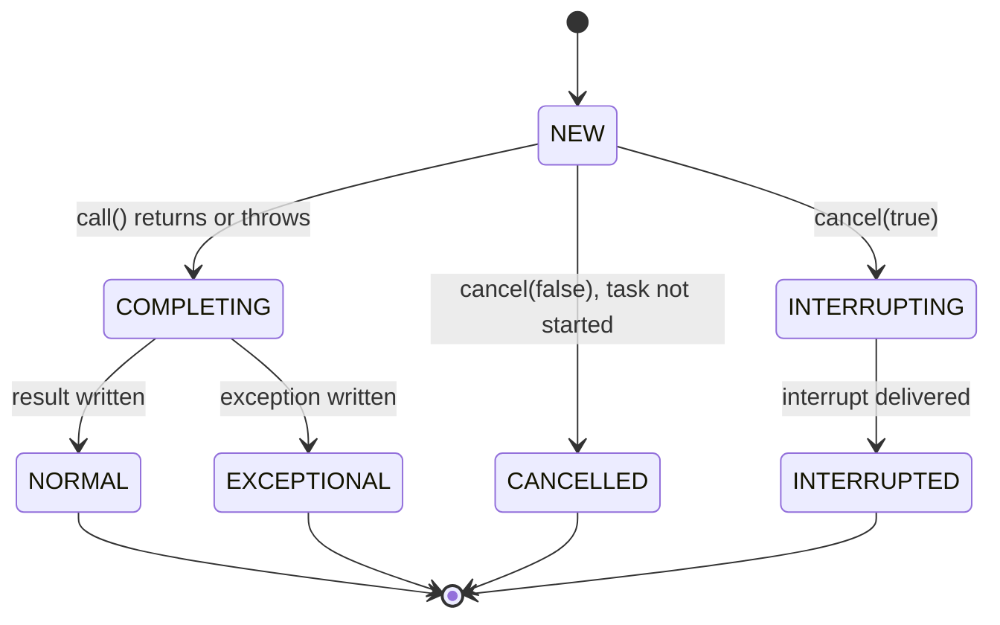
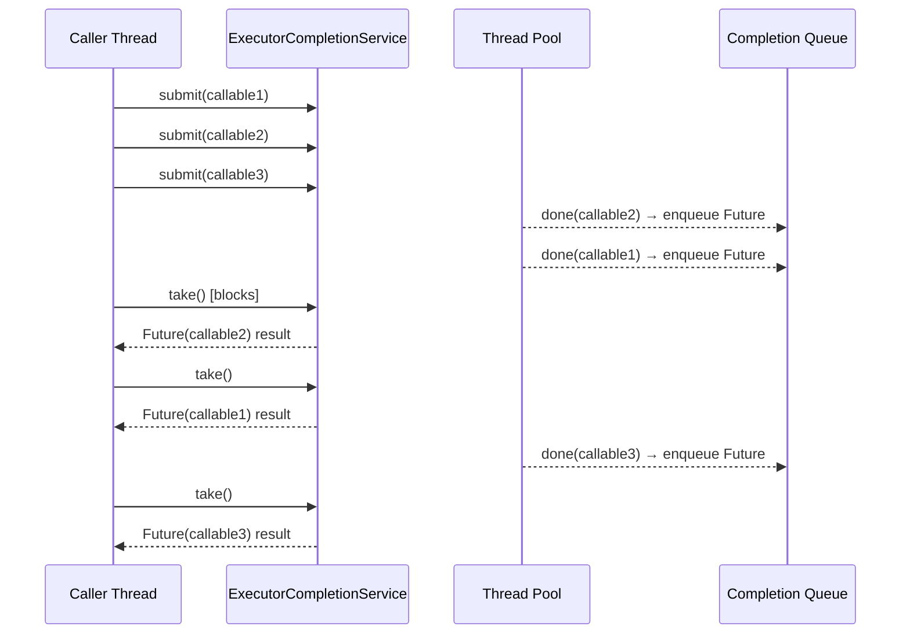

<!-- tldr -->
# Future & Callable

```mermaid
flowchart LR
    C["Callable&lt;T&gt;\ncall()"] -->|submit| ES[ExecutorService]
    ES -->|wraps in FutureTask| TP[Thread Pool]
    ES -->|returns immediately| F["Future&lt;T&gt;"]
    TP -->|executes & writes result| F
    F -->|get&#40;&#41; blocks if needed| R["T  /  Exception"]
```

`Callable<T>` is the typed, exception-aware sibling of `Runnable`. When submitted to an `ExecutorService`, it returns a `Future<T>` — a promise-like handle that decouples task submission from result retrieval. The calling thread can continue work and later block on `future.get()` only when the result is actually needed. Together they form the foundational async-execution contract in the `java.util.concurrent` package.



<!-- standard -->

## What They Are

**`Callable<T>`** — a single-method functional interface (`T call() throws Exception`) in `java.util.concurrent`. Differs from `Runnable` in two ways:
- Returns a typed value.
- Declares `throws Exception`, allowing checked exceptions to propagate.

**`Future<T>`** — the receipt you get back from `ExecutorService.submit(callable)`. Core API:

| Method | Behaviour |
|---|---|
| `get()` | Blocks indefinitely until done; throws `ExecutionException` wrapping the callable's exception. |
| `get(timeout, unit)` | Blocks up to the timeout; throws `TimeoutException` if not done. |
| `cancel(mayInterruptIfRunning)` | Attempts cancellation; returns `false` if already complete. |
| `isDone()` | Non-blocking poll; `true` for complete, cancelled, or exceptional states. |
| `isCancelled()` | `true` only if cancelled before natural completion. |

## Why It Matters

- Enables **scatter-gather** patterns: fan out N I/O calls concurrently, collect results with `get()`.
- Lets you enforce **deadlines** via `get(2, SECONDS)` without blocking the world.
- Foundation that `FutureTask`, `CompletableFuture`, and `ForkJoinTask` all build on.

## Primary Techniques

- **Fire and collect**: submit all tasks, store futures in a list, iterate and call `get()`.
- **Poll with backoff**: use `isDone()` in a loop to avoid hard blocking.
- **Timeout + cancel**: `get(timeout)` + `future.cancel(true)` to enforce SLAs.
- **`ExecutorCompletionService`**: wraps a pool; `take()` returns the *next completed* future, avoiding head-of-line blocking.

## Key Tradeoffs

- `Future.get()` is **blocking** — naively calling it immediately negates the concurrency benefit.
- **No composition**: you can't chain `Future` results or attach callbacks without extra boilerplate.
- **Cancellation is best-effort**: `cancel(true)` sends an interrupt, but only cooperative tasks (those checking `Thread.interrupted()`) will honour it.
- **`CompletableFuture`** (Java 8+) supersedes `Future` for new code requiring non-blocking pipelines — but understanding `Future` is still mandatory because legacy codebases and many library APIs (e.g., `HttpClient`, `gRPC ListenableFuture`) return raw futures.



<!-- deep -->

## Deep Dive: Future & Callable

### FutureTask Internals

`ExecutorService.submit(Callable)` wraps your callable in a **`FutureTask<T>`**, which implements both `Runnable` (for the pool to execute) and `Future<T>` (for the caller to retrieve). The state machine above maps directly to `FutureTask`'s `volatile int state` field in the JDK source.

**Result storage mechanism:**
```
Object outcome;   // holds T on NORMAL, Throwable on EXCEPTIONAL
```
`get()` parks the calling thread via `LockSupport.park()` if state < COMPLETING. Once the worker thread transitions to NORMAL/EXCEPTIONAL via a CAS on `state`, it calls `LockSupport.unpark()` on each waiting thread in a linked waiters list.

**Cost of `get()`:**
- If result is already set: ~**10–30 ns** (volatile read + return).
- If blocking: context switch adds ~**1–10 µs**; irreducible OS scheduling overhead.

### Scatter-Gather Pattern (Canonical Interview Snippet)

```java
ExecutorService pool = Executors.newFixedThreadPool(8);
List<Future<UserProfile>> futures = userIds.stream()
    .map(id -> pool.submit(() -> fetchProfile(id)))   // Callable lambda
    .toList();

List<UserProfile> profiles = new ArrayList<>();
for (Future<UserProfile> f : futures) {
    try {
        profiles.add(f.get(500, TimeUnit.MILLISECONDS));
    } catch (TimeoutException e) {
        f.cancel(true);       // attempt interrupt
        profiles.add(UserProfile.EMPTY);
    } catch (ExecutionException e) {
        handleError(e.getCause());
    }
}
```

This pattern is O(N) sequential `get()` calls, which head-of-line blocks on the slowest task. Use `ExecutorCompletionService` when you want to process results as they arrive.

### Sequence Flow: ExecutorCompletionService



`ExecutorCompletionService` wraps the pool with an internal `LinkedBlockingQueue`. Each completed `FutureTask` self-enqueues via a `done()` override — processing order is completion order, not submission order.

### Real-World Systems

| System | Pattern |
|---|---|
| **Cassandra** coordinator | Issues parallel reads to replicas as `Callable`s; collects `Future`s and applies read-repair once quorum responds. |
| **Kafka consumer** | Parallel partition processing submits `Callable` decode+deserialize tasks; result futures are joined before offset commit. |
| **gRPC Java (blocking stub)** | `stub.method(request)` internally `get()`s a `ListenableFuture` (Guava's `Future` extension); timeouts map to `get(deadline, unit)`. |
| **Spring `@Async`** | Returns `Future<T>` or `CompletableFuture<T>` from annotated methods; uses a configured `ThreadPoolTaskExecutor`. |
| **HikariCP** | `getConnection()` submits a park task as a `Callable`; `Future.get(connectionTimeout, ms)` enforces pool acquisition SLA. |

### Failure Modes

**1. Blocking immediately after submit**
```java
Future<T> f = pool.submit(task);
T result = f.get();  // ← defeats the purpose; equivalent to running synchronously
```
Always submit all tasks first, then collect.

**2. Swallowing `ExecutionException`**
```java
try { f.get(); } catch (ExecutionException e) { /* ignored */ }
```
The real cause is `e.getCause()`. Failing to unwrap it loses the stack trace from the worker thread.

**3. Assuming `cancel(true)` stops work**
Interrupt is advisory. If your callable calls a non-interruptible blocking op (e.g., `Socket.read()`, `Lock.lock()`), it will not stop. Design tasks to check `Thread.currentThread().isInterrupted()` or use interruptible variants (`lockInterruptibly()`).

**4. Thread-pool starvation deadlock**
A task submitted to a fixed pool calls `future.get()` on another task submitted to the *same* pool. If all threads are blocked waiting, no thread is free to execute the inner task → deadlock. Use a separate pool or `CompletableFuture` with async composition.

**5. Unbounded future list**
Storing 1 M `Future` objects for a bulk job holds references to their results simultaneously. At ~64 bytes per `FutureTask` + result object, 1 M futures ≈ **64–200 MB**. Drain and process in batches.

### Capacity & Latency Reference Numbers

| Scenario | Typical P99 |
|---|---|
| `get()` on already-completed future | < 50 ns |
| Single HTTP fetch offloaded via `Callable` (LAN) | 1–5 ms |
| 50 parallel DB queries, 10-thread pool | bounded by slowest shard; ~20–80 ms |
| `get(timeout)` expiry path | timeout + ~5 µs unpark overhead |

### Interview Pitfalls

- **"`Callable` vs `Runnable`"**: Interviewers expect you to mention the return type *and* checked exceptions. Missing either is a flag.
- **Forgetting `ExecutionException` wrapping**: Checked exceptions thrown inside `call()` are wrapped; always `getCause()`.
- **`isDone()` ≠ success**: `isDone()` returns `true` for cancelled and exceptional states too. Never use it as a success gate.
- **`FutureTask` as both `Runnable` and `Future`**: Be ready to explain why this dual nature exists (enables manual submission via `execute()` while retaining a `Future` handle).
- **When to prefer `CompletableFuture`**: Answer = any time you need chaining (`thenApply`, `thenCompose`), non-blocking callbacks, or `allOf`/`anyOf` combinators. Raw `Future` is appropriate when integrating with legacy APIs or when simplicity outweighs composability.

### Decision Rubric: When to Use `Future` + `Callable`

```
Need async result with a typed return value?
  ├─ Yes, and I need callbacks / chaining?
  │     → CompletableFuture
  ├─ Yes, simple fire-and-collect, no chaining?
  │     → Callable + Future  ✓
  ├─ Yes, integrating with Guava/gRPC ecosystem?
  │     → ListenableFuture (Guava) or adapt via CompletableFuture.supplyAsync()
  └─ No return value, no exception propagation needed?
        → Runnable / submit(Runnable) returns Future<?> (get() returns null)
```

**Reach for `Callable` + `Future` when:**
- You're on Java 7 or a codebase that predates `CompletableFuture`.
- You need to enforce a hard per-task deadline with `get(timeout, unit)`.
- You're building a library and want to return the simplest possible async contract without pulling in a reactive dependency.
- Task fan-out is small (< ~50 concurrent subtasks) and scatter-gather is the whole pattern.