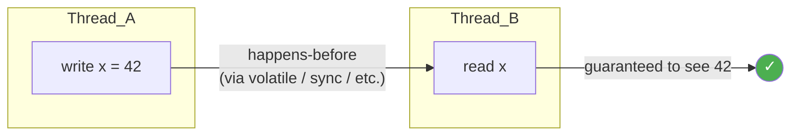
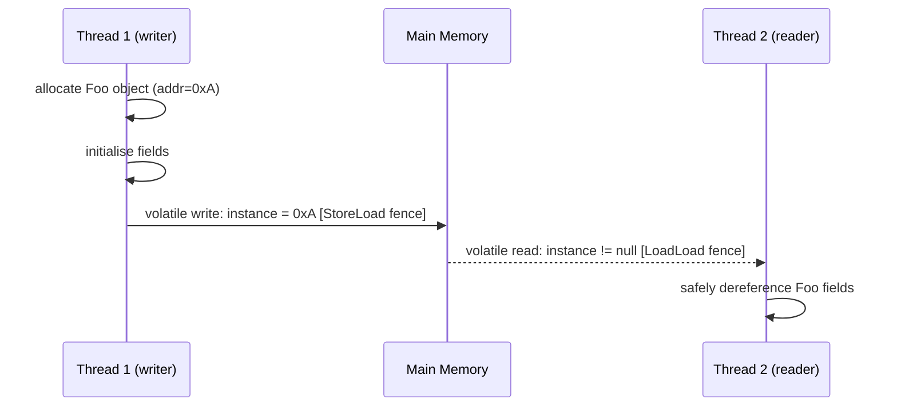
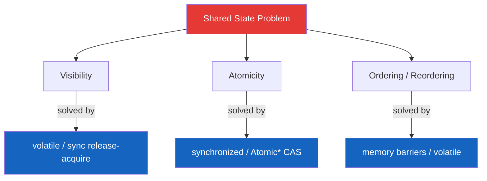

<!-- tldr -->
# Java Memory Model

The Java Memory Model (JMM), specified in JSR-133 and codified in JLS §17.4, defines the legal interactions between threads sharing memory. It answers one question: *under what conditions is a write by thread A guaranteed to be visible to thread B?* The answer is the **happens-before (HB)** partial order — if action X HB→ action Y, Y sees all effects of X. Without an HB edge, the JVM, JIT, and CPU are free to reorder, cache-buffer, or speculate however they like.



<!-- standard -->

## What It Is and Why It Matters

Modern hardware does not execute code in source order. CPUs reorder stores/loads for pipeline efficiency; L1/L2 caches create per-core write buffers; JIT compilers hoist or sink reads. The JMM provides a platform-independent abstraction over all of this — it tells you exactly which synchronisation actions create the visibility guarantees your program depends on.

### The happens-before rules (complete list)

| Rule | HB edge created by |
|---|---|
| Program order | Each action in a thread HB→ every subsequent action in the same thread |
| Monitor unlock | `unlock(m)` HB→ every subsequent `lock(m)` |
| Volatile write | `write(v)` HB→ every subsequent `read(v)` |
| Thread start | `Thread.start()` HB→ any action in the started thread |
| Thread join | Any action in thread T HB→ `T.join()` returning |
| Object construction | All writes in a constructor HB→ first use of a `final` field after ctor completes |
| Transitivity | X HB→ Y ∧ Y HB→ Z ⟹ X HB→ Z |

### Primary synchronisation mechanisms

- **`volatile`** — guarantees visibility and prevents reordering across the read/write; does *not* give atomicity for compound actions (check-then-act, i++).
- **`synchronized`** — mutual exclusion (atomicity) + release/acquire semantics on the monitor; heavyweight because it may block.
- **`final` fields** — safe publication without synchronisation; once the constructor completes and the reference escapes, all threads see the correct value.
- **`java.util.concurrent`** — built on `Unsafe.compareAndSwapX` / `VarHandle` acquire/release; exposes lock-free patterns atop the same HB rules.

### Key tradeoffs

| Mechanism | Atomicity | Visibility | Ordering | Cost |
|---|---|---|---|---|
| `volatile` read/write | ❌ (non-compound) | ✅ | ✅ (LoadLoad+StoreStore) | ~1–5 ns |
| `synchronized` | ✅ | ✅ | ✅ | ~20–100 ns uncontended |
| `AtomicLong.getAndIncrement` | ✅ | ✅ | ✅ (acq/rel) | ~5–15 ns (LOCK XADD) |
| Plain read/write | ❌ | ❌ | ❌ | ~0.3 ns |

<!-- deep -->

## Deep Dive: Algorithms, Real Systems, and Pitfalls

### Memory Barrier Semantics

The JMM is an *abstract* model; the real enforcement is memory barriers (fences) emitted by the JIT.

- **`volatile` write** → `StoreStore` + `StoreLoad` fence (the expensive one on x86: `MFENCE` or `LOCK ADD`).
- **`volatile` read** → `LoadLoad` + `LoadStore` fence (free on x86 due to TSO; costly on ARM/POWER).
- **`monitorenter`** → `LoadLoad` + `LoadStore` (acquire).
- **`monitorexit`** → `StoreStore` + `StoreLoad` (release).

On x86's Total Store Order (TSO) model, most load–load and store–store barriers are no-ops; the only truly expensive fence is `StoreLoad`. This is why `volatile` reads are essentially free on x86 but non-trivial on ARM.

### The Double-Checked Locking Pattern

Classic broken version (pre-JSR-133):
```java
// BROKEN before Java 5
if (instance == null) {
    synchronized (Foo.class) {
        if (instance == null)
            instance = new Foo(); // 3 steps: alloc, init, publish — reorderable
    }
}
```
Fix: declare `instance` **`volatile`**. The volatile write to `instance` happens *after* the constructor body, giving the required HB edge.



### Publication Safety and `final`

A `final` field written in a constructor is safe to publish *without* synchronisation:
```java
class ImmutablePoint {
    final int x, y;
    ImmutablePoint(int x, int y) { this.x = x; this.y = y; }
}
```
The JMM guarantees a **freeze action** at the end of the constructor — any thread that obtains the reference sees the final values. **Caveat:** if `this` escapes the constructor (e.g., registering in a global list inside the ctor), the guarantee evaporates.

### Atomicity vs. Visibility vs. Ordering

These are three orthogonal concerns the JMM addresses:



A common mistake is believing `volatile` fixes atomicity: `count++` is a read-modify-write and is *not* atomic even with `volatile`. Use `AtomicLong` or `LongAdder`.

### `VarHandle` and Acquire/Release (Java 9+)

`VarHandle` exposes four access modes:
- **Plain** — no guarantees (same as unguarded field access).
- **Opaque** — atomicity only; no ordering.
- **Acquire/Release** — uni-directional fences; cheaper than full `volatile` on weak-memory architectures.
- **Volatile** — full sequential consistency.

This mirrors C++11's `memory_order` and lets library authors (e.g., `j.u.c` internals) fine-tune barrier cost.

### Real-World Systems

| System | JMM usage |
|---|---|
| **`ConcurrentHashMap` (Java 8+)** | Node array is `volatile`; CAS on bucket head; `synchronized` per-bin for resize |
| **`LinkedTransferQueue`** | Uses `VarHandle` release-stores for lock-free enqueue; acquire-loads for dequeue |
| **Netty `ChannelPipeline`** | Uses `volatile` reference to handler list head for safe publication after modification |
| **Disruptor (LMAX)** | Sequences are `@Contended volatile long`; producer/consumer use explicit memory order to avoid false sharing |
| **Akka / Project Loom** | Actor mailbox uses `AtomicReference`; virtual-thread scheduler uses `j.u.c.locks` built on AQS (which itself uses `volatile int state`) |

### Failure Modes

1. **Visibility bug** — thread reads stale value from L1 cache because no HB edge exists. Symptom: infinite loop, stale config, silent data loss.
2. **Out-of-thin-air reads** — theoretically possible on very weak models; practically eliminated by JIT but can appear in broken lock-free code.
3. **Word tearing** — `long`/`double` writes are *not* guaranteed atomic on 32-bit JVMs unless `volatile`. Reading/writing a `long` can expose a half-written value.
4. **Safe-publication failure** — publishing a mutable object via a non-volatile/non-synchronized reference; reader may see partially constructed object.
5. **False sharing** — two `volatile` fields on the same cache line (64 bytes) cause unnecessary invalidation traffic. Fix with `@Contended` (JVM flag `-XX:+EnableContended`).

### Capacity / Latency Numbers

| Operation | Approximate latency |
|---|---|
| L1 cache hit (no sync) | ~0.3–1 ns |
| `volatile` read (x86) | ~1–2 ns |
| `volatile` write (x86, `MFENCE`) | ~20–40 ns |
| Uncontended `synchronized` block | ~25–80 ns |
| Contended `synchronized` (OS park) | ~1–10 µs |
| CAS success (`AtomicLong`) | ~5–15 ns |
| CAS failure + retry | ~30–200 ns (backoff-dependent) |

### Interview Pitfalls

- **"volatile is the same as synchronized"** — No. `volatile` gives no atomicity for compound actions.
- **"synchronized guarantees ordering across all threads"** — Only across threads that lock the *same* monitor object.
- **"final fields are always safe"** — Not if `this` escapes the constructor or if the owning object is mutated post-construction.
- **"`AtomicInteger` is always faster than `synchronized`"** — Under high contention, `LongAdder` or `synchronized` with `wait`/`notify` can be better because CAS spin-loops burn CPU.
- **Forgetting transitivity** — HB is transitive; you don't need a direct edge between every pair of actions.

### When to Reach for Each Tool

```
Need atomicity for a single variable?       → AtomicReference / AtomicLong / VarHandle
Need atomicity for a compound action?       → synchronized block (or StampedLock)
Need cheap publication of immutable data?   → final fields + safe reference publish
Need high-throughput counters (stats)?      → LongAdder (striped cells, no CAS contention)
Need ordered, batched events at 10M+/s?    → Disruptor (custom ring buffer with volatile sequences)
Need async, non-blocking I/O pipeline?      → Netty / Project Loom (VirtualThread + j.u.c)
```

### Decision Rubric

1. **Is the data read-mostly?** → `volatile` or `final`; reads are cheap.
2. **Is the update a single CAS-able word?** → `AtomicXxx` or `VarHandle`.
3. **Does the update span multiple fields?** → `synchronized` (or `ReadWriteLock` for read-heavy).
4. **Is throughput the bottleneck?** → Profile false sharing; consider `@Contended`; consider `LongAdder`; consider striped data structures.
5. **Is latency the bottleneck?** → Minimise `StoreLoad` fences; use acquire/release (`VarHandle`) instead of full volatile where sequential consistency is not needed.