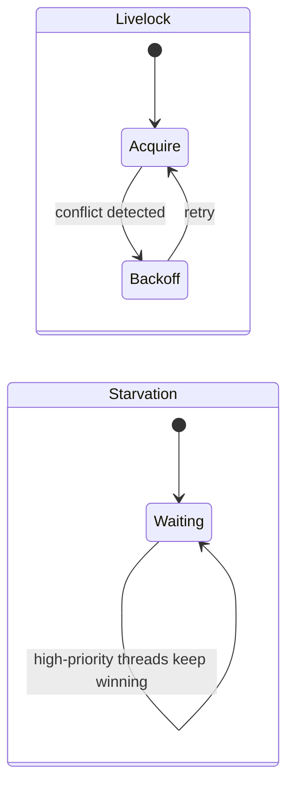
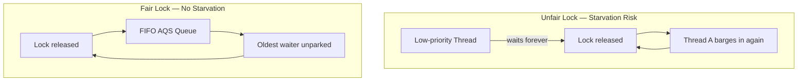
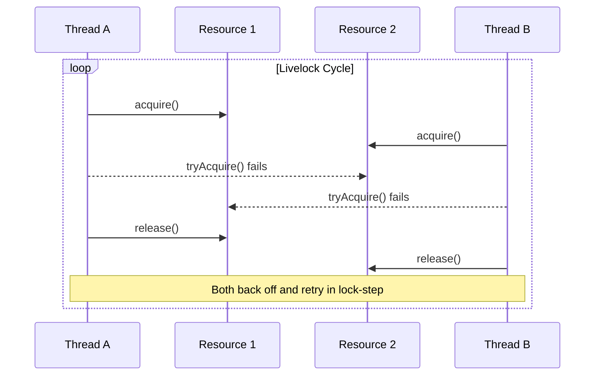
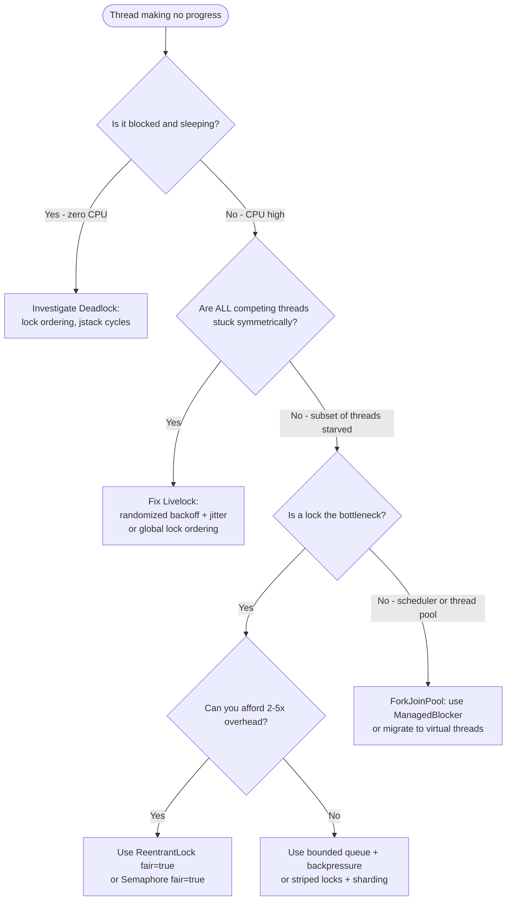

<!-- tldr -->
# Livelock & Starvation

Both are **progress failures**, but they fail differently. In a livelock, all involved threads are actively running — continuously changing state in reaction to each other — yet the system never moves forward. In starvation, one or more threads are indefinitely denied a resource while competing threads succeed repeatedly. Neither throws an exception, neither crashes the JVM, and both are invisible without deliberate instrumentation.



<!-- standard -->

## What They Are

**Livelock** is the "two people in a hallway" problem. Each thread detects a conflict and politely steps aside — but because both step aside at the exact same instant, they collide again on retry, forever. Unlike deadlock, no thread is parked or sleeping; all threads are `RUNNABLE` and consuming 100% of their CPU allotment. Livelock is most often introduced by naïve backoff strategies using `Thread.yield()` or synchronized `tryLock()` loops without randomization.

**Starvation** is a scheduling or fairness failure. A thread is perpetually skipped in favor of others because:
- The lock or scheduler is unfair (Java `synchronized` has no ordering guarantees).
- Higher-priority threads monopolize a resource.
- A **lock convoy** forms: a slow thread holds a lock; by the time it releases, faster threads immediately re-acquire it, lapping the slow thread indefinitely.
- A **thundering herd** is triggered: all waiters wake on release, one wins, the rest contend again with the same unlucky thread losing each round.

## Why It Matters

- Livelock wastes CPU at full throttle while making zero progress — harder to distinguish from genuine work in metrics than a deadlock.
- Starvation produces **unbounded tail latency**: P50 may look healthy while P99.9 → ∞.
- In distributed systems with optimistic concurrency and retry loops, livelock is a first-class design concern, not an edge case.

## Primary Fixes

| Problem | Root Cause | Fix |
|---|---|---|
| Livelock | Synchronized backoff cadence | Randomized exponential backoff with jitter |
| Livelock | Symmetric decision logic | Asymmetric tiebreaker (thread ID, rank, global token) |
| Livelock | Both | Global lock-ordering by identity hash — eliminates livelock *and* deadlock |
| Starvation | Unfair lock | `new ReentrantLock(true)` (FIFO AQS queue) |
| Starvation | Priority inversion | Priority inheritance; aging |
| Starvation | Lock convoy | Lock coarsening, striped locks, hand-off scheduling |

## Key Tradeoffs

- **Fair `ReentrantLock`** eliminates starvation but adds 2–5× overhead under high contention because it disables the fast-path "barging" optimization.
- **Randomized backoff** cures livelock but raises average latency; the jitter window must be tuned per workload.
- **Lock-free CAS loops** move the problem: a thread whose compare-and-swap perpetually loses is starved. True wait-free algorithms bound this at the cost of complexity.



<!-- deep -->

## Algorithms & Mechanics

### Livelock: The `tryLock` Trap

The canonical Java livelock pattern — both threads run identical logic:

```java
// Thread A and Thread B execute this symmetrically
while (true) {
    if (lockA.tryLock()) {
        try {
            if (lockB.tryLock()) {
                try { /* critical section */ return; }
                finally { lockB.unlock(); }
            }
        } finally {
            lockA.unlock(); // politely back off
        }
    }
    Thread.yield(); // both yield in lock-step → livelock
}
```

Both acquire their first lock, fail on the second, release, and retry in perfect unison. Two fixes break the symmetry:

**Fix 1 — Randomized exponential backoff with jitter:**

```java
long delay = BASE_MS; // e.g. 1ms
int attempt = 0;
while (true) {
    if (lockA.tryLock()) {
        try {
            if (lockB.tryLock()) {
                try { /* success */ return; }
                finally { lockB.unlock(); }
            }
        } finally { lockA.unlock(); }
    }
    // Full jitter: random in [0, min(cap, base * 2^attempt)]
    long sleep = ThreadLocalRandom.current().nextLong(
        Math.min(MAX_MS, delay * (1L << attempt++)));
    Thread.sleep(sleep);
}
```

**Fix 2 — Global lock ordering (preferred for deadlock prevention too):**

```java
// Always acquire locks in ascending identityHashCode order
Object first  = System.identityHashCode(lockA) < System.identityHashCode(lockB) ? lockA : lockB;
Object second = (first == lockA) ? lockB : lockA;
synchronized (first) { synchronized (second) { /* safe */ } }
```

### Starvation: Fairness Guarantees in Java

| Mechanism | Fair? | Notes |
|---|---|---|
| `synchronized` | ❌ | JVM may barge a thread ahead of all waiters; biased locking further skews toward the last holder |
| `ReentrantLock(false)` | ❌ (default) | Same barging; best raw throughput |
| `ReentrantLock(true)` | ✅ | FIFO CLH-variant AQS queue; ~2–5× slower under contention |
| `Semaphore(n, true)` | ✅ | Fair permit acquisition; same AQS internals |
| `ForkJoinPool` | Partial | Work-stealing is fair across tasks but can starve if all workers block on dependent subtasks |
| `StampedLock` | ❌ | No fairness; optimistic reads add throughput but can starve writers |

**AQS internals:** `ReentrantLock(true)` enqueues waiters in a doubly-linked CLH list. On `unlock()`, only the head node's successor is unparked — no barging permitted. This gives O(1) wakeup but eliminates the fast path where an arriving thread can acquire a just-released lock without entering the queue. Under 32 contending threads on a 16-core box, this difference is typically ~800K ops/sec (unfair) vs ~200K ops/sec (fair) in JMH benchmarks.

### Real-World Systems

#### Ethernet CSMA/CD — Canonical Livelock Fix

Without jitter, two hosts that collide would retry in the same slot → livelock. **Binary exponential backoff (BEB):** after the *k*-th collision, a host waits a random number of 51.2 µs slot-times in `[0, 2^k − 1]`. At k = 10 the window is 0–1,023 slots (≈ 52 ms). If 16 consecutive collisions occur the frame is dropped.

#### DynamoDB — Optimistic Locking + Jitter

DynamoDB conditional writes (`ConditionExpression` + version attribute) implement OCC. Under hot-key write contention, two clients can continuously lose to each other on the version check — effective livelock. The AWS SDK `RetryPolicy` mandates **full jitter**: `sleep = random(0, min(cap, base × 2^attempt))` with base = 100 ms and cap = 20 s. Equal jitter and decorrelated jitter are documented variants for different access patterns.

#### Kafka Consumer Group — Rebalance Storm as Starvation

When consumers join/leave rapidly, rebalance storms cause starvation: a consumer is perpetually assigned partitions, immediately triggers another rebalance before processing a single message, and is reassigned. Kafka 2.4+ **incremental cooperative rebalance** (KIP-429) fixes this: consumers retain undisputed partitions during rebalance, so stable members continue processing while only the contested partitions migrate.

#### Java `ForkJoinPool` — Thread Starvation Deadlock

A well-known production failure mode:

```
All ForkJoinPool worker threads are blocked inside tasks
that submit child tasks and call Future.get() / task.join() on them.
No thread is available to execute the child tasks → starvation deadlock.
Queue depth grows unbounded. No exception. Pool appears healthy.
```

Detection: `ForkJoinPool.commonPool().getQueuedTaskCount() > 0` while `getActiveThreadCount() == getParallelism()` and no progress.

Fixes:
- Use `ForkJoinTask.invokeAll()` — work-stealing handles the join implicitly.
- Implement `ForkJoinPool.ManagedBlocker` to signal the pool to spawn a compensating thread.
- Java 21 virtual threads: blocking I/O unmounts from the carrier thread, eliminating this class of starvation entirely for I/O-bound work.

#### Linux CFS — Bounding Starvation Mathematically

The Completely Fair Scheduler tracks `vruntime` (CPU time normalized by priority weight). The thread with the smallest `vruntime` runs next, stored in an O(log N) red-black tree. A sleeping thread's `vruntime` is clamped to `min_vruntime` on wake, so it can't dominate CPU, but it also immediately becomes the next candidate — bounding starvation by the number of runnable threads × timeslice.

### Sequence: Livelock in Action



### Failure Modes & Capacity Numbers

| Scenario | Symptom | Detection Tool |
|---|---|---|
| Livelock in retry loop | 100% CPU, zero throughput | `jstack` → all threads `RUNNABLE` in tight loop |
| Lock starvation | P99 latency spikes; P50 normal | Latency histograms; one thread's wait time → ∞ |
| ForkJoinPool starvation | All threads `WAITING`, queue grows | `ForkJoinPool.getQueuedTaskCount()` |
| Kafka rebalance storm | Consumer lag grows unbounded | Consumer group lag metric in Grafana |
| DynamoDB hot-key livelock | `ProvisionedThroughputExceededException` + retries looping | SDK retry metrics; CloudWatch `ThrottledRequests` |

**Numbers worth citing in interviews:**
- `ReentrantLock(true)` throughput: ~200K ops/sec vs ~1M ops/sec (unfair) at 32-thread contention on an 8-core machine (JMH).
- Ethernet BEB base slot: 51.2 µs; max wait after 10 collisions: ~52 ms.
- AWS SDK default retry: base 100 ms, cap 20 s, full jitter, max 3 attempts by default (configurable).
- Linux CFS default timeslice: ~0.75 ms per thread (scaled by `sched_latency_ns` / runqueue depth).

### Interview Pitfalls

1. **Conflating livelock with deadlock.** Deadlock = threads `BLOCKED` (parked by the OS, zero CPU). Livelock = threads `RUNNABLE` (burning cycles). Both make zero progress, but CPU utilization distinguishes them instantly.

2. **Conflating livelock with starvation.** Livelock is symmetric — *all* participants are stuck in a mutual reaction loop. Starvation is asymmetric — some threads succeed repeatedly while one subset never does.

3. **Assuming `synchronized` is fair.** It isn't. Interviewers often probe this directly. The JVM makes no ordering promises; a thread can be skipped indefinitely.

4. **Over-applying fair locks.** Fairness is expensive. Most production systems tolerate bounded unfairness and address starvation at a higher level via bounded queues, back-pressure, or rate limiting — not by paying the 2–5× lock overhead.

5. **Missing CAS starvation in "lock-free" code.** A thread whose CAS perpetually loses to faster threads is starved. True wait-free algorithms require **helping protocols** (e.g., the thread that wins helps complete the loser's operation) — correct answer if asked "is a CAS loop wait-free?"

6. **Not mentioning virtual threads for the ForkJoinPool starvation pattern.** Java 21 structured concurrency and virtual threads are the modern answer to this class of bug; interviewers at companies running Java 21+ expect you to know this.

### Decision Rubric: When to Reach for Each Fix



**Rubric summary:**
- Default to unfair locks; profile before changing.
- Switch to `ReentrantLock(true)` only when a tail-latency SLA is broken and `jstack` confirms a single thread perpetually in the wait queue.
- Use global lock ordering (by `identityHashCode` or a deterministic ID) as the first defense against both deadlock and livelock — it costs nothing at runtime.
- Never write a retry loop against a shared resource without jitter — this is non-negotiable in distributed systems and an automatic hire/no-hire signal in system design rounds.
- For Java 21+ services, prefer virtual threads for I/O-bound work; they eliminate the `ForkJoinPool` starvation class by design.