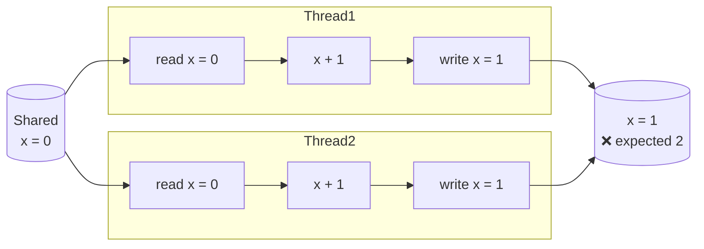
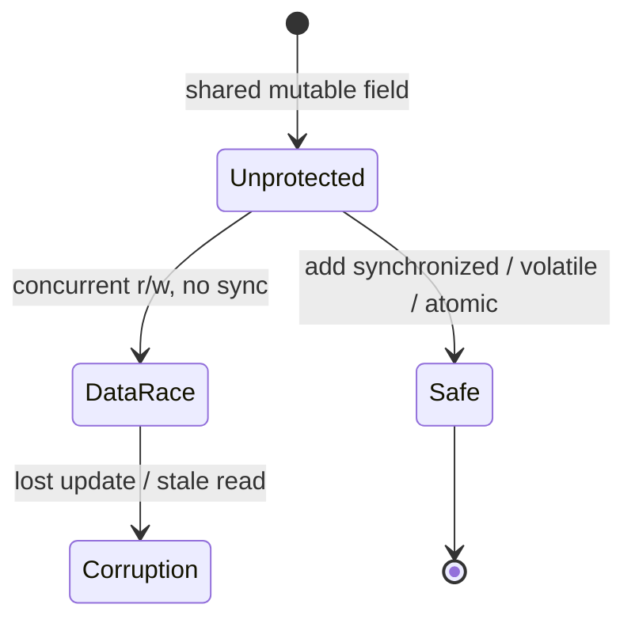
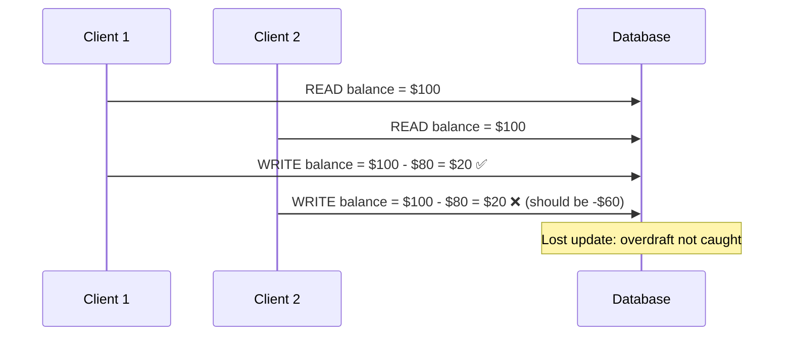
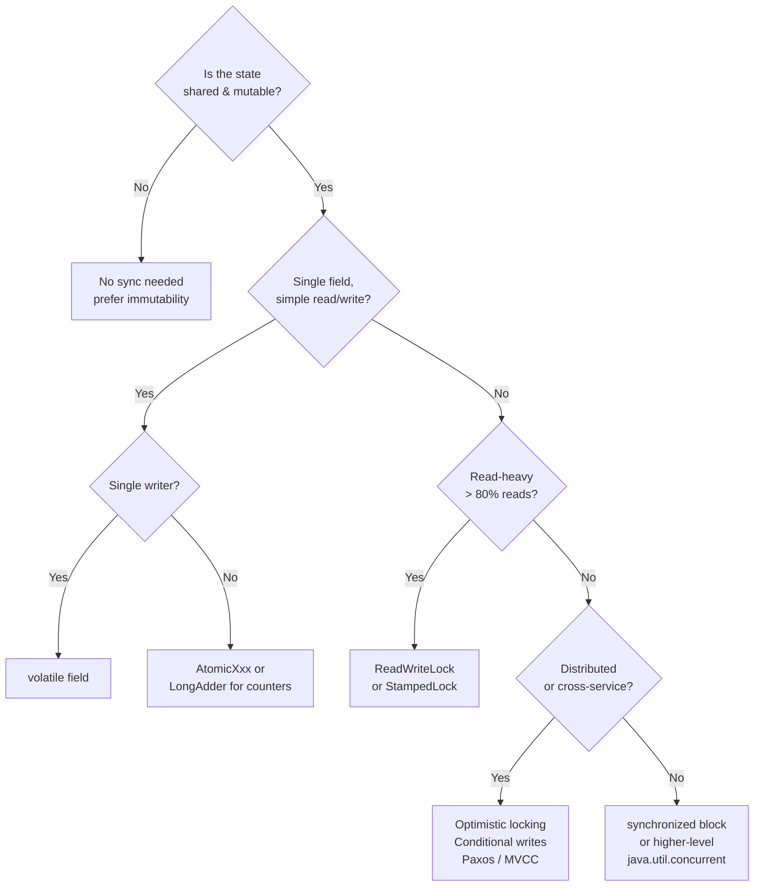

<!-- tldr -->
# Race Conditions

Two or more threads access shared mutable state concurrently, and at least one access is a write, with no synchronization enforcing a safe ordering. The resulting behavior is non-deterministic and often impossible to reproduce under a debugger because observation changes timing. In Java, race conditions manifest at both the JVM instruction level *and* the hardware memory-model level—CPU caches and instruction reordering compound the problem beyond simple interleaving.



<!-- standard -->

## What It Is

A race condition is the violation of a *safety property*: the program reaches a state that should be unreachable. The canonical example is `i++` on a shared counter, which compiles to three JVM bytecode operations (`GETFIELD`, `IADD`, `PUTFIELD`). Any interleaving that splits a read-modify-write across threads can lose an update.

**Two structural patterns cover ~90% of real races:**

- **Check-Then-Act** — read a condition, then act on it assuming it's still true (e.g., `if (map.containsKey(k)) map.get(k).doWork()`).
- **Read-Modify-Write** — read a value, compute a new value, write it back (e.g., `counter++`, lazy singleton init).

## Why It Matters

Races produce *data corruption that is intermittent, load-dependent, and timing-sensitive*. They scale with thread count and disappear under `-ea` debugging. At 1M QPS on a 32-core host, a counter race fires thousands of times per second; on a dev laptop with 4 threads it may never trigger.

## Primary Techniques in Java

| Technique | Granularity | Throughput | Use When |
|---|---|---|---|
| `synchronized` block | Mutual exclusion | Low–medium | Simple critical sections |
| `volatile` field | Visibility only | High | Single-writer, multi-reader flags |
| `AtomicLong` / `LongAdder` | Lock-free CAS | Very high | Counters, accumulators |
| `ReentrantReadWriteLock` | Read/write split | High (read-heavy) | Mostly reads, rare writes |
| `StampedLock` (optimistic) | Optimistic read | Highest | Low-contention, latency-critical |
| Immutability / confinement | No sharing | Zero overhead | Design-time, preferred default |

## Key Tradeoffs

- **`volatile` ≠ atomicity.** It guarantees visibility (flushes CPU store buffers) and prevents reordering, but `volatile long x; x++` is still three non-atomic operations.
- **`synchronized` provides both mutual exclusion and a happens-before edge**, so all writes before `unlock` are visible to any thread that subsequently `lock`s on the same monitor.
- **`LongAdder` beats `AtomicLong` under high contention** by striping the counter across cells; reads aggregate them. Good for metrics; bad when you need per-operation consistency.



<!-- deep -->

## Deep Dive

### CAS: The Hardware Primitive Behind Lock-Free Java

`AtomicInteger.incrementAndGet()` ultimately emits a `LOCK CMPXCHG` x86 instruction—**Compare-And-Swap**: atomically read a memory location, compare to an *expected* value, and write a *new* value only if they match. Spurious failure loops on contention.

```
// Pseudocode for CAS loop (what Atomic* classes do)
int current;
do {
    current = field.get();          // volatile read
} while (!field.compareAndSet(current, current + 1));  // CAS
```

**Latency benchmarks (JMH, Ryzen 7 5800X, JDK 21):**

| Operation | Uncontended | 8-thread contention |
|---|---|---|
| `volatile` read | ~1 ns | ~1 ns |
| `AtomicLong.incrementAndGet` | ~5 ns | ~60 ns |
| `synchronized` (biased) | ~2 ns | ~80–120 ns |
| `LongAdder.increment` | ~10 ns | ~12 ns |

### The ABA Problem

CAS checks *value equality*, not *identity*. If a field goes A → B → A between your read and your CAS, the swap succeeds despite a structural change underneath. **Fix:** use `AtomicStampedReference<V>` or `AtomicMarkableReference<V>` (adds a version counter / boolean tag alongside the reference).

### TOCTOU in Distributed Systems

Time-of-Check-to-Time-of-Use races aren't limited to threads. They occur across services:



**Fixes at distributed scale:**
- **Optimistic locking** — include a `version` column; the `UPDATE` checks `WHERE version = N` and fails if another writer incremented it first (used in JPA `@Version`).
- **Conditional writes** — DynamoDB `ConditionExpression`, Cassandra lightweight transactions (`IF balance > amount`), Redis `WATCH`/`MULTI`/`EXEC`.
- **Compare-and-swap semantics** — Zookeeper's `setData(path, data, version)` rejects writes on version mismatch.

### Real-World Systems

- **Kafka ISR management** — ZooKeeper (pre-KRaft) used conditional znodes to update the ISR set; a broker could only add itself if it had caught up, preventing split-brain from a TOCTOU on partition leadership.
- **Cassandra paxos (LWT)** — `INSERT ... IF NOT EXISTS` runs a Paxos round to prevent two nodes from inserting the same key concurrently. At P99 ~5–10× slower than normal writes; use sparingly.
- **HotSpot JIT** — The JIT eliminates lock elision for synchronized blocks when escape analysis proves the monitor object doesn't leave the thread. This means micro-benchmarks of `synchronized` on local objects are not representative.
- **ConcurrentHashMap (JDK 8+)** — Uses CAS on individual bucket heads for `put`, falling back to `synchronized` per-bucket only on collision. Read paths are lock-free via `volatile` node links.

### Java Memory Model (JMM) Nuances

The JMM defines *happens-before* (HB) relationships, not wall-clock ordering. Without an HB edge, a write in Thread A is **not guaranteed visible** to Thread B regardless of actual execution order:

- `volatile` write HB `volatile` read of the same field.
- `unlock(m)` HB any subsequent `lock(m)`.
- `Thread.start()` HB all actions in the started thread.
- `Thread.join()` HB all actions after the join returns.

**Classic bug: Broken double-checked locking (pre-JDK 5)**

```java
// BROKEN without volatile (JDK 1.4 and below, or missing volatile)
if (instance == null) {                     // check (no lock)
    synchronized (Singleton.class) {
        if (instance == null)
            instance = new Singleton();     // publish partially-constructed object
    }
}
```

`new Singleton()` is three steps: allocate, construct, assign reference. Without `volatile`, the JIT can reorder assign before construct; another thread sees a non-null but incompletely initialized reference. **Fix:** `private static volatile Singleton instance;`.

### Failure Modes Taxonomy

| Failure | Root Cause | Symptom | Detection |
|---|---|---|---|
| Lost update | Read-modify-write race | Counter < expected | ThreadSanitizer, stress tests |
| Stale read | Visibility without HB | Infinite spin on flag | `volatile` audit |
| Partially constructed object | Publication race | NullPointerException / garbled state | Code review, FindBugs |
| ABA | CAS value blindness | Silent structural corruption | Use `AtomicStampedReference` |
| TOCTOU | Check-act gap | Double spend, duplicate insert | Conditional writes, optimistic locking |

### Capacity & Design Numbers

- A `LongAdder` can sustain **~500M increments/sec** on a 16-core machine; `AtomicLong` degrades to ~40M under the same load.
- Cassandra LWT adds ~5–15ms vs ~0.5ms for a normal write at P99—never use on hot paths.
- A DynamoDB conditional write costs the same RCU/WCU as a regular write; no latency penalty for the condition check itself.

### Interview Pitfalls

1. **"I'll just use `synchronized` everywhere"** — Answer why that's wrong: convoys, priority inversion, no scalability.
2. **Conflating visibility and atomicity** — `volatile` fixes the former, not the latter. Know the exact guarantees of each tool.
3. **Forgetting `Collections.synchronizedList` is not sufficient for iteration** — You still need external locking around the `for` loop; `CopyOnWriteArrayList` or a snapshot is safer.
4. **Using `HashMap` in a concurrent context** — Can cause an infinite loop in JDK 7 (resize bucket cycle). Use `ConcurrentHashMap`.
5. **Thread-safe class ≠ thread-safe composition** — `AtomicReference<Map>` protects the reference; the Map itself may still race.

### Decision Rubric: When to Reach for What



**Rule of thumb:** reach for immutability and thread confinement first, `java.util.concurrent` types second, explicit locking last. Any time you write a `synchronized` block from scratch, ask whether a `ConcurrentHashMap.compute()` or `AtomicReference.updateAndGet()` can replace it without a lock.