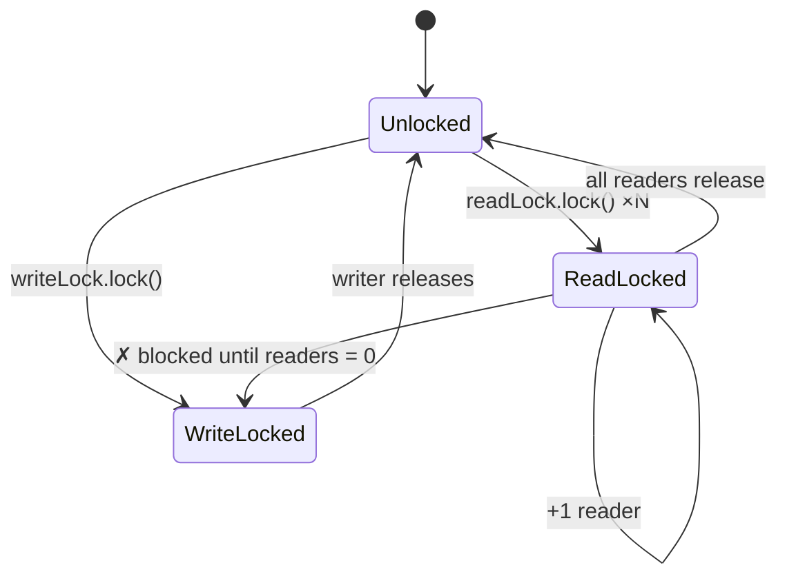
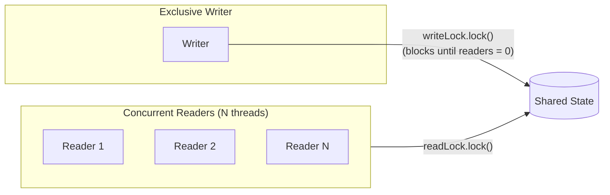
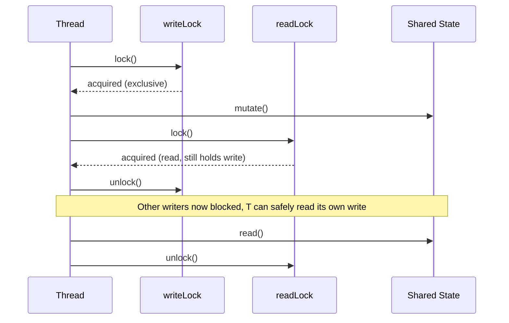
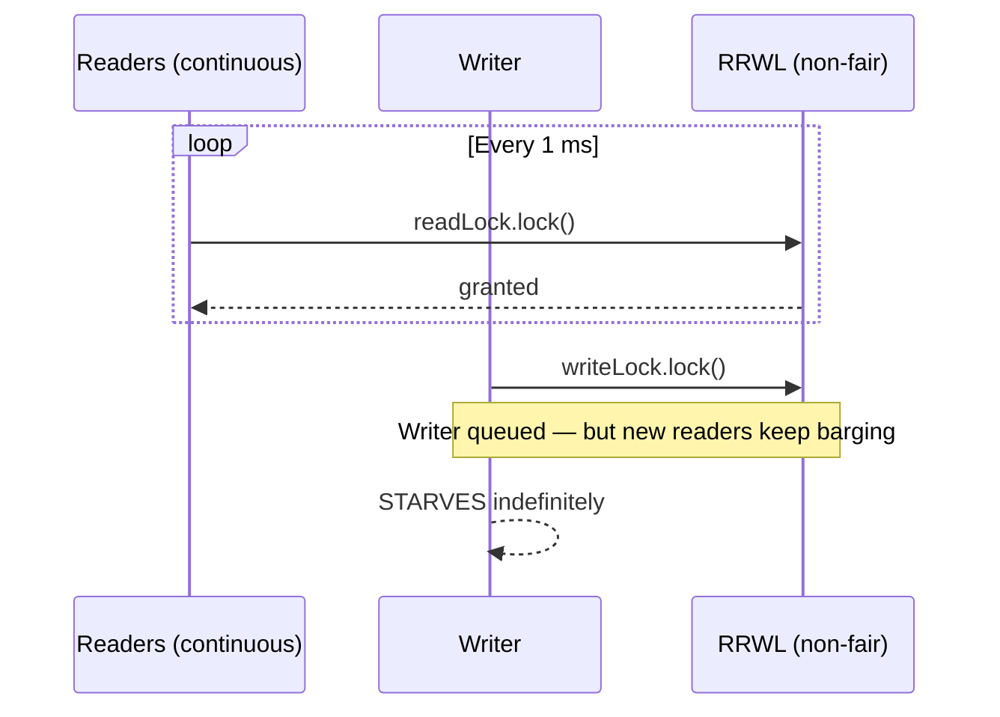

<!-- tldr -->
# ReadWriteLock

`ReadWriteLock` separates read and write access into two distinct locks: many threads may hold the read lock simultaneously, but acquiring the write lock requires exclusive ownership — no readers, no other writers. This maximises throughput when reads vastly outnumber writes, which is the common case for caches, configuration stores, and in-memory indexes. Java ships `ReentrantReadWriteLock` as the canonical implementation, with optional fair-ordering and reentrance support.



<!-- standard -->

## What It Is

`java.util.concurrent.locks.ReadWriteLock` is an interface with two methods: `readLock()` and `writeLock()`. Both return a `Lock`. The contract:

- **Read lock** — shared; any number of threads may hold it concurrently, *as long as no writer holds the write lock*.
- **Write lock** — exclusive; blocks until every reader and any previous writer has released.

`ReentrantReadWriteLock` (RRWL) is the standard implementation. It is reentrant on both lock types and supports a *downgrade* path (write → read), but **not upgrade** (read → write — doing so causes deadlock).

## Why It Matters

A plain `synchronized` block or `ReentrantLock` serialises all access, capping read throughput at one thread at a time. With a read-heavy 95/5 read-write ratio and 32 cores, RRWL can deliver nearly **32× the read throughput** of a single mutex. The trade-off is added complexity and the write-starvation risk.

## Key Techniques

| Technique | Detail |
|---|---|
| **Non-fair mode** (default) | Barging allowed; highest throughput, writers may starve |
| **Fair mode** (`new RRWL(true)`) | FIFO queue; eliminates starvation, ~20–30 % lower throughput |
| **Lock downgrade** | Acquire write → acquire read → release write → safe read of just-written data |
| **Try-lock with timeout** | `tryLock(50, MILLISECONDS)` avoids indefinite blocking |
| **Condition variables** | Only available on `writeLock().newCondition()` |

## Primary Tradeoffs

- **Write-starvation**: in non-fair mode a constant stream of readers can block a writer indefinitely.
- **Lock upgrade is forbidden**: attempting `readLock → writeLock` deadlocks; design around it.
- **Overhead vs. `synchronized`**: RRWL adds ~3–5 ns overhead per operation; only wins when concurrent readers > ~2–3 and critical sections are non-trivial.
- **`StampedLock` alternative**: Java 8+ offers optimistic reads with no lock acquisition — better throughput for short read sections, but non-reentrant and harder to use correctly.



<!-- deep -->

## Deep Dive: ReadWriteLock

### Internal Mechanics — The AQS State Word

`ReentrantReadWriteLock` is built on `AbstractQueuedSynchronizer`. RRWL splits the single 32-bit AQS state into two 16-bit halves:

```
 31          16 | 15           0
 ┌─────────────┬──────────────┐
 │ read count  │ write count  │
 └─────────────┴──────────────┘
```

- **Write lock acquired** when the high 16 bits are 0 and the low 16 bits CAS from 0 → 1.
- **Read lock acquired** when the low 16 bits are 0 (no active writer); a CAS increments the high 16 bits.
- Maximum 65,535 concurrent readers or a hold count of 65,535 — both limits are almost never hit in practice.

Each thread's individual reentrant read-hold count is tracked in a `ThreadLocalHoldCounter` (a `ThreadLocal<HoldCounter>`), avoiding contention on a shared counter.

### Lock Downgrade — The Only Safe Promotion



This pattern guarantees a thread that just wrote can observe its own write without a TOCTOU window.

### Real-World Usage

| System | Pattern |
|---|---|
| **Guava `LoadingCache` / Caffeine** | RRWL guards segment-level eviction; reads are lock-free via CAS, RRWL used only during rehash |
| **Elasticsearch in-memory segment cache** | Read lock per segment; write lock on merge/refresh cycle (~1 s intervals) |
| **ZooKeeper client watch registry** | `ConcurrentHashMap` + RRWL for bulk snapshot vs. incremental update |
| **Spring `BeanFactory`** | `ReentrantReadWriteLock` protects singleton registry — reads dominate after startup |
| **HikariCP connection pool** | RRWL for pool-state reads vs. resize/close operations |

### Capacity & Latency Numbers

- Uncontended `readLock.lock()` + `unlock()`: **~15–25 ns** on modern JVMs (JDK 21, x86).
- Uncontended `writeLock.lock()` + `unlock()`: **~20–30 ns**.
- At 32-thread contention, non-fair read throughput: **~800 M ops/s**; fair mode drops to **~550 M ops/s**.
- Context-switch cost when a writer blocks 30 readers: **~1–5 µs** per thread wake-up, dominating over lock math.
- `StampedLock` optimistic read (no CAS on happy path): **~5 ns** — 3–5× faster than RRWL for read-dominated, short critical sections.

### Failure Modes

#### Write Starvation (Non-Fair Mode)

**Fix**: Use fair mode (`new ReentrantReadWriteLock(true)`) or switch to `StampedLock` which has built-in write-preference queuing.

#### Deadlock via Attempted Upgrade
```java
// DEADLOCK — never do this
readLock.lock();
try {
    writeLock.lock(); // blocks forever — read lock is still held by THIS thread
} finally {
    readLock.unlock();
}
```
**Fix**: Release the read lock *before* acquiring the write lock, then re-validate state after acquisition.

#### Missed Unlock in Finally Block
```java
// Correct idiom — always pair lock/unlock
rwl.writeLock().lock();
try {
    // mutate
} finally {
    rwl.writeLock().unlock(); // must be in finally
}
```
Failing to release the write lock permanently blocks all readers and writers — the thread need not even be alive.

### `ReentrantReadWriteLock` vs. Alternatives

| | RRWL | `StampedLock` | `synchronized` | `ConcurrentHashMap` |
|---|---|---|---|---|
| **Concurrent reads** | ✅ | ✅ (optimistic) | ❌ | ✅ |
| **Reentrant** | ✅ | ❌ | ✅ | N/A |
| **Condition support** | Write only | ❌ | ✅ | N/A |
| **Fair mode** | ✅ | ❌ | ❌ | N/A |
| **Lock downgrade** | ✅ | ✅ | ❌ | N/A |
| **Lock upgrade** | ❌ | ✅ (via `tryConvertToWriteLock`) | ❌ | N/A |
| **Complexity** | Medium | High | Low | Low |
| **Best for** | Read-heavy, complex logic | Ultra-hot read paths | Simple exclusion | Map-shaped state |

### Interview Pitfalls

1. **"I'll use `volatile` instead"** — `volatile` gives visibility but no atomicity for compound check-then-act sequences. RRWL is the right tool when reads need to see a consistent composite snapshot.
2. **Confusing hold count with thread count** — Reentrance means one thread can lock the read lock *N* times; it must unlock *N* times. Forgetting this leaks the lock.
3. **Assuming `readLock()` is always faster** — If your write % exceeds ~20–25%, the synchronisation overhead of RRWL exceeds that of a plain `ReentrantLock`. Profile first.
4. **Not knowing `StampedLock` exists** — Interviewers at FAANG will probe whether you know the Java 8+ evolution. Know that `StampedLock` is not reentrant and has no `Condition` support.
5. **Forgetting lock downgrade semantics** — Common follow-up: "Can you upgrade a read lock to a write lock?" The answer is no, and you should explain *why* (deadlock between two upgrading threads).

### When to Reach for `ReadWriteLock`

Use RRWL when **all** of these hold:

- Read : write ratio ≥ **5 : 1** (measure it; don't assume).
- Critical section is **non-trivial** (> ~50 ns of work), making the lock overhead negligible.
- You need **reentrance** or `Condition` variables (rules out `StampedLock`).
- The shared state is **not** already a concurrent data structure (`ConcurrentHashMap`, `CopyOnWriteArrayList`).

If read sections are tiny (< 20 ns), prefer `StampedLock`'s optimistic reads. If write contention is the bottleneck, partition state and use per-shard locks or lock-free structures instead.