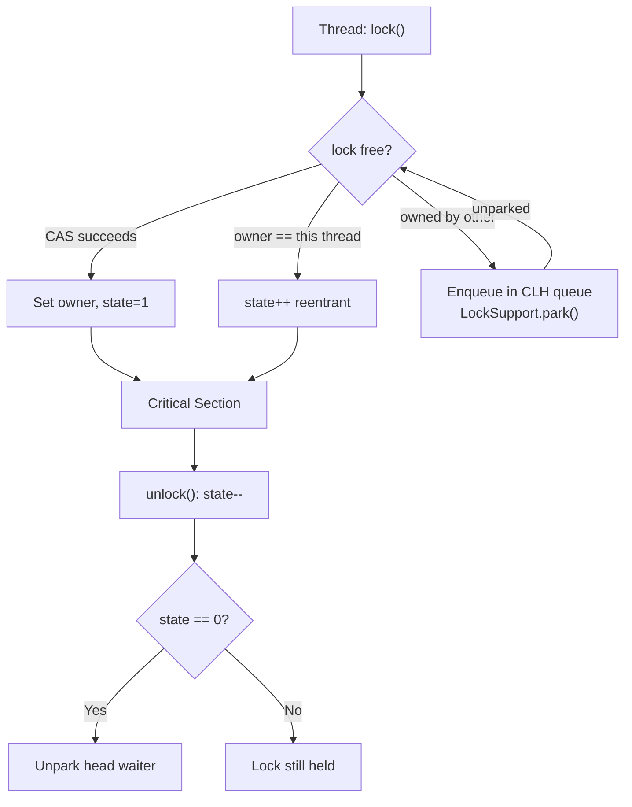
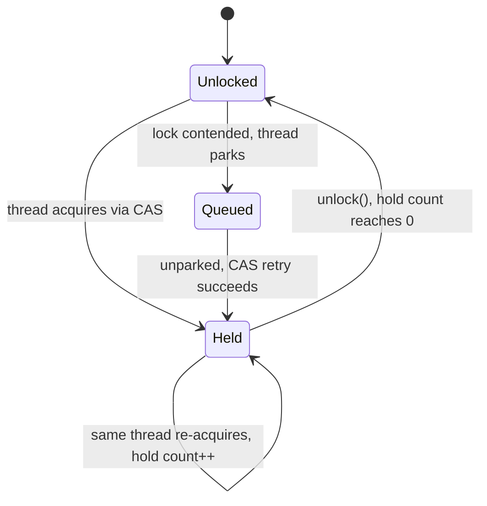
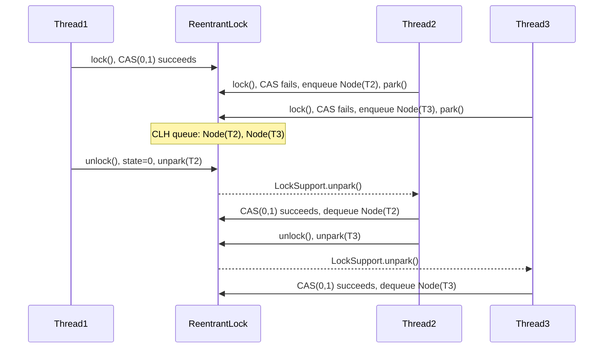

<!-- tldr -->
# ReentrantLock

`ReentrantLock` (`java.util.concurrent.locks.ReentrantLock`) is a mutual-exclusion lock built on `AbstractQueuedSynchronizer` (AQS). Unlike `synchronized`, it supports optional fairness, timed and interruptible lock acquisition, and multiple `Condition` objects per lock instance. The "reentrant" guarantee means the owning thread may call `lock()` again without deadlocking; an internal hold counter tracks nesting depth and must reach zero before the lock is released.



<!-- standard -->

## What It Is

`ReentrantLock` implements `java.util.concurrent.locks.Lock` and delegates all synchronization to its inner `Sync` class, which extends `AbstractQueuedSynchronizer`. The AQS `volatile int state` field doubles as the hold count. An `exclusiveOwnerThread` field (in `AbstractOwnableSynchronizer`) identifies the owning thread and is updated under the lock invariant — no CAS required for it.

## Why It Matters

`synchronized` covers 80% of locking needs but cannot time out, cannot abort a blocked acquire, and provides only one `wait/notify` queue per object. `ReentrantLock` fills the remaining 20%: bounded blocking queues, responsive shutdown, and coordination across multiple logical conditions on a single resource.

## Primary Techniques

- **`lock()` / `unlock()`** — basic mutual exclusion; always pair in `try/finally`.
- **`tryLock()`** — non-blocking; returns `false` immediately if lock unavailable.
- **`tryLock(long timeout, TimeUnit unit)`** — blocks up to `timeout`; throws `InterruptedException`.
- **`lockInterruptibly()`** — blocks until acquired or thread is interrupted.
- **`newCondition()`** — returns a `Condition` with `await()` / `signal()` / `signalAll()`; N conditions per lock instance supported.
- **`new ReentrantLock(true)`** — enables fair (FIFO) mode for waiting threads.

## Key Tradeoffs

| Feature | `synchronized` | `ReentrantLock` |
|---|---|---|
| Fairness option | ✗ | ✓ optional |
| Timed acquisition | ✗ | ✓ `tryLock(t, u)` |
| Interruptible acquire | ✗ | ✓ `lockInterruptibly()` |
| Multiple conditions | 1 (`wait`/`notify`) | N via `newCondition()` |
| Automatic unlock on exit | ✓ | ✗ — must use `try/finally` |
| Throughput (JDK 21, low contention) | ≈ equal | ≈ equal |
| Diagnostics | ✗ | ✓ `getQueueLength()`, `isHeldByCurrentThread()` |
| Virtual thread pinning (JDK 21–23) | Pins carrier | Pins carrier |



The primary footgun is omitting `unlock()` in an exception path — this leaks the lock permanently. `synchronized` is immune to this class of bug. Since JDK 8, JIT lock elision and biased locking make `synchronized` competitive in uncontended paths; reach for `ReentrantLock` only when you need its extra features.

<!-- deep -->

## Internals: AbstractQueuedSynchronizer

### State and Ownership

AQS maintains a single `volatile int state`. For `ReentrantLock`:
- `state == 0` → free.
- `state > 0` → hold count; only the owner may increment it.

The owner reference (`exclusiveOwnerThread`) lives in `AbstractOwnableSynchronizer`. It is written non-atomically because writes always occur under the AQS invariant (only the lock holder can change it).

### Non-Fair `tryAcquire` (default)

```java
// Simplified from ReentrantLock.NonfairSync
protected boolean tryAcquire(int acquires) {
    int c = getState();
    if (c == 0) {
        if (compareAndSetState(0, acquires)) {
            setExclusiveOwnerThread(current);
            return true;
        }
    } else if (getExclusiveOwnerThread() == current) {
        int next = c + acquires;           // hold count++
        if (next < 0) throw new Error("Maximum lock count exceeded");
        setState(next);
        return true;
    }
    return false; // caller will enqueue and park
}
```

A newly arriving thread **barges** — it attempts CAS even if other threads are waiting. This yields higher throughput at the cost of potential starvation.

### Fair `tryAcquire`

Identical to the above but adds one guard before the CAS:

```java
if (c == 0 && !hasQueuedPredecessors()) { ... CAS ... }
```

`hasQueuedPredecessors()` returns `true` when a thread with an earlier queue position is waiting. This forces FIFO ordering and eliminates barging. **Throughput penalty**: 10–30% under high contention because no thread can short-circuit the queue.

**Critical edge case**: even in fair mode, zero-timeout `tryLock()` bypasses this check and barges. This is intentional but surprises many engineers.

### CLH Queue Mechanics

AQS maintains a doubly-linked list of `Node` objects (~64 bytes each):

```
head (sentinel) <-> Node(T2, SIGNAL) <-> Node(T3, SIGNAL) <-> tail
```

`waitStatus` values that matter:
- `SIGNAL (-1)`: successor needs unparking when current releases.
- `CANCELLED (1)`: thread timed out or was interrupted; node is removed.
- `CONDITION (-2)`: node sits on a `Condition` queue, not the sync queue.

Threads block via `LockSupport.park(this)`, which calls the OS-level futex (Linux) or equivalent. Unparking a thread costs ~1–5 µs for a context-switch round-trip.

### Condition Variable Internals

Each `Condition` owns a **separate** singly-linked queue of `ConditionNode` objects, distinct from the AQS sync queue.

- **`await()`**: atomically releases the full hold count (so nested `lock()` calls are all released), adds a node to the condition queue, then parks. On return, re-acquires with the original hold count.
- **`signal()`**: dequeues the head of the condition queue and enqueues it on the AQS sync queue; that thread now competes for the lock normally.
- **`signalAll()`**: drains the entire condition queue into the AQS sync queue.

`ArrayBlockingQueue` uses exactly two conditions — `notFull` and `notEmpty` — on one `ReentrantLock` to coordinate producers and consumers.



## Real-World Systems

| System | Usage |
|---|---|
| `ArrayBlockingQueue` | One `ReentrantLock` + `notEmpty` + `notFull` conditions |
| `LinkedBlockingQueue` | Separate `takeLock` + `putLock` for higher throughput (2 locks) |
| `ThreadPoolExecutor` | `mainLock` guards worker set, completion stats, and termination |
| `ConcurrentHashMap` (JDK 7) | Per-segment `ReentrantLock`; replaced by `synchronized`+CAS in JDK 8 |
| Kafka Java client | `RecordAccumulator` uses `ReentrantLock` to guard in-flight batch buffers |
| Netty `NioEventLoop` | Guards scheduled task queue ordering and selector lifecycle |
| Redisson | Emulates distributed locks; local reentrancy tracked by `ReentrantLock` |

## Failure Modes

### 1. Lock Leak
```java
// WRONG: exception skips unlock()
lock.lock();
doRiskyWork();
lock.unlock();

// CORRECT
lock.lock();
try {
    doRiskyWork();
} finally {
    lock.unlock();
}
```
A leaked lock parks every subsequent caller indefinitely with no JVM-level error.

### 2. Deadlock
Thread A holds Lock-1, waits for Lock-2; Thread B holds Lock-2, waits for Lock-1. `ReentrantLock` provides no built-in deadlock detection. Mitigations:
- `tryLock(timeout)` with exponential back-off.
- Global consistent lock-ordering (always acquire in the same order across all code paths).
- `ThreadMXBean.findDeadlockedThreads()` for detection in production.

### 3. Starvation Under Non-Fair Mode
A hot-path thread can continuously barge and monopolize the lock. Symptoms: P99 latency diverges from median. Fix: switch to fair mode or redesign with work-stealing queues.

### 4. Condition Predicate Not Re-Checked
```java
// WRONG: spurious wakeup vulnerability
lock.lock();
try {
    if (queue.isEmpty()) condition.await(); // 'if', not 'while'
    process(queue.take());
} finally { lock.unlock(); }
```
`await()` can return spuriously. Always loop on the predicate with `while`.

### 5. Virtual Thread Pinning (JDK 21–23)
A virtual thread holding a `ReentrantLock` pins its carrier OS thread for the entire critical section. Under high virtual-thread parallelism this exhausts carriers. In JDK 24, `synchronized` was patched to unmount the virtual thread; `ReentrantLock` still pins in 21–23. Workaround: minimize critical section duration or use `synchronized` in JDK 24+.

### 6. Hold-Count Overflow
Technically possible at `Integer.MAX_VALUE` re-entrances. `setState` does not guard against it; you get silent state corruption. Practically irrelevant but worth knowing if asked.

## Capacity & Latency Numbers

| Scenario | Typical Latency |
|---|---|
| Uncontended `lock()` (CAS only) | 5–15 ns |
| Contended `lock()` (park + context switch + unpark) | 1–10 µs |
| `tryLock()` fast-path rejection | ~5 ns |
| `Condition.await()` + `signal()` round-trip | 2–15 µs |
| Fair vs non-fair throughput at 100 competing threads | 10–30% gap |

At 1M QPS with 10% lock contention, 5 µs per contended acquire yields ~500 ms of aggregate blocked time per second. This is the signal to introduce lock striping, lock-free structures, or partitioned queues.

## Interview Pitfalls

1. **"ReentrantLock is always faster than synchronized"** — False. JIT lock elision, biased locking (JDK ≤14), and `synchronized`'s JVM intrinsics make it faster in many uncontended paths. Always benchmark.
2. **Forgetting `try/finally`** — The single most common failure in whiteboard coding. Demonstrate it unprompted.
3. **`Condition.await()` vs `Thread.sleep()`** — `await()` releases the lock; `sleep()` does not. Confusing them causes deadlocks.
4. **Fair mode = zero starvation** — Fair mode guarantees FIFO order, not bounded wait time. Under sustained saturation, every thread still waits arbitrarily long.
5. **`tryLock()` ignores fairness** — Even with `new ReentrantLock(true)`, bare `tryLock()` barges. Only `tryLock(0, TimeUnit.NANOSECONDS)` respects the queue.
6. **Re-entrancy isn't free in logic** — Code that re-enters a lock usually has broken abstraction. Treat it as a smell, not a feature to exploit.

## When to Reach for ReentrantLock

```
Multiple distinct wait conditions on one resource?    → ReentrantLock + N Conditions
Need timeout or cancellation on lock acquisition?     → ReentrantLock (tryLock / lockInterruptibly)
FIFO ordering required to prevent starvation?         → ReentrantLock(true)
Need runtime diagnostics (queue depth, owner)?        → ReentrantLock
Simple critical section, no exotic requirements?      → synchronized (no unlock footgun)
Read-heavy (reads >> writes)?                         → ReentrantReadWriteLock or StampedLock
Single writer, many readers, ultra-low latency?       → StampedLock (optimistic reads, ~5 ns)
Lock-free counter or reference?                       → AtomicLong / AtomicReference
```

Default to `synchronized` — it is simpler, immune to lock leaks, and fully JIT-optimized. Promote to `ReentrantLock` when you hit a concrete limitation. Promote to `StampedLock` only when profiling shows lock contention as a bottleneck in a read-dominated path and you can tolerate the API complexity and absence of reentrancy.