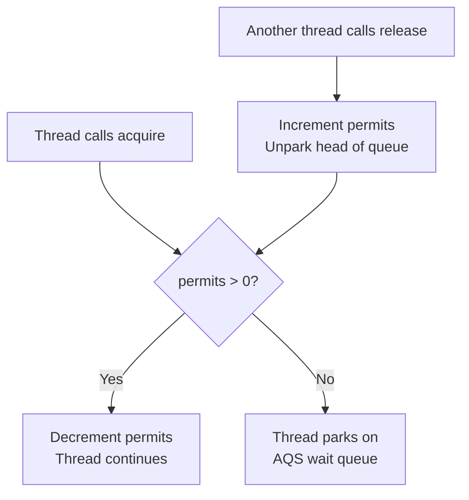
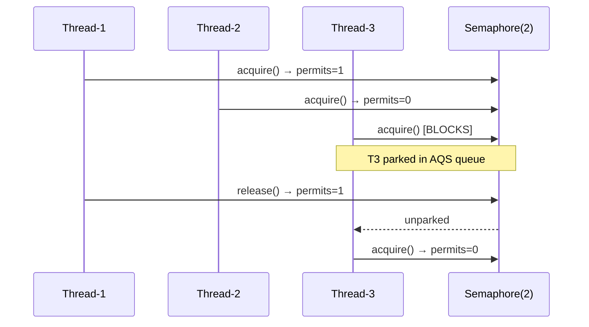
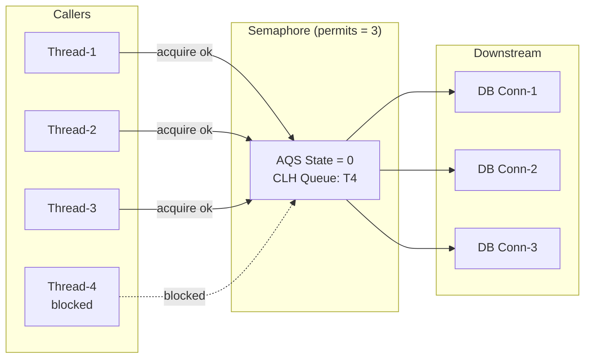

<!-- tldr -->
# Semaphore

A **semaphore** is a synchronization primitive that gates access to a finite resource by tracking a permit count. Threads `acquire()` a permit before entering the guarded section and `release()` it afterward; if no permits remain, the caller blocks until one is returned. Java's `java.util.concurrent.Semaphore` wraps `AbstractQueuedSynchronizer` (AQS) and supports both fair and non-fair scheduling. Binary semaphores (permits = 1) approximate a mutex but, unlike `ReentrantLock`, are not reentrant and can be released by any thread.



<!-- standard -->

## What It Is

A counting semaphore holds an integer **permit count** (≥ 0). Each `acquire()` decrements the count; each `release()` increments it. The invariant is that no thread proceeds past `acquire()` if the count is already zero. A binary semaphore (permits = 1) acts like a mutex but with one critical difference: **any** thread can release it, making it suitable for signaling rather than mutual exclusion.

## Java API Highlights

- `new Semaphore(int permits)` — non-fair by default
- `new Semaphore(int permits, true)` — fair FIFO ordering
- `acquire(int n)` / `release(int n)` — bulk operations
- `tryAcquire(long timeout, TimeUnit unit)` — non-blocking with deadline; essential for avoiding indefinite waits
- `drainPermits()` — atomically grabs all remaining permits; useful for shutdown sequences
- `availablePermits()` — advisory only, not suitable for flow control logic

## Primary Use Cases

- **Connection pool throttling**: cap DB/HTTP connections to `N` concurrent users
- **Rate-limiting parallel tasks**: bound a thread pool's effective parallelism below its size
- **Resource guards**: binary semaphore protecting a non-reentrant legacy library
- **Bulkhead isolation**: limit concurrent in-flight calls to a downstream service (Resilience4j pattern)

## Key Tradeoffs

| Primitive | Ownership | Reentrant | Signaling | Best For |
|---|---|---|---|---|
| `synchronized` / `ReentrantLock` | Thread-owned | Yes | Via `Condition` | Mutual exclusion of one resource |
| `Semaphore(1)` | None | No | Yes (cross-thread release) | Cross-thread handoff, signaling |
| `Semaphore(N)` | None | No | N/A | Bounding concurrent access to N slots |
| `CountDownLatch` | None | No | One-shot | Waiting for K events to complete |



<!-- deep -->

## Internals: AQS Under the Hood

`java.util.concurrent.Semaphore` delegates entirely to two inner `AbstractQueuedSynchronizer` subclasses: `NonfairSync` and `FairSync`. The AQS **state field** stores the current permit count.

### acquire() — Non-Fair Path

```
loop:
  current = getState()                    // volatile read
  if current == 0: park thread in CLH queue
  next = current - n
  if next < 0: park
  if CAS(state, current, next): return    // succeed
  // else: spin
```

### acquire() — Fair Path

Before the CAS, `hasQueuedPredecessors()` returns true if any thread is already waiting; if so, the caller parks immediately — no barging. This eliminates starvation but reduces throughput under high contention (~15–30% slower than non-fair in benchmarks due to extra volatile reads).

### release()

```
loop:
  current = getState()
  next = current + n
  if CAS(state, current, next): break
releaseShared() → LockSupport.unpark(head.next)
```

No ownership check exists — any thread can call `release()`, including threads that never called `acquire()`. This is both a feature (signaling) and a footgun (permit inflation).

---

## Real-World Systems

### HikariCP (JDBC Connection Pool)
HikariCP uses `java.util.concurrent.Semaphore` directly to bound connection acquisition. A pool of 10 connections means `Semaphore(10, true)` (fair). Default `connectionTimeout` is 30 s — translates to `tryAcquire(30_000, MILLISECONDS)`. A P99 acquisition latency above ~5 ms signals pool exhaustion before the connection overhead itself.

### Resilience4j — SemaphoreBulkhead
```java
BulkheadConfig.custom()
    .maxConcurrentCalls(25)      // Semaphore permits
    .maxWaitDuration(Duration.ofMillis(100))
    .build();
```
Wraps `Semaphore(25)` with `tryAcquire(100, ms)`. Rejected calls throw `BulkheadFullException`, enabling circuit-breaking patterns without thread isolation overhead.

### Tomcat — MaxConnections
`NioEndpoint` uses a `LimitLatch` (internally a semaphore-like AQS subclass) to cap accepted socket connections. Default: 8192 permits. When saturated, the `accept()` loop parks rather than accepting more file descriptors.

### Kafka Broker — In-Flight Request Throttling
The `Processor` network thread uses semaphore-like counters to limit queued request bytes per connection, preventing slow consumers from exhausting broker heap. Each channel's in-flight budget acts as a permit pool.

---

## Failure Modes

### 1. Permit Leak (Most Common)
```java
// WRONG — exception bypasses release
semaphore.acquire();
doRiskyWork();        // throws → permit never returned
semaphore.release();

// CORRECT
semaphore.acquire();
try {
    doRiskyWork();
} finally {
    semaphore.release();
}
```
A single leaked permit in a `Semaphore(10)` pool degrades to `Semaphore(9)`. Ten leaks cause full deadlock. No JVM alarm fires — the symptom is slow starvation.

### 2. Permit Inflation
Calling `release()` without a preceding `acquire()` increments the count above the original bound. Over time, `availablePermits()` exceeds `initialPermits` and the guard no longer limits concurrency. Validate in tests with `assert semaphore.availablePermits() <= INITIAL_PERMITS`.

### 3. Multi-Semaphore Deadlock
```
Thread-A: acquire(SemA) → acquire(SemB)  // waits for SemB
Thread-B: acquire(SemB) → acquire(SemA)  // waits for SemA
```
Classic dining-philosophers deadlock. Enforce a **global acquisition order** or use `tryAcquire` with backoff on the second semaphore.

### 4. Starvation Under Non-Fair Mode
A burst of short-lived tasks can repeatedly steal permits before a long-queued thread is unparked. Use `Semaphore(N, true)` whenever tail latency matters more than aggregate throughput.

---

## Capacity & Latency Numbers

| Scenario | Typical Value |
|---|---|
| Uncontended `acquire()` (CAS succeeds first try) | 30–80 ns |
| Contended acquire → park/unpark round-trip | 1–5 µs |
| HikariCP `connectionTimeout` default | 30 s |
| Resilience4j bulkhead `maxWaitDuration` recommendation | 50–200 ms |
| Tomcat default `maxConnections` (Semaphore permits) | 8,192 |
| Kafka default `queued.max.requests` (per-listener) | 500 |

---

## Architecture: Semaphore as Bulkhead



---

## Interview Pitfalls

1. **"Semaphore is a mutex"** — Wrong. A semaphore has no ownership. Two threads can hold one permit each from `Semaphore(2)`. A mutex is exclusively owned by one thread.
2. **"Binary semaphore == ReentrantLock"** — Wrong. `ReentrantLock` is reentrant; the same thread can re-acquire without deadlocking. `Semaphore(1).acquire()` from the same thread blocks forever.
3. **Not using `tryAcquire` in latency-sensitive paths** — Blocking `acquire()` in a request-handling thread under load will cause thread exhaustion. Always provide a timeout.
4. **Ignoring `InterruptedException`** — Swallowing the interrupt without restoring the interrupted flag breaks cooperative cancellation.
5. **`availablePermits()` in conditional logic** — This is not atomic with subsequent `acquire()`. Race condition guaranteed. Use `tryAcquire()` instead.
6. **Forgetting `release(n)` matches `acquire(n)`** — If you called `acquire(3)`, you must `release(3)` (or three separate `release(1)` calls). Mismatched bulk operations corrupt the permit count.

---

## When to Reach for a Semaphore

```
Need to limit concurrent access?
│
├── To exactly 1 unit AND need reentrancy or Condition?
│   └── → ReentrantLock
│
├── To exactly 1 unit, cross-thread release (producer/consumer signal)?
│   └── → Semaphore(1)
│
├── To N units (connection pool, bulkhead, parallel task cap)?
│   └── → Semaphore(N)
│       ├── Tail latency matters → fair=true
│       └── Max throughput matters → fair=false (default)
│
├── One-time "N events completed" barrier?
│   └── → CountDownLatch
│
└── Repeated phases of N-thread rendezvous?
    └── → CyclicBarrier / Phaser
```

**Concrete rule**: if the sentence "at most N threads may be here simultaneously" describes your constraint, a `Semaphore(N)` is the right primitive. If the constraint is "only one thread at a time, owned by the acquirer," use `ReentrantLock`.