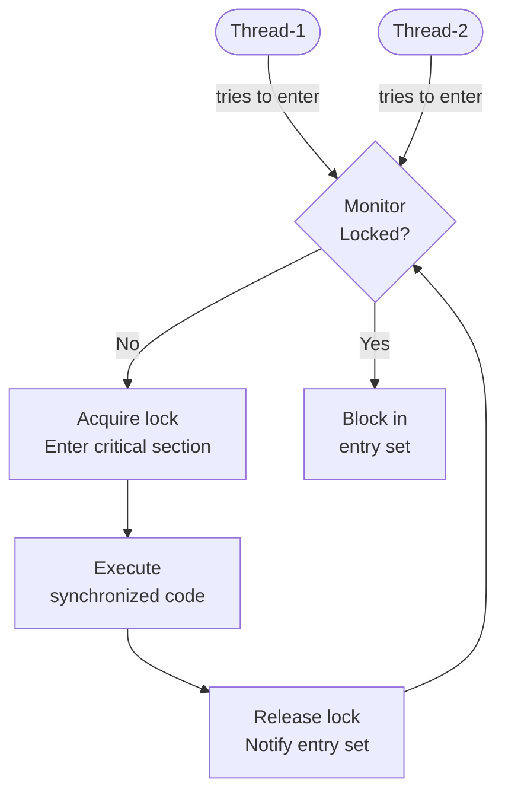
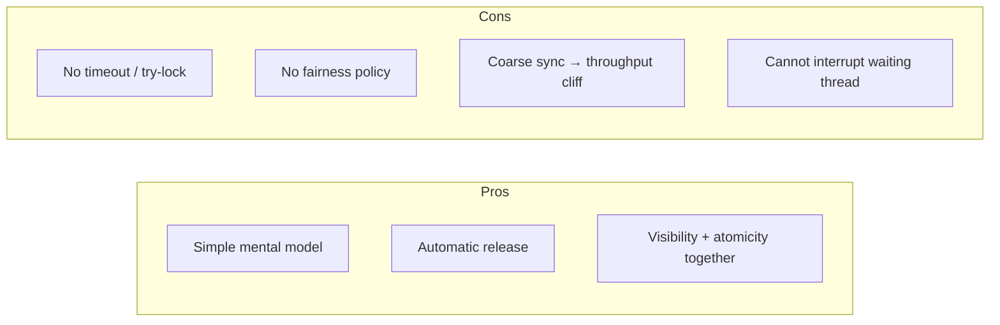
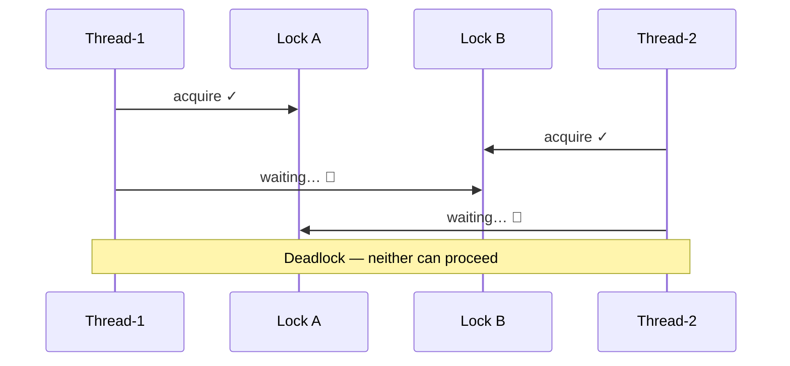

<!-- tldr -->
# `synchronized` keyword

Every Java object carries an implicit **monitor lock** (intrinsic lock). `synchronized` forces a thread to acquire that lock before entering a block or method, ensuring only one thread executes that critical section at a time. It also guarantees **visibility**: all writes made inside a synchronized block are flushed to main memory and seen by any subsequent thread that acquires the same lock. It is reentrant — a thread already holding the lock can re-enter without deadlocking.



<!-- standard -->

## What It Is

`synchronized` can be applied at two granularities:

| Form | Lock object | Use case |
|---|---|---|
| `synchronized` instance method | `this` | Protecting instance state |
| `synchronized` static method | `ClassName.class` | Protecting class-level state |
| `synchronized(obj) { }` block | Explicit object reference | Fine-grained or multi-lock patterns |

The JVM uses a **monitorenter / monitorexit** bytecode pair. The lock is released unconditionally even if an exception is thrown — the compiler wraps the body in an implicit `try/finally`.

## Why It Matters

Without synchronization in a multi-threaded program:
- **Race conditions** corrupt shared state (e.g., `i++` is three bytecodes, not one).
- **Visibility bugs** cause threads to read stale cache-line values indefinitely.
- The Java Memory Model (JMM) offers **no guarantees** unless a happens-before edge is established.

## Primary Techniques

- **Coarse-grained locking** — sync the whole method. Simple, easy to reason about; high contention under load.
- **Fine-grained locking** — sync on separate lock objects per data partition, reducing contention.
- **Lock splitting** — one lock per field or logical resource instead of one lock for the whole object.

## Key Tradeoffs



- **`synchronized` vs `ReentrantLock`**: prefer `synchronized` for simple cases; reach for `ReentrantLock` when you need `tryLock(timeout)`, fairness, or multiple condition queues.
- **`volatile` vs `synchronized`**: `volatile` gives visibility only (no atomicity for compound actions). A single `volatile` read/write is cheaper but insufficient for read-modify-write.
- `StringBuffer` (synchronized) vs `StringBuilder` (not) is the canonical JDK example of paying the sync tax unnecessarily in single-threaded contexts.

<!-- deep -->

## Deep Dive

### JVM Internals — The Mark Word & Lock State Machine

Every object header contains a **mark word** (64-bit on modern HotSpot). The lock state machine is:

```mermaid
stateDiagram-v2
    [*] --> Unlocked
    Unlocked --> BiasedLocked : first thread acquires\n(stores thread ID in mark word)
    BiasedLocked --> Unlocked : thread exits
    BiasedLocked --> ThinLock : second thread contends\n(revoke bias; CAS spin)
    ThinLock --> FatLock : CAS spin fails >\nthreshold (~10 spins)\nor thread count > 1
    FatLock --> Unlocked : lock released,\nwaiters unparked
```



| State | Cost | Mechanism |
|---|---|---|
| **Biased** | ~0 ns (no CAS) | Thread ID stamped in mark word |
| **Thin (lightweight)** | ~10–50 ns | CAS on displaced mark word |
| **Fat (inflated)** | ~100–1000 ns | OS mutex (`pthread_mutex`), thread parks |

> **Biased locking was deprecated in JDK 15 and removed in JDK 21.** In modern runtimes, uncontended sync starts at thin-lock CAS. Interview tip: know this timeline.

### JMM Happens-Before Guarantee

An **unlock** of monitor M happens-before every subsequent **lock** of M. This means:

```
Thread A writes x = 42, then releases lock L
Thread B acquires lock L, then reads x → guaranteed to see 42
```

Without this edge, the JIT can reorder stores, and CPU store buffers may not be flushed.

### Real-World Systems Using Intrinsic Locks

| System / Class | How it uses sync |
|---|---|
| `java.util.Hashtable` | Every method synchronized on `this`; replaced by `ConcurrentHashMap` |
| `java.util.Vector` | Same pattern; throughput bottleneck at > ~10K QPS under contention |
| `ConcurrentHashMap` (JDK 8+) | `synchronized` on individual **bucket heads** (not the whole map); ~1M QPS on 16-core |
| `LinkedBlockingQueue` | Two separate `ReentrantLock`s (head + tail), but `ArrayBlockingQueue` uses a single `synchronized`-equivalent lock |
| Kafka `NetworkClient` | Coarse `synchronized` on poll loop — single-threaded by design, so no contention |
| Cassandra `Memtable` | Fine-grained locking per partition key to reduce write stalls |

### Failure Modes

#### Deadlock
Two threads, each holding one lock, each waiting for the other.



**Fix**: always acquire locks in a canonical global order; or use `ReentrantLock.tryLock(timeout)`.

#### Livelock
Threads continuously yield to each other, making no progress. Rare with `synchronized` (no voluntary retry), more common with `tryLock` spin loops.

#### Lock Starvation
Non-fair `synchronized` gives no ordering guarantees. A low-priority thread may be starved indefinitely under heavy contention. Use `new ReentrantLock(true)` (fair mode) if FIFO ordering is required — at a throughput cost of ~30–50%.

### Capacity & Latency Numbers to Know

- **Uncontended thin lock**: 5–20 ns (just a CAS + memory barrier)
- **Context switch** (thread block/unblock): 1–10 µs on Linux
- **Fat-lock contended acquire**: 5–50 µs depending on OS scheduler
- At **1M QPS** into a single `synchronized` method averaging 10 µs: you need lock to be held < 1 µs or throughput collapses (Little's Law: L = λW)
- `ConcurrentHashMap` with 32-bucket-level locks can sustain ~16× the write throughput of a single `synchronized` wrapper

### Interview Pitfalls

1. **Syncing on the wrong object**
   ```java
   // BUG: each call creates a new Integer; no mutual exclusion
   synchronized (Integer.valueOf(id)) { ... }
   ```

2. **Syncing on a String literal**
   ```java
   synchronized ("LOCK") { ... } // shares the interned constant — hidden coupling
   ```

3. **Broken double-checked locking (pre-Java 5)**
   ```java
   if (instance == null) {
       synchronized (Foo.class) {
           if (instance == null)
               instance = new Foo(); // NOT safe without volatile
       }
   }
   ```
   Fix: declare `instance` as `volatile`. The JMM prior to JSR-133 (Java 5) allowed the half-constructed object to be visible.

4. **Publishing `this` before construction completes** (escaped reference) inside a synchronized constructor gives another thread a partially constructed object.

5. **Forgetting that `synchronized` on a method does *not* prevent access via unsynchronized methods** on the same object.

### When to Reach for `synchronized`

```
Is the critical section short-lived (< 1 µs)?         → synchronized (thin lock is fast)
Do you need timeout or interruptibility?               → ReentrantLock
Do you need multiple condition variables?              → ReentrantLock + Condition
High-read, low-write ratio?                            → ReadWriteLock / StampedLock
Simple flag / counter visible across threads?          → volatile / AtomicLong
Immutable data passed between threads?                 → No lock needed at all
```

Use `synchronized` as the **default starting point** — its simplicity eliminates whole classes of bugs. Profile before replacing it with a fancier primitive; JIT's lock elision and biased locking (JDK < 15) often make it faster than it looks.