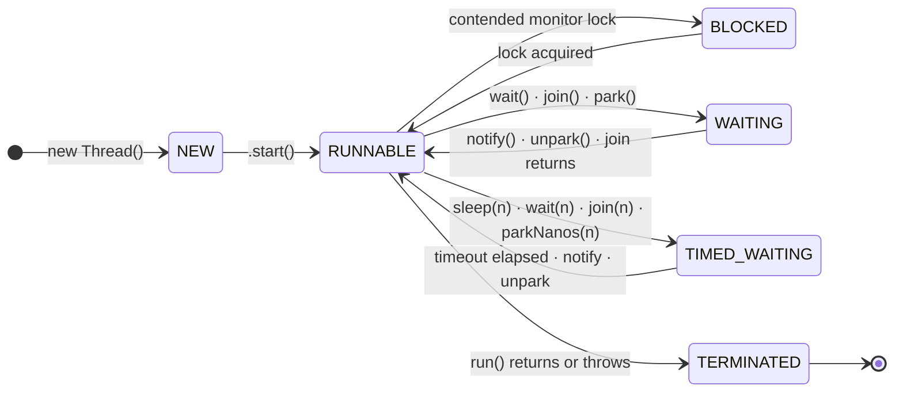
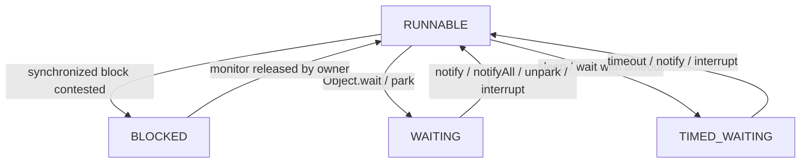
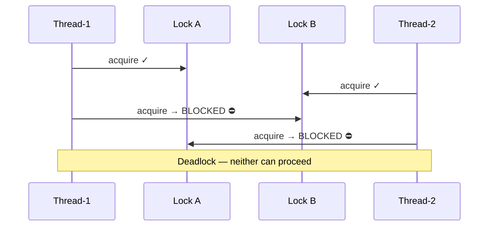

<!-- tldr -->
# Thread Lifecycle

A Java thread is a `java.lang.Thread` object backed by a kernel-scheduled OS thread (platform thread) or a lightweight continuation (virtual thread, Java 21+). The JVM defines **six distinct states** in `Thread.State`; only one CPU core executes a thread at a time, but a thread can be alive without running—parked in BLOCKED, WAITING, or TIMED_WAITING. Understanding which state a thread is in, and *why*, is the first skill a senior engineer reaches for when debugging latency spikes, thread leaks, or deadlocks.



<!-- standard -->

## What It Is

`Thread.State` is a JVM-level enum, not the OS scheduler state. A thread the OS considers "runnable" may be in JVM BLOCKED state because it is spinning on a `synchronized` entry. The distinction matters for profiling: OS tools (perf, top) won't surface JVM-level contention.

### The Six States

| State | Trigger | Exits When |
|---|---|---|
| `NEW` | `new Thread(r)` | `thread.start()` called |
| `RUNNABLE` | `start()` / lock acquired / notify | Blocks, waits, or run() ends |
| `BLOCKED` | Hits a `synchronized` block held by another thread | Owning thread exits monitor |
| `WAITING` | `Object.wait()`, `Thread.join()`, `LockSupport.park()` | Matching signal / unpark / interrupt |
| `TIMED_WAITING` | `Thread.sleep(n)`, `wait(n)`, `join(n)`, `parkNanos(n)` | Timeout OR signal |
| `TERMINATED` | `run()` returns or propagates an unchecked exception | Never (terminal state) |

### Why It Matters

- **Deadlock diagnosis**: two threads mutually in BLOCKED on each other's monitors → classic deadlock; visible in thread dump.
- **Starvation**: a low-priority thread stays RUNNABLE but never gets scheduled; invisible in state alone—requires CPU-time profiling.
- **Thread leaks**: threads in WAITING indefinitely because nobody calls `notify()` → heap and file-descriptor exhaustion.
- **Latency spikes**: P99 jumps when a hot path hits unexpected BLOCKED state under load.

### Key Transitions to Memorise

- `wait()` **atomically** releases the monitor and enters WAITING—this is intentional and critical to the monitor pattern.
- `sleep()` does **not** release any monitor—a sleeping thread still holds locks.
- `interrupt()` on a WAITING/TIMED_WAITING thread throws `InterruptedException`; on a RUNNABLE thread it merely sets the interrupt flag.
- `LockSupport.park()` → WAITING; `LockSupport.unpark(t)` → RUNNABLE. This is the primitive that backs `ReentrantLock`, `CountDownLatch`, and `CompletableFuture`.



<!-- deep -->

## Deep Dive

### JVM Thread Model vs OS Thread

A **platform thread** maps 1:1 to a kernel thread. Stack size defaults to 512 KB–1 MB (tunable via `-Xss`). Context-switch cost is ~1–10 µs. At 10 K concurrent platform threads you're consuming 5–10 GB of stack memory before touching heap.

A **virtual thread** (Java 21, Project Loom) is a JVM-managed continuation mounted onto a carrier ForkJoin worker thread. Stack starts at ~1 KB and grows incrementally. You can run **millions** of virtual threads on a handful of carrier threads because blocking calls (`socket read`, JDBC, `Thread.sleep`) unmount the continuation instead of blocking the OS thread.

### State-Transition Internals

#### `synchronized` → BLOCKED
The JVM uses an **ObjectMonitor** (a C++ struct per lock). Contending threads are placed in a `_cxq` (contention queue) or `_EntryList`. The OS `pthread_mutex` (or Windows `CRITICAL_SECTION`) is acquired only when the JVM inflates the lock from biased/thin to fat. A fat-lock contention puts the thread into OS sleep → JVM reports BLOCKED.

#### `Object.wait()` → WAITING
`wait()` must be called inside a `synchronized` block. Execution:
1. Thread adds itself to the monitor's **wait set**.
2. Monitor count is decremented to 0 (lock released atomically).
3. Thread suspends via `LockSupport.park()` internally.
4. On `notify()`: one thread is moved from wait set → entry list → competes for the monitor → RUNNABLE.

#### `LockSupport.park()` / `unpark()`
`park()` is the lowest-level blocking primitive in the JVM. It checks a **permit** (binary semaphore): if a permit is available (someone already called `unpark(t)`), park returns immediately. This avoids lost-wakeup races without needing a monitor.

```
permit = 0
park()   → if permit > 0: permit-- and return; else: block
unpark() → if thread blocked: wake it; else: permit++
```

`ReentrantLock`, `Semaphore`, `CountDownLatch`, `CompletableFuture`, and virtual thread scheduling all bottom out here.

### Real-World Systems

| System | Thread Lifecycle Relevance |
|---|---|
| **Tomcat (blocking NIO)** | Each request on a platform thread; BLOCKED/WAITING under DB latency limits concurrency to ~200 threads before queue saturation |
| **Netty / Vert.x** | Event-loop threads stay RUNNABLE; blocking ops offloaded to worker pools to avoid starving the loop |
| **JDBC connection pools (HikariCP)** | Borrowing thread enters TIMED_WAITING (`parkNanos`) for up to `connectionTimeout` (default 30 s) if pool exhausted |
| **Kafka consumer loop** | `poll()` uses `LockSupport.parkNanos`; heartbeat thread must remain RUNNABLE or the coordinator triggers a rebalance |
| **ForkJoinPool (parallel streams, CompletableFuture)** | Work-stealing; idle workers park themselves and are unparked when tasks are enqueued |
| **Java 21 Virtual Threads** | Blocking I/O calls trigger a JVM "yield" → carrier thread becomes RUNNABLE with another virtual thread; the virtual thread itself shows WAITING in `jstack` |

### Failure Modes & Diagnostics

#### Deadlock
Two or more threads each hold a lock the other needs. JVM detects monitor-only deadlocks; `ReentrantLock` deadlocks are invisible to `ThreadMXBean.findDeadlockedThreads()`.



**Detection**: `jstack <pid>` or `ThreadMXBean.findDeadlockedThreads()` at runtime.  
**Prevention**: consistent lock ordering, tryLock with timeout (`ReentrantLock.tryLock(100, MILLISECONDS)`).

#### Starvation
A RUNNABLE thread never gets CPU because higher-priority threads or a biased lock owner monopolise the scheduler. Java's thread priorities (1–10) are **hints**—the OS may ignore them entirely on Linux (CFS scheduler).

**Signal**: CPU profiling shows 0% samples for a thread that appears RUNNABLE in `jstack`.

#### Thread Leak
A thread in WAITING indefinitely because `notify()` is never called, or a thread pool is created without a shutdown hook. Each leaked thread holds its stack (512 KB+), open file descriptors, and any `ThreadLocal` references (→ classloader leaks in app servers).

**Signal**: `jstack` showing hundreds of threads in `WAITING` on the same stack frame; `Thread.activeCount()` grows monotonically.

#### Spurious Wakeups
`Object.wait()` and `LockSupport.park()` can return without a signal on POSIX systems. **Always** re-check the condition in a loop:

```java
// Correct
synchronized (lock) {
    while (!conditionMet()) {
        lock.wait();
    }
}

// Wrong — single if check
synchronized (lock) {
    if (!conditionMet()) lock.wait();  // spurious wakeup → proceeds incorrectly
}
```

### Capacity & Latency Numbers

| Metric | Platform Thread | Virtual Thread |
|---|---|---|
| Stack memory | 512 KB – 1 MB | ~1 KB (grows to ~few KB) |
| Creation cost | ~1 ms (OS thread spawn) | ~1 µs |
| Context-switch cost | 1–10 µs (OS) | ~100 ns (JVM continuation swap) |
| Practical ceiling | ~10 K concurrent | ~10 M concurrent |
| `park()` overhead | ~500 ns – 2 µs | same (uses same primitive) |
| Deadlock detection via `jstack` | Yes (monitors) | Partial (carrier thread shown) |

### Interview Pitfalls

1. **"RUNNABLE means it's using CPU"** — false. A thread doing a blocking `read()` syscall is in JVM RUNNABLE but sleeping in the kernel.
2. **"sleep() releases locks"** — false. Only `wait()` releases the monitor. A sleeping thread can cause downstream starvation.
3. **"interrupt() throws immediately"** — false. It only throws `InterruptedException` if the thread is in WAITING/TIMED_WAITING or enters one of those states. You must poll `Thread.interrupted()` in CPU-bound loops.
4. **"notify() vs notifyAll()"** — `notify()` wakes exactly one thread (JVM-chosen, not FIFO); if the wrong thread wakes up and re-waits, progress can stall. Default to `notifyAll()` unless throughput analysis justifies single-notify.
5. **Forgetting `InterruptedException` re-interrupt**: catching and swallowing it without calling `Thread.currentThread().interrupt()` breaks cooperative cancellation up the call stack.
6. **Diagnosing virtual thread state**: `jstack` on Java 21 shows the carrier thread, not the virtual thread. Use `jcmd <pid> Thread.dump_to_file -format=json <file>` for virtual thread dumps.

### When to Reach for What

```
Is the bottleneck I/O-bound (DB, HTTP, file)?
  ├─ Yes → Java 21 virtual threads (structured concurrency)
  │         → eliminates BLOCKED/WAITING overhead for I/O
  └─ No (CPU-bound)?
       ├─ Parallelism with shared mutable state
       │   → Platform thread pool (ForkJoinPool / ThreadPoolExecutor)
       │   → Use ReentrantLock over synchronized for tryLock / fairness
       └─ Embarrassingly parallel (no shared state)?
           → parallel streams or ForkJoin with work-stealing
```

**Decision rubric**:
- Use `synchronized` + `wait/notify` only for simple, single-condition monitors where library classes don't fit.
- Use `ReentrantLock` when you need timed/interruptible acquisition, multiple `Condition` objects, or fairness guarantees.
- Use `LockSupport.park/unpark` only when building your own synchroniser (extends `AbstractQueuedSynchronizer`).
- Prefer `CompletableFuture` / reactive pipelines over raw thread lifecycle management for async composition.
- In Java 21+, start with virtual threads for any service that does I/O; only profile back to platform threads if pinning (native calls, `synchronized` holding a monitor during I/O) becomes a bottleneck.