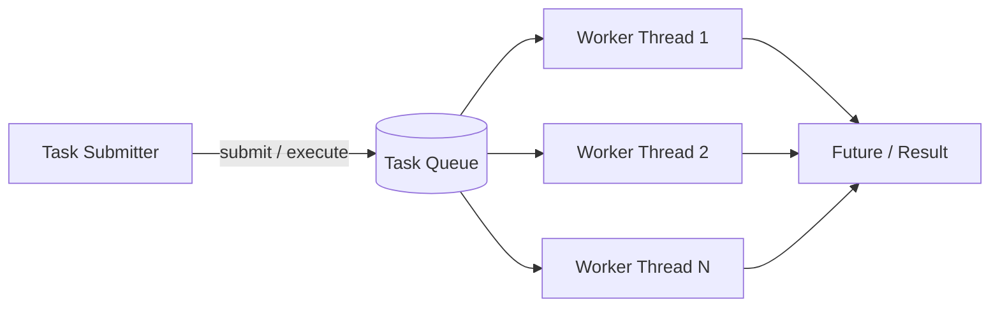
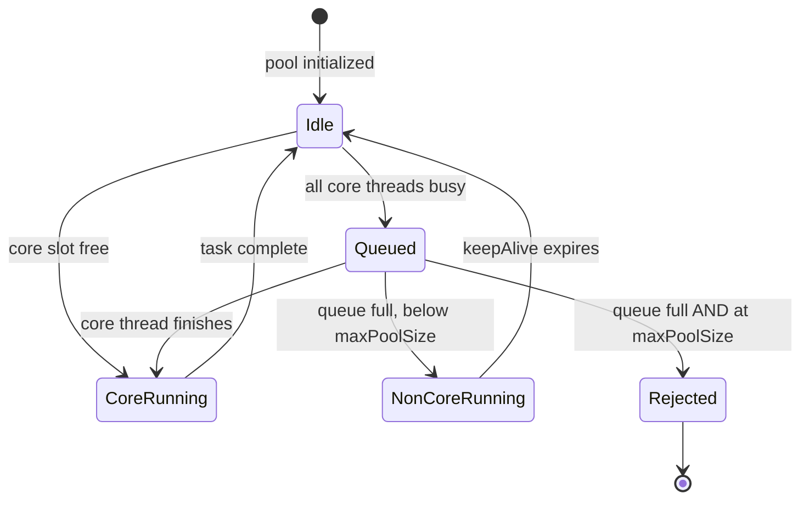
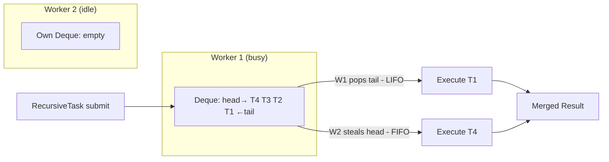

<!-- tldr -->
# Thread Pools

A thread pool holds a fixed (or bounded) set of worker threads that pull tasks off a shared queue, amortizing the ~1ms spawn cost and ~512KB–1MB stack allocation across thousands of tasks. The six knobs on `ThreadPoolExecutor`—core size, max size, keep-alive, queue type, thread factory, and rejection policy—interact non-obviously; getting any one wrong produces silent queue leaks, starvation deadlocks, or rejection storms under load. Every Java I/O framework (Tomcat, Netty, gRPC-Java) runs on a thread pool; knowing its internals is table-stakes for senior interviews.



<!-- standard -->

## What It Is

`ThreadPoolExecutor` underpins every `Executors` factory method. Its constructor accepts:

- **corePoolSize** — threads kept alive even when idle
- **maximumPoolSize** — hard ceiling on live threads
- **keepAliveTime** — idle non-core threads die after this duration
- **workQueue** — `BlockingQueue` buffering pending tasks
- **threadFactory** — names threads, sets daemon flag / priority
- **rejectedExecutionHandler** — fires when queue is full *and* pool is at max

**Submission flow**: new task → try core thread → if saturated, enqueue → if queue full, create non-core thread → if at max, invoke rejection handler.

## Why It Matters

- Thread creation costs ~0.5–2ms and ~512KB–1MB default stack. At 10K req/s, per-request threads burn ~10 CPU-seconds on creation alone.
- Unbounded threads exhaust heap and thrash the OS scheduler; a pool is the principal backpressure mechanism.
- `CallerRunsPolicy` turns a full pool into natural flow control: the producer thread runs the task itself, slowing ingestion automatically.

## Java Executor Variants

| Factory / Type | Queue | Max Threads | Best For |
|---|---|---|---|
| `newFixedThreadPool(n)` | `LinkedBlockingQueue` (∞) | `n` | CPU-bound, known parallelism |
| `newCachedThreadPool()` | `SynchronousQueue` | `Integer.MAX_VALUE` | Short bursts, low sustained rate |
| `newSingleThreadExecutor()` | `LinkedBlockingQueue` (∞) | 1 | Ordered / serialized tasks |
| `newScheduledThreadPool(n)` | `DelayedWorkQueue` | `Integer.MAX_VALUE` | Periodic / delayed tasks |
| `ForkJoinPool.commonPool()` | Work-stealing deques | CPU count | Recursive decomposition, parallel streams |

## Key Tradeoffs

- **Fixed pool + unbounded queue** (`newFixedThreadPool`) looks safe but leaks memory silently under sustained overload—the queue grows without bound.
- **Cached pool** eliminates queueing latency at the cost of unbounded thread creation; a 10K concurrent-task burst spawns 10K threads → OOM.
- **`SynchronousQueue`** (cached pool) has zero buffer: every submit must rendezvous with a free thread immediately or create a new one.
- **`ArrayBlockingQueue(n)`** is the right choice for production fixed pools; it bounds memory and triggers rejection policy, making overload visible.



<!-- deep -->

## Internals & Sizing

### Little's Law Sizing Formula

```
threads = N_cpu × U_cpu × (1 + W/C)
```

- `N_cpu` = `Runtime.getRuntime().availableProcessors()` (respects cgroup quotas on JDK 11+)
- `U_cpu` = target utilisation, typically 0.8
- `W` = average wait time per task (I/O, lock contention)
- `C` = average compute time

**Pure CPU-bound** (W≈0): `threads = 8 × 0.8 × 1 = 6–8`.  
**90% I/O wait** (W/C = 9): `threads = 8 × 0.8 × 10 = 64`.

In practice, measure W and C with a profiler or APM—guessing produces either under-utilised CPUs or over-subscribed cores.

### Work-Stealing (ForkJoinPool)

Each worker owns a **double-ended deque**. It pushes and pops its own work from the **tail** (LIFO — stays cache-warm). Idle workers steal from the **head** of other workers' deques (FIFO — oldest task first, minimises contention with the owner). This yields near-linear speedup for recursive divide-and-conquer up to ~10K subtasks before deque overhead dominates.



`ForkJoinPool.managedBlock` lets a worker park a blocking call and compensate with a spare thread, preventing full-pool starvation during I/O inside fork-join tasks.

---

## Real-World Systems

| System | Thread Pool Configuration |
|---|---|
| **Tomcat NioEndpoint** | Default: core 10, max 200, keep-alive 60s, queue 100. Hitting 200 threads under load is a common P0 incident. |
| **Netty** | Boss group: 1–2 threads (accept only). Worker `NioEventLoopGroup`: 2×CPU. Rule: **never block a worker thread**; off-load to a separate bounded pool. |
| **Kafka Consumer** | One `KafkaConsumer` per thread (not thread-safe). Pool size ≤ partition count; extra threads sit idle. |
| **HikariCP** | Default `maximumPoolSize=10`. Each DB connection occupies exactly one thread; set pool size to match connection pool size or you either starve connections or starve threads. |
| **gRPC-Java** | Non-blocking handlers run on `directExecutor`; blocking RPCs are delegated to an explicitly-sized `ThreadPoolExecutor` to avoid stalling the event loop. |
| **Spring `@Async`** | Defaults to `SimpleAsyncTaskExecutor`—**creates a new thread per call, no pooling**. Always override with a `ThreadPoolTaskExecutor` bean in production. |

---

## Failure Modes

### 1. Thread Starvation Deadlock
Thread A (pool thread) submits task B to the **same pool** and calls `future.get()`. If the pool is full, B queues behind A. A blocks waiting for B; B can never run. The pool deadlocks with zero throughput and no exception.

**Fix**: Use separate pools for nested submissions, or use `ForkJoinPool.managedBlock` to allow compensation.

### 2. Unbounded Queue Memory Leak
`Executors.newFixedThreadPool(n)` wraps `new LinkedBlockingQueue<>()` — no capacity argument. Under sustained overload, the queue grows unboundedly until heap OOM. The leak is invisible in thread-count metrics.

**Fix**: Always construct `ThreadPoolExecutor` directly with `new ArrayBlockingQueue<>(capacity)`.

### 3. Silent Exception Swallowing
`execute(Runnable)` — uncaught exception kills the worker thread; a new one is silently spawned. Task result is gone.  
`submit(Callable)` — exception is stored in the `Future`; **if `.get()` is never called, the exception is permanently lost**.

**Fix**: Install a `Thread.UncaughtExceptionHandler` on the thread factory, and always chain `future.whenComplete(...)` or call `.get()` in a try-catch.

### 4. `parallelStream()` Sharing `commonPool`
`Stream.parallel()` uses `ForkJoinPool.commonPool()` (JVM-wide singleton). One blocking call inside a parallel stream blocks a common-pool thread for all callers in the JVM—including other libraries using parallel streams.

**Fix**: Wrap parallel streams in a custom `ForkJoinPool`: `myPool.submit(() -> list.parallelStream()...).get()`.

---

## Capacity & Latency Reference

| Metric | Typical Value |
|---|---|
| JVM thread creation | ~0.5–2ms, ~512KB–1MB stack |
| OS context switch (same core) | ~1–10µs |
| OS context switch (NUMA cross-socket) | ~50–150µs |
| `ThreadPoolExecutor.submit()` overhead | < 1µs uncontended |
| `LinkedBlockingQueue` poll latency | ~50–200ns |
| Reasonable max threads (8-core, 80% I/O) | 40–80 |
| Tomcat thrash point (8-core host) | > 400 threads |
| ForkJoinPool break-even task granularity | ~10–100µs of work |

---

## Interview Pitfalls

1. **"I'd use `newCachedThreadPool` — it scales automatically."** Under burst it creates unbounded threads; 10K concurrent tasks = 10K threads = OOM. Name the failure mode.
2. **Forgetting `shutdown()`/`shutdownNow()`** — core threads keep the JVM alive. Leaked pools in unit tests cause false hangs; in microservices they exhaust heap across redeploys.
3. **Setting `corePoolSize == maximumPoolSize` with a `SynchronousQueue`** — zero-buffer queue means every task that can't immediately get a thread is rejected. You get a rejection policy, not queueing.
4. **Monitoring thread count instead of queue depth** — queue depth is the leading indicator of overload. Thread count hitting max is already a lagging signal; by then latency has spiked.
5. **Using `ForkJoinPool` for I/O-bound tasks** — work-stealing assumes tasks are non-blocking and CPU-intensive. Blocking tasks stall worker threads and defeat the algorithm.

---

## Decision Rubric

```
Work is CPU-bound and recursively decomposable?
  → ForkJoinPool (sized to CPU count); never block inside tasks

Work is I/O-bound with predictable concurrency?
  → ThreadPoolExecutor, fixed, sized via Little's Law
  → ArrayBlockingQueue(n) + CallerRunsPolicy for backpressure

Work is short-lived, bursty, low sustained rate?
  → CachedThreadPool guarded by a Semaphore(maxConcurrency)

Work requires scheduling or periodic execution?
  → ScheduledThreadPoolExecutor (never use Timer—single thread, swallows exceptions)

Service is NIO / reactive?
  → Netty EventLoop or Project Reactor Schedulers.boundedElastic()
  → Rule: zero blocking on event-loop threads; delegate to a separate bounded pool
```

> **Production rule of thumb**: never use `Executors` factory methods in production code. Construct `ThreadPoolExecutor` directly, name your threads via `threadFactory`, use a bounded `ArrayBlockingQueue`, choose an explicit rejection policy, and expose `getQueue().size()` and `getActiveCount()` to your metrics pipeline.