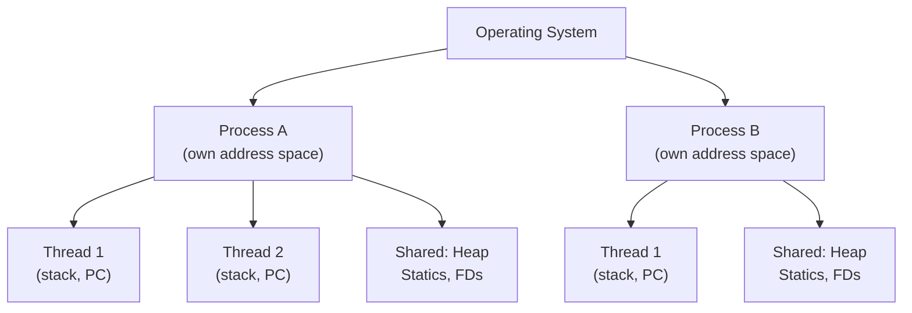
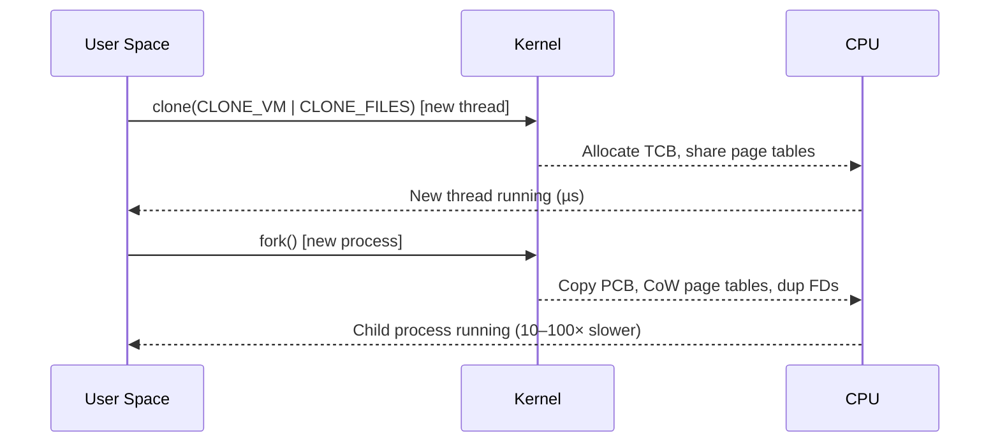
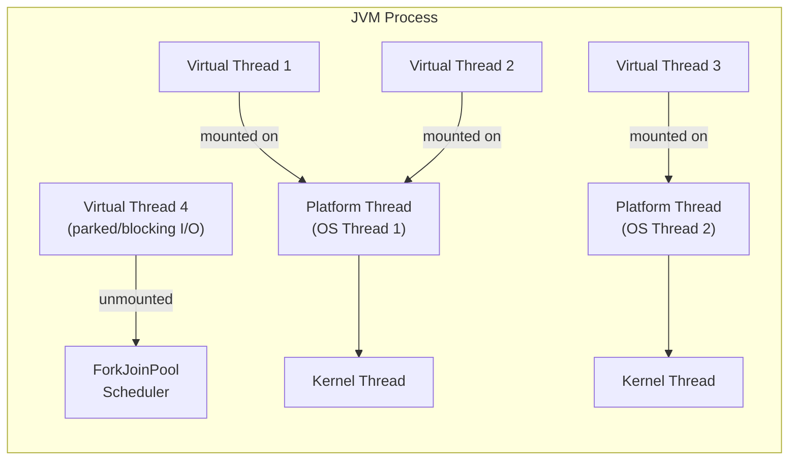
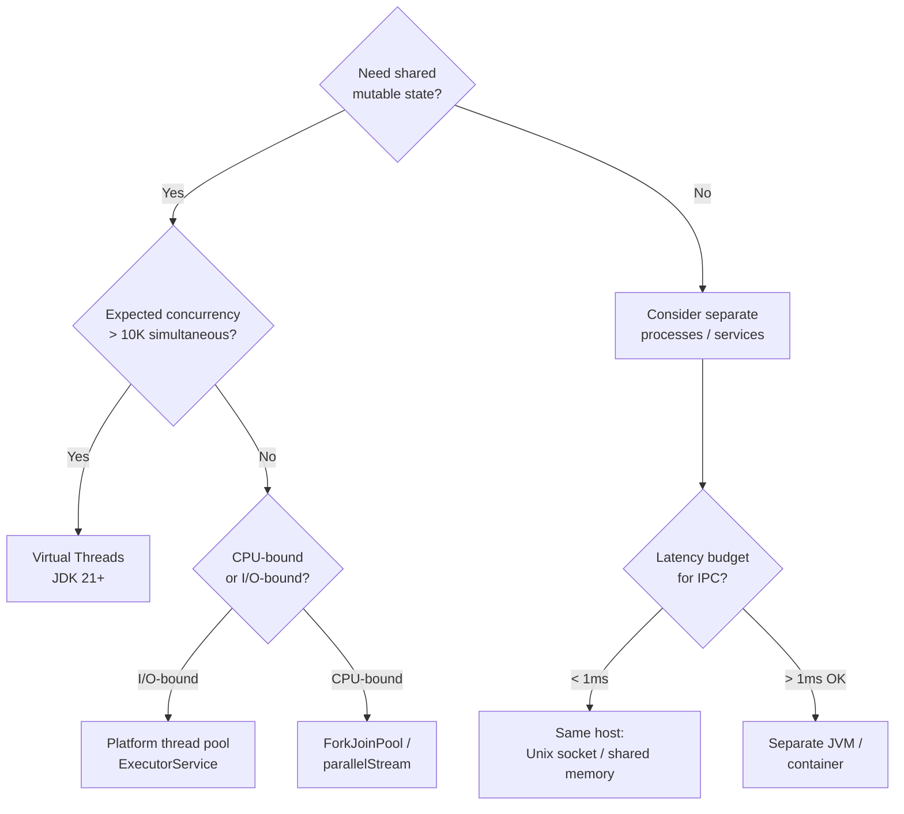

<!-- tldr -->
# Thread vs Process

A **process** is an independent program in execution with its own virtual address space, file handles, and OS resources. A **thread** is a unit of execution within a process—threads in the same process share heap, static fields, and open file descriptors, but each owns its own stack and program counter. The JVM itself is a process; every `java.lang.Thread` is a platform thread mapped (since Java 19+, optionally) to an OS thread or a virtual thread scheduled by the JVM.

<!-- standard -->

## What They Are

| Dimension | Process | Thread |
|---|---|---|
| Memory space | Private virtual address space | Shares process heap & statics |
| Creation cost | High (fork/exec, copy-on-write pages) | Low (stack allocation, ~1 MB default in HotSpot) |
| Communication | IPC: pipes, sockets, shared memory | Direct memory reads/writes (needs synchronization) |
| Fault isolation | Crash stays contained | One thread's SIGSEGV can kill the whole JVM |
| Context switch cost | ~1–10 µs (TLB flush, full register save) | ~0.1–1 µs (register save only, same page tables) |
| OS visibility | Always a kernel entity | Platform thread = kernel entity; virtual thread = user-space |

## Why It Matters for System Design

- **Isolation vs. throughput**: Microservices split work across processes (crash isolation, independent deployments). Within a service, threads (or virtual threads) maximize CPU utilization on shared state.
- **Java specifically**: The JVM starts as one process. `Runtime.getRuntime().exec()` / `ProcessBuilder` spawns child processes. `Thread` / `ExecutorService` / `ForkJoinPool` spawn threads inside the JVM process.
- **Concurrency bugs are thread-domain problems**: data races, deadlocks, and visibility failures only arise when threads share mutable state. Separate processes communicate through well-defined, serialized channels—much safer but slower.

## Primary Techniques in Java

- **Thread-per-request** (classic): `ExecutorService` with a bounded `ThreadPoolExecutor`. Saturates at ~10K threads before scheduling overhead dominates.
- **Virtual threads** (JDK 21 GA): `Thread.ofVirtual().start(...)`. Millions of threads, JVM scheduler, ~1 KB initial stack. Blocking I/O parks the virtual thread without blocking the carrier OS thread.
- **Process isolation**: Use `ProcessBuilder` for CPU-bound sandboxed tasks (e.g., running untrusted code, separate GC tuning) or just use separate JVM deployments behind a load balancer.

## Key Tradeoffs

- Sharing memory is fast but dangerous—you need `synchronized`, `volatile`, or `java.util.concurrent` primitives.
- Processes give you free serialization boundaries (you must marshal data), which forces cleaner APIs and eliminates entire classes of bugs.
- Virtual threads do **not** fix CPU-bound workloads; they shine exclusively on I/O-bound, high-concurrency paths.

<!-- deep -->

## Deep Dive: Thread vs Process

### OS Mechanics

Every process owns a **virtual address space** (typically 48-bit on x86-64, giving 256 TB). The OS kernel maintains a **process control block (PCB)** storing: page tables, signal handlers, open file descriptor table, UID/GID, and resource limits (`RLIMIT_NOFILE`, etc.).

Threads share the process's page tables. The kernel maintains a **thread control block (TCB)** per thread storing: register set (16 GPRs + FP/SIMD on x64), stack pointer, program counter, and thread-local storage pointer.

**fork() cost breakdown** on a 512 MB heap JVM:
- CoW page table copy: ~50 µs
- FD duplication (1000 open files): ~500 µs
- Total: easily 1–5 ms before the child does any useful work

### JVM Thread Model

**Platform thread** (pre-JDK 21 default):
- 1:1 with an OS kernel thread
- Stack: 512 KB–1 MB (tunable via `-Xss`)
- Practical ceiling: ~10K–20K concurrent threads before thrashing

**Virtual thread** (JDK 21+):
- M:N mapping onto a `ForkJoinPool` of carrier threads (default = CPU core count)
- Stack: grows from ~200 bytes, heap-allocated as `StackChunk` objects
- Practical ceiling: millions (LinkedIn reported 1M+ in production)
- **Pinning risk**: `synchronized` blocks that perform blocking I/O pin the carrier thread—migrate to `ReentrantLock` to avoid this.

### Real-World System Patterns

| System | Process or Thread? | Rationale |
|---|---|---|
| **Nginx** | Multi-process (master + workers) | Fault isolation; each worker is single-threaded, uses epoll |
| **Apache Tomcat** (classic) | Thread-per-request in one JVM process | Shared connection pool, session cache |
| **Kafka Broker** | Single JVM process, internal thread pools per subsystem | Network threads, I/O threads, purgatory threads are separate pools |
| **Cassandra** | Single JVM process, SEDA stages | `READ`, `WRITE`, `INTERNAL_RESPONSE` stage thread pools |
| **Node.js** | Single-threaded event loop process + libuv thread pool | Avoids shared-state concurrency; uses child_process for CPU work |
| **Chromium** | One process per tab | Crash isolation; GPU process separate |

### Failure Modes

1. **Thread leak**: `ExecutorService` never shut down → threads accumulate → OOM or port exhaustion.
2. **Stack overflow**: Recursive algorithm on a platform thread with small `-Xss` → `StackOverflowError` kills that thread (not the JVM). On virtual threads, recursion is still limited but stack chunks grow on heap.
3. **Deadlock across threads**: Classic `synchronized(A) { synchronized(B) }` vs. `synchronized(B) { synchronized(A) }`. Use `jstack` / `ThreadMXBean.findDeadlockedThreads()` to detect.
4. **Process zombie**: Child started via `ProcessBuilder` never `.waitFor()`—file descriptors leak; PID table exhausts.
5. **Signal inheritance**: `fork()` in a multithreaded JVM is dangerous—only the forking thread survives in the child. JVM uses `vfork`/`posix_spawn` internally to mitigate.

### Capacity & Latency Numbers (Know These)

| Operation | Typical Latency |
|---|---|
| Thread creation (platform) | 50–100 µs |
| Thread creation (virtual) | ~1 µs |
| Context switch (same process) | 0.5–2 µs |
| Context switch (cross-process) | 2–10 µs (TLB invalidation) |
| `volatile` read (L1 cache hit) | ~4 ns |
| `synchronized` uncontended lock | ~10–20 ns |
| `synchronized` contended lock | 1–100 µs (depends on queue depth) |
| IPC via Unix socket | ~5–20 µs round-trip |
| IPC via TCP loopback | ~20–50 µs round-trip |

### Interview Pitfalls

- **"Threads are always faster than processes"** — False. For truly CPU-bound parallel work with no shared state, separate processes avoid GC stop-the-world interference and can be easier to scale horizontally.
- **"Virtual threads solve all concurrency problems"** — False. They solve the *blocking I/O scalability* problem. Data races, deadlocks, and CPU saturation are unchanged.
- **Forgetting `volatile` or happens-before**: Two threads writing/reading a plain field without synchronization is a data race—the JMM permits the compiler to cache the value in a register indefinitely.
- **`ThreadLocal` leaks in thread pools**: A `ThreadLocal` set on a pooled thread persists across tasks. Always `remove()` in a `finally` block.
- **`synchronized` pinning virtual threads**: In JDK 21, a virtual thread inside a `synchronized` block that blocks on I/O pins its carrier. Profile with `-Djdk.tracePinnedThreads=full`.

### Decision Rubric: Thread vs Process

**Reach for threads when**: low-latency shared-state access is required (caches, connection pools), the team owns the whole JVM, and the workload is I/O-bound.

**Reach for separate processes when**: fault isolation is paramount, deployments must scale and restart independently, or you need separate GC tuning (e.g., a latency-sensitive process alongside a throughput-optimized batch job).