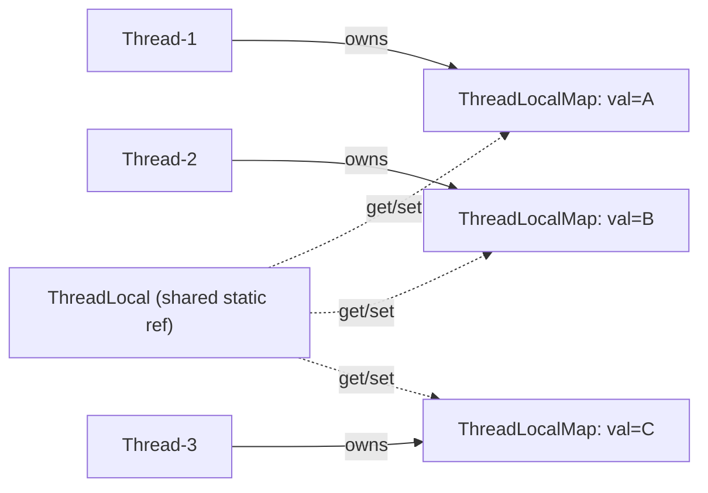
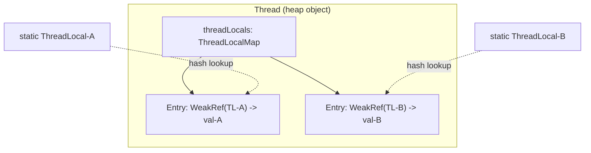
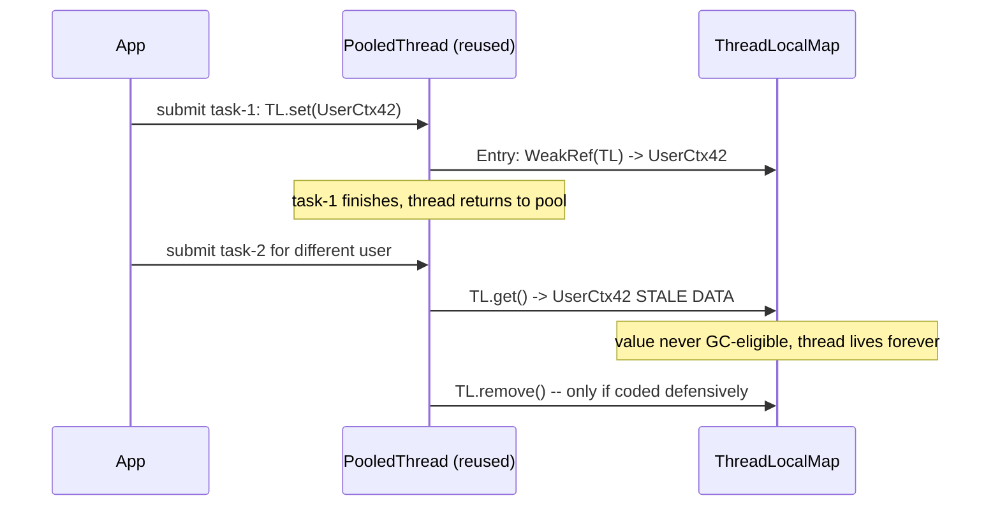

<!-- tldr -->
# ThreadLocal

`ThreadLocal<T>` provides thread-confined storage: every thread calling `get()` or `set()` on the same `ThreadLocal` instance operates on its own private copy, completely invisible to all other threads. The value lives in a map stored directly on the `Thread` object—not in any shared global structure. This makes access contention-free, but demands disciplined cleanup in thread pools where threads are reused indefinitely.



<!-- standard -->

## What It Is

Declare a `ThreadLocal` as a `static` field so every thread shares the same *reference*, but each thread's `get()` returns its own independent value:

```java
private static final ThreadLocal<SimpleDateFormat> FMT =
    ThreadLocal.withInitial(() -> new SimpleDateFormat("yyyy-MM-dd"));
```

`withInitial(Supplier)` lazily constructs the value on the first `get()` per thread. Prefer it over overriding `initialValue()`.

## Why It Matters

Non-thread-safe objects—`SimpleDateFormat`, `StringBuilder`, JDBC `Connection`, transaction state—would otherwise require synchronization or object pooling. `ThreadLocal` provides lock-free per-thread instances at zero contention cost.

| Approach | Contention | `get()` Latency | Memory |
|---|---|---|---|
| `ThreadLocal` | None | ~2–5 ns | N copies (N = live threads) |
| Uncontended `synchronized` | None at low load | ~25–50 ns | 1 object |
| Contended `synchronized` (8 threads) | High | 200 ns – 2 µs | 1 object |
| `AtomicReference` | CAS spin | ~10–20 ns | 1 object |

## Primary Techniques

- **`withInitial(Supplier)`** — lazy init on first `get()`; preferred in almost all cases.
- **`InheritableThreadLocal`** — copies parent's value into child at **thread creation time**; useful for propagating context to sub-tasks but broken with cached thread pools.
- **`remove()`** — mandatory in thread-pool tasks; always call in a `finally` block to prevent stale data and memory leaks.

## Key Tradeoffs

- ✅ Zero lock overhead for read-heavy per-thread state.
- ✅ Clean mechanism for propagating request-scoped context (trace ID, locale, auth token) without polluting method signatures.
- ❌ Memory scales with thread count; large value objects amplify this fast.
- ❌ Invisible state makes debugging and distributed tracing harder.
- ❌ Memory and correctness leaks in thread pools if `remove()` is omitted.
- ❌ Incompatible at scale with Project Loom virtual threads; Java 21+ `ScopedValue` is the intended successor.



<!-- deep -->

## Internal Data Structure

### ThreadLocalMap

`Thread.threadLocals` is a `ThreadLocalMap`: a purpose-built open-addressing hash map with linear probing, stored directly on the `Thread` object—not in a global concurrent map.

```
Entry extends WeakReference<ThreadLocal<?>> {
    Object value;   // ← strong reference — this is where leaks live
}
```

- **Key**: `WeakReference<ThreadLocal<?>>` — allows the `ThreadLocal` *instance* to be GC'd if no strong reference to it exists externally.
- **Value**: strong reference — the actual per-thread data is **not** weakly held.
- **Initial table size**: 16 slots; grows when load factor exceeds 2/3.
- **Hash**: `threadLocalHashCode & (len - 1)`. Each `ThreadLocal` receives a hash code from a global `AtomicInteger` incremented by `0x61c88647` (Fibonacci/golden-ratio hashing), spreading keys evenly across power-of-2 tables.

### Stale Entry Cleanup

When the `ThreadLocal` key is GC'd, its `WeakRef` clears to `null`, but the value remains strongly reachable via the `Entry`. Cleanup is **lazy**: it fires only on the *same thread's* next `get()`, `set()`, or `remove()` call. Pooled threads that live indefinitely and never call `remove()` accumulate zombie entries permanently—the value is never collected.

---

## Real-World Systems

| System | Usage |
|---|---|
| **Spring Framework** | `TransactionSynchronizationManager`, `RequestContextHolder`, `LocaleContextHolder` all use `ThreadLocal` internally |
| **Spring Security** | `SecurityContextHolder` (default `MODE_THREADLOCAL`) stores `Authentication` per thread |
| **SLF4J / Logback MDC** | `MDC.put(k, v)` stores a `Map<String,String>` per thread for log enrichment without method coupling |
| **Hibernate (legacy)** | Session-per-thread via `ThreadLocal<Session>` in the open-session-in-view pattern |
| **gRPC Java** | `Context.attach()` pins context to a `ThreadLocal`; `Context.detach()` must be called in `finally` |
| **Netty** | `FastThreadLocal` replaces hash lookup with a direct array index (~1 ns vs ~5 ns per `get()`) |

---

## Failure Modes

### 1. Stale Data + Memory Leak in Thread Pools

The canonical failure mode: set a value inside a task, omit `remove()`, return the thread to the pool. The next task on that thread reads stale data, and the value object is never eligible for GC as long as the thread lives.



**Fix** — wrap every task with a cleanup boundary:

```java
try {
    TL.set(buildCtx());
    processRequest();
} finally {
    TL.remove();  // mandatory
}
```

### 2. ClassLoader Leak on Hot Redeploy

A webapp's `ThreadLocal` holding an object whose class was loaded by the webapp's classloader survives undeploy when a container platform thread (Tomcat, WildFly) holds that `Entry`. The webapp classloader cannot be GC'd → `OutOfMemoryError: Metaspace`. Tomcat's `ThreadLocalLeakPreventionListener` partially mitigates this by clearing `ThreadLocal` entries when a webapp stops.

### 3. InheritableThreadLocal with Cached Pools

`InheritableThreadLocal` copies the parent thread's map at **child thread creation time**, not at task submission time. With a cached `ExecutorService`, all worker threads were created during pool initialization. The "inherited" snapshot is from pool-startup, not from the current request—silently wrong.

### 4. Virtual Thread Memory Explosion (Java 21+)

`ThreadLocal` still works with virtual threads but each virtual thread carries its own copy. At 1M concurrent virtual threads, every `ThreadLocal` value is instantiated 1M times. Small values (a `String` trace ID) are tolerable; large objects (a `Map`, a `HttpClient`) become prohibitive.

---

## Capacity & Latency Numbers

| Operation | Typical Cost |
|---|---|
| `ThreadLocal.get()` | 2–5 ns (array index + 0–1 linear probe) |
| `ThreadLocal.set()` | 5–10 ns |
| Uncontended `synchronized` | 25–50 ns |
| Contended `synchronized` (8 threads) | 200 ns – 2 µs |
| Memory per entry | ~40 bytes (Entry object + header) |
| 1,000 threads × 10 TLs | ~400 KB metadata (excluding value objects) |
| Netty `FastThreadLocal.get()` | ~1 ns (direct array index, no hash) |

---

## Java 21+: ScopedValue as the Successor

`ScopedValue` (JEP 446, preview in Java 21, finalized in Java 23) is the intentional replacement for immutable per-thread context:

```java
static final ScopedValue<UserCtx> CTX = ScopedValue.newInstance();

ScopedValue.where(CTX, userCtx).run(() -> {
    handleRequest();  // CTX.get() returns userCtx within this scope
});
// automatically freed when run() exits — no remove() needed
```

Key differences from `ThreadLocal`:

| | `ThreadLocal` | `ScopedValue` |
|---|---|---|
| Mutability | Mutable (`set()` anytime) | Immutable within scope |
| Lifetime | Manual (`remove()`) | Structured (scope boundary) |
| Virtual thread safety | Works but memory-heavy | Designed for Loom |
| Inheritance to child threads | `InheritableThreadLocal` (broken with pools) | Safe via `StructuredTaskScope` |

---

## Interview Pitfalls

| Question | Wrong Answer | Correct Answer |
|---|---|---|
| "When is the value GC'd?" | "When ThreadLocal goes out of scope" | When the thread dies or `remove()` is called; weak key ≠ weak value |
| "Is ThreadLocal safe with ExecutorService?" | "Yes, each task gets its own copy" | Only if `remove()` is called before task completion; otherwise stale data and leak |
| "How does InheritableThreadLocal work?" | "It copies values on every `get()`" | Copies parent's map at **child thread creation** — semantically broken with cached pools |
| "What replaces ThreadLocal for virtual threads?" | "Nothing, it just works" | `ScopedValue` for immutable context; TL still works but costs memory per-VT |
| "How does Spring SecurityContextHolder work?" | "It's a global static singleton" | `ThreadLocal<SecurityContext>` per thread by default; configurable to `InheritableThreadLocal` |
| "Why does ThreadLocalMap use WeakReference for keys?" | "To allow GC of values" | To allow GC of the `ThreadLocal` *instance* if no code holds a strong reference—**not** the value |

---

## When to Reach for ThreadLocal

**✅ Use it when:**
- Confining non-thread-safe objects (formatters, parsers, random generators) per bounded platform thread.
- Propagating request-scoped context (user ID, trace ID, locale) through deep call stacks without parameter threading.
- Writing framework or library code that cannot impose method-signature coupling on callers.

**❌ Avoid it when:**
- Running tasks on cached/pooled threads without a guaranteed `remove()` at task boundary.
- Using virtual threads at scale—prefer `ScopedValue`.
- You need parent→child context propagation into pooled threads—use Spring's `TaskDecorator` or explicit parameter passing instead.
- You need shared mutable state across threads—`ThreadLocal` is the wrong abstraction entirely; use `synchronized`, `Lock`, or atomics.

### Decision Rubric

```
Need per-thread isolated state?
├── Bounded platform threads + cleanup boundary guaranteed?
│   └── YES → ThreadLocal + remove() in finally
├── Virtual threads / Project Loom?
│   └── YES → ScopedValue (Java 21+)
├── Child threads need parent's snapshot?
│   ├── New threads (not pooled)? → InheritableThreadLocal
│   └── Pooled threads?          → explicit parameter passing or TaskDecorator
└── Shared mutable state across threads?
    └── NOT ThreadLocal → synchronized / Lock / Atomic / concurrent collections
```