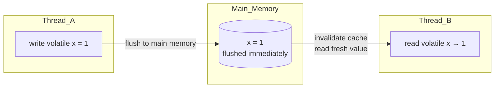
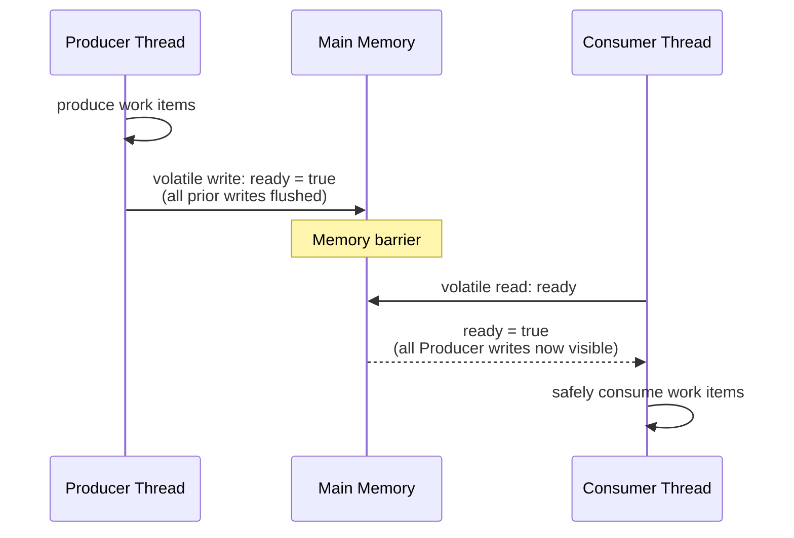
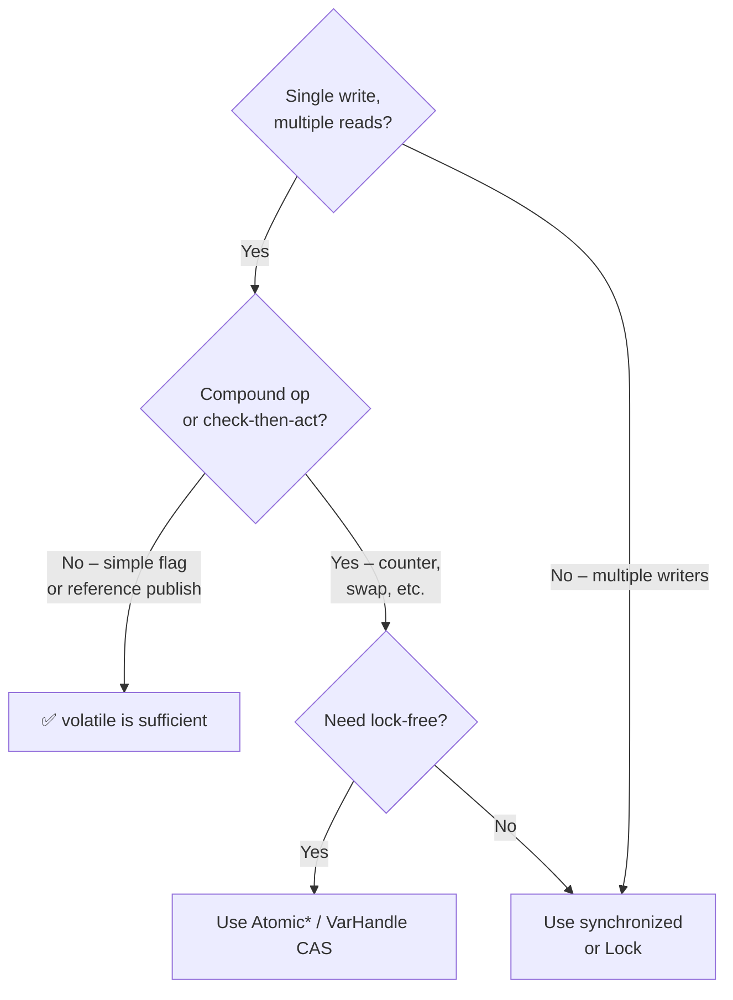

<!-- tldr -->
# `volatile` Keyword

`volatile` is a Java field modifier that makes reads and writes of a variable go directly to main memory, bypassing each thread's local CPU cache. It establishes a *happens-before* relationship between a write and any subsequent read of the same variable. It is **not** a replacement for `synchronized` because it provides no compound-action atomicity. Use it for simple flags and state variables shared across threads—not for counters or check-then-act patterns.



<!-- standard -->

## What It Is

`volatile` is a JVM instruction hint backed by the **Java Memory Model (JMM)**. A write to a `volatile` field:
1. Flushes the written value (and all pending writes from the writing thread) to main memory.
2. Invalidates cached copies of that variable in all other CPU caches.

A read of a `volatile` field always loads from main memory, not the thread's local cache.

## Why It Matters

Without `volatile` (or `synchronized`), threads can read **stale values** cached in L1/L2. A classic example:

```java
// Without volatile — loop may never terminate on some JVMs/CPUs
boolean running = true;

// Thread A
while (running) { /* work */ }

// Thread B
running = false;   // Thread A may never see this!
```

Marking `running` as `volatile` fixes visibility.

## Primary Guarantees

| Guarantee | `volatile` | `synchronized` | `AtomicInteger` |
|---|---|---|---|
| Visibility | ✅ | ✅ | ✅ |
| Happens-before | ✅ | ✅ | ✅ |
| Atomicity (single r/w) | ✅ (64-bit on 32-bit JVM too) | ✅ | ✅ |
| Compound atomicity (i++) | ❌ | ✅ | ✅ |
| Mutual exclusion | ❌ | ✅ | ❌ |

## Key Tradeoffs

- **Cheaper than `synchronized`**: no lock acquisition/release, no thread blocking.
- **Heavier than plain reads**: forces a memory barrier (MFENCE/LOCK prefix on x86); adds ~5–20 ns latency per access on modern hardware vs ~1 ns for a cached read.
- **No atomicity on compound ops**: `count++` is read-modify-write—three steps, still racy with `volatile`.
- **Not for objects**: `volatile` on a reference guarantees visibility of the *reference*, not the fields inside the object.

## When to Reach For It

- Boolean termination flags or lifecycle state (`running`, `initialized`).
- A single writer, multiple readers publishing a result.
- Double-Checked Locking (DCL) on Java 5+ — **requires** `volatile` on the instance field.

<!-- deep -->

## Deep Dive

### The Java Memory Model and Happens-Before

JMM (JSR-133, Java 5+) defines happens-before (HB) chains. For `volatile`:

> **A write to a `volatile` variable W *happens-before* every subsequent read R of that same variable.**

"Subsequent" means R observes W or a later write. HB is transitive: if A HB→ B and B HB→ C, then A HB→ C. This means all actions taken by the writing thread *before* the `volatile` write are visible to the reading thread *after* it reads that variable.

### Memory Barriers Under the Hood

The JIT compiles `volatile` reads/writes into CPU memory-barrier instructions:

| Operation | x86 (TSO model) | ARM / POWER |
|---|---|---|
| `volatile` write | `LOCK ADD [rsp], 0` (implicit StoreLoad) | `stlr` + `dmb ish` |
| `volatile` read | Plain load (x86 has strong model) | `ldar` |

On x86 the write is the expensive side (~20–30 cycles). On ARM both sides carry barriers.

### Double-Checked Locking — the Canonical `volatile` Use Case

```java
public class Singleton {
    private static volatile Singleton instance;  // volatile is REQUIRED

    public static Singleton getInstance() {
        if (instance == null) {                  // first check (no lock)
            synchronized (Singleton.class) {
                if (instance == null) {          // second check (locked)
                    instance = new Singleton();
                }
            }
        }
        return instance;
    }
}
```

Without `volatile`, the JIT can reorder the write of `instance` before the constructor finishes (object publication before full initialization), causing another thread to read a partially-constructed object. `volatile` inserts a StoreStore barrier that prevents this reordering.

### Failure Modes

#### 1. Lost Update (Check-Then-Act)
```java
volatile int counter = 0;
counter++;   // NOT atomic: read (1) → increment (2) → write (3)
             // Two threads can both read 0, both write 1 → lost update
```
**Fix**: Use `AtomicInteger.incrementAndGet()` (CAS loop) or `synchronized`.

#### 2. Visibility Without Atomicity Illusion
```java
volatile long balance = 1_000_000L;
balance -= withdrawal;  // compound op — still a race
```

#### 3. Object Field Trap
```java
volatile Config config;   // reference is visible
config.timeout = 500;     // mutation of config fields is NOT volatile-guarded
```
Use an **immutable value object** + `volatile` reference for safe publication.

### Architecture: Producer-Consumer with Volatile Flag



### Real-World Systems Using `volatile`

| System | Usage |
|---|---|
| **JDK `FutureTask`** | `volatile int state` tracks RUNNING/COMPLETING/DONE |
| **JDK `ConcurrentHashMap`** (Java 8) | `volatile Node<K,V>[] table` for safe resizing |
| **Disruptor (LMAX)** | `volatile long sequence` in `Sequence` class — high-throughput ring buffer cursors |
| **Netty** | `volatile int state` in `AbstractChannel` lifecycle |
| **Kafka Consumer** | `volatile boolean closed` stop flag |

### Capacity and Latency Numbers

- Plain cached read: **~1–3 ns** (L1 hit)
- `volatile` read on x86: **~1–5 ns** (near-free, TSO model)
- `volatile` write on x86: **~20–40 ns** (StoreLoad barrier)
- `volatile` read on ARM: **~10–20 ns** (explicit barrier)
- `synchronized` uncontended lock: **~25–50 ns**
- `AtomicInteger.incrementAndGet()`: **~15–30 ns** (CAS, uncontended)

### Interview Pitfalls

1. **"volatile makes operations atomic."** — Wrong. Atomicity of a *single* 32/64-bit read or write, yes. Compound operations, no.
2. **Forgetting DCL needs volatile.** — A classic gotcha on Java 5+ JMM questions.
3. **Confusing visibility with mutual exclusion.** — `volatile` cannot protect a critical section.
4. **Not knowing about 64-bit long/double tearing.** — Without `volatile`, `long` and `double` writes can be non-atomic on 32-bit JVMs (JLS §17.7); `volatile` fixes this.
5. **Assuming x86 behavior is universal.** — Code that accidentally works on x86 (strong memory model) may break on ARM-based systems (e.g., AWS Graviton).

### Decision Rubric: When to Reach for `volatile`



**Use `volatile` when**: single writer publishes a value (flag, immutable config, singleton reference) that multiple readers consume, and no compound operations are needed.

**Avoid `volatile` when**: you need atomicity of multi-step operations, or multiple threads write — reach for `AtomicInteger`, `AtomicReference`, `VarHandle`, or explicit locking instead.