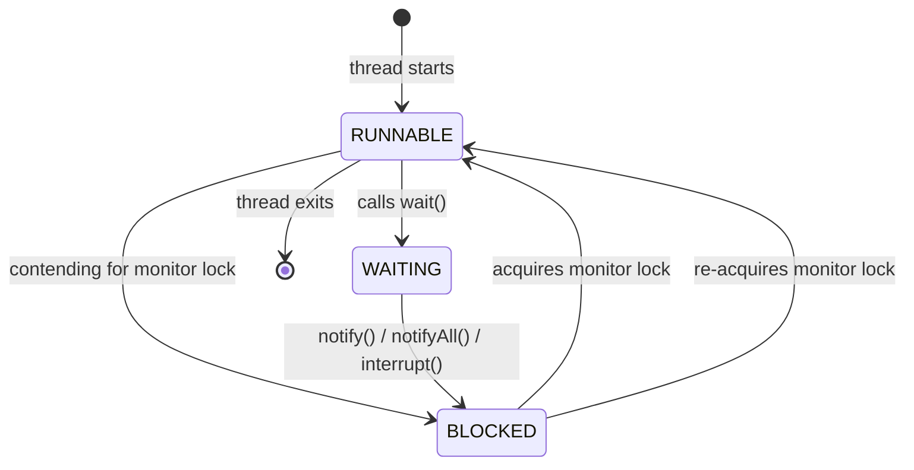
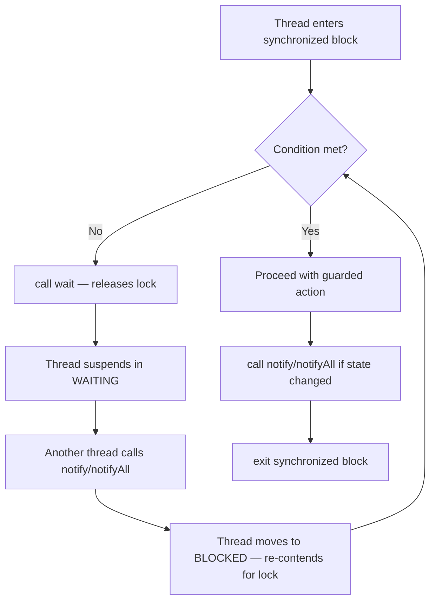
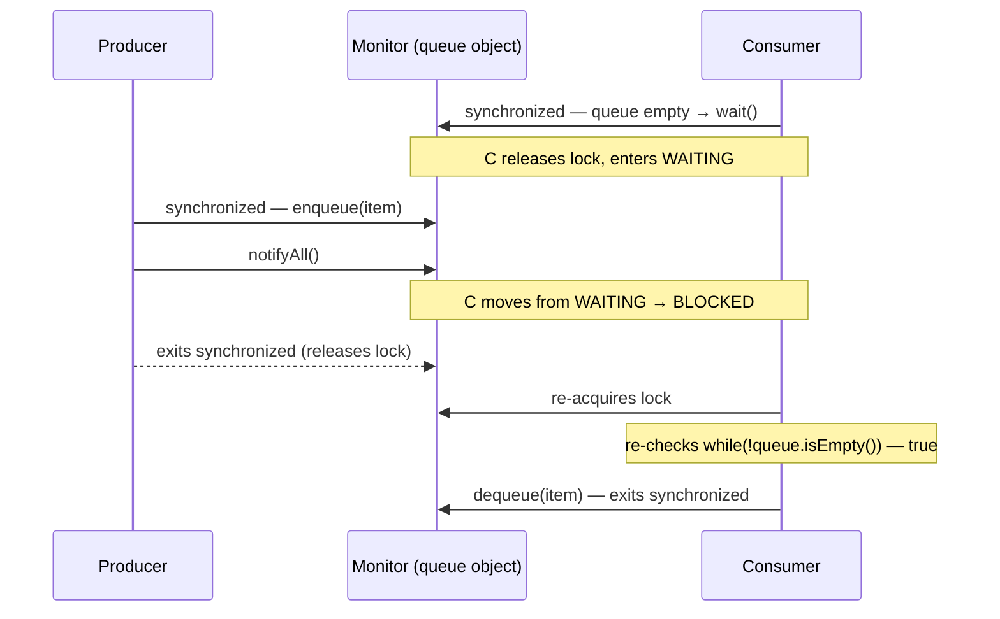

<!-- tldr -->
# `wait()`, `notify()`, `notifyAll()`

`Object.wait()` atomically releases the intrinsic monitor lock and suspends the calling thread until another thread calls `notify()` or `notifyAll()` on the same object. This trio is Java's built-in mechanism for **guarded suspension** — blocking a thread until a condition becomes true without burning CPU. All three must be called inside a `synchronized` block or method, otherwise `IllegalMonitorStateException` is thrown at runtime.



<!-- standard -->

## What It Is and Why It Matters

These methods implement the **monitor pattern** (Hoare, 1974). Unlike `Thread.sleep()`, `wait()` releases the lock it holds — letting other threads make progress — before suspending. This is the only way for a thread to pause mid-critical-section without causing deadlock.

**Primary use case:** producer-consumer coordination where one thread must wait for data or capacity to become available.

### Core Rules

- **Must hold the monitor** (`synchronized` on the same object) before calling any of the three.
- **Always wrap `wait()` in a `while` loop**, never `if`, to guard against spurious wakeups and missed notifications.
- `notify()` wakes **one** arbitrary waiting thread. `notifyAll()` wakes **all** waiting threads; each must re-compete for the lock.

```java
// Canonical guarded-suspension idiom
synchronized (lock) {
    while (!conditionMet()) {   // <-- while, not if
        lock.wait();
    }
    // safe to act
}
```



### `notify()` vs `notifyAll()` Tradeoff

| | `notify()` | `notifyAll()` |
|---|---|---|
| Threads woken | 1 (arbitrary) | All waiting |
| CPU cost | Lower | Higher (thundering herd) |
| Risk | Wrong thread woken; lost signal if condition-specific | Safe default |
| Use when | Exactly one waiter cares about each signal | Multiple distinct conditions share one lock |

**Default to `notifyAll()`** unless you can prove all waiters are interchangeable and only one needs to proceed per signal (e.g., a binary semaphore).

---

<!-- deep -->

## Deep Dive

### How the JVM Implements It

Each object has an **intrinsic monitor** with two implicit queues:

1. **Entry set** — threads blocked waiting to *acquire* the lock (`BLOCKED`).
2. **Wait set** — threads that called `wait()` and released the lock (`WAITING`).

`notify()` moves one thread from the wait set to the entry set. `notifyAll()` moves all. The OS thread scheduler then picks a winner from the entry set — there is **no fairness guarantee**.

The JVM spec (JLS §17.2) explicitly permits **spurious wakeups** — a waiting thread may resume with no notify call at all. This is why the `while` loop is mandatory, not optional.

### Failure Modes

#### 1. Lost Signal (Missed Notification)
```java
// Thread A (waiter) — NOT yet in wait()
// Thread B (notifier) — calls notify() HERE
// Thread A — now calls wait() — sleeps forever
```
Guard with the `while (condition)` idiom; check the condition before waiting so you never sleep when the event already occurred.

#### 2. Nested Monitor Lockout
Thread A holds lock `X`, calls `wait()` on lock `Y` — it releases `Y` but keeps `X`. Any thread that needs `X` to produce the condition is now deadlocked. Avoid holding multiple locks across a `wait()`.

#### 3. `notify()` Waking the Wrong Thread
If multiple threads wait for *different* conditions on the same object, `notify()` may wake a thread whose condition is still false. It re-waits, but the thread that *should* wake never does. Fix: use `notifyAll()`, or switch to `Condition` objects.

#### 4. Interrupt Handling
`wait()` throws `InterruptedException`. If you swallow it, you corrupt the thread's interrupt status. Either rethrow or restore: `Thread.currentThread().interrupt()`.

### Sequence: Producer-Consumer



### Real-World Systems That Use This Mechanism

| System | Usage |
|---|---|
| **`java.util.concurrent.LinkedBlockingQueue`** | Internally uses `ReentrantLock` + `Condition` (the modern equivalent), but the logic mirrors wait/notify exactly. |
| **Tomcat thread pool** | Worker threads `wait()` on the task queue object when idle. |
| **JDBC connection pools (c3p0, DBCP)** | Borrowers `wait()` when pool is exhausted; returners `notify()`. |
| **JVM GC safepoints** | `wait()`/`notify()` semantics underpin stop-the-world coordination in HotSpot. |

### `wait()`/`notify()` vs `java.util.concurrent.locks.Condition`

`Condition` (`ReentrantLock.newCondition()`) is the modern replacement:

```java
Lock lock = new ReentrantLock();
Condition notEmpty = lock.newCondition();
Condition notFull  = lock.newCondition();

// Consumer
lock.lock();
try {
    while (queue.isEmpty()) notEmpty.await();
    // consume
    notFull.signal();
} finally { lock.unlock(); }
```

Key advantages of `Condition`:
- **Multiple condition queues per lock** — eliminates the "wrong thread woken" problem.
- `await(long, TimeUnit)` for timeout without `InterruptedException` swallowing.
- `awaitUninterruptibly()` for non-cancellable waits.
- `Condition.signal()` is still not fair; use `new ReentrantLock(true)` + `signal()` only if ordering matters.

Use raw `wait()`/`notify()` only when you have no dependency on `java.util.concurrent` (e.g., embedded runtimes, teaching contexts, or legacy codebases).

### Capacity and Latency Context

- A `wait()` → `notify()` round-trip on the same JVM costs roughly **1–5 µs** under low contention (context-switch overhead dominates, not the monitor operation itself).
- Under high contention (>100 threads on one monitor), `notifyAll()` can cause a **thundering herd**: all threads wake, all contend, O(n²) lock acquisitions. Prefer partitioned locks or `java.util.concurrent` structures at that scale.
- A `LinkedBlockingQueue` backed by `Condition` sustains **~10–20 M ops/sec** on a modern server (JMH benchmarks); raw `wait()`/`notify()` implementations land 20–40% lower due to suboptimal condition handling.

### Interview Pitfalls

| Pitfall | What Interviewers Are Testing |
|---|---|
| Using `if` instead of `while` around `wait()` | Knowledge of spurious wakeups |
| Calling `wait()` outside `synchronized` | Knowing the monitor ownership requirement |
| Using `notify()` when multiple condition types share a lock | Understanding signal semantics |
| Not restoring interrupt status after catching `InterruptedException` | Thread lifecycle hygiene |
| Holding multiple locks across `wait()` | Nested monitor lockout / deadlock awareness |
| Proposing raw `wait()`/`notify()` when `BlockingQueue` suffices | Knowing when *not* to reinvent the wheel |

A common interview question: *"Implement a bounded blocking queue using wait/notify."* The expected answer uses two conditions (`notFull`, `notEmpty`) — which immediately segues into why `Condition` is superior to a single shared object monitor.

### When to Reach for This

```
Need inter-thread signaling?
├── Simple producer-consumer or resource pooling?
│   └── Use java.util.concurrent.BlockingQueue — done.
├── Need multiple distinct conditions on one lock?
│   └── Use ReentrantLock + Condition.await()/signal().
├── Need fairness / ordering guarantees?
│   └── Use ReentrantLock(true) + Condition.
└── Constrained environment (no java.util.concurrent, legacy codebase)?
    └── Use wait()/notifyAll() with while-loop guard.
```

Avoid `wait()`/`notify()` in new production Java code — `java.util.concurrent` abstractions are safer, better tested, and more performant under contention. Know the primitives cold for interviews; reach for `BlockingQueue` or `Condition` in production.