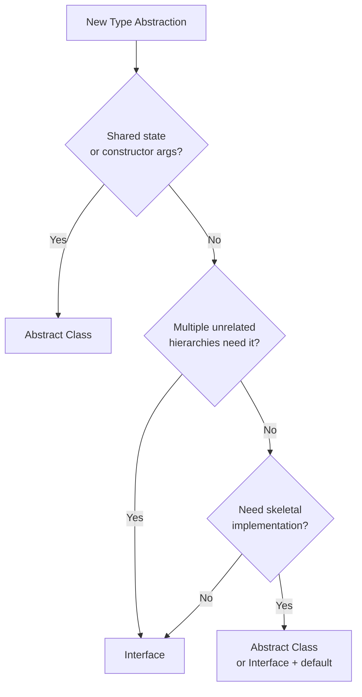
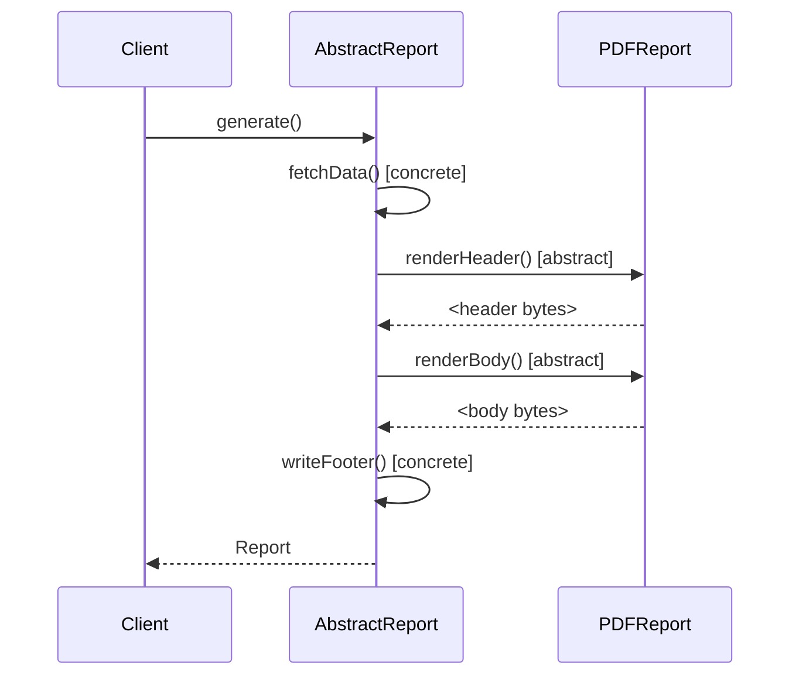
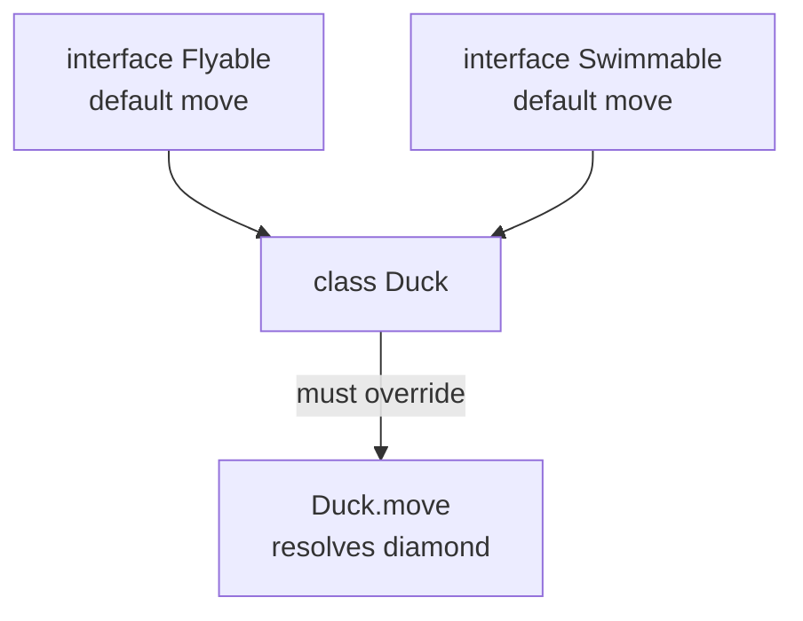

<!-- tldr -->
# Abstract Class vs Interface

An **interface** defines a capability contract — what a type *can do* — with no assumption about lineage. An **abstract class** defines a partial implementation within a type hierarchy — what a type *is*. Java 8+ blurred the line with `default` methods, but the design intent remains distinct: interfaces model roles, abstract classes model skeletal implementations. The choice has real consequences for API evolution, testability, and coupling.



<!-- standard -->

## What & Why

An **abstract class** is a class that cannot be instantiated and may contain abstract methods (no body), concrete methods, instance fields, and constructors. A subclass inherits exactly one abstract class.

An **interface** (pre-Java 8) is a pure contract — all methods implicitly `public abstract`, all fields `public static final`. Since Java 8 it can carry `default` (virtual) and `static` methods; since Java 9, `private` helper methods. A class can implement any number of interfaces.

### Key Differences

| Dimension | Abstract Class | Interface |
|---|---|---|
| Instantiation | ❌ | ❌ |
| Instance fields | ✅ | ❌ (only `static final`) |
| Constructors | ✅ | ❌ |
| Multiple inheritance | ❌ (single) | ✅ (multiple) |
| Access modifiers | Any | `public` / `private` (Java 9+) |
| State encapsulation | ✅ | ❌ |
| Default method conflict | N/A | Diamond — must override |
| Versioning (add method) | ✅ Binary compatible | ✅ via `default` (Java 8+) |

### Primary Techniques

- **Template Method Pattern** — abstract class defines the skeleton algorithm; subclasses fill in steps. Classic use case for `AbstractList`, `HttpServlet`.
- **Skeletal Implementation (Effective Java Item 20)** — pair an interface with an `Abstract*` class (e.g., `List` + `AbstractList`). Consumers code to the interface; implementors extend the skeleton to avoid boilerplate.
- **Mixin Interfaces** — `Comparable`, `Serializable`, `Runnable` add orthogonal capabilities without touching the class hierarchy.
- **Marker Interfaces** — zero-method interfaces (`Cloneable`, `Serializable`) used for type-system tagging (prefer annotations in modern code).

### Key Tradeoffs

- **Flexibility vs. Control**: Interfaces allow a class to participate in multiple roles; abstract classes give you constructor injection and field-level invariants.
- **API Evolution**: Adding a non-`default` method to a published interface is a **breaking change**. Abstract classes can add concrete methods without breaking subclasses — but only if state assumptions hold.
- **Testability**: Interfaces are trivially mockable (`Mockito`, `java.lang.reflect.Proxy`). Abstract classes require subclassing in tests, which is heavier.

---

<!-- deep -->

## Deep Dive

### Memory & JVM Mechanics

Every interface type participates in the **itable** (interface method table) lookup, which is slightly more expensive than **vtable** (virtual dispatch) used for abstract classes — though JIT inlining eliminates this in hot paths. Relevant at >10M QPS where you're shaving nanoseconds; invisible everywhere else.

### Template Method — Canonical Example



The abstract class owns the **invariant flow**; subclasses own **variant steps**. You cannot replicate this ordering guarantee with a plain interface without exposing `generate()`'s internals.

### Skeletal Implementation Pattern (Effective Java Item 20)

```java
// Step 1 — define the contract
public interface Collection<E> {
    int size();
    Iterator<E> iterator();
    // ... more abstract methods
    default boolean isEmpty() { return size() == 0; }
}

// Step 2 — skeletal class handles 90% of boilerplate
public abstract class AbstractCollection<E> implements Collection<E> {
    public boolean contains(Object o) {
        for (E e : this) if (e.equals(o)) return true;
        return false;
    }
    // size() and iterator() still abstract
}

// Step 3 — concrete class is trivial
public class MyBag<E> extends AbstractCollection<E> {
    public int size() { return ...; }
    public Iterator<E> iterator() { return ...; }
}
```

This is exactly how `java.util` is structured. `AbstractList` saves ~2,000 lines of code across all JDK `List` implementations.

### Diamond Problem with Default Methods



Java's resolution rules:
1. Class/superclass wins over interface default.
2. More specific interface wins over less specific.
3. Otherwise, **compile error** — must explicitly override and optionally delegate via `Flyable.super.move()`.

### Real-World Usage in Major Systems

| System | Usage |
|---|---|
| **Java Collections** | `List`/`Set`/`Map` interfaces + `Abstract*` skeletal classes |
| **Spring Framework** | `ApplicationContext` (interface) + `AbstractApplicationContext` (lifecycle hooks via Template Method) |
| **Kafka Streams** | `Processor<K,V>` interface; `AbstractProcessor` provides `context()` state |
| **JDBC** | `Driver`, `Connection`, `ResultSet` — pure interfaces enabling swap-in drivers |
| **Hibernate** | `UserType` interface for custom type mappings; no abstract class needed (stateless) |
| **Netty** | `ChannelHandler` interface + `ChannelHandlerAdapter` abstract class (deprecated in favor of `ChannelInboundHandlerAdapter`) |

### Failure Modes & Pitfalls

#### 1. Publishing an Interface Too Early
Adding a method to a released interface without a `default` body breaks **all** downstream implementors. Mitigation: ship with `default` throwing `UnsupportedOperationException` (ugly) or version the interface (`Collection2`).

#### 2. Fat Abstract Class Coupling
An abstract class that holds 15 fields and 30 methods forces subclasses to carry dead weight. If a subclass only uses 3 methods, extract an interface + a narrower helper.

#### 3. Constructors as Hidden API
Abstract class constructors are part of the public API surface. Changing constructor signatures breaks subclasses in other teams' codebases. Prefer factory methods or builder injection.

#### 4. `instanceof` Abuse
Coding `if (x instanceof AbstractFoo)` instead of `if (x instanceof FooCapable)` couples callers to the implementation hierarchy. Prefer interface-based type checks.

#### 5. Default Method Surprise
A `default` method added to a widely-used interface (e.g., `Collection.stream()` in Java 8) can silently override a method in a pre-existing implementing class if name/signature collides — verify with `-Xlint:overrides`.

### Capacity / Latency Anchors

- **vtable dispatch**: ~1–2 ns per call (JIT-optimized monomorphic site).
- **itable dispatch**: ~3–5 ns uncached; negligible after JIT bimorphic/megamorphic inlining threshold (~10K invocations).
- **Proxy-based mocks** (interface-only): reflection overhead ~50–200 ns/call — irrelevant in tests, never use in production hot path.
- A `default` method adding `isEmpty()` to an interface used by 1,000 implementing classes: **zero runtime cost**, pure syntactic sugar compiled to a static helper.

### Interview Decision Rubric

```
1. Do multiple unrelated classes need this capability?
   → Interface (e.g., Comparable, Serializable)

2. Does the abstraction require shared mutable state (fields)?
   → Abstract class

3. Is this a stable, internal-only hierarchy where you control all subclasses?
   → Abstract class (Template Method)

4. Is this a public API others will implement?
   → Interface (+ optional Abstract* skeletal companion)

5. Do you need to add behavior to an existing interface without breaking implementors?
   → default method (Java 8+)

6. Are you modeling a role/capability orthogonal to class identity?
   → Interface (mixin)
```

### Common Interview Questions at FAANG Level

- *"Why does `AbstractList.add()` throw `UnsupportedOperationException` by default?"* — Skeletal implementation provides a safe default; subclasses opt into mutability. Contrast with making `add()` abstract (would break read-only implementations).
- *"How would you design a plugin system — interface or abstract class?"* — Interface for the contract (allows any class to be a plugin), abstract class as an optional convenience adapter for common boilerplate.
- *"Java 8 default methods — does that make abstract classes obsolete?"* — No. Default methods can't hold state, can't have constructors, and can't enforce ordering (Template Method). Abstract classes remain the right tool for stateful skeletal implementations.
- *"When would you NOT use an interface?"* — When you need constructor-enforced invariants, when the hierarchy is closed and internal, or when you're implementing a state machine with shared transitions.