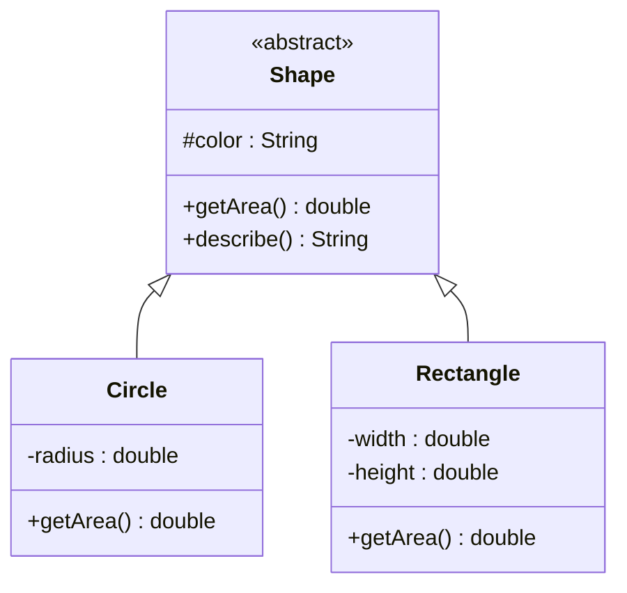
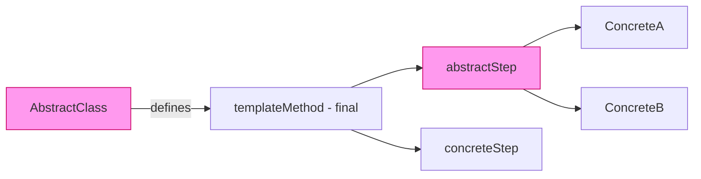
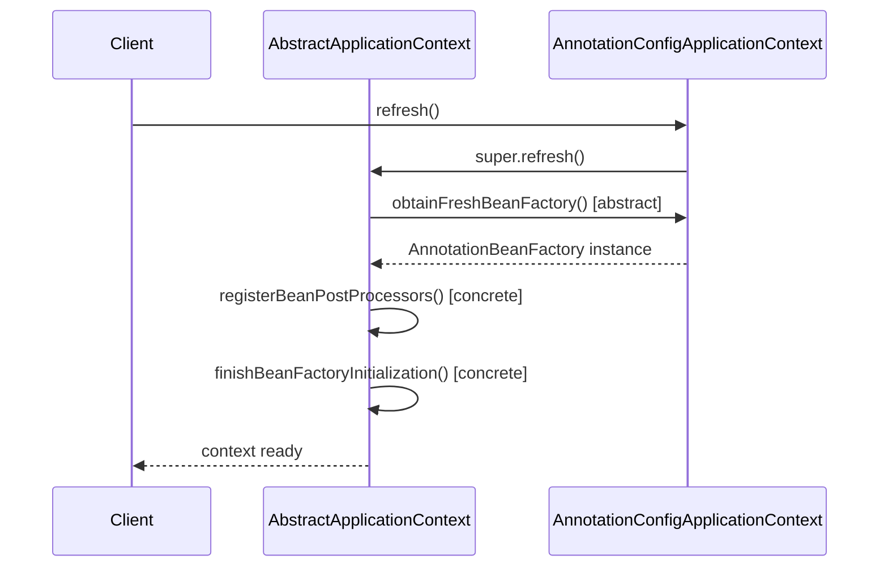

<!-- tldr -->
# Abstract Classes

An abstract class is a class that cannot be instantiated directly and may declare abstract methods — signatures without a body — that every non-abstract subclass must implement. It sits between a concrete class and a pure interface: it can carry instance state, constructors, and default behavior while still mandating that subclasses fill in specific variant steps. The core design leverage is the **Template Method pattern**: fix an algorithm's skeleton in the abstract class, delegate the variant parts to subclasses.



<!-- standard -->

## What It Is

Declared with the `abstract` keyword in Java, an abstract class may contain:

- **Abstract methods** — no body; concrete subclasses must override every one.
- **Concrete methods** — fully implemented; inherited or selectively overridden.
- **Instance fields** — shared mutable/immutable state unavailable in interfaces.
- **Constructors** — invoked via `super()` in subclass constructors; enforce invariants.
- **Static members** — class-level behavior, unaffected by polymorphism.

```java
public abstract class DataProcessor {
    private final String source;                       // shared state

    protected DataProcessor(String source) {           // constructor enforces invariant
        this.source = Objects.requireNonNull(source);
    }

    public final void process() {                      // template method — FIXED skeleton
        List<Record> raw     = read();
        List<Record> cleaned = transform(raw);
        write(cleaned);
    }

    protected abstract List<Record> read();            // extension point
    protected abstract List<Record> transform(List<Record> in);
    protected abstract void write(List<Record> out);
}
```

## Why It Matters

Without abstract classes you face an uncomfortable choice: duplicate logic across sibling classes, or push everything into a concrete base that exposes methods that should never be called directly. Abstract classes give you a **compile-time guarantee** that every variant method is implemented, plus a canonical home for invariant shared logic.

## Abstract Class vs Interface (Java 8+)

| Dimension | Abstract Class | Interface |
|---|---|---|
| Instance state | ✅ fields | ❌ constants only |
| Constructors | ✅ | ❌ |
| Access modifiers | Any (`private`, `protected`) | `public` / `private` (Java 9+) |
| Multiple inheritance | ❌ single `extends` | ✅ multiple `implements` |
| Default methods | ✅ concrete | ✅ `default` keyword (Java 8+) |
| When to prefer | Shared state + IS-A | Pure contract / mix-in |

## Primary Techniques

- **Template Method** — mark the skeleton `final`; mark variant steps `protected abstract`.
- **Hook methods** — optional override points with a safe no-op default body.
- **Protected constructor** — forces subclass instantiation, enforces shared invariants.
- **Partial interface implementation** — abstract class implements an interface but leaves some methods abstract, letting concrete subclasses finish the job.

## Key Tradeoffs

- **Inheritance lock-in**: subclasses couple tightly to the base. A new concrete method on the abstract class propagates to all subclasses at compile time; a renamed method breaks them all (fragile base class problem).
- **Single inheritance slot**: Java allows only one `extends`. Spending it on an abstract class blocks future extension via class inheritance.
- **Testing friction**: the abstract class cannot be instantiated in tests; you need a minimal anonymous or inner concrete subclass, or a spy/mock framework.



<!-- deep -->

## Deep Dive: Abstract Classes

### Template Method Pattern — Mechanics

The pattern has two hard invariants:

1. The skeleton method is `final` — no subclass can reorder or skip steps.
2. Extension points are `protected abstract` (mandatory) or `protected` hooks (optional, safe default body).

```
process()                      ← final, lives in AbstractClass
  ├── validateInput()          ← abstract  — MUST override
  ├── doWork()                 ← abstract  — MUST override
  └── postProcess()            ← hook      — optional, default: no-op
```

The JVM dispatches calls to abstract methods via **virtual dispatch** (vtable lookup) — approximately **1–3 ns** per call on a modern x86-64 core. For a service handling 1 M QPS with 10 virtual calls per request, that's ~10–30 ms of cumulative dispatch overhead — negligible compared to any network or disk I/O.

### Real-World Systems

#### Java Collections Framework

`AbstractList`, `AbstractMap`, `AbstractSet` are the canonical examples in the JDK itself:

- `AbstractList` implements `iterator()`, `indexOf()`, `subList()`, and ~12 other methods in terms of exactly two abstract primitives: `get(int index)` and `size()`.
- `ArrayList` overrides `get` and `size`; it gets the rest of the `List` API for free.
- Without `AbstractList`, every `List` implementation would duplicate ~15 methods — a maintenance and correctness disaster across `ArrayList`, `LinkedList`, `CopyOnWriteArrayList`, etc.

#### Servlet API — `HttpServlet`

`HttpServlet extends GenericServlet` is Template Method in the standard library:

- `service(HttpServletRequest, HttpServletResponse)` is the fixed skeleton — it routes to `doGet`, `doPost`, `doPut`, etc.
- Developers override only the HTTP verb methods they need.
- Default implementations return `405 Method Not Allowed` — a safe, non-silent hook default.

#### Spring Framework — `AbstractApplicationContext`

`AbstractApplicationContext.refresh()` is a ~30-step template method covering: bean definition loading, post-processor registration, singleton pre-instantiation, and lifecycle callbacks. Concrete implementations override exactly one abstract method, `obtainFreshBeanFactory()`, to supply the backing bean store.



#### Apache Kafka — `AbstractFetcherThread`

Kafka's replication layer uses `AbstractFetcherThread` to define a fixed fetch-and-offset-commit loop. `ReplicaFetcherThread` overrides the data-handling hook while inheriting exponential-backoff retry logic, backpressure, and metrics. Changing retry behavior in one place covers all fetcher implementations.

### Failure Modes

| Failure | Root Cause | Mitigation |
|---|---|---|
| **Fragile Base Class** | Adding a concrete method to the abstract class silently hides subclass methods with matching names | Document with `@implSpec`; mark invariant steps `final` |
| **LSP Violation** | A subclass overrides a hook in a way that breaks the template's postconditions | Enforce contracts via assertions or `@implNote`; use `final` on invariant steps |
| **Constructor Call Leak** | Abstract constructor calls an overridable method; subclass fields are not yet initialized | Never call overridable methods from constructors — it is an effective Java anti-pattern (EJ Item 19) |
| **Over-deep Hierarchy** | 4+ levels of abstract classes; changes ripple uncontrollably; reading code requires mental stack unwinding | Flatten with composition + Strategy objects after 2 levels |
| **Partial Interface Abuse** | Abstract class implements a wide interface but delegates most methods as abstract, front-loading burden onto every subclass | Split the interface (ISP); provide adapter defaults at the abstract class level |

### Capacity & Latency Notes

- **Vtable dispatch**: ~1–3 ns per virtual call; irrelevant for services with P99 in the 10–100 ms range.
- **JIT inline caches**: monomorphic (1 concrete type) and bimorphic (2 types) call sites are inlined by HotSpot — effectively zero overhead.
- **Megamorphic sites**: ≥3 distinct concrete types at one call site triggers full vtable dispatch, disabling inlining. In plugin systems or framework hot paths (e.g., a codec registry with many implementations), this matters. Measure with `-XX:+PrintInlining` before optimizing.
- **Java 17+ sealed classes**: `sealed abstract class Expr permits Num, Add, Mul` gives the JIT a closed type set, restoring inlining opportunities even at call sites that see multiple subtypes.
- **Class loading cost**: each concrete subclass loaded into the JVM costs ~50–200 µs and ~1–8 KB of metaspace. For systems generating classes dynamically (bytecode proxies, rule engines), this adds up at scale — 10 K dynamic subclasses ≈ 80 MB metaspace.

### Interview Pitfalls

**1. "Can an abstract class have no abstract methods?"**  
Yes — fully legal. Declaring a class `abstract` with no abstract methods prevents direct instantiation without mandating any override. Useful for base classes with protected constructors and utility behavior that should never be used standalone.

**2. "Can an abstract class extend a concrete class?"**  
Yes. `abstract class Foo extends ArrayList<String>` is valid. The abstract class inherits all concrete behavior and may layer abstract extension points on top.

**3. "What if a concrete subclass doesn't implement all abstract methods?"**  
Compile error — unless the subclass is itself declared `abstract`, which defers the obligation further down the hierarchy.

**4. "Abstract class vs interface when both could work (Java 8+)?"**  
The primary tiebreaker is **state and constructors**. If you need instance fields, constructor-enforced invariants, or non-public members, use an abstract class. If the contract is purely behavioral and you want to allow multiple inheritance of type, use an interface. Composition over either if the IS-A relationship isn't genuinely true.

**5. "What does making the template method `final` actually prevent?"**  
It prevents a subclass from bypassing the skeleton — e.g., skipping a validation step or changing the order of `read → transform → write`. Without `final`, a subclass that overrides `process()` entirely defeats the pattern.

**6. "Sealed abstract classes in Java 17 — why should I care?"**  
`sealed abstract class Shape permits Circle, Rectangle, Triangle` allows `switch` expressions with exhaustiveness checking at compile time — no catch-all needed. The JIT can also devirtualize and inline calls knowing the exact closed set of subtypes.

### Decision Rubric: When to Reach for an Abstract Class

```
Does the hierarchy share mutable/immutable instance state (fields)?
  YES → Abstract class is the natural fit.
   NO ↓

Do subclasses need a shared constructor to enforce invariants?
  YES → Abstract class.
   NO ↓

Is the algorithm skeleton fixed with only specific steps varying?
  YES → Abstract class + Template Method.
   NO ↓

Is the contract purely behavioral with no shared implementation needed?
  YES → Interface (with default methods if needed).
   NO ↓

Do you need multiple inheritance of type?
  YES → Interface.
   NO → Either works; prefer interface for future flexibility.

If hierarchy depth would exceed 2 levels → stop and use composition.
```

### Interview Room Checklist

- State the two defining properties unprompted: *cannot be instantiated*, *may declare abstract methods*.
- Name the **Template Method pattern** as the canonical use case before the interviewer does.
- Cite `AbstractList` or `HttpServlet` as evidence you've engaged with production-grade code.
- Distinguish from interfaces on axes of **state**, **constructors**, and **multiple inheritance**.
- Call out the **Fragile Base Class** problem and its mitigation (`final` steps + `@implSpec`).
- Know that **Java 17 sealed + abstract** is the modern evolution for closed hierarchies and exhaustive `switch`.
- Discuss **megamorphic call site** performance only if the interviewer pushes to JIT/JVM depth — it signals genuine low-level understanding.