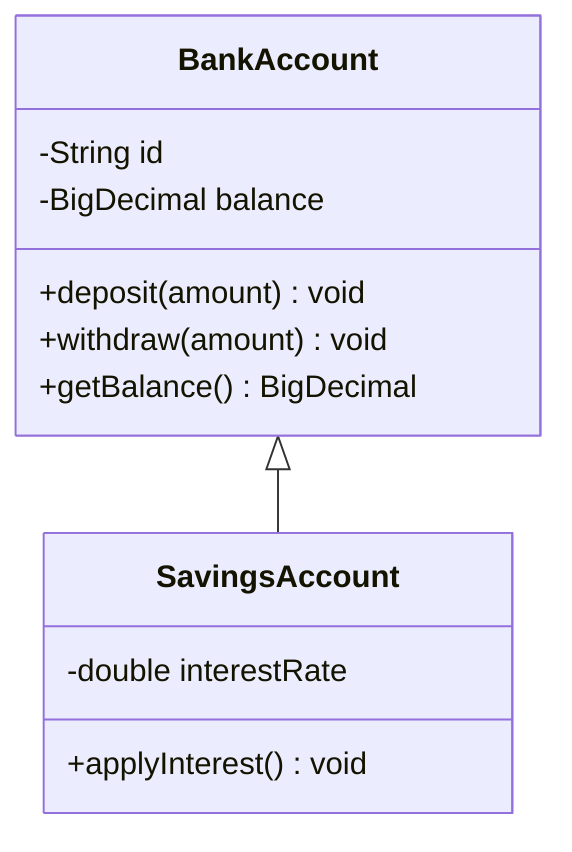
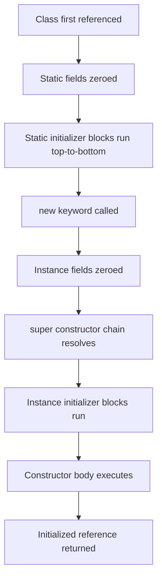
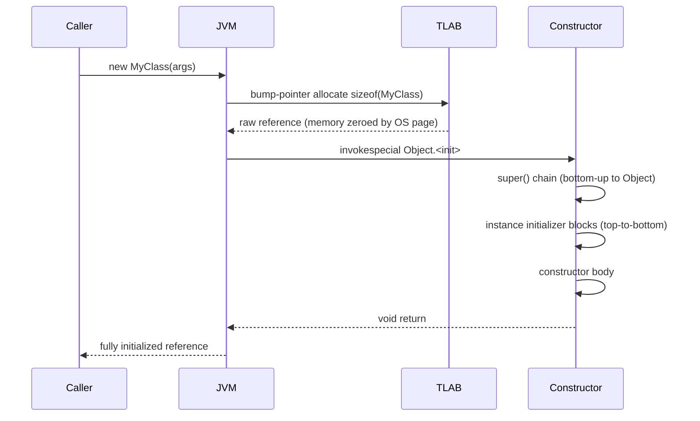

<!-- tldr -->
# Classes & Objects

A **class** is a compile-time construct that bundles state (fields) and behavior (methods) under a single named type. An **object** is a live, heap-allocated instance of that class carrying its own field values and an implicit pointer back to the class metadata in Metaspace. In Java, `new` allocates memory in Eden, writes a 16-byte object header, zeroes the fields, then calls the full constructor chain. Understanding this model at the JVM level — not just syntactically — is the line between a junior and a staff-level answer.



<!-- standard -->

## What It Is

A class declaration creates a new reference type. Its key members:

- **Fields** — per-instance (instance fields) or per-class (`static` fields) storage slots.
- **Methods** — behavior operating on instance state or class state.
- **Constructors** — initialization methods invoked via `new`; not inherited.
- **Access modifiers** — `private` / package-private / `protected` / `public` — enforce encapsulation boundaries.

Objects live on the heap; references to them live on the stack or inside other objects.

## Why It Matters

Classes are the atomic unit of encapsulation. A mutable shared object introduces data races. An anemic class (fields + getters/setters, no behavior) leaks business logic into service layers where it gets duplicated. A class that leaks its `this` reference before construction completes causes subtle concurrency bugs. Getting class boundaries right is the first — and most load-bearing — design decision in any system.

## Key Techniques

- **Encapsulate invariants** — `private` fields; validate in constructors or setters.
- **Prefer immutability** — `final` fields + no mutating methods = trivially thread-safe.
- **Factory methods over constructors** — named, can return cached instances (`Integer.valueOf`), can return a subtype.
- **Builder pattern** — objects with > 3 optional parameters; avoids telescoping constructors.
- **`record` (Java 16+)** — collapses immutable value-object boilerplate; auto-generates `equals`, `hashCode`, `toString`.

## Static vs Instance Members

| Dimension | Instance Member | Static Member |
|---|---|---|
| Lifetime | Per object; GC'd with it | Per classloader; lives until class unloaded |
| Access | Through object reference | Through class name |
| Thread safety | Isolated per object | Shared — requires synchronization |
| Typical use | Domain state & behavior | Utilities, constants, factories |
| Mockability | Easy via interface | Requires PowerMock or static agent |

## Initializer Execution Order



<!-- deep -->

## JVM Object Memory Layout

Every Java object on the heap begins with a **12-byte compressed-oops header** (64-bit JVM, `-XX:+UseCompressedOops` default):

```
[ mark word (8 bytes) | klass pointer (4 bytes) | instance fields... | alignment padding ]
```

- **Mark word** — stores GC age bits, identity hash code, and lock state (unlocked / biased / thin / fat / GC-marked).
- **Klass pointer** — compressed reference to the `InstanceKlass` structure in **Metaspace** (not heap).
- **Field layout** — JVM reorders fields by size to minimize padding: `long`/`double` → `int` → `char`/`short` → `byte` → references.
- Minimum object size = **16 bytes** (header + padding). An empty class still costs 16 bytes.

### Practical Size Numbers

| Object | Heap Cost |
|---|---|
| `new Object()` | 16 bytes |
| `Integer` (boxed int) | 16 bytes vs 4 bytes primitive |
| `String` (empty) | ~48 bytes (header + char array object + fields) |
| `HashMap.Node` entry | ~48 bytes |
| 1 M `Integer` instances | ~16 MB Eden pressure |

Boxing `int → Integer` at 1 M/s = **16 MB/s of Eden allocation** → minor GC every few seconds in throughput-sensitive code. This is the core motivation for Project Valhalla value types.

## Object Creation Sequence



**TLAB allocation is ~O(1)** — a single pointer bump with no lock. Objects only enter the global heap lock path when a TLAB refill is needed (~once per 256 KB allocated per thread).

## Exact Initialization Order (Superclass First)

1. Superclass **static fields** zeroed (first class reference only)
2. Superclass **static initializer blocks** run top-to-bottom
3. Subclass **static fields** zeroed
4. Subclass **static initializer blocks** run top-to-bottom
5. `super()` resolved (explicit or implicit)
6. Superclass **instance initializer blocks**
7. Superclass **constructor body**
8. Subclass **instance initializer blocks**
9. Subclass **constructor body**

### Critical Gotcha — `this` Escape

```java
class EventSource {
    EventSource() {
        EventBus.register(this); // 'this' escapes before subclass fields are initialized
    }
    protected void onEvent(Event e) {}
}

class SpecialSource extends EventSource {
    private final String name;
    SpecialSource(String name) {
        super();            // register() fires here — name is still null
        this.name = name;  // too late
    }
    @Override protected void onEvent(Event e) {
        System.out.println(name.toUpperCase()); // NPE in prod
    }
}
```

Fix: use a static factory; publish `this` only after construction returns.

## Identity vs Equality

| Concept | Mechanism | What It Checks |
|---|---|---|
| Reference identity | `==` | Same heap address |
| Value equality | `.equals()` | Logical equivalence (must override) |
| Hash contract | `.hashCode()` | Must be consistent with `equals` |

**Contract**: `a.equals(b)` → `a.hashCode() == b.hashCode()`. Violation breaks `HashMap`, `HashSet`, and `ConcurrentHashMap` silently — objects land in the wrong bucket or are treated as duplicates.

**When identity equality is intentional**: `IdentityHashMap`, interned strings, lock tokens, thread-locals — all rely on `==` semantics being preserved.

## Immutability: Full Checklist

```java
public final class Money {                         // 1. final — no subclass mutation
    private final BigDecimal amount;               // 2. private final fields
    private final Currency currency;

    public Money(BigDecimal amount, Currency currency) {
        this.amount  = Objects.requireNonNull(amount);    // 3. validate at construction
        this.currency = Objects.requireNonNull(currency);
    }
    // 4. No setters
    // 5. Defensive copy on mutable inputs/outputs (BigDecimal itself is immutable here)
    public BigDecimal getAmount() { return amount; }
}
```

Immutable objects need **no synchronization, no volatile, no defensive locking** for safe publication across threads — `final` fields are guaranteed visible after construction completes (JMM §17.5).

## Real-World Systems

- **Kafka `ProducerRecord`** — immutable value object; key/value/topic/partition frozen at construction, shared across threads without copying.
- **Hibernate entities** — mutable, identity equality based on database PK (not field equality). Classic bug: calling `equals` before `flush` compares transient PKs, breaking `HashSet` membership.
- **Netty `ChannelHandlerContext`** — per-channel stateful object; exposes a narrow interface to pipeline handlers to prevent cross-channel state leakage.
- **JDK `String`** — immutable, hash lazily cached (race-benign: same `int` always written by every racing thread); literal pool interning makes `==` usable for compile-time constants.
- **Guava `ImmutableList`** — enforces immutability at type level; `UnsupportedOperationException` on mutation attempts rather than silent copy-on-write surprises.

## Failure Modes

| Failure | Root Cause | Fix |
|---|---|---|
| NPE on first use | Field not initialized; constructor path skipped | `Objects.requireNonNull` in constructor |
| Broken `HashMap` lookup | `equals` overridden without `hashCode` | Always override both; use `record` or Lombok |
| `this` escape race | Publishing reference in constructor | Static factory; publish after `new` returns |
| Mutable `static` field | Shared state across threads | `ThreadLocal`, `ConcurrentHashMap`, or immutable constant |
| Subclass breaks invariant | `public`/`protected` mutable parent fields | Declare `private final`; seal class |
| Singleton per classloader assumption | Multiple classloaders each load the class | Use enum singleton or container-managed scope |

## Interview Pitfalls

1. **"`==` vs `.equals()`"** — Never stop at "`.equals` compares values." Describe the hashCode contract, the silent `HashMap` corruption scenario, and the cases where identity equality is intentional.

2. **Overriding method called from constructor** — Classic trick question. The override runs (dynamic dispatch), but the subclass fields are still zero/null because the subclass constructor has not executed yet.

3. **`static` fields in app-server environments** — OSGi, Tomcat, and JPMS can isolate classloaders. Each loader gets its own set of `static` fields; a `static` singleton breaks across web-app reload boundaries. Prefer a container-managed scope.

4. **Memory overhead at scale** — 10 M `Long` objects ≈ 160 MB heap vs 80 MB for a `long[]`. At that scale, prefer primitive arrays, off-heap (`ByteBuffer.allocateDirect`), or flat value representations.

## Decision Rubric

```
Shared across threads or layers?
  YES → immutable (final class, final fields, defensive copies)

Natural value equality (coordinates, money, IDs)?
  YES → record (Java 16+) or override equals/hashCode
  
Owns lifecycle state (connection, session, buffer)?
  YES → encapsulate mutation behind methods; never expose internal collections raw

Needs extension by external callers?
  NO  → sealed class (Java 17+) or final
  YES → define protected abstract API; keep fields private

More than 3 optional constructor params?
  YES → Builder pattern
  
Needs cached / controlled instantiation?
  YES → static factory method
```