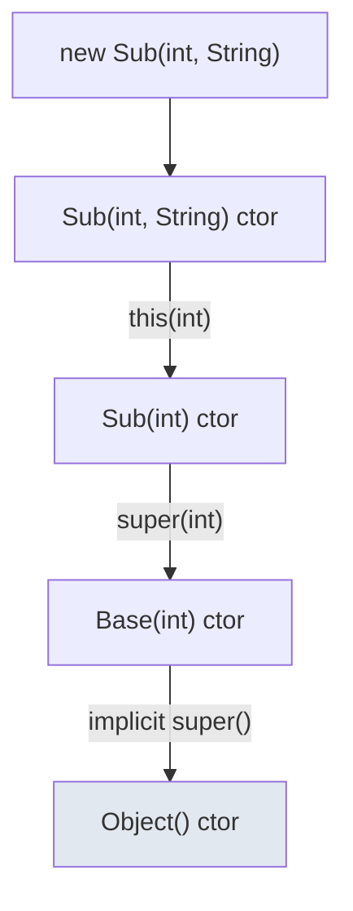
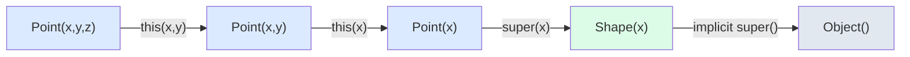
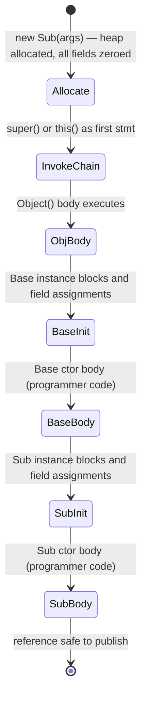

<!-- tldr -->
# Constructor Chaining

Constructor chaining is the practice of having one constructor invoke another—either in the same class (`this()`) or in a parent class (`super()`)—so initialization logic lives in exactly one place. The JVM guarantees that every constructor call propagates all the way to `Object.<init>` before any subclass instance fields are assigned or instance-initializer blocks execute. Getting this order wrong is a rich source of subtle bugs in inheritance hierarchies and a frequent FAANG interview probe.



<!-- standard -->

## What It Is

Java exposes two constructor-delegation keywords:

- **`this(...)`** — calls another constructor in the **same** class. Must be the absolute first statement; at most one per constructor.
- **`super(...)`** — calls a constructor in the **direct parent** class. Also the first statement. If omitted entirely, the compiler silently inserts `super()`—which is a compile error if the parent has no no-arg constructor.

### The Canonical Constructor Pattern

Keep one *canonical* constructor that does all real work; every overload delegates to it:

```java
public class Connection {
    private final String host;
    private final int    port;
    private final int    timeoutMs;

    // Canonical — all validation lives here
    public Connection(String host, int port, int timeoutMs) {
        Objects.requireNonNull(host, "host");
        if (port < 1 || port > 65535) throw new IllegalArgumentException("port out of range");
        this.host      = host;
        this.port      = port;
        this.timeoutMs = timeoutMs;
    }

    public Connection(String host, int port) { this(host, port, 5_000); }
    public Connection(String host)           { this(host, 443); }
}
```

Validation and defensive copies appear exactly once. Adding a new field means touching one constructor, not N.

### Key Tradeoffs

| Approach | Pros | Cons |
|---|---|---|
| Constructor chaining | Compile-time safe, zero extra types | Telescopes badly beyond 4 params |
| Builder pattern | Readable named params, optional fields | Boilerplate; two-phase construction |
| Static factory | Named, can cache/return subtypes | Hides construction; harder to subclass |

### Hard Rules

- `this()` and `super()` are **mutually exclusive** in any one constructor.
- Circular `this()` chains are a **compile-time error** — the compiler detects them.
- Implicit `super()` is injected only when no explicit `super()`/`this()` is written.



<!-- deep -->

## JVM Mechanics

Every constructor compiles to an `<init>` method dispatched via `invokespecial` (statically resolved — not polymorphic). The compiler splices **instance initializer blocks** and inline field assignments into each `<init>` *after* the `super()`/`this()` call but *before* any programmer-written statements that follow. The precise execution order for `new Sub(args)`:



Static initializers (`static {}` blocks and `static` field assignments) fire **once at class load**, entirely before any instance construction.

**Initialization order mnemonic:**
```
[class load] static blocks/fields (once)
[new]        Object() → ... → Base instance init → Base body
                             → Sub  instance init → Sub  body
```

For an N-level hierarchy, exactly N `invokespecial` calls are made in the constructor chain.

---

## Real-World Systems

| System | How chaining is used |
|---|---|
| `java.time.LocalDateTime` | `of(date, time)` delegates to the canonical `of(y,mo,d,h,min,s,nano)` — single validation point for 186 possible overloads |
| Spring `AbstractBeanDefinition` | Subclass ctors call `super(beanClass)` to seed common metadata before adding specialised fields |
| Netty `AbstractChannel` | `super(parent)` seeds the pipeline and event loop; `NioSocketChannel` calls it before setting NIO-specific selectable-channel state |
| Guava `AbstractIterator` | `super()` initializes the `State` enum that drives `hasNext()`; any other order would expose a partially wired state machine |
| Kotlin data classes | Secondary constructors must delegate via `this(...)` — the language enforces the canonical-constructor pattern at the compiler level |

---

## Failure Modes

### 1. Overridden Method Called from a Super Constructor (Most Common Bug)

```java
class Base {
    Base() { init(); }   // virtual dispatch here — DANGER
    void init() { }
}

class Sub extends Base {
    private final List<String> items = new ArrayList<>();

    @Override
    void init() {
        items.add("seed");   // items is null — NPE or silent drop
    }
}
```

`items` is assigned **after** `super()` returns, but `Base()` invokes `init()` *while still inside* the `super()` call. The virtual dispatch resolves to `Sub.init()`, but `Sub`'s fields haven't been initialized yet. **Rule: never call overridable methods from constructors.** Seal or `final` the method, or restructure using a post-construction hook.

### 2. Leaking `this` Before Construction Completes

```java
class EventSource {
    EventSource(EventBus bus) {
        bus.register(this);   // reference escapes before ctor finishes
        this.name = "src";    // too late if another thread already used this
    }
    private String name;
}
```

Another thread may observe `name == null`. Safe publication requires the object to be fully constructed *before* any reference is shared. Use a static factory + private constructor if registration is mandatory.

### 3. Missing No-Arg Constructor in Parent

If a parent defines only parameterized constructors, every subclass constructor **must** call `super(...)` explicitly. Forgetting this produces a compile error that surprises developers who assume `super()` always exists.

### 4. Circular Constructor Chains

```java
class Foo {
    Foo()      { this(0); }
    Foo(int x) { this();  }  // compile error: recursive constructor invocation
}
```

The compiler catches this at build time — no runtime risk, but it's a credible interview trick question.

---

## Capacity & Latency Notes

- Object allocation on modern JVMs (G1, ZGC) costs **~1–3 ns** via TLAB bump-pointer. Constructor chaining adds **zero heap overhead** — it is a pure stack concern.
- Constructor bodies are JIT-compiled like any other method. Chains of `this()` delegation in a hot path inline naturally after **~10 K invocations** (C1 tier) and fully after **~100 K** (C2/Graal).
- Deep inheritance chains (> 5–6 levels) can exceed the JIT's inline budget (`-XX:MaxInlineSize` defaults to 35 bytes of bytecode). Prefer composition over deep inheritance in performance-critical code; verify with `-XX:+PrintInlining` or async-profiler's flamegraphs.

---

## Interview Pitfalls

| Question | Common wrong answer | Correct answer |
|---|---|---|
| "What if you omit `super()`?" | "Nothing happens" | Compiler inserts `super()` — compile error if parent has no no-arg ctor |
| "Can `this()` and `super()` coexist?" | "Yes, order matters" | No — mutually exclusive; exactly one may be the first statement |
| "When do instance initializer blocks execute?" | "Before the constructor body" | After `super()`/`this()` returns, spliced inline before programmer-written ctor code |
| "Is `super()` polymorphic?" | "Yes, like method calls" | No — `invokespecial` resolves statically; always calls the declared parent's ctor |
| "Why not call virtual methods in a ctor?" | "Fine if you use `@Override`" | Subclass fields are uninitialized during `super()`, so the overriding method sees zeroed state |

---

## When to Reach for Constructor Chaining

```
≤ 3–4 variants, all required params known at call site
    → Constructor chaining with one canonical ctor

> 4 params, many optional, or logically grouped
    → Builder pattern (Effective Java Item 2; Lombok @Builder)

Need caching, subtype selection, or readable named constructors
    → Static factory methods

Java 16+ immutable record-like type
    → Record + compact constructor; secondary ctors must delegate via this(...)

Inheritance hierarchy with shared initialization logic
    → Explicit super(...) in every subclass ctor; document the contract
```

### Decision Rubric

1. **Immutable + few params** → canonical constructor chaining, defensive copies inside canonical only.
2. **Mutable + many optional params** → Builder; never rely on setters post-construction for required invariants.
3. **Any inheritance** → call `super(...)` explicitly; never trust implicit `super()` in multi-level hierarchies.
4. **Hot allocation path** → keep chains shallow (≤ 2 hops); validate with profiler before optimizing.
5. **Library/API design** → prefer static factories over public constructors (they can return subtypes, enforce singletons, and be renamed without breaking callers).