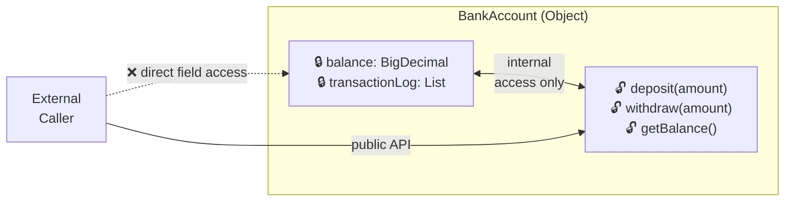
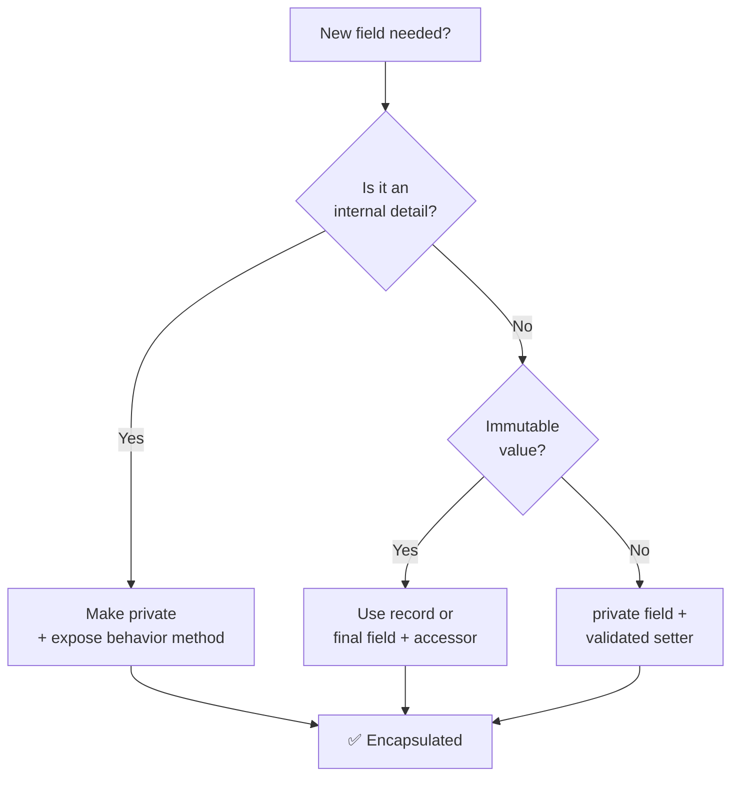
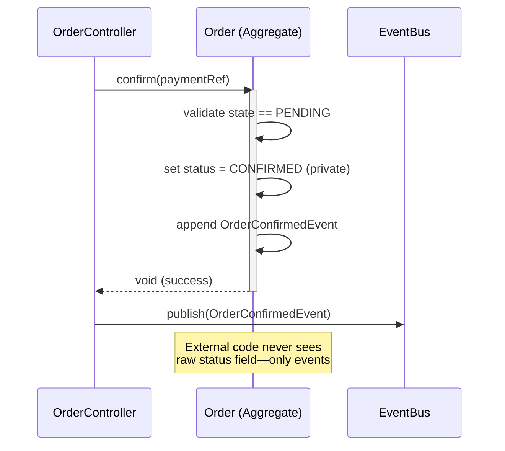

<!-- tldr -->
# Encapsulation

Encapsulation is the OOP mechanism of binding data (fields) and the operations that act on that data (methods) into a single unit—the class—while restricting direct access to internal state. It enforces a *public contract* separate from *private implementation*, letting the internals change freely without breaking callers. In Java, this is realized through access modifiers (`private`, `protected`, `public`) combined with accessor methods or immutable value types.



<!-- standard -->

## What It Is

Encapsulation combines two concerns that are often conflated:

- **Data hiding** — fields are `private`; no external code reads or writes them directly.
- **Behavioral cohesion** — the only way to transition an object's state is through its own methods, which can enforce invariants.

The **JavaBeans convention** (`getX`/`setX`) is the entry-level expression of this. More sophisticated designs use *immutable value objects*, *builder patterns*, or *domain-driven aggregates* where setters don't exist at all.

## Why It Matters

| Without Encapsulation | With Encapsulation |
|---|---|
| Any caller can corrupt state | State changes go through invariant-checked methods |
| Refactoring internals breaks callers | Internal representation is swappable |
| Concurrency bugs from unsynchronized field writes | Synchronization lives in one place |
| Test setup must replicate exact field layout | Tests drive public behavior, not implementation |

## Primary Techniques in Java

- **`private` fields + accessors** — baseline; accessors can add validation, lazy init, or logging.
- **Immutable classes** — `final` fields, no setters, defensive copies in constructors and getters (`Collections.unmodifiableList`). Thread-safe by definition.
- **Package-private visibility** — default (no modifier); use to expose internals to collaborators in the same package while hiding from the outside world.
- **Records (Java 16+)** — `record Point(int x, int y)` generates a canonical constructor, accessors, `equals`/`hashCode`/`toString`; designed for transparent, immutable carriers.
- **Sealed classes (Java 17+)** — restrict which classes can extend or implement a type; encapsulates the *type hierarchy* itself.

## Key Tradeoffs

- **Accessors vs. tell-don't-ask** — excessive getters encourage procedural code that reaches in and manipulates data externally; prefer methods that *do work* on the object.
- **Immutability cost** — copying large collections on every access adds GC pressure; acceptable for DTOs, questionable for hot paths with millions of allocations/sec.
- **Reflection bypass** — `setAccessible(true)` breaks encapsulation; relevant when designing frameworks or when writing tests (prefer package-private over reflection).



<!-- deep -->

## Deep Dive: Encapsulation at Senior/Staff Level

### Access Modifier Semantics (Java Specifics)

| Modifier | Class | Package | Subclass | World |
|---|---|---|---|---|
| `private` | ✅ | ❌ | ❌ | ❌ |
| *(default)* | ✅ | ✅ | ❌ | ❌ |
| `protected` | ✅ | ✅ | ✅ | ❌ |
| `public` | ✅ | ✅ | ✅ | ✅ |

`protected` is frequently misused: it breaks encapsulation across inheritance hierarchies. Prefer composition + package-private over `protected` fields in framework design.

---

### Invariant Enforcement

The deepest value of encapsulation is *invariant protection*. An invariant is a condition that must always hold true for an object to be valid.

```java
public final class Money {
    private final BigDecimal amount;  // always >= 0
    private final Currency currency;

    public Money(BigDecimal amount, Currency currency) {
        Objects.requireNonNull(amount);
        Objects.requireNonNull(currency);
        if (amount.compareTo(BigDecimal.ZERO) < 0)
            throw new IllegalArgumentException("Amount cannot be negative");
        // defensive copy not needed — BigDecimal is immutable
        this.amount = amount;
        this.currency = currency;
    }

    public Money add(Money other) {
        if (!this.currency.equals(other.currency))
            throw new CurrencyMismatchException();
        return new Money(this.amount.add(other.amount), this.currency);
    }
}
```

Every `Money` instance is *always valid*. No null checks scattered across the codebase. This is the real payoff.

---

### Real-World Systems

#### `java.util.Collections` / Unmodifiable Wrappers
`Collections.unmodifiableList(list)` encapsulates a mutable list behind a read-only facade. The internal list reference is hidden; the wrapper throws `UnsupportedOperationException` on mutating calls. Used pervasively in the JDK to return safe views.

#### Domain-Driven Design Aggregates (e.g., Order in an e-commerce platform)
An `Order` aggregate root exposes `addItem(SKU, qty)`, `confirm()`, `cancel()` — **never** a raw setter on `status`. The state machine lives inside the aggregate. External services (Inventory, Payment) interact only through domain events, not field reads. This is encapsulation at the *architecture* level.

#### `java.util.concurrent` — `ReentrantLock`, `AtomicReference`
Concurrency primitives encapsulate volatile/CAS operations behind clean APIs. `AtomicReference.compareAndSet(expected, update)` hides the CPU memory-fence instruction. Callers cannot accidentally skip the CAS; the unsafe operation is encapsulated.

#### Kafka's `RecordBatch`
Internally, Kafka's broker encapsulates the byte-layout of a record batch (magic byte, CRC, compression codec) behind a `RecordBatch` abstraction. When Kafka migrated from message format v0→v1→v2, broker *and* consumer code didn't change—only the encapsulated serialization layer did. Zero-copy `FileChannel.transferTo` is an implementation detail invisible to producers/consumers.

---

### Failure Modes

| Mistake | Symptom | Fix |
|---|---|---|
| Mutable field returned directly | Caller modifies internal collection; invariant broken silently | Defensive copy or `Collections.unmodifiableList` |
| Anemic domain model | All logic in service classes; objects are mere structs | Move behavior into the object |
| `protected` fields in base class | Subclass corrupts parent invariant | Use `private` + `protected` accessor with validation |
| Leaking `this` in constructor | Partially-constructed object visible to other threads | Never publish `this` before constructor completes |
| Overusing getters | Service layer does `account.getBalance() - fee` externally | Replace with `account.debit(fee)` |

---

### Capacity & Latency Considerations

- **Immutable object allocation rate**: a `Money` object is ~32 bytes on the JVM heap (16-byte header + 2 references). At 1M transactions/sec, that's ~32 MB/sec of allocation. Modern G1GC handles this comfortably in Eden; median GC pause < 5ms. Watch out at 10M+ TPS where object churn can spike P99 to > 50ms.
- **Accessor overhead**: JIT-inlines trivial getters (< 35 bytecodes) to zero cost at steady state. Profile before eliminating encapsulation for "performance."
- **Thread-safe encapsulation via `synchronized` methods**: adds ~20–50 ns/call on JDK 21 with uncontended biased locking. Under contention at 100 threads, can degrade to microseconds—prefer `java.util.concurrent` primitives instead.

---

### Sequence: Encapsulated State Transition



---

### Interview Pitfalls

1. **"Just use Lombok `@Data`"** — generates `equals`/`hashCode`/setters indiscriminately; interview answer should note this defeats encapsulation for domain objects. Use `@Value` (immutable) or manual control.
2. **Confusing encapsulation with abstraction** — Encapsulation is about *hiding state*. Abstraction is about *hiding complexity behind an interface*. A class can be abstract (interface-driven) but not encapsulated (public fields).
3. **Forgetting serialization breaks encapsulation** — `ObjectInputStream` can reconstruct an object bypassing the constructor, skipping all invariant checks. Implement `readObject()` to re-validate.
4. **`record` is not always the answer** — records are transparent data carriers (all fields are accessible). Use them for DTOs, not aggregates with hidden invariants.

---

### When to Reach for Strict Encapsulation

```
Is this object a value/DTO with no invariants?
  → Yes → Use record (Java 16+) or @Value (Lombok)

Does this object have invariants or state machine transitions?
  → Yes → private fields + method-only mutations + no setters

Is this object shared across threads?
  → Yes → Immutable (no setters, defensive copies) or synchronized accessor methods

Is this a framework/library API surface?
  → Yes → package-private internals, public only what callers truly need; document what is NOT API
```

> **Rule of thumb**: every `public` setter you add is a promise to every caller forever. Make setters earn their existence.