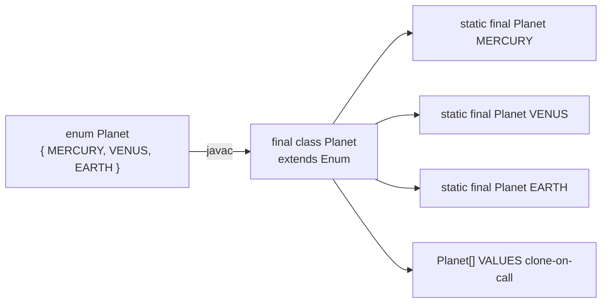
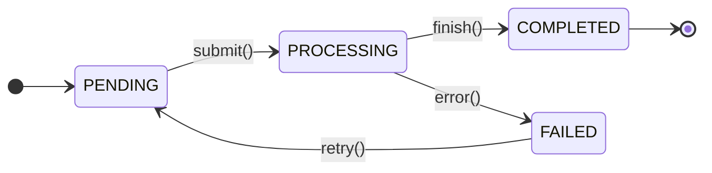
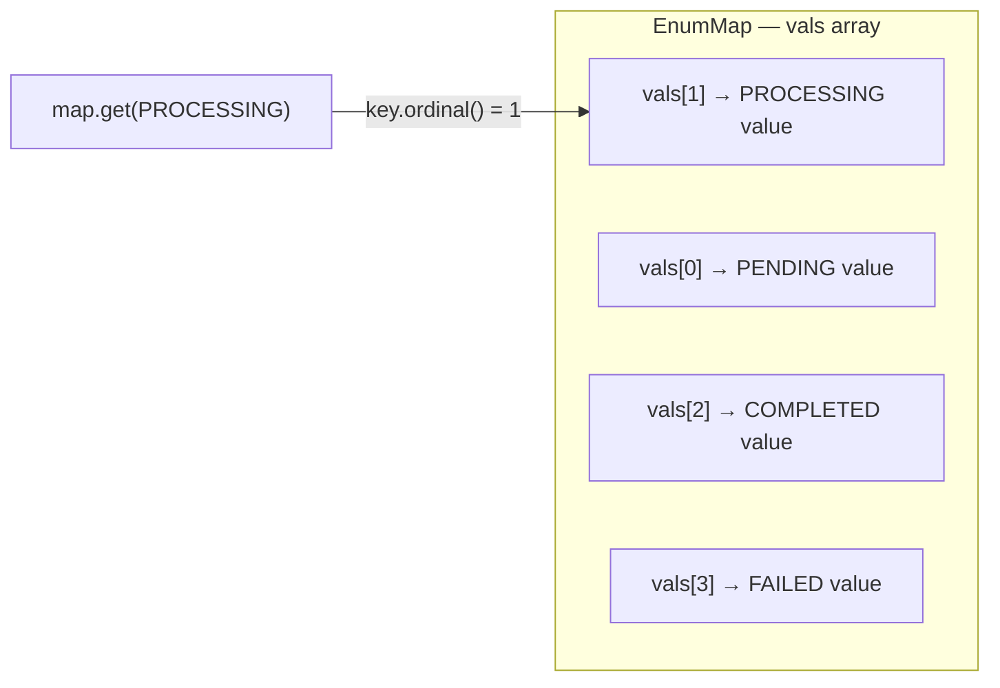
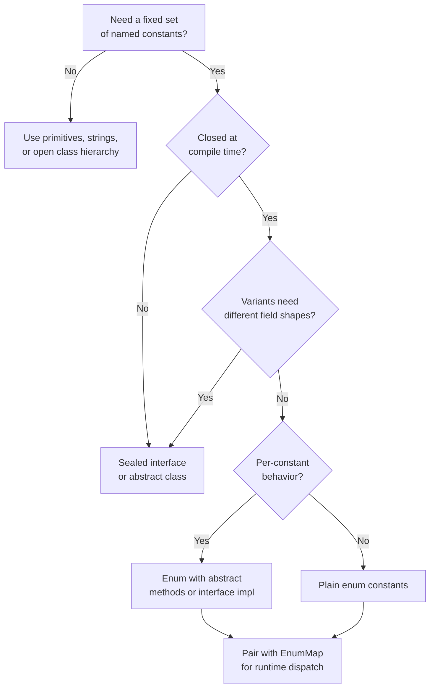

<!-- tldr -->
# Enums

In Java, an `enum` is syntactic sugar for a `final` class that extends `java.lang.Enum<E>`. Each constant is a `public static final` singleton instance, initialized in the class's static block. The compiler guarantees that no new instances can be created via `new` or reflection, and `switch` expressions over enums can be exhaustively checked. Because constants are true objects, they carry state, override methods, and implement interfaces.



<!-- standard -->

## What It Is

An enum declares a **closed, named set of constants** that are instances of the enum type itself. The JVM class-loader guarantees each constant is created exactly once. Unlike `public static final int` constants, enums are scoped, typed, and object-capable.

## Why It Matters

- **Type safety**: `void setDay(Day d)` cannot silently accept an arbitrary `int`.
- **Exhaustive switches**: Java 14+ `switch` expressions emit a compile error on missing cases; Java 21 pattern matching extends this to sealed hierarchies.
- **Namespace**: `Planet.EARTH` vs. leaking `EARTH` into a flat constant namespace.
- **Strategy pattern built-in**: Per-constant method overrides replace entire class hierarchies.

## Primary Techniques

| Technique | Use Case | Sketch |
|---|---|---|
| Plain constants | Fixed value sets | `enum Color { RED, GREEN, BLUE }` |
| Fields + constructor | Attaching metadata | `MERCURY(3.303e23, 2.44e6)` |
| Abstract methods | Per-constant behavior | `abstract double apply(double x, double y)` |
| Interface impl | Polymorphism / DI | `enum Op implements BinaryOperator<Double>` |
| `EnumSet` / `EnumMap` | High-perf collections | Bit-vector / array backed |

## Key Tradeoffs

- **Enums vs. sealed classes (Java 17+)**: Sealed classes allow structurally different subtypes (`Circle(radius)`, `Rectangle(w, h)`); enums enforce a flat, homogeneous constant set.
- **Enums vs. `int` constants**: `ordinal()` shifts when a constant is inserted; never use it as a stable key for persistence or logic.
- **`values()` clone overhead**: Each call allocates a fresh array copy — cache it as `private static final Day[] DAYS = Day.values()` in hot paths.
- **API surface growth**: Adding a constant to a published enum is a compatible change; removing one is binary-breaking.



<!-- deep -->

## JVM Internals

`javac` desugars `enum Op { PLUS, MINUS }` into approximately:

```java
public final class Op extends Enum<Op> {
    public static final Op PLUS  = new Op("PLUS",  0);
    public static final Op MINUS = new Op("MINUS", 1);
    private static final Op[] $VALUES = { PLUS, MINUS };

    private Op(String name, int ordinal) { super(name, ordinal); }

    public static Op[] values()            { return $VALUES.clone(); }
    public static Op valueOf(String name)  { return Enum.valueOf(Op.class, name); }
}
```

Key invariants the JVM enforces:
- **Singleton via `<clinit>`**: Constants are created in the static initializer; class loading is locked per class-loader.
- **Reflection lock**: `Constructor.newInstance()` throws `IllegalArgumentException` for enum types — making enum the safest singleton vehicle in Effective Java (Item 3).
- **Serialization safety**: `ObjectInputStream` resolves constants by name via an implicit `readResolve`; deserialization can never produce a second instance.

---

## EnumSet and EnumMap

### EnumSet

Backed by a single `long` bit-vector for enums with ≤64 constants (`RegularEnumSet`), or `long[]` for larger ones (`JumboEnumSet`).

- `add` / `contains` / `remove` → **O(1)** bit ops, ~1 ns per call.
- `EnumSet.allOf(Day.class)` sets all bits in one native instruction.
- **30–50% faster** than `HashSet<Day>` with zero allocation per operation.

### EnumMap

Array-backed: index = `key.ordinal()`. No hashing, no collision chains.

- `get` / `put` → **O(1)** array read/write, ~3 ns vs. ~20–30 ns for `HashMap`.
- Use as a **dispatch table** to replace large `if-else` chains keyed on an enum.



---

## Strategy Pattern via Abstract Methods

```java
public enum Operation {
    PLUS("+")   { @Override public double apply(double x, double y) { return x + y; } },
    MINUS("-")  { @Override public double apply(double x, double y) { return x - y; } },
    TIMES("*")  { @Override public double apply(double x, double y) { return x * y; } },
    DIVIDE("/") { @Override public double apply(double x, double y) { return x / y; } };

    private final String symbol;
    Operation(String symbol) { this.symbol = symbol; }

    public abstract double apply(double x, double y);

    @Override public String toString() { return symbol; }
}
```

Each constant compiles to an anonymous subclass of `Operation`. The JVM dispatches via vtable — identical cost to a classic strategy object, but with zero extra class files and exhaustiveness guarantees from `switch`.

---

## Real-World Usage

| System | Enum Usage |
|---|---|
| **JDK** | `TimeUnit`, `StandardOpenOption`, `DayOfWeek` |
| **Spring** | `HttpMethod`, `HttpStatus` |
| **Kafka** | `CompressionType`, `IsolationLevel`, `AclOperation` |
| **Hibernate / JPA** | `@Enumerated(EnumType.STRING)` — always `STRING` over `ORDINAL` |
| **Protobuf / gRPC** | Proto enums → Java enums; unknown values surface as `UNRECOGNIZED` |
| **DynamoDB SDK v2** | `RetryMode`, `SdkHttpMethod` |

---

## Failure Modes

### Ordinal-Based Persistence — Critical Bug

```java
// WRONG: inserting CANCELLED between PENDING and PROCESSING
// shifts every subsequent ordinal, corrupting stored data silently
@Enumerated(EnumType.ORDINAL)

// CORRECT: name string survives reordering and insertion
@Enumerated(EnumType.STRING)
```

### `valueOf` Throws, Not Returns Null

`Enum.valueOf(Status.class, "ACTIVE")` throws `IllegalArgumentException` for unknown names. Always wrap public-facing lookups:

```java
public static Optional<Status> fromString(String s) {
    try   { return Optional.of(valueOf(s.toUpperCase())); }
    catch (IllegalArgumentException e) { return Optional.empty(); }
}
```

### Static Initializer Ordering

Constants are initialized top-to-bottom in `<clinit>`. Forward references in a constructor cause a `NullPointerException`:

```java
enum Bad {
    A(B.name()),  // NPE — B is null here; not yet initialized
    B("b");
    Bad(String s) {}
}
```

### Non-Exhaustive Switch (Pre-Java 14)

`switch` **statements** silently fall through on unhandled constants added after the fact. Migrate to `switch` **expressions** (Java 14+) which require exhaustiveness, or throw explicitly in `default`.

---

## Performance Reference

| Operation | Cost | Notes |
|---|---|---|
| `EnumSet.contains()` | ~1 ns | Single bit AND |
| `EnumMap.get()` | ~3 ns | Direct array index |
| `HashMap<Enum,V>.get()` | ~20–30 ns | Hash + equality check |
| `values()` per call | ~5 ns + alloc | Returns a cloned array; cache it |
| `Enum.valueOf()` | O(n) table scan | Binary search over `$VALUES` |
| `switch` expression (enum) | ~1–2 ns | JIT emits a tableswitch bytecode |

---

## Interview Pitfalls

1. **"Can you extend an enum?"** — No; `enum` compiles to `final`. You can implement interfaces.
2. **"How does enum serialization differ from class serialization?"** — Resolved by name via implicit `readResolve`; you cannot deserialize a duplicate instance regardless of `transient` or custom `writeObject`.
3. **"When would you use a sealed interface over an enum?"** — When each variant requires distinct fields (e.g., `sealed interface Shape` with `record Circle(double r)` and `record Rectangle(double w, double h)`).
4. **"What does `ordinal()` return?"** — Declaration-order index, starting at 0. Should **never** be stored or used for logic — use a stable explicit field.
5. **"How is an enum singleton safer than a private-constructor singleton?"** — Protected against reflection (`AccessibleObject.setAccessible` is blocked) and against deserialization attacks (no second instance possible).

---

## Decision Rubric



**Reach for an enum when** the value set is known at compile time, closed to external extension, and its constants are semantically equivalent in structure. The moment variants diverge in shape or you need open extensibility, promote to a sealed type or a full class hierarchy.