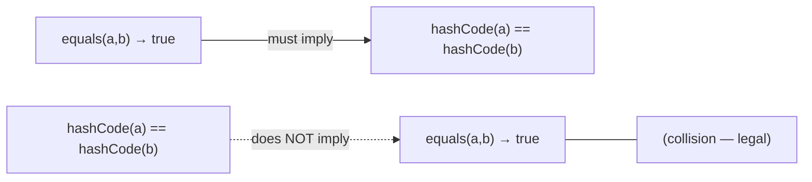
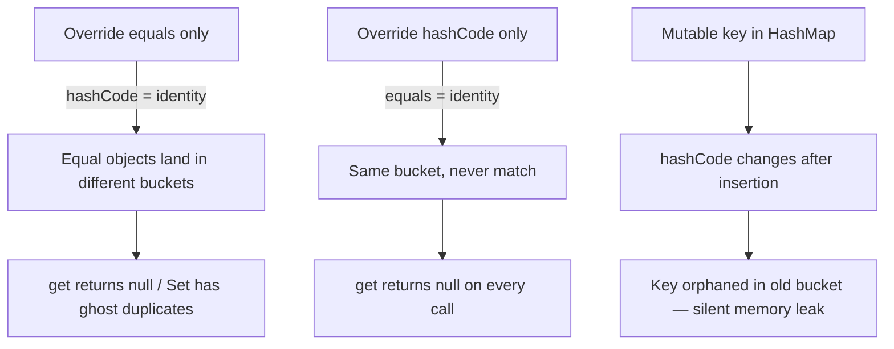
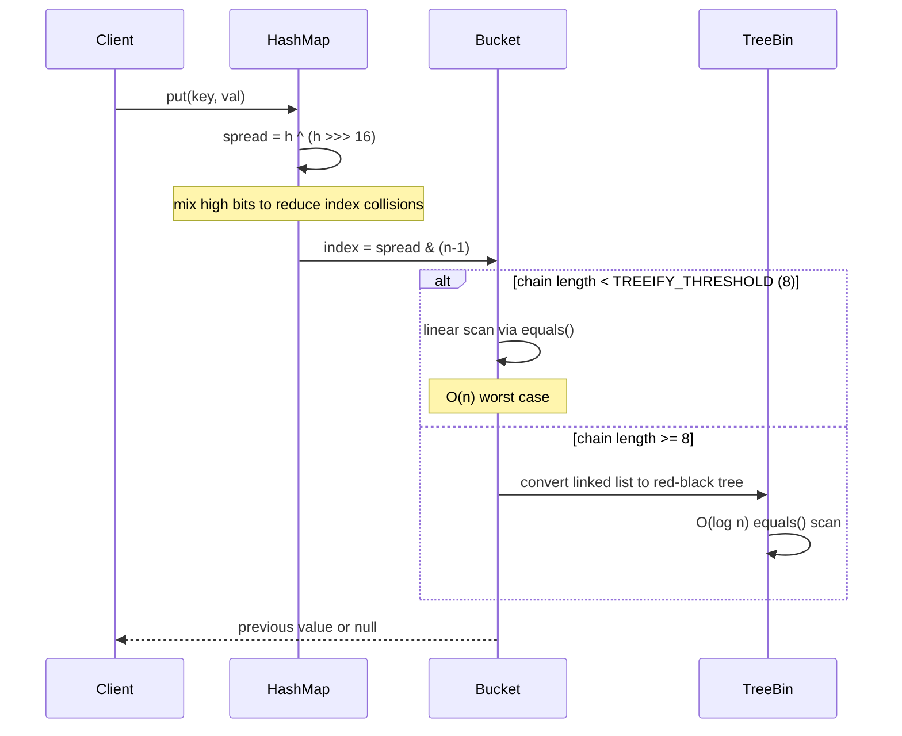

<!-- tldr -->
# `equals` & `hashCode` Contract

The JVM contract states: if `a.equals(b)` returns `true`, then `a.hashCode()` **must** equal `b.hashCode()`—but not the reverse. Hash-based collections (`HashMap`, `HashSet`, `ConcurrentHashMap`) use `hashCode` to find a bucket and `equals` to confirm identity within it. Breaking either half silently corrupts lookups with no exception thrown.



<!-- standard -->

## What It Is

`equals` defines **logical equality**; `hashCode` produces a **numeric fingerprint** for O(1) bucketing. Every hash-based structure performs a two-phase lookup: narrow to a bucket via `hashCode`, then confirm identity via `equals`. Both halves must be consistent or the structure silently misbehaves.

### The Five `equals` Properties

| Property | Requirement |
|---|---|
| Reflexive | `x.equals(x) == true` |
| Symmetric | `x.equals(y) == y.equals(x)` |
| Transitive | `x.equals(y) && y.equals(z)` → `x.equals(z)` |
| Consistent | Same result if state unchanged |
| Null-safe | `x.equals(null) == false` always |

### `hashCode` Rules

- Must return the same value when equals-participating fields have not changed.
- Equal objects **must** have equal hash codes (the contract).
- Unequal objects **should** have different hash codes; collisions are legal but degrade O(1) to O(n).

### Implementation Strategies

- **`Objects.hash(f1, f2, ...)`** — idiomatic since Java 7; slight boxing overhead for primitives.
- **Bloch's manual recipe** — `result = 31 * result + field.hashCode()` per field; zero boxing, JIT-friendly.
- **Lombok `@EqualsAndHashCode`** — annotation-driven; supports `callSuper` and `exclude`.
- **Java Records (16+)** — compiler synthesises correct, field-based implementations automatically; the canonical choice for value types.

### Critical Tradeoffs



- **Mutable keys**: mutating a field used by `hashCode` after insertion orphans the key in its original bucket; `get()` returns `null`, `containsKey()` returns `false`, and the entry leaks.
- **hashCode always returning 0**: technically contract-legal; reduces every `HashMap` to a linked-list scan—O(n) per operation.
- **Inheritance + symmetry**: adding a field to `equals` in a subclass makes it impossible to satisfy both symmetry and the Liskov Substitution Principle simultaneously. Use composition instead.
- **Arrays**: `array.equals(other)` uses identity; use `Arrays.equals()` / `Arrays.hashCode()` for content-based semantics.

---

<!-- deep -->

## Deep Dive: Algorithms, Failure Modes & Interview Patterns

### The Bloch Hash Formula

```java
// Effective Java, 3rd ed., Item 11
@Override
public int hashCode() {
    int result = Short.hashCode(areaCode);      // seed with first significant field
    result = 31 * result + Short.hashCode(prefix);
    result = 31 * result + Short.hashCode(lineNum);
    return result;
}
```

**Why 31?** Odd prime; JIT replaces `31 * i` with `(i << 5) - i`—one shift and one subtract. Even multipliers risk information loss on overflow (right-shifted bits vanish).

**Per-type hash contributions:**

| Field Type | Recommended Contribution |
|---|---|
| `int` | `value` |
| `long` | `(int)(value ^ (value >>> 32))` |
| `float` | `Float.floatToIntBits(value)` |
| `double` | `Double.doubleToLongBits(value)`, then long formula |
| `boolean` | `value ? 1231 : 1237` |
| `Object` | `Objects.hashCode(ref)` (null-safe) |
| `T[]` | `Arrays.hashCode(arr)` / `Arrays.deepHashCode` for nested |

### HashMap Internals (Java 8+)



**Sizing math:**
- Default initial capacity: **16** buckets, load factor **0.75** → first resize at **12** entries.
- Each resize doubles capacity; resizes are O(n) but amortised O(1) per insertion.
- Treeification at **≥ 8** chain length; untreeify at **≤ 6** (hysteresis prevents thrashing).
- At 1 M entries with a good hash: average **< 2 probes** per lookup, P99 **< 200 ns**.
- At 1 M entries with `hashCode` returning `0`: every lookup scans the full chain → **~500 µs** per `get`—a **2,500× regression**.

### Real-World Systems

#### Hibernate / JPA First-Level Cache

Hibernate tracks entities in a `Session` cache keyed by `(EntityType, id)`. If you write `hashCode` based on mutable business fields instead of the surrogate PK, entities added to a `Set<MyEntity>` before `flush()` (when `id == null`) hash to a different bucket after `flush()` (when `id` is assigned). Canonical safe pattern:

```java
@Override
public boolean equals(Object o) {
    if (this == o) return true;
    if (!(o instanceof MyEntity other)) return false;
    return id != null && id.equals(other.getId()); // null-id objects are never equal
}

@Override
public int hashCode() {
    return getClass().hashCode(); // stable; id-independent
}
```

#### `ConcurrentHashMap` (Java 8+)

Uses CAS + per-bin `synchronized` instead of a global lock. A `hashCode` returning a different value on each call (e.g., based on `System.currentTimeMillis()`) causes `get` to probe a different bin every time → permanent cache miss for any key, effectively a correctness bug at any QPS.

#### Guava `Equivalence<T>`

Lets you inject custom `equals`/`hashCode` semantics into `Maps.newCustomHashMap`. Use when you need reference-identity keying for a cache while domain `equals` is value-based (e.g., per-instance throttle counters).

#### Protobuf-Generated Java Classes

All generated message classes override `equals` and `hashCode` across all fields. They memoize `hashCode` in a cached `int` field (reset to `0` on mutation) to amortise the cost for large messages passed as map keys.

### Failure Modes Catalogue

| Failure | Root Cause | Observable Symptom |
|---|---|---|
| Key lost post-mutation | Equals-field mutated while key is in map | `get()` → `null`; entry leaks memory |
| Ghost duplicates in `Set` | `equals` overridden, `hashCode` not | `set.size()` grows past logical cardinality |
| Symmetric violation | Subclass adds field to `equals`, parent ignores it | `p.equals(cp) != cp.equals(p)` |
| `NaN` inequality | `double == double` is `false` for `NaN` | Two "equal" objects fail `equals` on NaN fields |
| O(n) map | `hashCode()` returns constant | P99 latency spikes linearly with map size |
| Array identity trap | `arr.equals(other)` uses `Object.equals` | Structurally identical arrays treated as unequal |

### The Symmetry–LSP Trap (Effective Java §10)

```java
class Point       { int x, y; }
class ColorPoint  extends Point { Color color; }

// ColorPoint.equals checks color; Point.equals does not.
point.equals(colorPoint)      // → true  (ignores color)
colorPoint.equals(point)      // → false (type/color mismatch)
// SYMMETRY VIOLATED ❌ — no fix exists within inheritance
```

**Fix**: make `ColorPoint` hold a `Point` field via composition and expose a `asPoint()` view. You cannot add a significant value component to a subclass while preserving the `equals` contract.

### Interview Pitfalls

1. **"What breaks if you only override `equals`?"**
   Expected: `hashCode` defaults to identity hash (`System.identityHashCode`); two logically equal objects land in different buckets; `HashSet`/`HashMap` silently malfunction.

2. **"Can unequal objects share a hash code?"**
   Yes—collisions are legal. The contract is strictly one-directional: `equals → same hash`, never the reverse.

3. **"Is a mutable object a safe `HashMap` key?"**
   Only if the fields used in `hashCode`/`equals` are immutable or guaranteed not to mutate while the key is resident in the map.

4. **"How does Java 8 guard against HashDoS?"**
   Treeification at chain length ≥ 8 bounds worst-case lookup to O(log n) even with all keys colliding. Java does **not** randomise `String.hashCode` by default (unlike Python's PYTHONHASHSEED).

5. **"How do you hash a `double` field correctly?"**
   `Double.doubleToLongBits(value)` then fold the long; handles `NaN` consistently because all NaN bit patterns collapse to the canonical `NaN` bits.

6. **"`Arrays.hashCode` vs `array.hashCode`"**
   `array.hashCode()` delegates to `Object.hashCode()` (identity-based). Always use `Arrays.hashCode(arr)` for content hashing; `Arrays.deepHashCode` for multi-dimensional arrays.

### Decision Rubric: Which Implementation?

| Situation | Recommendation |
|---|---|
| Pure value type, Java 16+ | `record` — correct by construction |
| JPA entity with surrogate PK | `equals` on PK only; `hashCode` returns `getClass().hashCode()` |
| Immutable value class pre-Java 16 | Full field-based `equals` + Bloch hashCode; cache `hashCode` in constructor |
| Performance-critical cache key | Precompute and store hash in constructor field |
| Need identity semantics in a value-equality world | Guava `Equivalence.identity()` wrapper |
| Rapid iteration / legacy code | Lombok `@EqualsAndHashCode(onlyExplicitlyIncluded = true)` |