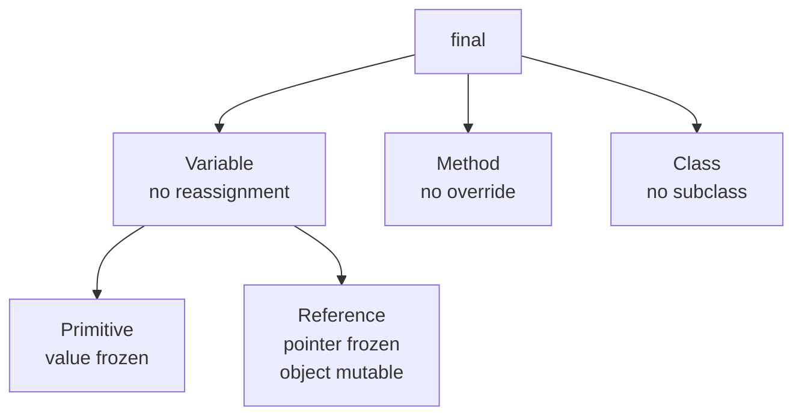
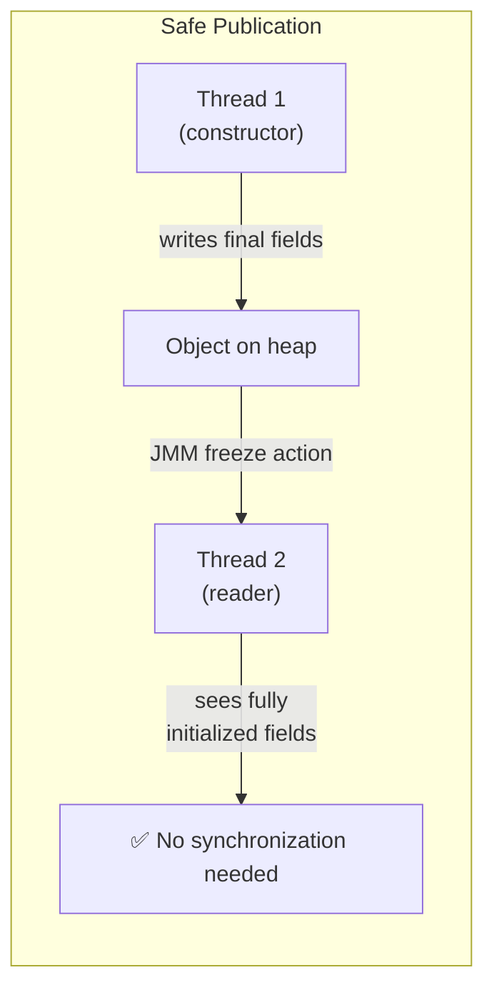
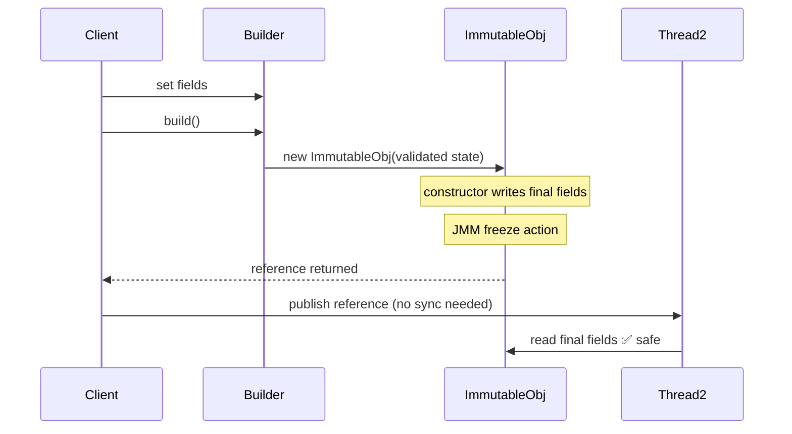
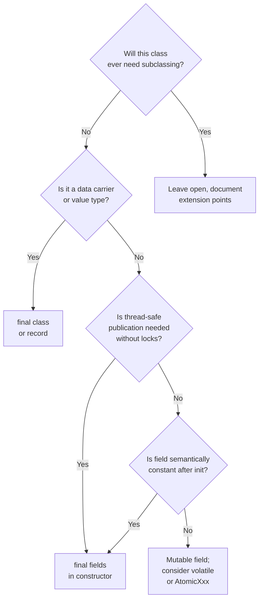

<!-- tldr -->
# The `final` Keyword in Java

`final` is Java's compile-time contract for "this will not change." Applied to a variable it prevents reassignment; to a method it blocks overriding; to a class it forbids subclassing. The JVM and JIT exploit these guarantees for inlining, escape analysis, and safe publication in concurrent code.



<!-- standard -->

## What It Is

`final` is a non-access modifier with three distinct semantics depending on where it appears.

| Target | Effect | Runtime Cost |
|---|---|---|
| Local variable / parameter | Compile-time; prevents reassignment; useful self-documentation | None |
| Instance / static field | Field must be assigned exactly once (constructor or initializer) | None; enables JIT inlining |
| Method | JVM can inline call sites; subclass cannot override | None |
| Class | No subclasses permitted; all methods implicitly final | None |

## Why It Matters

- **Immutability foundation.** A truly immutable object requires all fields to be `final` *and* their referenced objects to be immutable. One without the other is incomplete.
- **Safe publication.** The Java Memory Model (JMM, JLS §17.5) guarantees that `final` fields written in a constructor are **visible to all threads** without synchronization, *provided* the reference does not escape during construction.
- **JIT optimization.** HotSpot can devirtualize and inline `final` method calls, eliminating vtable dispatch overhead — critical in tight loops.
- **API contracts.** `final` class signals "not designed for inheritance" (Effective Java Item 19), preventing Liskov violations and fragile base-class bugs.

## Key Tradeoffs

- **Testability vs. safety.** Mocking frameworks (Mockito < 2.x) could not mock `final` classes; Mockito 2+ uses a subclass agent but adds overhead. Power trade-off: immutability vs. easy faking in tests.
- **Reference vs. value freeze.** A `final List<String> list` still allows `list.add(...)`. Shallow freeze is a common trap.
- **Inheritance flexibility.** Premature `final` on a class forces composition-over-inheritance even when inheritance would be appropriate.



<!-- deep -->

## Deep Dive

### Variables: Three Flavors

#### 1. Local Variables & Parameters
The compiler enforces definite assignment. Useful as readable intent markers and required for use inside lambda / anonymous inner class bodies (effectively final suffices since Java 8).

```java
void process(final String input) {
    // input = "other"; // CE: cannot assign to final parameter
    Runnable r = () -> System.out.println(input); // legal
}
```

#### 2. Instance Fields — JMM Guarantee
JLS §17.5: After an object's constructor completes, any thread that reads the reference *after construction* is guaranteed to see the correctly initialized value of all `final` fields — even without `volatile` or `synchronized`. This is the safe-publication idiom.

**The escape-during-construction trap:**
```java
class Broken {
    final int x;
    static Broken instance;
    Broken() {
        instance = this; // 'this' escapes before final field is written
        x = 42;
    }
}
```
Another thread reading `instance.x` before the constructor finishes may see `0`.

#### 3. Static Final Fields
JVM loads and initializes class statics once (class loading lock). `static final` constants are inlined by `javac` into call sites (constant folding), meaning bytecode at the use site embeds the literal — no field read at runtime.

### Methods: Devirtualization

The JIT uses two strategies:
- **Monomorphic inline cache (MIC):** Even non-final methods get inlined speculatively if the JIT sees only one concrete type at a call site.
- **`final` guarantee:** Removes the need for a type check guard on the inlined code path. On a `final` method the JIT can omit the deoptimization stub entirely.

Benchmark ballpark: a tight loop invoking a `final` method vs. a virtual dispatch through an interface can differ by **5–20 ns/call** on modern x86, meaningful at 10M+ QPS.

### Classes: Real-World Usage

| Class | Reason |
|---|---|
| `java.lang.String` | Immutability; security (class loaders, reflection); interning |
| `java.lang.Integer` (all wrappers) | Value-type semantics; caching (-128..127) |
| `java.util.Optional` | Prevent misuse via inheritance |
| `java.lang.Math` | Pure utility; no state to extend |
| Record classes (Java 16+) | Implicitly final |

### Concurrency: `final` vs. `volatile`

| Property | `final` | `volatile` |
|---|---|---|
| Guarantees visibility | ✅ (post-construction) | ✅ (every read/write) |
| Allows mutation after init | ❌ | ✅ |
| Prevents reordering | Freeze action at end of ctor | Full memory fence each access |
| Use case | Immutable objects | Mutable shared flags / counters |

`volatile final` is a compile error — they are mutually exclusive.

### Failure Modes & Pitfalls

1. **Mutable field content.** `final Map<K,V>` is not thread-safe. Wrap with `Collections.unmodifiableMap` or use `ImmutableMap`.
2. **Serialization.** `final` fields can be set by the JVM during deserialization via `ObjectInputStream` native reflection — surprising but spec-compliant.
3. **Reflection bypass.** `Field.setAccessible(true)` + `field.set(...)` can mutate `final` fields (except those that were constant-folded). This is undefined behavior per JLS.
4. **Premature class finalization.** Library classes marked `final` cannot be wrapped with delegation at the proxy level (Byte Buddy, cglib) without an agent — causes friction with frameworks like Spring AOP.
5. **`final` parameter ≠ caller protection.** `final` on a method parameter is *local* to the callee; the caller's variable is unaffected.

### Capacity & Performance Numbers

- **Bytecode size:** A `static final int CONST = 42` emits a `LDC` (or `BIPUSH/SIPUSH/ICONST`) at each use rather than `GETSTATIC` — saves ~1 bytecode per read, relevant in hot inner loops.
- **JIT inline depth:** HotSpot default inline limit is 35 bytecodes. Marking a method `final` raises compiler confidence but does not change the bytecode size limit.
- **String interning:** `String` being `final` allows the JVM to safely intern without identity confusion — the intern pool would be unsound if subclasses could override `equals`/`hashCode`.

### Architecture: Immutable Value Object Pattern



### Interview Pitfalls

- **"Is `final` the same as `const` in C++?"** No — C++ `const` can be cast away (`const_cast`); Java `final` on a reference only freezes the pointer, not the object graph.
- **"Does `final` improve performance?"** Only measurably for method inlining at high call frequencies. Over-applying it for performance alone is premature optimization.
- **"Can you make an immutable class without `final`?"** A class without `final` can be subclassed and state introduced indirectly. Item 17 of Effective Java explicitly requires `final` class *or* private constructors with factory methods.
- **Records vs. manual immutability.** Java 16+ records are implicitly `final` with implicitly `final` fields. Prefer records for plain data carriers; they also generate correct `equals`/`hashCode`/`toString`.

### When to Reach for `final`



**Decision rubric:**
- Default all local variables and parameters to `final` — zero cost, high signal.
- Mark a class `final` whenever it's a value type, utility class, or security-sensitive class.
- Always use `final` fields in objects meant to cross thread boundaries without synchronization.
- Avoid `final` on methods in abstract classes meant as extension points (defeats the purpose).