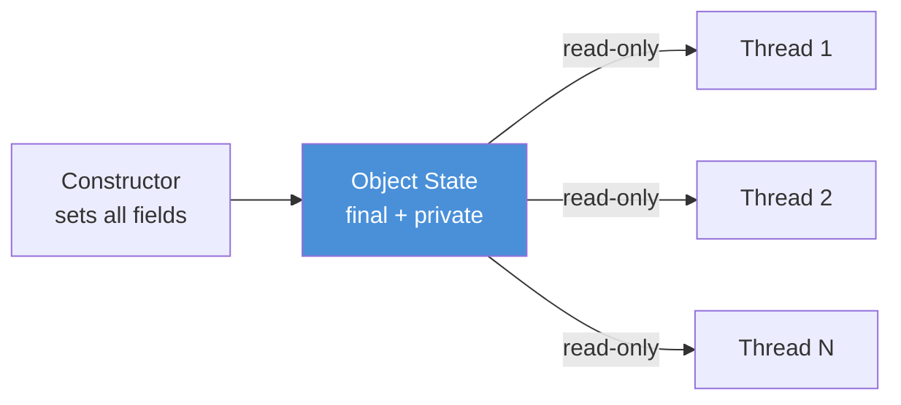
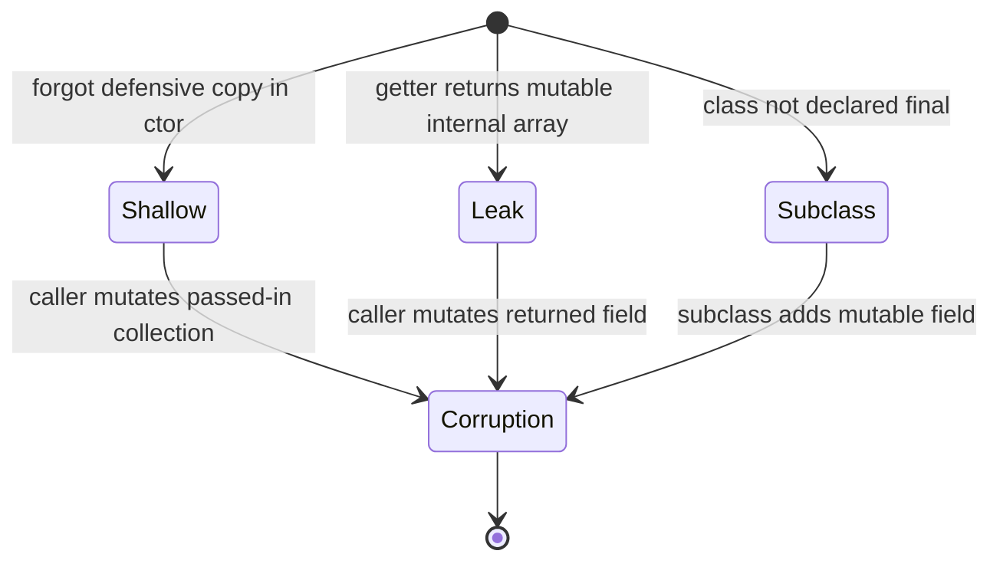

<!-- tldr -->
# Immutable Classes

An immutable object's state is fixed at construction time and never changes. This eliminates the need for defensive copying, locking, or visibility fences when sharing across threads. In Java, `String`, `Integer`, and `BigDecimal` are the canonical examples — the JVM itself bets its intern pool on their immutability.



<!-- standard -->

## What It Is

An immutable class guarantees that every field is set exactly once — during construction — and is never mutated afterward. Callers share references freely because there is no mutable shared state to race on.

## Why It Matters

- **Thread safety for free** — no `synchronized`, no `volatile`, no `ReentrantLock` needed.
- **Safe caching & interning** — `String.intern()`, `Integer` cache (-128 to 127), `Path` objects.
- **Value semantics** — equality by content, not identity; works correctly as `HashMap` key or `HashSet` element.
- **Failure atomicity** — a partially constructed object is never visible; either construction succeeds or you have nothing.

## The Java Recipe

1. Declare the class `final` (prevent subclass mutation).
2. Make all fields `private final`.
3. No setters.
4. Deep-copy mutable inputs in the constructor.
5. Return defensive copies (or unmodifiable views) from getters that expose mutable types.
6. If extending is required, use a private constructor + static factory.

## Key Tradeoffs

| Concern | Immutable | Mutable |
|---|---|---|
| Thread safety | ✅ Built-in | ❌ Requires explicit locking |
| Memory | ⚠️ New object per change | ✅ In-place update |
| Cache/hash key | ✅ Safe | ❌ Dangerous if key mutates |
| Builder pattern needed | Sometimes | Rarely |
| GC pressure | Higher | Lower |

## Common Pitfall: Shallow Immutability

```java
// BROKEN — array is mutable
public final class Broken {
    private final int[] data;
    public Broken(int[] d) { this.data = d; }      // leaks reference
    public int[] getData() { return data; }          // exposes internals
}

// FIXED
public final class Fixed {
    private final int[] data;
    public Fixed(int[] d) { this.data = Arrays.copyOf(d, d.length); }
    public int[] getData() { return Arrays.copyOf(data, data.length); }
}
```

---

<!-- deep -->

## Deep Dive: Immutable Classes in Production Systems

### The Java Memory Model Guarantee

JDK 5+ (JSR-133) gives **final field freeze** semantics: all writes to `final` fields in a constructor are guaranteed visible to any thread that obtains a reference to the object *after* the constructor completes — **without any synchronization**. This is not true for non-final fields.

```
happens-before chain:
  [write final fields in ctor] --freeze--> [object reference publication] --hb--> [read final fields]
```

This means a safely published immutable object (e.g., stored in a `volatile`, `AtomicReference`, or passed through a `java.util.concurrent` collection) is fully visible to all readers with zero locking overhead.

### Implementing a Correct Immutable Class

```java
public final class Money {
    private final long amount;          // cents
    private final Currency currency;    // Currency is itself immutable
    private final List<String> tags;    // List is mutable — must defend

    public Money(long amount, Currency currency, List<String> tags) {
        this.amount   = amount;
        this.currency = Objects.requireNonNull(currency);
        this.tags     = List.copyOf(tags);           // JDK 10+, unmodifiable snapshot
    }

    public Money add(Money other) {
        if (!currency.equals(other.currency)) throw new IllegalArgumentException();
        return new Money(amount + other.amount, currency, tags); // new object; no mutation
    }

    public List<String> getTags() { return tags; }   // List.copyOf result is already unmodifiable
}
```

### Real-World Systems That Depend on Immutability

| System | Usage |
|---|---|
| **Java `String`** | Intern pool, `HashMap` key safety, class loading |
| **Kafka `RecordMetadata`** | Returned to producers after send; shared across callbacks |
| **Cassandra `Token`** | Ring position objects shared across ring-traversal threads |
| **Guava `ImmutableMap/List`** | Zero-copy sharing of config/reference data at 1M+ QPS |
| **Project Loom (virtual threads)** | Encourages immutable message passing over shared-state concurrency |
| **Akka / Pekko actors** | Messages *must* be immutable; actor mailboxes assume no shared mutation |
| **DynamoDB SDK v2** | Request/response POJOs are immutable builders — safe to cache and retry |

### Performance Characteristics

- **Allocation rate**: a `String` concatenation loop (`s += x`) creates O(n²) bytes — use `StringBuilder`. Similarly, a tight loop mutating a `BigDecimal` chain is 10–100× slower than equivalent `long` arithmetic.
- **GC impact**: short-lived immutable objects (e.g., per-request `Money` wrappers) are cheap on modern generational GCs — eden allocation cost is ~1–2 ns; minor GC at 100 GB/day throughput adds < 5 ms pause with G1.
- **L1 cache friendliness**: small immutable value objects (≤ 64 bytes) fit a cache line; Java 16+ `record` types encourage this layout.

### Failure Modes



1. **Shallow copy in constructor** — caller retains a reference to the mutable object passed in and later mutates it.
2. **Getter returns internal mutable reference** — common with `Date`, `byte[]`, `int[]`.
3. **Non-final class** — a subclass can shadow a `final` field with a mutable one and override a method.
4. **Serialization backdoor** — `ObjectInputStream.readObject()` bypasses the constructor; add `readResolve()` or use `record` (serialization-safe by default).
5. **Reflection** — `Field.setAccessible(true)` can break immutability; relevant in frameworks. Mitigated by Java modules with strong encapsulation.

### Architecture: Immutable Event Sourcing Flow

```mermaid
sequenceDiagram
    participant C  as Command Handler
    participant ES as Event Store (Kafka)
    participant P  as Projection
    participant Q  as Query Cache

    C->>ES: publish ImmutableEvent(id, payload, timestamp)
    Note over ES: Event is final; never updated
    ES->>P: deliver ImmutableEvent (offset 42)
    P->>Q: upsert read model snapshot
    Q-->>P: ack
    P-->>ES: commit offset 42
    Note over Q: Cache holds immutable event refs — no copy needed
```

### Capacity / Latency Numbers to Drop in an Interview

- `String.intern()` lookup: ~50–100 ns; pool contention above 10M unique strings causes GC pressure.
- `Collections.unmodifiableList()` wrapper: 0 copy, 1 extra indirection (negligible).
- `List.copyOf()` on a 10k-element list: ~10 µs — acceptable for config, avoid in hot path (< 1 µs budget).
- Contended `ReentrantLock` P99 under heavy load: 5–50 µs. Replacing with an immutable + lock-free reference cuts this to < 100 ns.

### Java `record` — Immutability in One Line

```java
public record Point(double x, double y) {}   // final class, final fields, canonical ctor, equals/hashCode/toString
```

Records are **shallowly immutable** by construction. Deep immutability still requires `List.copyOf()` for collection components.

### Interview Pitfalls

| Question | Wrong Answer | Right Answer |
|---|---|---|
| "Is `String` truly immutable?" | "Yes, always." | "Yes, but `String` holds a `char[]`/`byte[]` internally; reflection or `Unsafe` can mutate it — don't." |
| "Can you make a subclass of an immutable class immutable?" | "Just add `final` fields." | "Seal the hierarchy with `final` class or use a `sealed` interface; a non-final parent is a broken contract." |
| "How do you share a large immutable dataset at 1M QPS?" | "Deep copy on each read." | "One canonical reference in an `AtomicReference<ImmutableMap>`; swap atomically on update — zero locking, zero copy." |
| "What breaks immutability in serialization?" | "Nothing." | "`readObject()` bypasses the constructor; implement `readResolve()` or use `record`." |

### When to Reach for Immutable Classes

**Use immutability when:**
- The object is a value (money, coordinates, IP address, config snapshot).
- The object will be used as a `Map` key or `Set` element.
- The object crosses a thread boundary or is published to an `Executor`.
- You need safe caching without explicit locking (e.g., Guava `LoadingCache`).

**Reconsider when:**
- You have a hot path generating > 500k objects/sec and profiling shows GC is the bottleneck — consider object pooling or mutable builders that produce a final sealed object.
- The object genuinely models accumulated state (e.g., a running `Histogram` or ring buffer) — use thread-safe mutable alternatives (`LongAdder`, `ConcurrentLinkedDeque`).