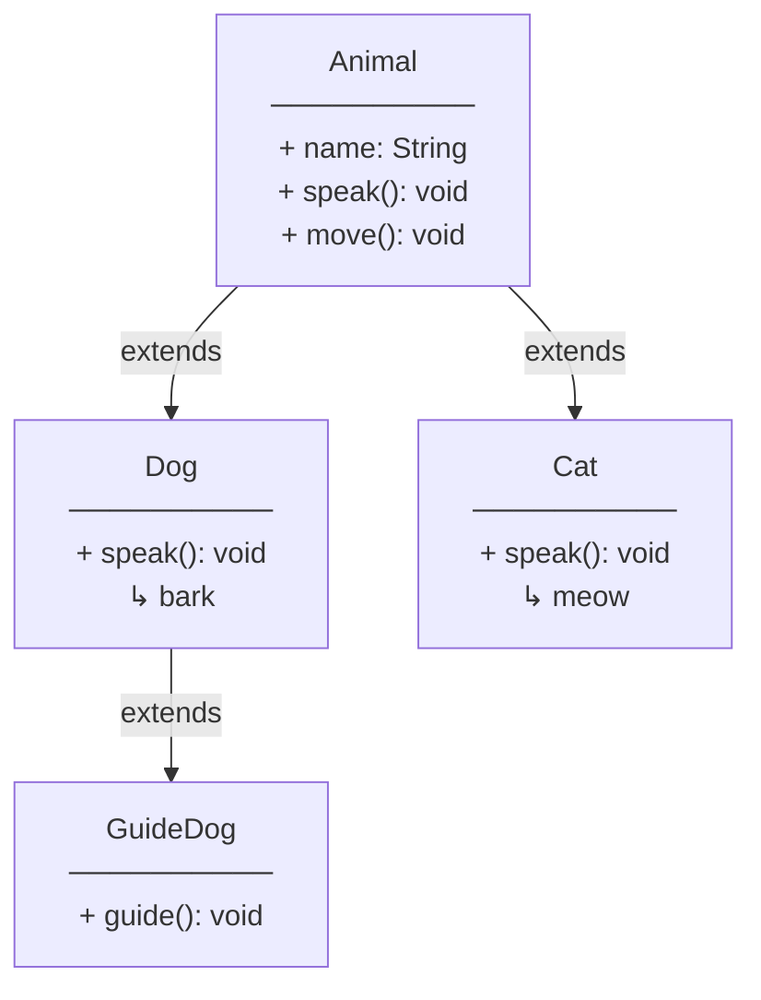
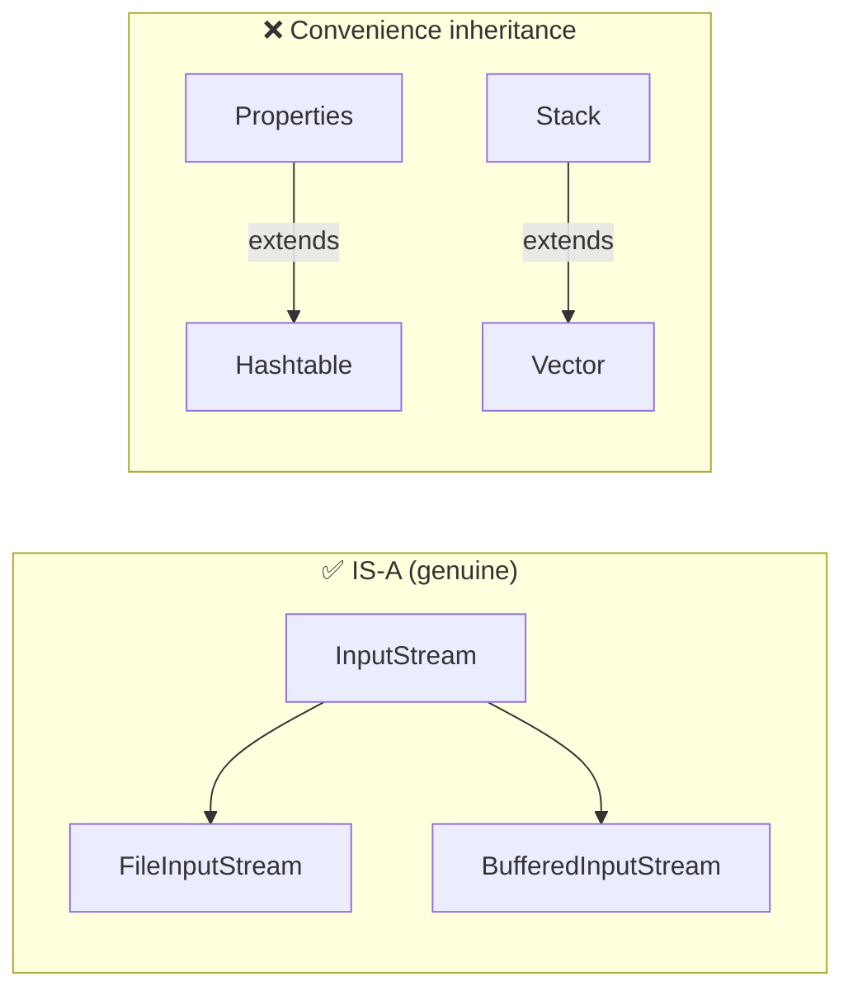
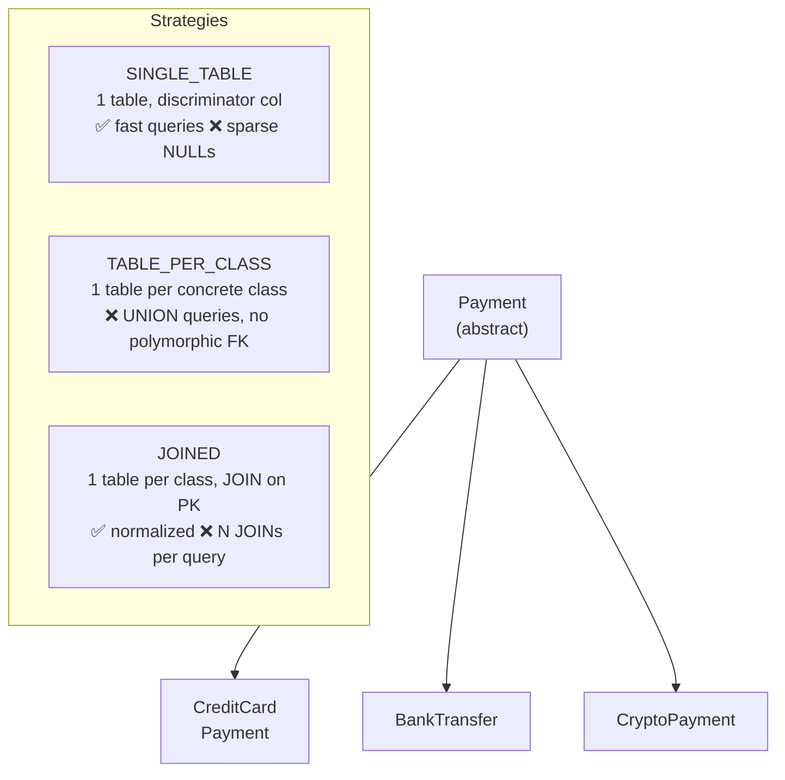

<!-- tldr -->
# Inheritance

Inheritance models an IS-A relationship: a subclass acquires the fields and methods of its superclass and may override or extend them. Java supports single-class inheritance (`extends`) and multiple-interface inheritance (`implements`), deliberately avoiding the diamond problem at the class level. The JVM resolves overridden methods at runtime via virtual dispatch (invokevirtual), enabling polymorphism. At scale, misuse of inheritance is one of the most common sources of rigid, fragile codebases.



<!-- standard -->

## What It Is

Inheritance allows `class Dog extends Animal` to inherit all non-private members of `Animal`. Java uses a single-root hierarchy — every class implicitly extends `java.lang.Object`. Interfaces may extend multiple interfaces; a class may implement multiple interfaces, enabling a safe form of multiple inheritance for behavior (default methods) without state conflicts.

## Why It Matters

- **Code reuse** — shared logic lives in one place; subclasses inherit without copying.
- **Polymorphism** — a `List<Animal>` can hold `Dog` and `Cat`; callers don't need to know the concrete type.
- **Framework contracts** — Spring, JPA, and the JCF (Java Collections Framework) are built on deep inheritance hierarchies that engineers must navigate daily.

## Primary Techniques

| Mechanism | Keyword | When to Use |
|---|---|---|
| Class inheritance | `extends` | Share state + behavior; strict IS-A |
| Abstract class | `abstract class` | Partial implementation; template method pattern |
| Interface (pre-Java 8) | `implements` | Pure contract; no state |
| Default methods | `interface` + `default` | Backward-compatible API evolution |
| `final` class/method | `final` | Prevent extension; security, immutability |

## Key Tradeoffs

- **Tight coupling** — subclasses are coupled to superclass internals; a `protected` field change breaks every child.
- **Fragile base class** — adding a method to a base class can silently break a subclass that happened to define the same signature.
- **Encapsulation erosion** — `protected` leaks internals into the inheritance tree.
- **Liskov Substitution (LSP)** — every subclass must honor the superclass contract. Violating LSP (e.g., a `Square extends Rectangle` that breaks `setWidth`) causes subtle bugs at call sites that receive a base-type reference.
- **Composition is usually better** — "favor composition over inheritance" (Effective Java, Item 18) unless the IS-A relationship is genuine and stable.



> `java.util.Properties extends Hashtable` and `Stack extends Vector` are canonical JDK examples of convenience inheritance gone wrong — they expose methods that violate the semantic contract.

<!-- deep -->

## Deep Dive: Inheritance in Production Java Systems

### Virtual Dispatch & the JVM

Every non-`final`, non-`static`, non-`private` method call compiles to `invokevirtual`. The JVM resolves the concrete method at runtime using the **vtable** (virtual method table) — a per-class array of method pointers built during class loading.

```
invokevirtual lookup:
  1. Load receiver object reference from operand stack
  2. Read klass pointer from object header (mark word + klass word, 8–16 bytes)
  3. Index into vtable at compile-time-resolved slot
  4. Jump to resolved method entry point
```

**Cost:** A monomorphic call site (single concrete type seen by JIT) gets inlined — effectively 0 overhead. A **bimorphic** site (2 types) gets an inline cache. A **megamorphic** site (≥3 types) falls back to vtable dispatch: ~3–5 ns vs ~0.5 ns for a direct call. At 10M calls/sec this is measurable (~25–45 ms/sec of dispatch overhead). HotSpot's C2 JIT aggressively de-virtualizes and inlines monomorphic/bimorphic sites.

### Constructor Chaining & Initialization Order

```
new Dog("Rex")
  └─▶ Dog() constructor body begins
        └─▶ implicit super() → Animal()
              └─▶ implicit super() → Object()
              ←─ Object.<init> returns
           Animal instance initializers + Animal fields
        ←─ Animal() returns
     Dog instance initializers + Dog fields
  ←─ Dog() returns
```

**Pitfall:** Calling an overridable method from a superclass constructor invokes the *subclass* override before the subclass fields are initialized. The override sees `null` / `0` defaults.

```java
// BROKEN
class Animal {
    Animal() { speak(); }          // calls Dog.speak() before Dog is ready
}
class Dog extends Animal {
    private final String name = "Rex";
    @Override void speak() { System.out.println(name.toUpperCase()); } // NPE
}
```

**Fix:** Never call overridable methods from constructors. Use `final` methods or factory methods instead.

### Abstract Classes vs. Interfaces — Decision Matrix

| Criterion | Abstract Class | Interface |
|---|---|---|
| State (fields) | ✅ Yes | ❌ No (only `static final`) |
| Constructor | ✅ Yes | ❌ No |
| Multiple inheritance | ❌ Single parent | ✅ Multiple |
| Access modifiers | Any | `public` / package (Java 9+: `private`) |
| Default implementation | ✅ Full | ✅ `default` only |
| Versioning / evolution | Hard (breaks subclasses) | Easier with `default` |

**Rule of thumb:** Use an abstract class when you need shared mutable state or a template method skeleton. Use an interface for contracts that multiple unrelated classes should satisfy.

### Real-World Systems

#### Spring Framework
`AbstractApplicationContext` → `AbstractRefreshableApplicationContext` → `ClassPathXmlApplicationContext` is a 5-level chain. Spring's **Template Method** pattern (e.g., `JdbcTemplate`, `RestTemplate`) uses inheritance deliberately: the abstract base handles lifecycle, transactions, and exception translation; subclasses override narrow hooks.

#### JPA / Hibernate — Inheritance Mapping Strategies



- `SINGLE_TABLE`: best read performance (single SELECT), poor for NOT NULL constraints.
- `JOINED`: normalized; every polymorphic query adds one JOIN per level — watch out at depth ≥ 3.
- `TABLE_PER_CLASS`: avoid for polymorphic queries; UNION across N tables is expensive.

#### Java Collections Framework
`AbstractList` → `ArrayList` / `AbstractSequentialList` → `LinkedList`. `AbstractList` implements 90% of `List` using only `get(int)` and `size()` — the **skeletal implementation** pattern (Effective Java Item 20). Subclasses override only what changes, keeping the override count at 2–5 methods instead of ~25.

### Failure Modes

1. **Fragile base class** — adding `boolean isEmpty()` to a base class silently overrides a subclass's `isEmpty()` with different semantics.
2. **LSP violation** — `Square extends Rectangle`: `setWidth(5); setHeight(3)` should give area 15; `Square` breaks this, crashing callers that rely on the contract.
3. **Yo-yo problem** — chains > 4 levels deep require engineers to yo-yo up and down the hierarchy to understand a single method call.
4. **Constructor leak** — overridable method called from `super()` (see above).
5. **Accidental override** — Java 5+ `@Override` catches this at compile time; always use it.
6. **Covariant return misuse** — returning a narrower type is valid but can confuse generic bounds.

### Capacity & Latency Reference Numbers

| Scenario | Approx. Cost |
|---|---|
| Monomorphic virtual call (JIT-inlined) | ~0.5 ns |
| Bimorphic virtual call (inline cache) | ~1–2 ns |
| Megamorphic virtual call (vtable) | ~3–5 ns |
| Class loading per class (JVM startup) | ~50–200 µs |
| Hibernate JOINED query, depth 3 | +2–3 ms vs SINGLE_TABLE at P99 |
| Spring proxy (CGLIB subclass proxy) | +1–3 µs per call (reflection-free after warmup) |

### Interview Pitfalls

- **"Use inheritance for code reuse"** — wrong framing; LSP must hold. Reuse alone → composition.
- **Forgetting `@Override`** — `equals(Object o)` vs `equals(MyClass o)` overload trap.
- **Serialization + inheritance** — every class in the hierarchy needs a `serialVersionUID`; adding a field to a superclass can break deserialization of subclasses.
- **`instanceof` chains** — a code smell indicating the abstraction is wrong; prefer polymorphic dispatch.
- **Mutable superclass fields** — subclasses can mutate inherited state, breaking invariants across the hierarchy.
- **`protected` abuse** — reviewers at FAANG companies treat large `protected` surfaces as a design smell.

### When to Reach for Inheritance

```
Is the relationship genuinely IS-A (not HAS-A or USES-A)?
  └─ No  → Use composition / delegation
  └─ Yes → Will the subclass honor ALL of the superclass's contracts (LSP)?
              └─ No  → Redesign; inheritance will cause bugs
              └─ Yes → Does the subclass need to override > 50% of public methods?
                          └─ Yes → Consider whether the base is too coarse-grained
                          └─ No  → ✅ Inheritance is appropriate
                                    Pick abstract class if you need shared state
                                    Pick interface if multiple inheritance is needed
```

**Golden rule for FAANG interviews:** State the IS-A / LSP check first, then propose the design. Interviewers want to see that you default to composition and reach for inheritance only when semantically correct — not for reuse convenience.