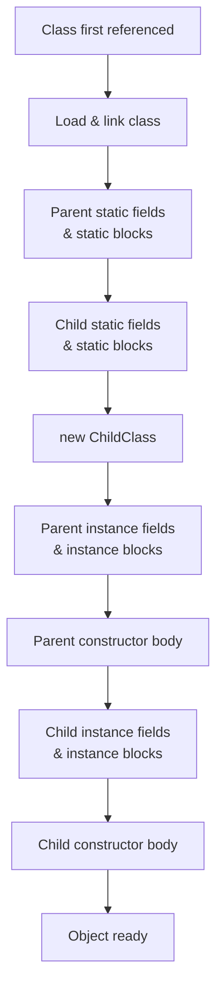
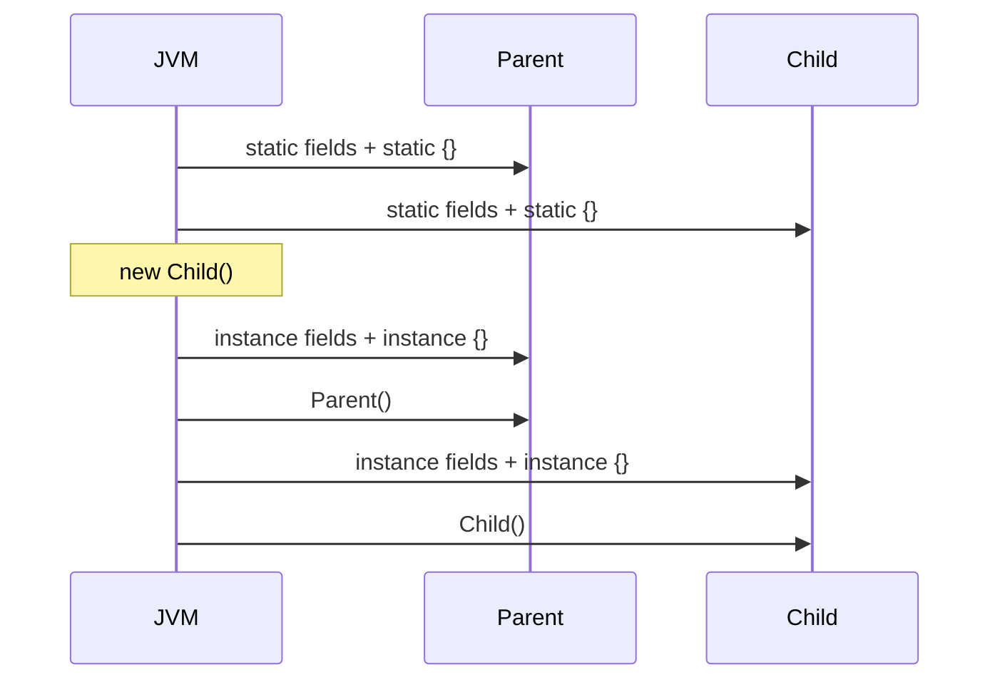
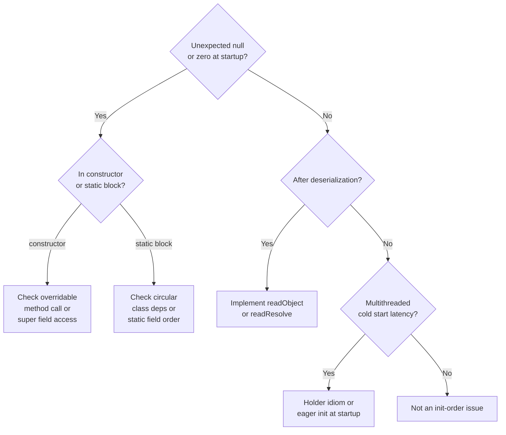

<!-- tldr -->
# Initialization Order

Java's JVM loads and initializes classes exactly once, in a precise sequence: parent statics → child statics → parent instance blocks + constructor → child instance blocks + constructor. Violating assumptions about this order is a common source of `NullPointerException`, half-constructed objects, and subtle threading bugs. Knowing the exact sequence is table stakes for senior Java interviews.



<!-- standard -->

## What It Is

Initialization order governs **when** a field, block, or constructor runs relative to others during both class loading and object construction. The JVM spec (§12.4, §12.5) defines this deterministically.

### Static Initialization — happens once per class, at class load time

1. JVM loads and resolves the class.
2. Static fields are set to default values (`0`, `null`, `false`).
3. Static fields with initializers and `static {}` blocks execute **top-to-bottom, parent before child**.

### Instance Initialization — happens per `new` expression

1. Memory allocated; all fields set to default values.
2. `super(...)` call runs (explicitly or implicitly) — recursing up to `Object`.
3. After `super()` returns, **instance fields with initializers** and `instance {}` blocks run **top-to-bottom**.
4. Remainder of the current constructor body runs.
5. Repeat steps 2–4 walking back down the hierarchy.

### Key Tradeoffs / Gotchas

| Scenario | Risk |
|---|---|
| Overridable method called in constructor | Child override sees **uninitialized** child fields |
| `final` field read in `super()` call | Reads default value (`0`/`null`) before child init |
| Circular class dependencies | Can trigger `ExceptionInInitializerError` |
| Lazy vs eager static init | `static {}` blocks run at first active use, not at JVM start |
| Double-checked locking pre-Java 5 | Missing `volatile` breaks happens-before; field reads stale |

### Comparison: Static vs Instance Block

| | `static {}` block | Instance `{}` block |
|---|---|---|
| Runs | Once per class | Every `new` call |
| Access | Static members only | All members |
| Use case | One-time setup, registering drivers | Shared constructor logic |
| Thread safety | JVM guarantees single execution | Caller's responsibility |



<!-- deep -->

## Deep Dive

### Exact JVM Specification Sequence (§12.5)

For `new Child()` where `Child extends Parent`:

```
1.  Allocate memory; zero-fill all fields
2.  Invoke Child.<init>
    a. First statement: super() → invokes Parent.<init>
        i.  super() → Object.<init> (base case)
        ii. Parent instance initializers (fields + blocks, top-to-bottom)
        iii.Rest of Parent() body
    b. Child instance initializers (fields + blocks, top-to-bottom)
    c. Rest of Child() body
3.  Return reference to caller
```

The compiler **inlines** instance initializer blocks into **every** constructor, immediately after the `super()` call. They are not separate calls at the bytecode level.

---

### The Overridable-Method-in-Constructor Trap

```java
class Base {
    Base() { init(); }           // calls overridden method
    void init() {}
}

class Derived extends Base {
    final int value = 42;        // NOT yet initialized when Base() calls init()
    @Override
    void init() { System.out.println(value); } // prints 0, not 42
}
new Derived(); // prints 0 — classic interview question
```

**Why**: `Base()` runs before Derived's instance initializers. `value` is still `0` (default). This is why Effective Java Item 19 says: *"never call overridable methods from constructors."*

---

### Static Initialization & Class Loading

Static init runs during **class initialization**, triggered by the first *active use*:
- First `new` of the class
- First access to a `static` field or method
- `Class.forName("...")`
- JVM startup class

The JVM holds a per-class initialization lock (`<clinit>` is synchronized). This means:

```java
class Singleton {
    // Thread-safe — JVM guarantees <clinit> runs exactly once
    private static final Singleton INSTANCE = new Singleton();
    static Singleton get() { return INSTANCE; }
}
```

This is the **Initialization-on-Demand Holder** idiom — zero overhead, lazy, and provably thread-safe without `synchronized` or `volatile`.

#### Circular Dependency Deadlock

```java
class A { static B b = new B(); }
class B { static A a = new A(); }
// Thread 1: initializing A, waits for B
// Thread 2: initializing B, waits for A → DEADLOCK
```

The JVM will throw `ExceptionInInitializerError` or deadlock depending on the scenario. Real-world occurrence: seen in Spring `@Configuration` classes with circular `@Bean` static references.

---

### Real-World Systems

| System | Relevance |
|---|---|
| **Spring IoC** | Bean initialization order matters; `@DependsOn` overrides default; `InitializingBean.afterPropertiesSet()` runs post-construction |
| **JDBC drivers** | `Class.forName("com.mysql.Driver")` triggers `static {}` which calls `DriverManager.registerDriver()` |
| **Hibernate** | Proxy subclasses call overridden getters before field injection — causes NPE if getter assumes non-null state |
| **Java serialization** | `readObject()` bypasses constructors entirely; instance initializers do NOT run |
| **Enum** | Each constant is a `static final` instance; static block runs after all constants are created |

---

### Serialization Exception

`ObjectInputStream.readObject()` allocates the object and populates fields directly — **no constructor, no instance initializer blocks run**. If your class relies on constructor-set invariants (e.g., `if (list == null) list = new ArrayList()`), deserialization silently violates them. Fix: implement `readObject()` or use `readResolve()`.

---

### Capacity & Latency Notes

- `<clinit>` contention under high concurrency: if 500 threads simultaneously trigger first use of a class, 499 threads block on the JVM init lock. At 1M QPS with a cold-start, this can add 50–200ms to first-request latency.
- Eager static initialization at JVM startup (via `-XX:+EagerClassInitialization` or GraalVM `native-image`) trades startup memory for zero-latency first calls — standard in serverless (AWS Lambda SnapStart, Quarkus).

---

### Interview Pitfalls

1. **"What does this print?"** — Always trace parent statics → child statics → parent instance/ctor → child instance/ctor.
2. **Forgetting `super()` is implicit** — Interviewers add explicit `super(x)` calls; make sure you track which constructor is delegated to.
3. **`final` fields in `super()`** — A `final int x = 5` in Child reads as `0` during `super()` because child init hasn't run yet.
4. **`static final` vs `static`** — Compile-time constants (`static final int X = 3`) are inlined by `javac`; no class init required to read them. Non-constant statics trigger full `<clinit>`.
5. **Enum trap** — `enum Color { RED, GREEN; static int count = 2; }` — the constants are created *before* `count = 2`, so a constructor that references `count` sees `0`.

---

### Decision Rubric: When Initialization Order Bites You



**Reach for explicit initialization order control when:**
- You have complex inheritance with shared mutable state.
- You use `Class.forName`-based plugin registries (JDBC, SPI).
- Your framework (Spring, Guice) injects fields post-construction and your methods assume non-null state.
- You serialize/deserialize objects with invariants set in constructors.