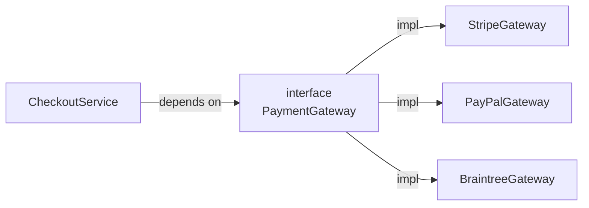
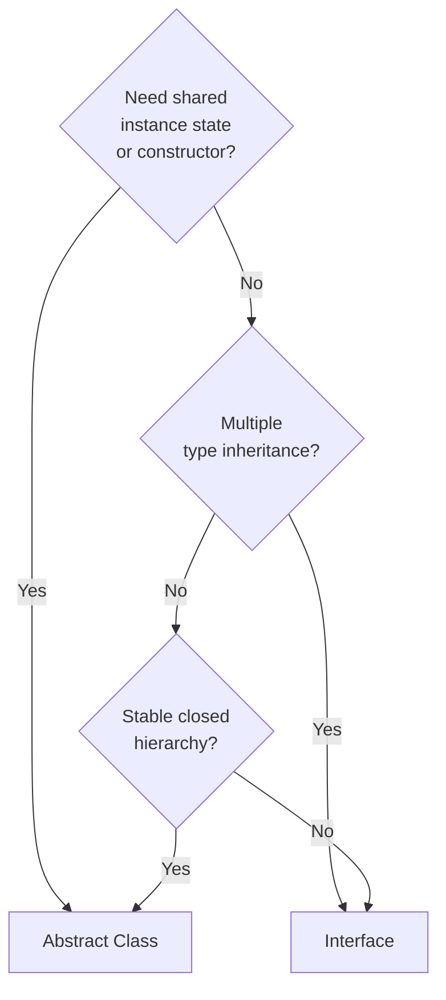
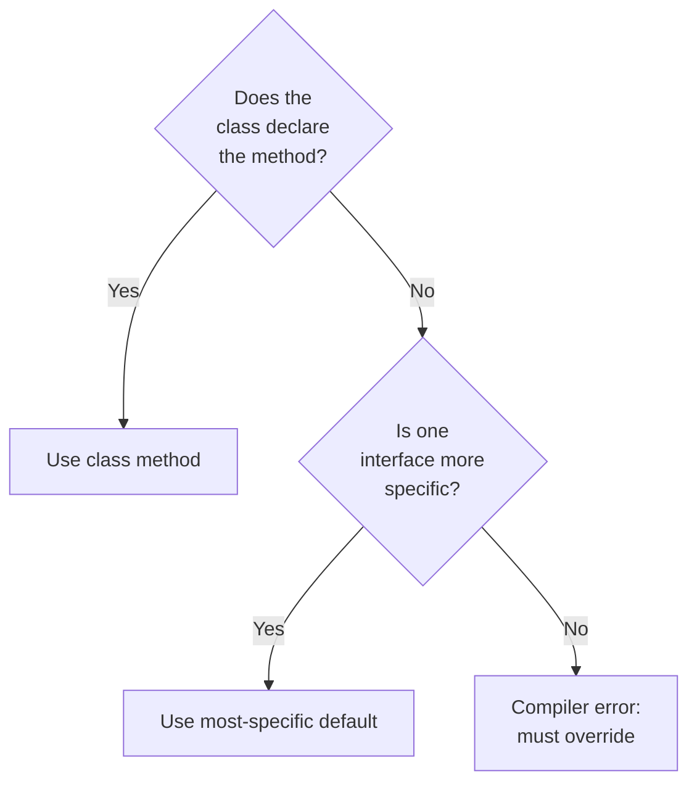

<!-- tldr -->
# Interfaces

An interface is a named set of method signatures (and, since Java 8, optional default/static implementations) that any class can commit to fulfilling. The caller depends only on the contract; the concrete type is invisible. This is the mechanical foundation of the **Dependency Inversion Principle** and is why every major Java framework — Spring, JDBC, JPA, Kafka — is built on interface hierarchies rather than concrete classes.



<!-- standard -->

## What It Is

A Java interface declares a **type** with zero shared instance state. Prior to Java 8, every method was implicitly `public abstract`. Modern Java adds:

- **`default` methods** (Java 8) — concrete method bodies that implementors inherit, enabling backward-compatible API evolution.
- **`static` methods** (Java 8) — utility helpers scoped to the interface namespace.
- **`private` / `private static` methods** (Java 9) — DRY helpers shared among `default` methods, not visible to implementors.
- **`sealed` interfaces** (Java 17) — restrict the set of permitted implementing types, enabling exhaustive `switch` expressions.

All fields are implicitly `public static final`. All non-`private` methods are implicitly `public`.

## Why It Matters

- **Testability**: swap real impl for a mock with zero framework magic.
- **Multiple-type inheritance**: a class can `implement` any number of interfaces; `extends` is single-target only.
- **API stability**: adding a `default` method to a published interface is binary-compatible; adding an abstract method is not.
- **Functional programming bridge**: a `@FunctionalInterface` with one abstract method is the target type for any lambda or method reference.

## Interface vs Abstract Class

| Concern | Interface | Abstract Class |
|---|---|---|
| Instance state | ✗ | ✓ |
| Constructor logic | ✗ | ✓ |
| Multiple inheritance | ✓ (unlimited) | ✗ (single) |
| Access modifiers on methods | only `public` / `private` | any |
| IS-A vs CAN-DO | CAN-DO (role) | IS-A (identity) |
| Default implementations | ✓ (`default`) | ✓ (any method) |



## Key Tradeoffs

- **Default method diamond conflict**: if two interfaces provide a `default` with the same signature, the implementor **must** override to resolve; the compiler enforces this.
- **Leaky abstractions**: bloated interfaces violate the Interface Segregation Principle (ISP). Prefer narrow, role-specific interfaces (`Readable`, `Closeable`) over fat ones.
- **Versioning**: once an interface is published and widely implemented, adding an abstract method is a **breaking change**; adding a `default` is safe.

<!-- deep -->

## Deep Dive

### Bytecode: `invokeinterface` vs `invokevirtual`

The JVM emits `invokeinterface` for interface calls and `invokevirtual` for class calls. `invokeinterface` historically required a linear scan of the implementor's method table because a class can implement many interfaces. In HotSpot, an **inline cache** and profile-guided JIT compilation collapse this to a direct call after a few thousand invocations. At a well-warmed P99, the overhead is unmeasurable (<1 ns). The distinction matters only in hyper-tight loops or if you're reasoning about startup latency before JIT kicks in.

### Default Method Resolution Rules (C3-style)

1. **Class wins over interface** — a concrete method in the class always wins.
2. **Most specific interface wins** — if `B extends A` and both provide a `default`, `B`'s wins.
3. **Explicit disambiguation required** — if two unrelated interfaces supply conflicting defaults, the implementor must call `InterfaceA.super.method()` or override.



### `@FunctionalInterface` and Lambdas

Any interface with **exactly one abstract method** (SAM — Single Abstract Method) is a valid lambda target. The annotation `@FunctionalInterface` is documentation + compile-time guard; the JVM doesn't need it. `java.util.function` ships 43 ready-made functional interfaces (`Function<T,R>`, `Predicate<T>`, `Supplier<T>`, `Consumer<T>`, and their primitive specializations). Define your own only when the signature or intent doesn't match a standard one.

```java
@FunctionalInterface
public interface RiskScorer {
    double score(Transaction tx); // one abstract method

    default boolean isHighRisk(Transaction tx) { // default is fine
        return score(tx) > 0.85;
    }
}

RiskScorer mlScorer = tx -> mlModel.predict(tx.features()); // lambda
```

### Sealed Interfaces (Java 17+)

```java
public sealed interface Shape permits Circle, Rectangle, Triangle { }
```

The compiler knows the **closed set** of subtypes, enabling exhaustive `switch` expressions without a `default` arm. Pattern matching (`instanceof` with binding variables, Java 16+) integrates cleanly. This replaces fragile `instanceof` chains at the call site.

### Real-World Systems That Lean Heavily on Interfaces

| System | Interface | What it hides |
|---|---|---|
| **JDBC** | `java.sql.Connection`, `Statement`, `ResultSet` | MySQL vs Postgres wire protocol |
| **Spring Framework** | `ApplicationContext`, `BeanFactory`, `BeanPostProcessor` | XML vs annotation vs Java config wiring |
| **JPA / Hibernate** | `EntityManager`, `Query`, `CriteriaBuilder` | SQL dialect, session management |
| **Kafka Clients** | `Producer<K,V>`, `Consumer<K,V>` | broker protocol, partition strategy |
| **Java Collections** | `List`, `Map`, `Queue`, `Iterable` | array vs linked vs tree vs hash backing |
| **Executor Framework** | `Executor`, `ExecutorService`, `Future<V>` | thread pool sizing, scheduling policy |

### Failure Modes and Pitfalls

**Constant interface anti-pattern**: using an interface purely to share `public static final` constants. It pollutes the implementing class's API namespace and is visible to all subclasses. Use a `final` utility class with a private constructor instead.

**Fat interface**: a single `UserService` interface with 30 methods forces every mock/test-double to stub all of them. Apply ISP: split into `UserReader`, `UserWriter`, `UserAuthenticator`.

**Premature `default` method**: using a `default` to add behaviour to a published interface looks safe but can silently change behaviour in existing implementors that didn't expect the method to exist.

**Marker interfaces vs annotations**: `Serializable`, `Cloneable`, `RandomAccess` are marker interfaces (no methods). Since Java 5, annotations (`@Transactional`, `@Entity`) are generally preferred for marking because they carry metadata. Use marker interfaces only when `instanceof` checks at runtime are the primary mechanism.

### Capacity / Latency Context

- Spring boot startup with 500 interface-backed beans: ~1.5s cold, ~50ms warm (GraalVM native).  
- Kafka `Producer` throughput: up to **1M msg/s** at ~500 bytes/msg on a 3-broker cluster; the interface abstraction adds zero overhead at that scale.  
- JDBC connection pool (`HikariCP`) checkout latency through the `DataSource` interface: P99 **< 1 ms** at 10K QPS.

### Interview Pitfalls at Staff Level

1. **"Why not just use abstract classes everywhere?"** — Concrete answer: Java's single-inheritance constraint means composition breaks down for cross-cutting roles (`Comparable`, `AutoCloseable`). Interfaces model *roles*; abstract classes model *identities*.
2. **"What happens when two interfaces have the same default method?"** — Must override and optionally delegate with `InterfaceA.super.method()`.
3. **"How do you evolve a published interface without breaking callers?"** — Add `default` methods; use `sealed` to lock the hierarchy if you own all implementors; use adaptor/wrapper patterns if you don't.
4. **Forgetting `private` interface methods (Java 9)** — Interviewers love asking "how do you share logic between two `default` methods without exposing it?".
5. **Not connecting to SOLID** — ISP says no client should be forced to depend on methods it doesn't use. Narrow interfaces are the enforcement mechanism.

### When to Reach for an Interface

- You want **multiple callers with zero coupling** to a concrete type.
- The abstraction is a **role or capability** (`Runnable`, `Comparable`, `Closeable`), not an identity.
- You need to **test in isolation** — define an interface, inject, mock.
- The hierarchy must be **open for extension** by third-party code (SDK design).
- You're writing **framework/library code** where concrete classes would lock users in.

Reach for an **abstract class** instead when you need constructors, protected fields, or want to share substantial stateful implementation across a closed family of types.