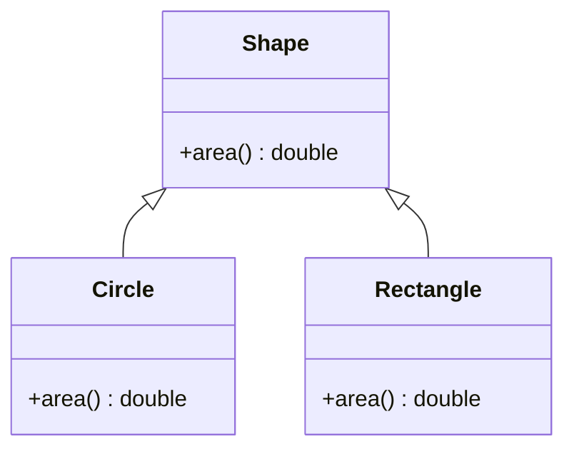
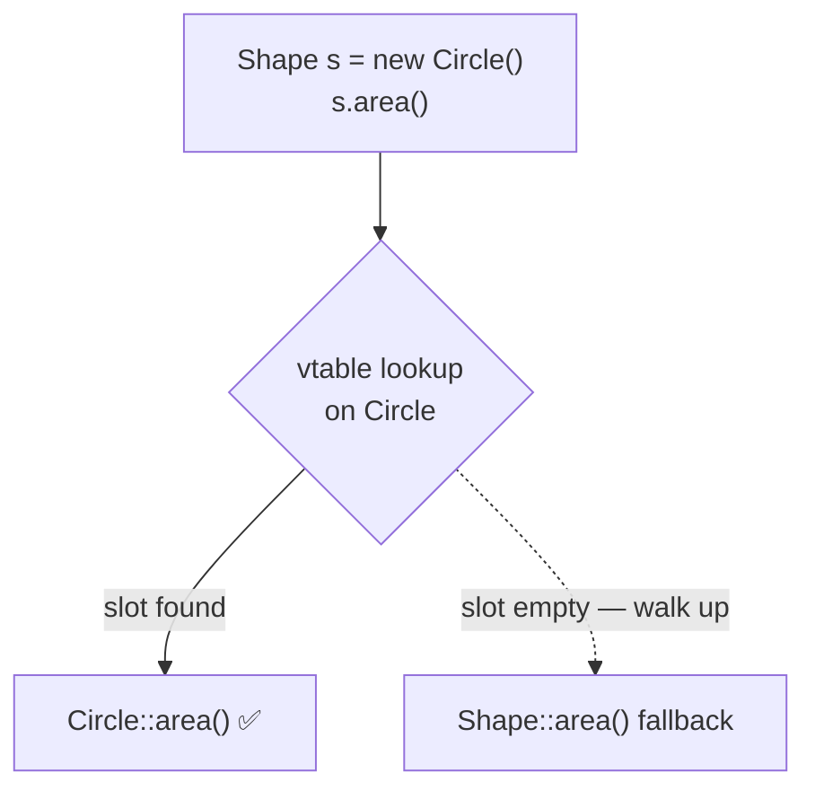
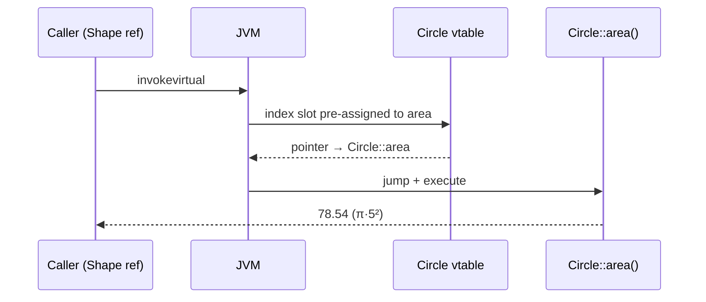
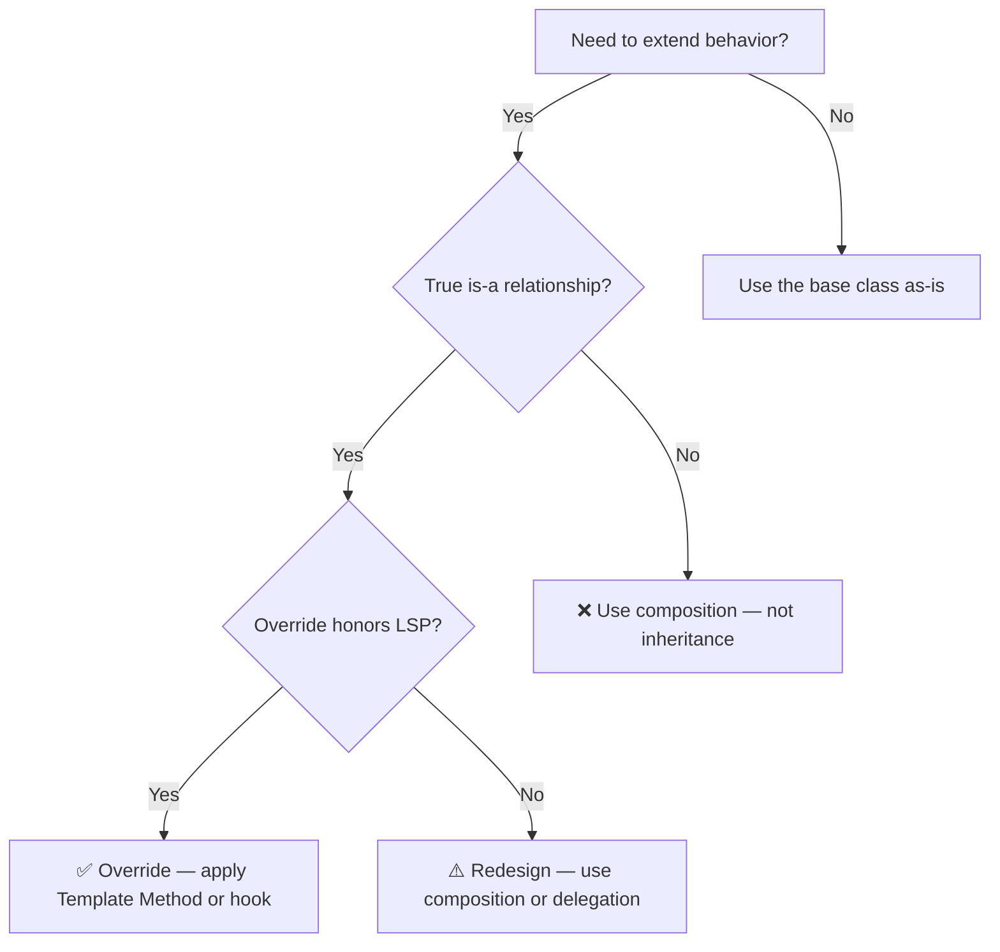

<!-- tldr -->
# Method Overriding

Method overriding is the mechanism by which a subclass provides its own implementation of a method declared in a superclass or interface, with the JVM selecting the correct version at call time based on the **actual object type**, not the declared reference type. This runtime resolution — dynamic dispatch — is the foundation of polymorphism, the Open/Closed Principle, and virtually every major Java framework hook. Understanding what the compiler emits, how the JIT optimizes it, and where the contract can silently break is what separates a senior answer from a junior one.



<!-- standard -->

## What It Is

When a subclass declares an instance method with the **same name**, **same parameter list**, and a **compatible return type** as a method in its superclass, it overrides that method. Any call through a `Shape` reference pointing to a `Circle` instance will invoke `Circle::area`, not `Shape::area`. The JVM implements this via a **virtual method table (vtable)**: a per-class array of method pointers built at class load time.

## Why It Matters

- **Open/Closed Principle**: Extend behavior by subclassing without modifying existing code.
- **Liskov Substitution Principle**: Every override is an implicit contract — subtypes must behave consistently with the supertype's spec.
- **Framework hooks**: Spring (`doFilterInternal`), Servlet API (`doGet`/`doPost`), JPA callbacks, and Jackson serializers all rely on overriding hot paths.

## Java Override Rules

| Dimension | Rule |
|---|---|
| Signature | Name + parameter types must match **exactly** |
| Return type | Same type or a **covariant subtype** (Java 5+) |
| Access modifier | May only be **widened** (`protected` → `public`), never narrowed |
| Checked exceptions | May declare the **same, fewer, or narrower** checked exceptions only |
| `static` methods | **Hidden**, not overridden — resolved at compile time |
| `private` methods | Invisible to subclasses; no override possible |
| `final` methods | Compiler error on override attempt |

## Primary Techniques

- **`@Override`**: Always annotate. It makes the compiler verify the override is valid and catches signature typos.
- **`super.method()`**: Delegate to the parent implementation and extend it rather than replacing it wholesale.
- **Covariant return types**: `clone()` may return `MyClass` instead of `Object`, eliminating unsafe casts at call sites.
- **Abstract methods**: Force every concrete subclass to provide an implementation; the contract is explicit.



## Tradeoffs

- **Deep hierarchies**: Each level of override makes behavior harder to trace; three levels deep is usually a design smell — reach for composition.
- **Fragile base class**: Adding a concrete method to a widely-extended superclass can accidentally match a subclass method, creating an unintended override.
- **Dispatch overhead**: Dynamic dispatch adds indirection, but HotSpot's JIT devirtualizes monomorphic call sites — in practice, near-zero overhead at steady state.

<!-- deep -->

## JVM Internals: Dynamic Dispatch Under the Hood

### Bytecode Opcodes

The Java compiler emits different opcodes depending on how a method is invoked:

| Opcode | When Used | Resolution Time |
|---|---|---|
| `invokevirtual` | Normal instance method call | Runtime — vtable slot |
| `invokespecial` | `super.m()`, constructors, `private` methods | Compile time — static binding |
| `invokeinterface` | Call through an interface reference | Runtime — itable lookup |
| `invokestatic` | Static methods | Compile time |
| `invokedynamic` | Lambdas, method handles | Custom bootstrap linkage |

`invokevirtual` is the opcode for every overridable method call. `invokespecial` is the opcode that **bypasses** dispatch — which is why `super.m()` always reaches the parent, even if a subclass further down the chain exists.

### Virtual Method Table Construction

At class loading, the JVM builds a vtable for every class:

1. **Copy** the parent's vtable verbatim.
2. For each method declared in the subclass, **replace** the matching parent slot if the signatures match (an override).
3. **Append** new methods not present in the parent.

A call `s.area()` where `s` is declared `Shape` but holds a `Circle`:
1. Dereference the object header → get the `Class` pointer for `Circle`.
2. Index into `Circle`'s vtable at the pre-assigned slot for `area`.
3. Jump to `Circle::area`. Done — no type checks, no name lookup at runtime.



### JIT Devirtualization and Inline Caches

HotSpot profiles every call site during interpreted execution:

| Site Type | JIT Strategy | Overhead |
|---|---|---|
| **Monomorphic** (one concrete type ever seen) | Inline the callee body directly | ~0 ns |
| **Bimorphic** (two concrete types) | Inline cache with one type-check branch | ~1–2 ns |
| **Megamorphic** (3+ types) | Full vtable dispatch, no inlining | ~5–10 ns |
| `invokeinterface` megamorphic | itable scan | ~7–12 ns |

At 1 M QPS, a 10 ns per-call overhead is 10 ms/s of CPU — rarely the bottleneck. Profile with JMH before micro-optimizing polymorphic dispatch. The real cost is the **loss of inlining**, which prevents subsequent optimizations (escape analysis, scalar replacement, loop unrolling) from firing.

---

## LSP Contract: What an Override Must Preserve

The Liskov Substitution Principle formalizes override correctness:

- **Preconditions** may be **weakened** (accept a broader set of inputs than the parent).
- **Postconditions** may be **strengthened** (promise more than the parent).
- **Invariants** must be preserved.

Inverting either rule breaks substitutability silently at runtime.

**Classic LSP violation — the `Square extends Rectangle` trap:**
`Rectangle.setWidth(w)` has the postcondition `height unchanged`. `Square.setWidth(w)` must also set height (to stay square), violating that postcondition. Code that writes `r.setWidth(5); assert r.getHeight() == 10;` through a `Rectangle` reference fails when `r` is actually a `Square`.

---

## Real-World Systems

### Java Collections Framework — Template Method at Scale
`AbstractList` declares `get(int)` and `size()` abstract. All of `iterator()`, `indexOf()`, `subList()`, `equals()`, `hashCode()`, and `toString()` are implemented in terms of those two. Override two methods, inherit a complete `List` implementation. This is the canonical Template Method pattern.

### Spring Framework
`DispatcherServlet` overrides `HttpServlet.service()` — the entire Spring MVC request lifecycle flows from one override. `AbstractBeanFactory.getBean()` delegates to `doGetBean()`, an internal override point used by `AbstractAutowireCapableBeanFactory` to inject interceptors, proxies, and scope management.

### Hibernate / JPA
`SessionImpl` overrides 40+ methods from `AbstractSessionImpl`. Every second-level cache integration point is an override slot — Ehcache, Redis, and Hazelcast plugins swap in implementations without touching core persistence logic.

### Kafka Consumer API
`ConsumerRebalanceListener` exposes `onPartitionsRevoked` and `onPartitionsAssigned` as override hooks. The framework calls them during rebalance; every custom offset-commit and state-store flush pattern is expressed as an override.

---

## Failure Modes & Interview Traps

### 1. Accidental Method Hiding With `static`
```java
class Parent { static void ping() { System.out.println("parent"); } }
class Child  extends Parent { static void ping() { System.out.println("child"); } }

Parent p = new Child();
p.ping(); // prints "parent" — hiding, not overriding
```
The call is resolved at **compile time** based on the reference type. `@Override` on a `static` method is a **compile error** — your safety net.

### 2. Bridge Methods from Covariant Returns
When you override `Object clone()` with `MyClass clone()`, the compiler emits **two** bytecode methods: your real one plus a synthetic bridge method with the original return type. Reflection-based frameworks (Mockito proxy generation, Jackson type inference) can see both and behave unexpectedly.

### 3. Lost `synchronized` Semantics
```java
class Base { synchronized void transfer() { ... } }
class Derived extends Base {
    @Override
    void transfer() { ... } // NOT synchronized — the lock is on `this`, not the vtable slot
}
```
You must re-declare `synchronized` explicitly. This is a real source of race conditions in persistence layer subclasses.

### 4. `equals` + `hashCode` Contract Violation
Overriding `equals` without overriding `hashCode` means two "equal" objects can land in different `HashMap` buckets. Objects become irretrievable. The JDK contract (`equals` ↔ `hashCode`) is enforced nowhere at compile time — pure runtime failure.

### 5. Throwing Broader Checked Exceptions
```java
class Parent { void read() throws IOException { ... } }
class Child extends Parent {
    @Override
    void read() throws Exception { ... } // compile error — broader checked exception
}
```
The compiler rejects this. An override may only declare **unchecked** exceptions freely, or checked exceptions that are the **same or narrower** than the parent's declaration.

---

## Capacity & Latency Reference

| Dispatch Scenario | Approx. Latency |
|---|---|
| Monomorphic, JIT-inlined | ~0 ns |
| Bimorphic inline cache | ~1–2 ns |
| Megamorphic vtable | ~5–10 ns |
| `invokeinterface` megamorphic | ~7–12 ns |
| `Method.invoke` (reflection, cold) | ~50–200 ns |
| `MethodHandle.invoke` (warm) | ~1–3 ns |

---

## Decision Rubric



**Reach for overriding when:**
- A genuine `is-a` relationship holds and LSP is satisfiable without contortion.
- You're plugging into a framework's Template Method or hook pattern.
- The override is a single, well-scoped behavioral customization.

**Avoid overriding when:**
- The relationship is `has-a` or `uses-a` — composition wins every time.
- You'd need to override multiple unrelated methods — the abstraction is fighting you.
- The override must weaken the parent's contract (return null where parent returns non-null, throw more, accept less).
- The class is `final` — the author made an explicit stability promise; proxy via delegation instead.