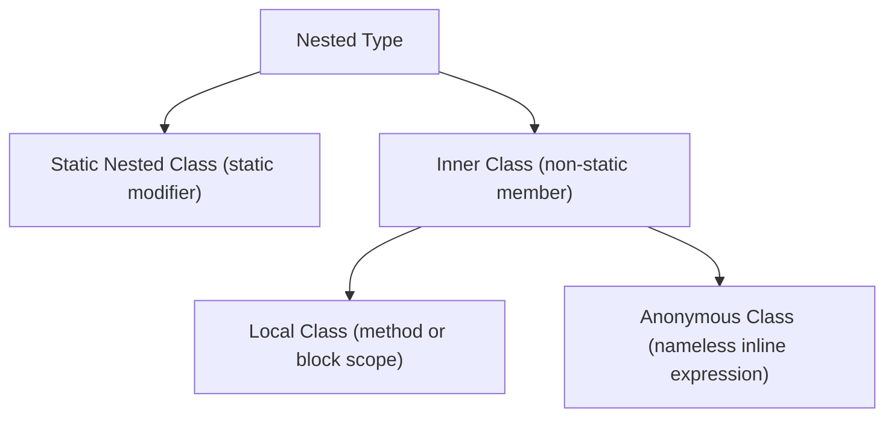
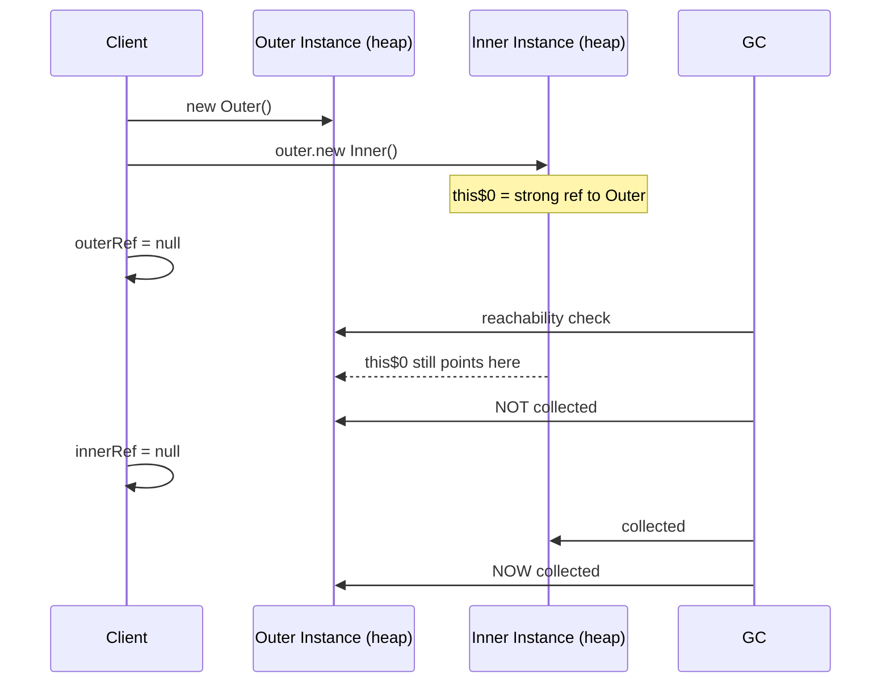
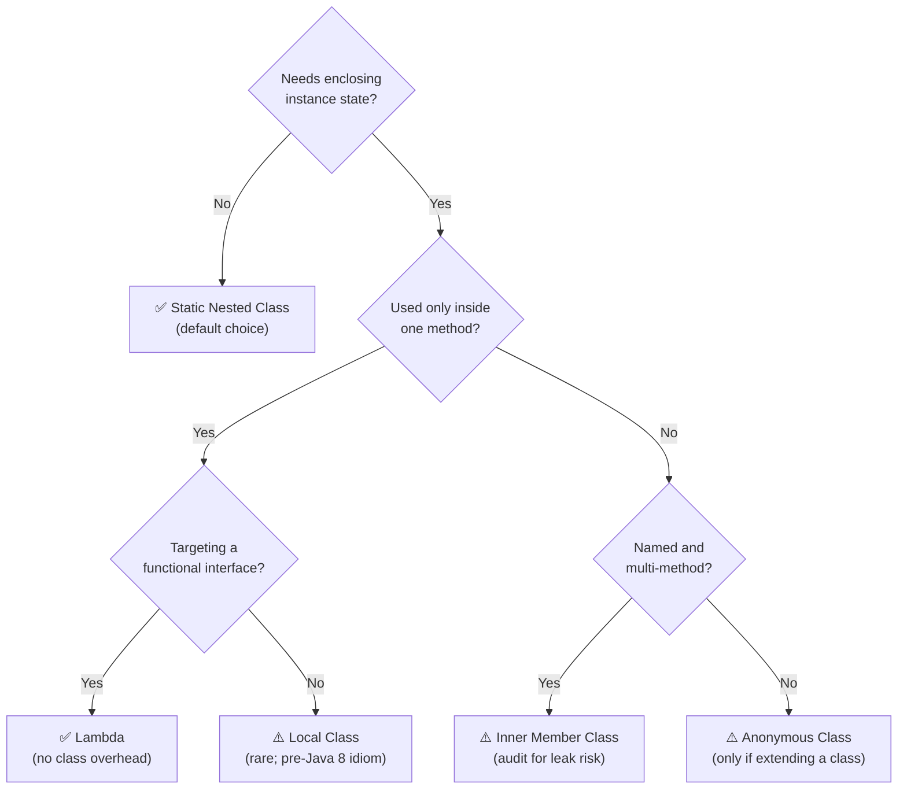

<!-- tldr -->
# Nested Classes

Java provides four nested-class forms—static nested, inner (non-static member), local, and anonymous—each encoding a different relationship with the enclosing type's instance. The choice between them is not stylistic: it determines whether a hidden reference to the outer object is retained, whether local variables can be captured, and whether serialization is safe. Getting this wrong introduces silent memory leaks or fragile bytecode.



<!-- standard -->

## What It Is

A nested class is any class declared inside another class or interface body. Java distinguishes four forms on two axes: **does it hold a reference to the enclosing instance?** and **where in source is it declared?**

## The Four Forms

- **Static nested class** — declared `static`; no hidden enclosing reference. The JVM treats it as a sibling top-level class namespaced inside the outer. Instantiated with `new Outer.Nested()`. Use for helpers that don't need enclosing state.
- **Inner class** (non-static member class) — holds an implicit `Outer.this` reference injected as a hidden constructor parameter. Can read and write all private members of the enclosing instance. Instantiated with `outer.new Inner()`.
- **Local class** — declared inside a method or block; can capture effectively-final locals from the enclosing scope. Largely obsolete since Java 8; lambdas cover the same ground with less ceremony.
- **Anonymous class** — nameless, declared and instantiated in one expression. The pre-Java-8 callback idiom. Lambdas replace most uses; anonymous classes remain necessary when extending a concrete class or when the implementation needs multiple non-default methods.

## Why It Matters

- **API surface control**: `HashMap.Node`, `LinkedList.Node`, and `Map.Entry` are static nested types that expose only what the public contract requires.
- **Builder pattern**: placing `Builder` as a static nested class inside the target domain object keeps the API cohesive without polluting the package namespace.
- **Memory risk**: every non-static nested instance silently roots the enclosing instance on the heap—this is the most common senior-interview trap in Java OOP.

## Comparison

| Form | Holds `Outer.this` | Captures locals | Instantiation | Safe to serialize |
|---|---|---|---|---|
| Static nested | ✗ | ✗ | `new Outer.Nested()` | ✓ |
| Inner (member) | ✓ | ✗ | `outer.new Inner()` | ✗ |
| Local | ✓ | ✓ (eff. final) | Within scope only | ✗ |
| Anonymous | ✓ | ✓ (eff. final) | Inline `new Type(){}` | ✗ |

## Key Tradeoffs

- **Memory overhead**: inner/local/anonymous classes add one hidden reference field (~4 bytes with compressed oops, 8 bytes without) per instance and prevent GC of the entire outer object graph.
- **Serialization instability**: anonymous and local classes receive synthetic names (`Outer$1`, `Outer$2`) assigned by compiler ordinal; renaming or reordering nested classes silently breaks deserialization of persisted streams.
- **Bytecode footprint**: each nested class compiles to a separate `.class` file (`Outer$Inner.class`), adding jar entries even for trivial helpers.
- **Lambda vs. anonymous class**: a lambda targeting a `@FunctionalInterface` is an `invokedynamic` call site at runtime—not a class—and does not capture `Outer.this` unless the body explicitly references `this`, making it leak-safe by default.

<!-- deep -->

## Deep Dive: Nested Classes

### JVM Representation

The JVM has no native concept of "nested." `javac` desugars nested classes into sibling top-level classes linked by synthetic access-bridge methods. For `Outer.Inner`, `javap -private` reveals:

```java
final class Outer$Inner {
    final Outer this$0;          // hidden ref — 4 bytes (compressed oops on heap ≤ 32 GB)
    Outer$Inner(Outer outer$0) {
        this.this$0 = outer$0;   // injected regardless of whether outer members are used
    }
}
```

The `this$0` field is unconditionally injected by `javac` even when the inner class body never references any outer-instance member. This is why even a "logically stateless" inner class roots the outer object.

### Memory Model and Leak Anatomy



**Classic Android leak pattern**: an anonymous `AsyncTask` or `Handler` declared inside an `Activity` captures the activity via `this$0`. The task outlives an orientation rotation, preventing GC of the entire view hierarchy—typically 10–40 MB per screen on mid-range hardware.

**Fix**: use a `static` nested class + `WeakReference<Activity>` to sever the strong reference:

```java
private static class SafeTask extends AsyncTask<Void, Void, Void> {
    private final WeakReference<MyActivity> activityRef;
    SafeTask(MyActivity activity) { this.activityRef = new WeakReference<>(activity); }
    // ...
}
```

### Real-World Usage in Production Systems

| System | Nested Class | Form | Rationale |
|---|---|---|---|
| `java.util.HashMap` | `Node<K,V>`, `TreeNode<K,V>` | Static nested | No outer-instance coupling; avoids reference overhead |
| `java.util.LinkedList` | `Node<E>` | Static nested | Implementation detail hidden from API |
| `java.util.Map` | `Entry<K,V>` | Interface member (implicitly static) | Public contract; zero outer coupling |
| Spring Framework | `@Configuration` inner beans | **Must be static** | CGLIB must instantiate nested config before outer is ready |
| Apache Kafka | `ConsumerRecords.ConcurrentIterableIterator` | Private inner | Needs per-instance cursor state tied to the records batch |
| `java.util.concurrent` | `FutureTask.WaitNode` | Static nested | Intrinsic-lock wait queue node; outer ref would be a leak |
| Android `RecyclerView` | `ViewHolder` | Static nested (enforced pattern) | Prevents adapter from leaking the hosting activity |

### Serialization Failure Modes

1. **Anonymous class UID instability** — `ObjectOutputStream` derives `serialVersionUID` from the class name. Anonymous class names (`Outer$1`) shift when any *preceding* anonymous class is added or removed. A stream written as `Outer$3` cannot deserialize after a refactor promotes it to `Outer$4`.

2. **Inner class serialization exception** — serializing a non-static inner class requires the enclosing instance to also be `Serializable`. Even if it is, the outer object is unintentionally included in every serialized payload.

3. **Local class synthetic field leakage** — captured effectively-final locals become unnamed synthetic fields in the bytecode; their serialized form is positional, not name-based, making the wire format fragile across recompiles.

**Rule of thumb**: only `static` nested classes should implement `Serializable`. Always declare `serialVersionUID` explicitly.

### Access Bridge Methods and the Nest API (Java 11+)

When an inner class accesses a `private` member of the outer class pre-Java 11, `javac` generates a synthetic package-private bridge:

```java
// Compiler-generated in Outer.class:
static int access$000(Outer outer) { return outer.privateField; }
```

Each such bridge is an extra indirect dispatch. In a loop at ~10⁸ iterations, this costs roughly **5–15 ns per call** (measurable via JMH; branch predictor cannot elide it). Java 11 introduced the `NestHost`/`NestMembers` class-file attributes, granting nestmates direct JVM-level access with **zero bridge overhead**. Verify with `javap -verbose Outer.class` and look for `NestMembers`.

### Capacity and Overhead Numbers

| Metric | Value |
|---|---|
| Extra heap per inner instance (compressed oops, heap ≤ 32 GB) | +4 bytes (`this$0`) |
| Extra heap per inner instance (uncompressed oops, heap > 32 GB) | +8 bytes |
| Access bridge call overhead, tight loop (pre-Java 11) | ~5–15 ns/call |
| Nest-access overhead (Java 11+) | ~0 ns vs. direct field |
| Additional `.class` files per nested class | 1 (`Outer$Inner.class`) |
| Typical Android Activity leak via inner AsyncTask | 10–40 MB retained |

### Interview Pitfalls

1. **"Can a static nested class access private outer members?"** — Yes since Java 11 (Nest attribute grants direct access). Before Java 11, only via synthetic `access$` bridge methods—technically yes but with overhead.
2. **"Is a static nested class loaded when the outer class loads?"** — No. It is loaded on first use, following the same lazy-loading rules as any other class.
3. **"Can an interface contain a nested class?"** — Yes. Any type nested inside an interface is implicitly `public static`, including classes, enums, records (Java 16+), and even other interfaces.
4. **"What exactly happens with `new Outer().new Inner()`?"** — Two heap allocations: one for `Outer`, one for `Inner`. The `Outer` instance is strongly held by `Inner.this$0` and cannot be GC'd until the `Inner` is collected.
5. **"Why does Spring mandate static `@Configuration` nested classes?"** — Spring's CGLIB proxy must instantiate the nested configuration class during the `BeanDefinitionRegistryPostProcessor` phase, before the enclosing `@Configuration` class has been fully initialized. A non-static inner class cannot be instantiated without a live outer instance; a static nested class can.
6. **"Doesn't a lambda capture `this` too?"** — Only if the lambda body references `this` or an instance member directly. An `invokedynamic` lambda over a pure-function body captures nothing from the enclosing instance, unlike an anonymous class which unconditionally stores `this$0`.

### When to Reach for Each Form



**Decision rubric**:
- **Default to static nested.** It costs nothing extra and is always safe. Promote to non-static only when you have a concrete reason to need `Outer.this`.
- **Never serialize non-static nested classes.** Refactor to static nested + an explicit `private final Outer outer` field if persistence is required—you control the field name, and `serialVersionUID` is stable.
- **Replace anonymous class with lambda** whenever the target type is a `@FunctionalInterface`. The JVM generates an `invokedynamic` bootstrap that avoids a class-loading event on cold paths and produces no `Outer$N.class` artifact.
- **Audit inner classes in long-lived contexts**—caches, static maps, thread pools, event buses. If an inner instance could outlive the natural lifetime of its outer object, extract it to a static nested class or a top-level class.
- **In library/framework code**, never expose inner classes in a public API. The instantiation syntax (`outer.new Inner()`) is surprising to callers and the dependency on an outer instance leaks your implementation structure.