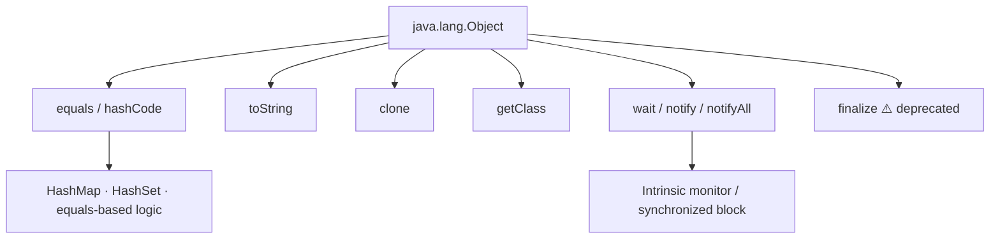
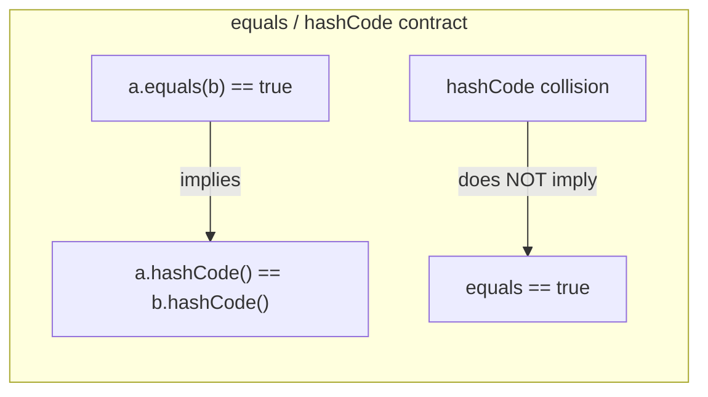
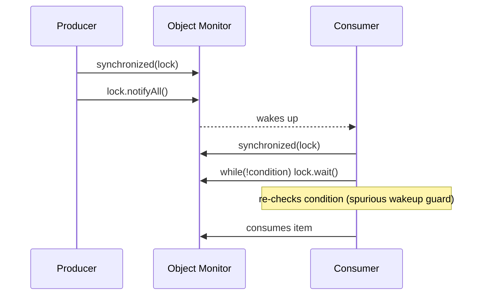
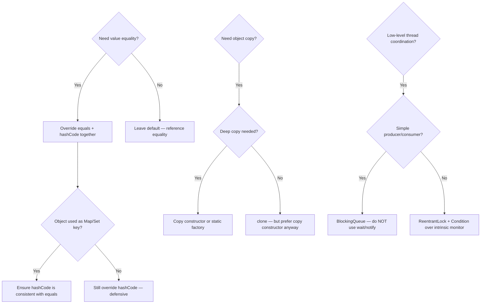

<!-- tldr -->
# Object Class Methods

`java.lang.Object` sits at the root of every Java class hierarchy. Its methods define the universal contracts every object must honor: equality semantics (`equals`/`hashCode`), string representation (`toString`), shallow copying (`clone`), thread coordination (`wait`/`notify`/`notifyAll`), and runtime type introspection (`getClass`). Violating any contract silently breaks collections, caches, and concurrent code.



<!-- standard -->

## What It Is & Why It Matters

Every class you write inherits these methods whether you like it or not. The defaults are often **wrong for value semantics**: the default `equals` is reference equality (`==`), and the default `hashCode` is derived from identity. Forgetting to override both together breaks `HashMap`, `HashSet`, and any equality-based logic.

### Primary Methods & Responsibilities

| Method | Default behaviour | Override when |
|---|---|---|
| `equals(Object)` | Reference equality (`this == obj`) | Value equality is needed |
| `hashCode()` | Identity-based int (JVM-internal) | `equals` is overridden (always together) |
| `toString()` | `ClassName@hexHashCode` | Human-readable logging/debugging |
| `clone()` | Shallow field copy; throws `CloneNotSupportedException` | Copying is needed; prefer copy constructors |
| `getClass()` | Returns `Class<?>` of runtime type | Rarely overridden (final) |
| `finalize()` | Called by GC pre-collection | **Never** — deprecated Java 9, removed Java 18 |
| `wait()` / `notify()` / `notifyAll()` | Block/wake threads on intrinsic monitor | Low-level monitor coordination |

### Key Tradeoffs

- **`equals` + `hashCode` contract**: if `a.equals(b)` then `a.hashCode() == b.hashCode()`. The converse need not hold (collisions are fine). Breaking this silently loses keys in `HashMap`.
- **`clone` vs copy constructor**: `clone` is shallow and requires implementing `Cloneable` (a marker interface with no methods — itself a design smell). Copy constructors or static factory `of(…)` are cleaner.
- **`wait`/`notify` vs `java.util.concurrent`**: intrinsic monitors are error-prone (spurious wakeups, missed signals). Prefer `ReentrantLock` + `Condition` or higher-level constructs for anything real.



<!-- deep -->

## Deep Dive

### `equals` — The Formal Contract

Per the Javadoc, `equals` must be:

1. **Reflexive** — `x.equals(x)` is `true`
2. **Symmetric** — `x.equals(y)` ↔ `y.equals(x)`
3. **Transitive** — `x.equals(y) && y.equals(z)` → `x.equals(z)`
4. **Consistent** — multiple calls return the same result (given no state mutation)
5. **Non-null** — `x.equals(null)` is always `false`

#### Canonical implementation pattern

```java
@Override
public boolean equals(Object o) {
    if (this == o) return true;                          // fast path
    if (!(o instanceof MyClass other)) return false;     // type check + cast (Java 16+ pattern)
    return Objects.equals(field1, other.field1)
        && field2 == other.field2;
}

@Override
public int hashCode() {
    return Objects.hash(field1, field2);                 // delegates to Arrays.hashCode internally
}
```

> **Interview pitfall**: using `getClass() != o.getClass()` instead of `instanceof` breaks the Liskov substitution principle when subclasses are involved (e.g., Hibernate proxies). Use `instanceof` unless you have an explicit reason not to.

---

### `hashCode` — Performance Implications

A poor `hashCode` (returning a constant, for example) degrades `HashMap` from O(1) to O(n) per operation — every key lands in the same bucket chain. With Java 8+ treeified buckets (threshold = 8 nodes), worst case becomes O(log n), but that's still unacceptable at scale.

**Real numbers**: A `HashMap` with 1 M entries and a good hash function delivers ~50 ns get; with a constant hash, expect ~5–50 µs (100×+ regression).

---

### `clone` — Why to Avoid It

```java
// Anti-pattern
public class Stack<E> implements Cloneable {
    private Object[] elements;
    @Override
    public Stack<E> clone() {
        try {
            Stack<E> result = (Stack<E>) super.clone(); // copies reference, not array!
            result.elements = elements.clone();          // must deep-copy manually
            return result;
        } catch (CloneNotSupportedException e) { throw new AssertionError(); }
    }
}
```

Bloch's *Effective Java* Item 13: **prefer copy constructors**. `clone` cannot call a constructor, so invariants enforced in constructors are bypassed.

---

### `wait` / `notify` / `notifyAll` — Intrinsic Monitor Protocol



**Rules**:
- Must hold the object's intrinsic lock (`synchronized`) before calling `wait`/`notify`.
- `wait` atomically releases the lock and suspends the thread.
- Always call `wait` inside a `while` loop — not `if` — to guard against spurious wakeups.
- Prefer `notifyAll` over `notify` unless you have proven exactly one thread needs waking and all waiters are homogeneous.

**Failure modes**:
- **Missed signal**: `notify` called before `wait` → consumer blocks forever.
- **Lost wakeup**: `notify` without `synchronized` → `IllegalMonitorStateException`.
- **Starvation**: `notify` (single) with heterogeneous waiters repeatedly wakes the wrong thread.

---

### `getClass` & Reflection

`getClass()` is `final`; you cannot override it. Common use:

```java
// Correct polymorphic logging
logger.info("Processing {}", event.getClass().getSimpleName());

// Dangerous equality check — breaks with proxies
if (a.getClass() == b.getClass()) { … }   // prefer instanceof
```

In frameworks like Hibernate/Spring, runtime-generated subclasses (CGLIB proxies) cause `getClass()` comparisons to fail unexpectedly.

---

### `finalize` — Don't Touch It

- Deprecated Java 9, for removal since Java 18 (`@Deprecated(forRemoval=true)`).
- Non-deterministic; can delay GC by promoting objects to the next generation.
- Use `java.lang.ref.Cleaner` (Java 9+) or `try-with-resources` + `AutoCloseable` for resource cleanup.

---

### Real-World Systems Impact

| System | Relevant Object method | Why it matters |
|---|---|---|
| **HashMap / HashSet** (JDK) | `equals` + `hashCode` | Bucket placement and key lookup |
| **Hibernate / JPA** | `equals` + `hashCode` | Entity identity in first-level cache; `Set` of managed entities |
| **Kafka consumer groups** | `equals` + `hashCode` on partition keys | Ensures deterministic partition assignment |
| **Guava / Caffeine caches** | `equals` + `hashCode` | Cache key deduplication |
| **ThreadLocal / InheritableThreadLocal** | `hashCode` | Internal map uses identity hash to avoid equality contract complexity |

---

### Capacity / Latency Reference

| Scenario | Typical P99 |
|---|---|
| `HashMap.get` with good hash, ~1 M entries | ~50–80 ns |
| `HashMap.get` with degenerate hash (all same bucket) | ~5–50 µs |
| `Object.wait` + `Object.notify` round-trip (JVM, single JVM) | ~1–5 µs |
| `Objects.hash(f1, f2, f3)` call overhead | ~10–20 ns |

---

### Interview Pitfalls Checklist

- ✅ Always override `hashCode` when overriding `equals` (and vice versa).
- ✅ Use `instanceof` (with null safety) not `getClass()` in `equals` for LSP compliance.
- ✅ Include only the same fields in `equals` and `hashCode`.
- ✅ Immutable fields make better hash components — mutable keys in `HashMap` are a corruption bug.
- ✅ `wait` must be in a `while` loop inside `synchronized`.
- ✅ Use `java.util.concurrent` primitives over raw `wait`/`notify` in production code.
- ✅ Never rely on `finalize` for resource cleanup.

---

### When to Reach for Each

