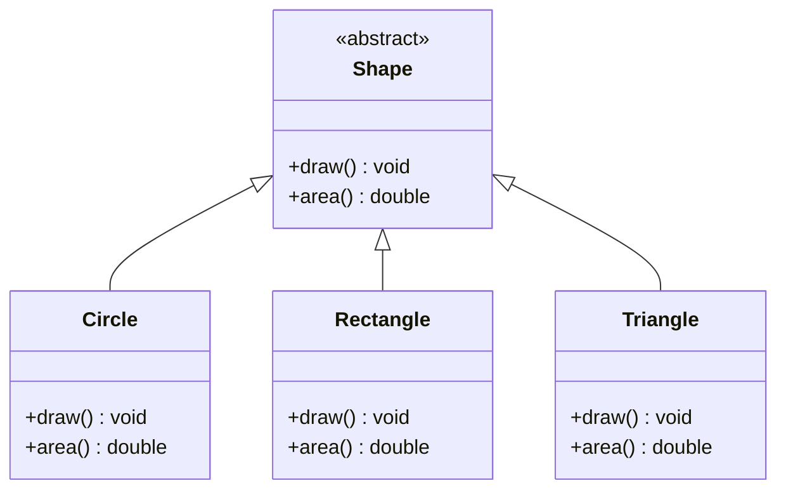
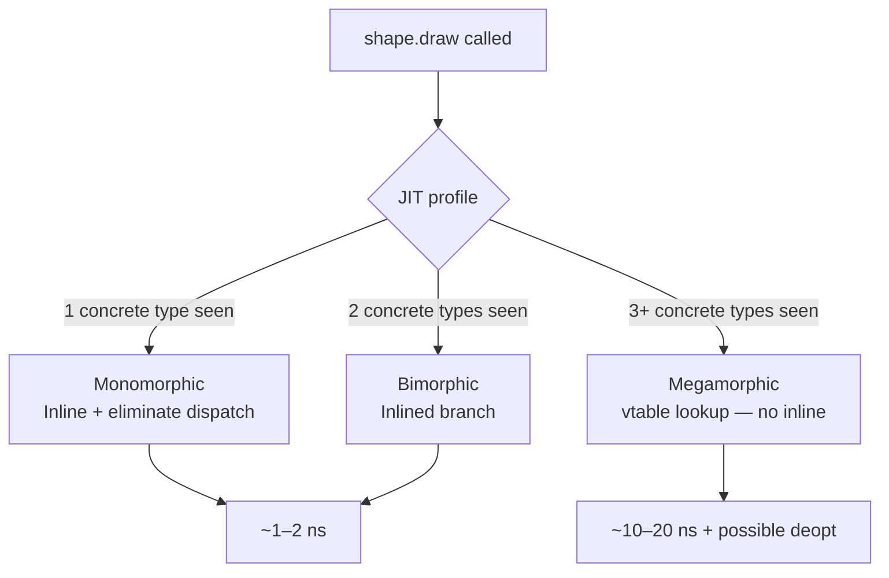
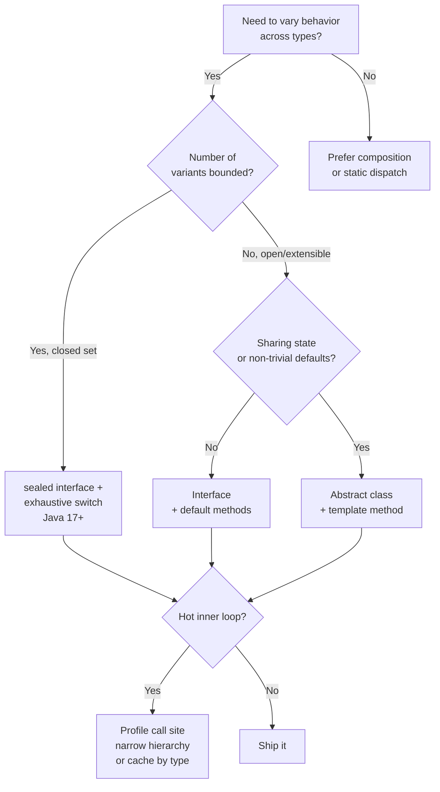

<!-- tldr -->
# Polymorphism

Polymorphism is the ability of a single symbol — a method name, a type reference, an operator — to resolve to different implementations depending on context. Java surfaces two primary flavors: **compile-time** (static) dispatch via overloading and generics, and **runtime** (dynamic) dispatch via method overriding through the JVM's virtual-method table. For senior engineers, the interesting territory is not the syntax but the JVM mechanics, the performance cliffs, and the design leverage it buys in large-scale systems.

<!-- standard -->

## What It Is

Polymorphism collapses the call site — `shape.draw()` is written once and dispatched at runtime to `Circle.draw()`, `Rectangle.draw()`, or whichever concrete class lives behind the reference. Java achieves this through:

- **Subtype polymorphism** — overriding inherited methods; dispatched via `invokevirtual` / `invokeinterface` bytecodes.
- **Parametric polymorphism** — generics (`List<T>`); erased to `Object` at the bytecode level, dispatch is static.
- **Ad-hoc polymorphism** — method overloading; resolved entirely at compile time.

## Why It Matters

- Decouples callers from implementations — adding a `Hexagon` subclass touches zero existing callers.
- The backbone of every major Java pattern: Strategy, Command, Template Method, Visitor, Decorator.
- Enables inversion of control — frameworks (Spring, Hibernate) hold `interface` references and you supply the implementation.

## Primary Techniques

| Technique | Resolved At | Bytecode | Example |
|---|---|---|---|
| Method overriding | Runtime | `invokevirtual` | `Animal.speak()` → `Dog.speak()` |
| Interface dispatch | Runtime | `invokeinterface` | `Runnable.run()` |
| Method overloading | Compile-time | `invokestatic` / `invokevirtual` | `println(int)` vs `println(String)` |
| Generics | Compile-time (erasure) | cast inserted | `Collections.sort(List<T>)` |
| Covariant return | Compile-time | bridge method generated | `clone()` returning subtype |

## Key Tradeoffs

- **Extensibility vs. predictability** — a deeply polymorphic hierarchy is open to extension but hard to reason about statically; use `sealed` classes (Java 17+) to bound it.
- **Interface vs. abstract class** — prefer interfaces for behavioral contracts; use abstract classes only when sharing mutable state or providing non-trivial default implementations you control.
- **Megamorphic call sites** — when the JIT sees 3+ concrete types at one call site, it abandons inlining and falls back to vtable lookup (~10× slower). Wide inheritance hierarchies at hot paths pay this tax.

<!-- deep -->

## JVM Dispatch Mechanics

### vtable and itable

Every class loaded by the JVM gets a **vtable** — a contiguous array of method pointers indexed by a slot assigned at class-loading time. `invokevirtual` resolves to a fixed slot offset; at runtime the JVM reads `object._class.vtable[slot]` — one pointer dereference, O(1).

Interfaces are more expensive. Because a class can implement many interfaces, the JVM builds an **itable** — a separate structure per (class, interface) pair. `invokeinterface` must search this structure, which is why `invokeinterface` has historically been ~2× slower than `invokevirtual`. Modern JVMs mitigate this with **inline caches** stored at the call site.

### JIT Inline Caches and Deoptimization

The JIT tracks the **type profile** at every call site:

1. **Monomorphic** — one concrete type ever observed → guard + devirtualized inline → fastest (~1–2 ns, zero dispatch overhead).
2. **Bimorphic** — two types → two inlined branches with type guards.
3. **Megamorphic** — three or more types → JIT inserts a vtable/itable lookup; no inlining. At a hot loop running 10M iterations/s, crossing this threshold adds ~80–180 ms/s of extra CPU.
4. **Deoptimization** — if a monomorphic assumption is invalidated by a new class being loaded, the JIT deoptimizes that compiled frame back to interpreted mode. In large plugin-based apps (OSGi, Spring with many beans), this can cause latency spikes of 10–50 ms on cold paths.

**Observation:** `invokedynamic` (Java 7+, used by lambdas and method references) uses a `CallSite` object with a `MethodHandle` that can be re-linked; it achieves monomorphic performance for stable lambdas.

---

## Real-World Systems That Exploit This

### JDBC Driver Abstraction
`java.sql.Connection`, `Statement`, `ResultSet` are pure interfaces. PostgreSQL, MySQL, Oracle each ship concrete implementations. Application code calls `stmt.executeQuery()` — a single megamorphic call site in a connection pool under mixed workloads. HikariCP pins connections to threads to keep the type profile monomorphic.

### Kafka SerDes
`Serializer<T>` and `Deserializer<T>` are single-method interfaces. Producers and consumers hold a reference typed to the interface. Each topic can be wired to `StringSerializer`, `AvroSerializer`, or custom implementations without touching producer/consumer logic. The call site in the send path is typically monomorphic per producer instance — no megamorphic tax.

### Spring IoC Container
Spring resolves `@Autowired` fields to concrete beans at startup, storing them as `Object` references in the bean registry. When you inject `ApplicationEventPublisher`, Spring delivers a `SimpleApplicationEventMulticaster` at runtime. The entire event multicasting loop is polymorphic dispatch across `ApplicationListener` implementations — often megamorphic, which is acceptable because event publishing is not a tight inner loop.

### Hibernate EntityPersister
Every mapped entity class has a corresponding `EntityPersister` implementation. Hibernate's session-level CRUD delegates to `persister.insert(...)`, `persister.load(...)`, etc. The hierarchy includes `SingleTableEntityPersister`, `JoinedSubclassEntityPersister`, `UnionSubclassEntityPersister` — chosen once at bootstrap, monomorphic at runtime per mapped type.

### Jackson ObjectMapper
`JsonSerializer<T>` and `JsonDeserializer<T>` are registered in a `SerializerProvider`. The serialization path resolves the concrete serializer via a type-keyed cache — effectively turning a wide polymorphic hierarchy into O(1) cache lookup backed by a `ClassValue` (JVM-native per-class slot), avoiding megamorphic dispatch on the hot serialize path.

---

## Failure Modes

| Failure | Root Cause | Mitigation |
|---|---|---|
| `ClassCastException` at runtime | Unchecked downcasts; erasure hiding type mismatch | Prefer generics; use `instanceof` + pattern match (Java 16+) |
| LSP violation | Subclass strengthens preconditions or weakens postconditions | Review contracts; use `sealed` + exhaustive `switch` |
| Megamorphic deopt spikes | Wide hierarchy at a single hot call site | Profile with JMH + `-XX:+PrintInlining`; narrow hierarchy or use `sealed` |
| Fragile base class | Superclass change breaks subclass invariants | Favor composition; mark non-overridable methods `final` |
| Covariant override confusion | Bridge methods inserted by `javac` create unexpected bytecode | Use `@Override`; be explicit about return-type narrowing |

---

## Capacity and Latency Reference Numbers

| Scenario | Latency | Notes |
|---|---|---|
| Monomorphic virtual call (JIT inlined) | ~1–2 ns | Single type seen; guard + inline |
| Bimorphic call | ~3–5 ns | Two guards + two inlined branches |
| Megamorphic call (vtable) | ~10–20 ns | No inlining; L1/L2 cache dependent |
| `invokeinterface` (itable, no JIT cache) | ~15–25 ns | Before JIT warms up |
| JIT deoptimization event | 10–50 ms one-time | Recompilation overhead |
| `ClassValue` lookup (Jackson pattern) | ~2 ns amortized | JVM-native per-class slot, lock-free |

---

## Interview Pitfalls

1. **"Overloading is not polymorphism"** — Strictly, overloading is ad-hoc polymorphism, but many interviewers mean *subtype* polymorphism. Clarify the axis before answering.
2. **Static methods are not polymorphic** — `Animal a = new Dog(); a.staticMethod()` calls `Animal.staticMethod()`. Static methods belong to the class, not the object; `invokevirtual` is not used.
3. **Generics don't give you runtime polymorphism** — `List<Dog>` is not a subtype of `List<Animal>` (invariance). `? extends Animal` (covariance) is read-only; `? super Dog` (contravariance) is write-only. Know PECS.
4. **`equals()` and `hashCode()` overriding symmetry** — `super.equals()` returning `true` for a subclass instance violates symmetry unless both classes are `final` or you check `getClass()` rather than `instanceof`.
5. **sealed classes change the design equation** — When the interviewer asks "how would you add a new operation without modifying existing classes?", pivot to Visitor *or* `sealed` + exhaustive pattern matching (Java 21 switch expression), not just inheritance.
6. **Performance at scale** — Any FAANG loop processing millions of heterogeneous objects (rules engines, codec pipelines, event buses) should prompt you to discuss call-site type profiles and JIT behavior, not just correctness.

---

## Decision Rubric: When to Reach for Subtype Polymorphism

**Use subtype polymorphism when:**
- The set of operations is stable but the set of implementations grows (open for extension → interface).
- You need the caller to be insulated from concrete types entirely (DI, plugin architecture, JDBC-style SPI).
- You want exhaustive compile-time checking over a closed set → `sealed` + `switch`.

**Avoid when:**
- You only have one or two known implementations — a direct call or a simple `if` is faster and easier to trace.
- The only variation is data, not behavior — a discriminated union / record is cleaner.
- The call site is a tight loop over millions of heterogeneous objects — benchmark first; consider type-specializing the loop.