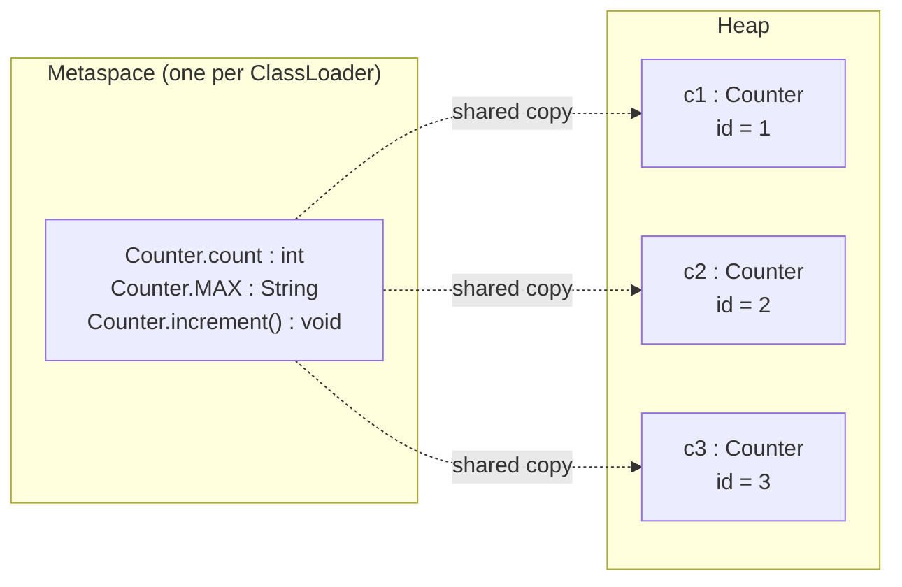
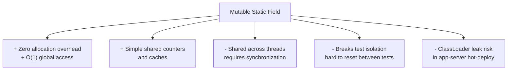
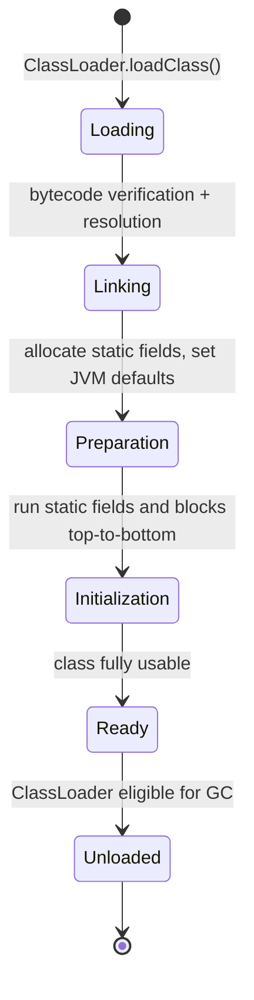
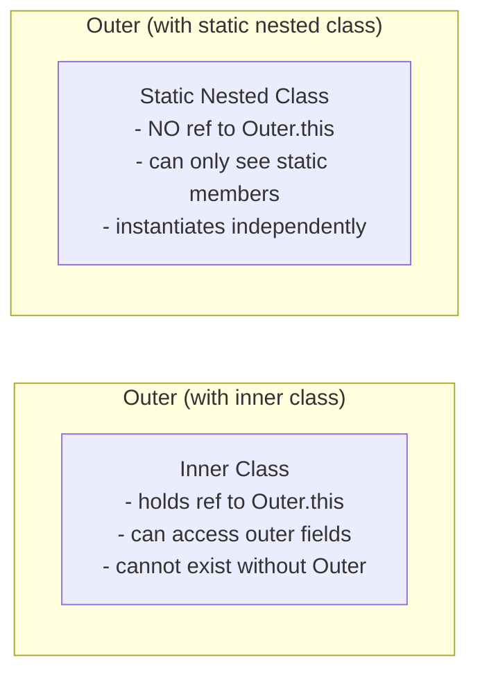

<!-- tldr -->
# The `static` Keyword in Java

`static` is a non-access modifier that ties a member to the *class* rather than to an *object instance*. Static fields share one copy per ClassLoader across all instances, static methods carry no implicit `this`, and static initializer blocks run exactly once during class loading via the JVM's `<clinit>` method. Misunderstanding its memory model, threading semantics, or initialization order is the fastest way to fail a senior-level Java interview.



<!-- standard -->

## What It Is

`static` applies to five constructs:

| Construct | Behavior |
|---|---|
| **Field** | One memory slot per ClassLoader; all instances share it |
| **Method** | No `this`; can only directly access other static members |
| **Initializer block** | Executes top-to-bottom during `<clinit>`; runs once at class load |
| **Nested class** | No implicit reference to the enclosing instance |
| **Import (`import static`)** | Pulls a static member into the current compilation unit's namespace |

## Why It Matters

Static members are the foundation of several pervasive patterns: utility classes (`Math`, `Collections`), constants (`HttpStatus.OK`), factory caches, and Singletons. They also carry the highest **blast radius for bugs** — a mutable static field is effectively global state shared across every thread and every caller in that ClassLoader.

## Primary Techniques

- **Constants** — `public static final` fields are inlined by `javac` at call sites (compile-time constants), so changing the value requires recompiling dependent classes.
- **Utility methods** — stateless helpers (`StringUtils.isEmpty`). Prefer these over instance methods when no per-object state is involved.
- **Static factory methods** — `valueOf`, `of`, `getInstance`; allow caching and polymorphic return types.
- **Static nested classes** — used in builder patterns (`Builder` inside `HttpRequest`) to avoid retaining a reference to the outer instance.
- **Lazy initialization holder idiom** — thread-safe, lock-free Singleton using class-loading guarantees (see deep section).

## Key Tradeoffs



- **Immutable statics** (`static final`) — safe; no synchronization needed.
- **Mutable statics** — require `volatile`, `AtomicXxx`, or explicit locking.
- **Inheritance** — static methods are *hidden*, not *overridden*; polymorphic dispatch does not apply. Calling a static method through a subclass reference dispatches to the declared type at compile time.

---

<!-- deep -->

## Class Loading and `<clinit>` Internals

### JVM Initialization Lifecycle



**Preparation** sets every static field to its JVM default (`0`, `false`, `null`) *before* user code runs. **Initialization** then runs `<clinit>` — a synthetic method the compiler weaves from all static field initializers and `static { }` blocks, strictly in **source order**.

### Initialization Order Hazard

```java
class Broken {
    static int B = A * 2;   // A is 0 at this point (Preparation default)
    static int A = 10;      // runs after B
}
// Broken.B == 0, not 20
```

This is a classic interview trap. The fix is to declare `A` before `B`, or use a static initializer block after both declarations.

### Forward Reference Rule

The compiler enforces a *forward reference restriction*: you can write to a static field that is declared later, but you cannot *read* it by simple name before its declaration. This prevents most (but not all) ordering bugs from compiling.

---

## Thread Safety of Static Fields

| Field type | Safe? | Mechanism |
|---|---|---|
| `static final` primitive / immutable object | ✅ Yes | JMM guarantees visibility after `<clinit>` |
| `static final` with mutable contents (e.g., `HashMap`) | ⚠️ Partially | Reference is safe; contents need synchronization |
| `static volatile` | ✅ Yes for single reads/writes | `volatile` ensures visibility; not atomicity |
| `static AtomicLong` | ✅ Yes for CAS ops | Lock-free; ~5–20 ns per operation |
| Plain `static` mutable | ❌ No | Data race without synchronization |

**Rule of thumb:** A `static` field accessed by more than one thread must be either immutable, `volatile`, or wrapped in a concurrent abstraction.

---

## The Initialization-on-Demand Holder Idiom

```java
public class Singleton {
    private Singleton() {}

    private static final class Holder {
        static final Singleton INSTANCE = new Singleton();
    }

    public static Singleton getInstance() {
        return Holder.INSTANCE;
    }
}
```

- **Why it works:** The JVM guarantees `<clinit>` for `Holder` runs exactly once and is visible to all threads — using class-loading as a lock.
- **No `synchronized` or `volatile` needed.**
- **Lazy:** `Holder` is only loaded when `getInstance()` is first called.
- This is preferred over double-checked locking for stateless singletons in any Java version.

---

## Static Nested Class vs Inner Class



**Memory leak risk with inner classes:** an anonymous inner class (e.g., a `Runnable` submitted to a thread pool) holds a reference to its outer instance, preventing the outer object from being GC'd for as long as the task lives. Prefer static nested classes or lambdas that capture only what they need.

---

## Real-World Usage in Production Systems

| System / Library | How `static` is used |
|---|---|
| **Guava `ImmutableList.of()`** | Static factory; returns cached empty instance for zero-arg call |
| **Spring `ApplicationContext`** | `ContextLoader.currentContextPerThread` — `static ThreadLocal` to bind context per ClassLoader |
| **Log4j / SLF4J** | `LogManager.getLogger(Class)` — static factory backed by a static `Map` of logger instances |
| **Netty `AttributeKey`** | `static final AttributeKey<T>` constants — one key object per logical attribute, shared globally |
| **JUnit 5 `@BeforeAll`** | Method must be `static` (or instance method in `@TestInstance(PER_CLASS)`) — directly tied to class lifecycle |
| **JDBC `DriverManager`** | `static` registry of `Driver` implementations loaded via `Class.forName` side effect |

---

## Failure Modes

### 1. ClassLoader Leak in App Servers (Tomcat, JBoss)

If a `static` field in a webapp's class holds a reference to any object from the webapp ClassLoader (e.g., a `static Map<Class<?>, ...>` keyed by application classes), hot-redeploy creates a new ClassLoader but the old one can't be GC'd. This is the root cause of `OutOfMemoryError: Metaspace` after N redeployments.

**Detection:** Use heap dumps + MAT's "Leak Suspects" report; look for ClassLoader chains.

### 2. Test Pollution

Static mutable state persists across test cases within a JVM process. JUnit 5 runs tests in the same JVM by default.

**Mitigation:** Use `@AfterEach` to reset; or refactor to dependency injection so state is injected rather than statically held; or fork a new JVM per test class with Surefire's `forkCount=1 reuseForks=false`.

### 3. Static Method Untestability

`static` methods cannot be overridden, so they cannot be substituted by a test double via subclassing. Mockito's inline mock maker (`mockito-inline` / `mockito-subclass`) can mock `static` since Mockito 3.4, but this requires explicit `MockedStatic` scoping and is a code smell when overused.

### 4. `<clinit>` Deadlock

Two classes that each reference each other in their static initializers can deadlock: Thread A holds the initialization lock for class X while waiting for class Y; Thread B holds Y's lock waiting for X.

**JVM spec §5.5** says initialization locks are per-class; circular dependencies during concurrent class loading produce `ExceptionInInitializerError` or hang.

---

## Capacity and Latency Notes

- Static field read: **~1 ns** (direct reference in Metaspace; no object dereference).
- Instance field read: **~1–2 ns** (one extra pointer dereference through the object header).
- `AtomicLong.incrementAndGet()` (uncontended): **~5 ns**; under high contention, prefer `LongAdder` (**~1 ns amortized** at 1M QPS via striped cells).
- Class loading + `<clinit>` execution: **microseconds to low milliseconds** depending on initializer complexity; never assume it's free in startup-critical paths.
- Metaspace itself is **off-heap**; defaults to unlimited growth — set `-XX:MaxMetaspaceSize` in production to prevent unbounded native memory consumption.

---

## Interview Pitfalls Checklist

1. **"static methods are polymorphic"** — False. They are hidden, not overridden. `Animal a = new Dog(); a.staticMethod()` calls `Animal.staticMethod`.
2. **"static final constants can be freely changed in libraries"** — False. Primitive/`String` compile-time constants are inlined; changing the library value requires recompiling callers.
3. **Forgetting `volatile` on a static field read by multiple threads** — classic data-race bug, especially in lazy-init patterns.
4. **Using `static` to avoid passing dependencies** — treat as a design smell; prefer constructor injection for testability.
5. **Assuming static state resets between tests** — it doesn't without explicit teardown.
6. **Inner class holding outer reference** — often the non-`static` nested class is a mistake; default should be `static`.

---

## When to Reach for `static`

```
Is the data/behavior inherently per-class rather than per-instance?
├─ Yes, and it will NEVER mutate after init  → static final ✅
├─ Yes, and mutation is needed               → static + AtomicXxx / volatile ⚠️ (justify carefully)
├─ It's a utility method with no state       → static method ✅
├─ It's a nested helper class                → static nested class ✅ (default choice)
└─ No → use instance field / method
```

The guiding principle: **`static` is appropriate when the concept genuinely belongs to the type, not to any particular object of that type.** Everything else is a tradeoff between convenience and correctness.