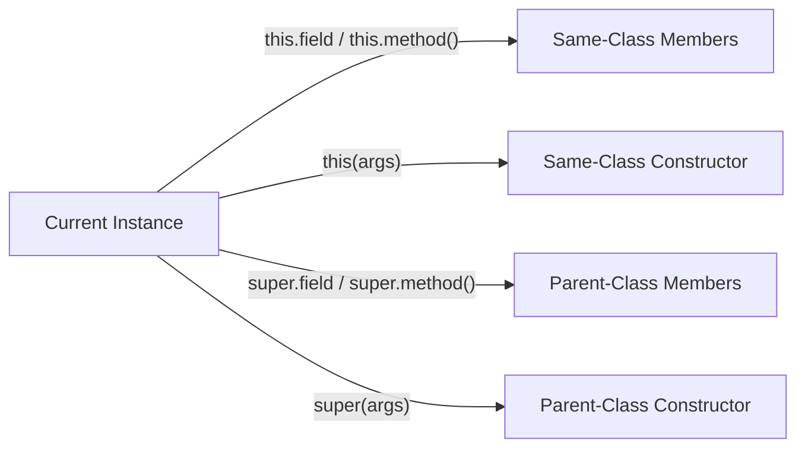
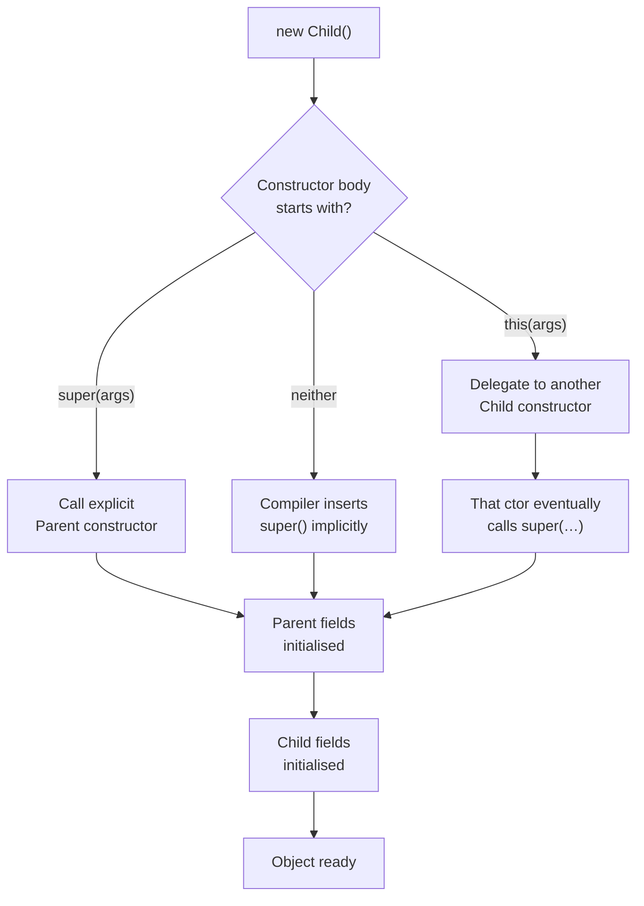
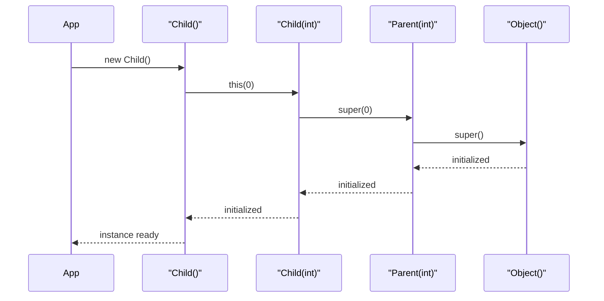
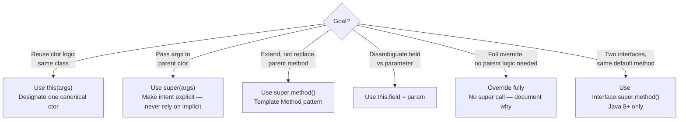

<!-- tldr -->
# `this` and `super`

`this` is an implicit reference to the current object instance; `super` is a reference to the parent class's view of that same object. Together they control constructor delegation, field shadowing resolution, and explicit invocation of overridden methods. Misunderstanding their initialization ordering is one of the most reliable sources of subtle Java bugs — and interview traps.



<!-- standard -->

## What They Are

| Keyword | Resolves To | Legal Contexts |
|---------|-------------|----------------|
| `this` | Current object reference | Instance methods, constructors |
| `super` | Parent class's view of current object | Instance methods, constructors |
| `this(…)` | Delegating constructor — same class | First statement of a constructor only |
| `super(…)` | Parent constructor call | First statement of a constructor only |

Both are **compile-time constructs**. The JVM lowers them to `invokespecial` bytecode; there is zero runtime overhead beyond the call itself.

## Why It Matters

- **Canonical constructors**: Centralise validation in one constructor; all overloads delegate via `this(…)`, eliminating duplicated logic.
- **Open/Closed extension**: Subclasses call `super.method()` to augment, not replace, parent behaviour.
- **Fluent / Builder APIs**: `return this` enables method chaining — `builder.setA(1).setB(2).build()`.
- **Framework correctness**: Spring `AbstractApplicationContext`, Hibernate `@MappedSuperclass`, and JUnit `@BeforeEach` all rely on deterministic `super()` call ordering across the hierarchy.

## Primary Techniques

- **`this(…)` chaining**: Must be the **first statement**; pick one constructor as the *canonical* entry point and delegate everything else to it.
- **`super(…)` delegation**: If omitted, the compiler silently inserts `super()` — which fails at compile time if the parent has no no-arg constructor.
- **Field disambiguation**: `this.name = name` separates the instance field from a same-named parameter.
- **Overridden method access**: `super.draw()` invokes the parent's implementation from inside an override — the template-method pattern's backbone.

## Key Tradeoffs

| Goal | `this(…)` | `super(…)` |
|------|-----------|------------|
| Reuse init/validation logic | ✅ Delegate to canonical ctor | ❌ Different class |
| Extend parent behaviour | ❌ Same class only | ✅ Invoke parent impl |
| Fluent return type | ✅ `return this` | ❌ |
| Both in one constructor | ❌ Compile error | ❌ Mutual exclusion |



<!-- deep -->

## Algorithm: Constructor Initialisation Chain

The JVM Specification (JVMS §2.9) mandates that every constructor invoke **either** another constructor of the same class (`this(…)`) **or** a constructor of its direct superclass (`super(…)`) as its very first action. The chain terminates unconditionally at `Object.<init>()`.

### Compile-Time Rules
1. `this(…)` and `super(…)` **cannot both appear** in the same constructor — choosing one excludes the other.
2. Both must be the **first statement** in the constructor body. Anything before them (including a `try` block) is a compile error.
3. Circular `this(…)` chains produce `error: recursive constructor invocation` — the compiler detects cycles statically.
4. If the parent class exposes **no no-arg constructor** and the child writes no explicit `super(…)`, compilation fails in the child — even though the child wrote no code.

### Constructor Chain Execution — Sequence View



### Static Context Restriction

`this` and `super` are **illegal in static methods, static initializers, and static field initializers**. The JVM has no implicit instance reference slot (`aload_0`) for static frames; the compiler rejects any use at compile time.

### Java 8+ Interface Default Method Disambiguation

```java
interface A { default String greet() { return "A"; } }
interface B { default String greet() { return "B"; } }

class C implements A, B {
    @Override
    public String greet() {
        return A.super.greet(); // Qualified super — picks A's default
    }
}
```

`InterfaceName.super.method()` is the only form where `super` takes a qualifier. It exists solely to resolve diamond conflicts between default methods — not available for classes.

---

## Real-World Systems

### Spring Framework
`AbstractApplicationContext.refresh()` is a template-method implementation; subclasses like `AnnotationConfigApplicationContext` call `this(new AnnotatedBeanDefinitionReader(this), ...)` to delegate to a canonical constructor that initialises the `DefaultListableBeanFactory`. The entire hierarchy depends on `super()` calls firing in the correct order before bean post-processors register.

### Java Collections Framework
`ArrayList` has three public constructors; the no-arg version delegates via `this(10)` to the capacity constructor, centralising the backing-array allocation. `AbstractList → AbstractCollection → Object` is the `super()` chain that fires on every `new ArrayList<>()`.

### Hibernate / JPA
`@MappedSuperclass` hierarchies require proper `super()` wiring. Hibernate's bytecode enhancer instruments `this` references at load time to redirect field accesses through lazy-loading proxies. An entity missing a no-arg constructor reachable via `super()` throws `InstantiationException` at `SessionFactory` bootstrap — before any query is executed.

### Java `Enum`
Every `enum` constant compiles to a subclass of `java.lang.Enum`. The compiler auto-generates `super(name, ordinal)` calls; developers cannot write explicit `super(…)` in an enum constructor. This is why `enum` cannot extend any class — the `super()` slot is already consumed by `Enum`.

---

## Failure Modes

| Failure | Root Cause | Detection |
|---------|------------|-----------|
| `VerifyError` at runtime | Bytecode missing `invokespecial <init>` (ASM/CGLIB bug) | Integration tests; `-XX:+VerifyOops` |
| `NullPointerException` in constructor | Overridable method called via `this` before subclass fields init | SpotBugs `MC_OVERRIDABLE_METHOD_CALL_IN_CONSTRUCTOR` |
| `StackOverflowError` | Circular `this(…)` chain bypassed via reflection or deserialization | Blocked at compile time in source; add ctor smoke tests |
| Stale parent state after `clone()` | Forgetting `super.clone()` in `Cloneable` impl | Unit test asserting deep-equality of parent fields |
| Silent wrong value | Shadowing a parent **field** instead of overriding a method — fields are NOT polymorphic | Static analysis, code review |

### The Overridable-Method-in-Constructor Anti-Pattern

```java
class Parent {
    Parent() { init(); }       // dispatches to Child.init() — before Child is set up
    void init() {}
}

class Child extends Parent {
    private final int value;

    Child() {
        super();               // fires Parent(), which calls init()
        value = 42;            // too late — init() already ran with value == 0
    }

    @Override
    void init() {
        System.out.println(value); // prints 0, not 42
    }
}
```

Fix: make `init()` `private` or `final`, or use a factory method that calls `init()` after construction.

---

## Bytecode: `invokespecial` vs `invokevirtual`

| Instruction | Used For | Polymorphic Dispatch? |
|-------------|----------|-----------------------|
| `invokevirtual` | `this.method()` — normal virtual call | ✅ Vtable lookup |
| `invokespecial` | `super.method()`, constructors, `private` methods | ❌ Static binding |

`super.equals(o)` compiles to `invokespecial java/lang/Object.equals`, unconditionally calling `Object.equals` regardless of any sibling's override. This is the **only** way to escape the vtable.

---

## Capacity / Latency Notes

- `invokespecial` vs `invokevirtual`: **< 1 ns** difference on JIT-warmed HotSpot. Never a bottleneck.
- Deep inheritance chains (> 6–7 levels) can prevent JIT inlining due to megamorphic call-site pressure; keep hierarchies shallow or prefer composition past that depth.
- Constructor chaining via `this(…)` adds **zero heap allocation** — no intermediate object is created between the delegating and target constructor.
- Hibernate proxy creation via CGLIB subclassing emits `super(…)` bytecode at runtime; each proxy class generation costs ~0.5–2 ms at startup, negligible per entity type.

---

## Interview Pitfalls

1. **"Can you call both `this()` and `super()` in the same constructor?"**
   No — compile error. Both compete for the mandatory first-statement slot.

2. **"What happens if you define no constructor at all?"**
   The compiler generates a public no-arg constructor with an implicit `super()`. If the parent has no accessible no-arg constructor, *the child* fails to compile — even though the child author wrote zero constructor code.

3. **"Are fields polymorphic like methods?"**
   No. `super.count` and `this.count` can refer to two **different memory slots** — the parent's and the child's. Field access is resolved at compile time by the *declared* (static) type, not the runtime type. This is a classic trick question.

4. **"Can a static method use `this`?"**
   No. `this` is undefined in any static context; the compiler rejects it outright.

5. **"What does `super` mean inside a lambda?"**
   A lambda captures the enclosing instance's `this`. `super` inside a lambda refers to the **enclosing class's** superclass, not some "lambda superclass." The behaviour is identical to using `super` in a regular method of the enclosing class.

6. **"Explain `Foo.super.bar()` syntax."**
   Interface default method disambiguation introduced in Java 8. Required when a class implements two interfaces with the same default method signature.

---

## Decision Rubric: When to Reach for Each



### Summary Rules
- **`this(…)`**: 3+ constructors with overlapping params → pick one canonical constructor, delegate everything else.
- **`super(…)`**: Any non-trivial parent initialisation (clocks, registries, validators) → pass explicitly even when implicit would compile; it documents intent.
- **`super.method()`**: Template method and decorator patterns only. Avoid in deep hierarchies — it creates tight coupling to the parent's implementation detail.
- **Never** call overridable (`public`/`protected` non-`final`) methods from a constructor. Use `private` or `final` helper methods if construction-time logic is unavoidable.