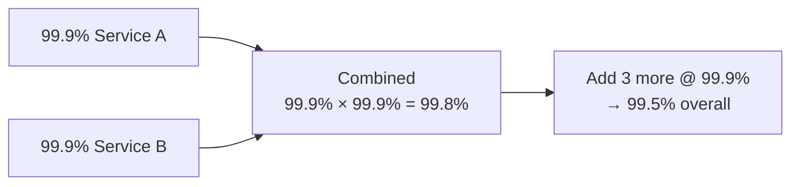
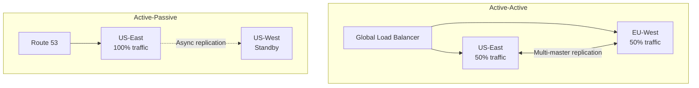
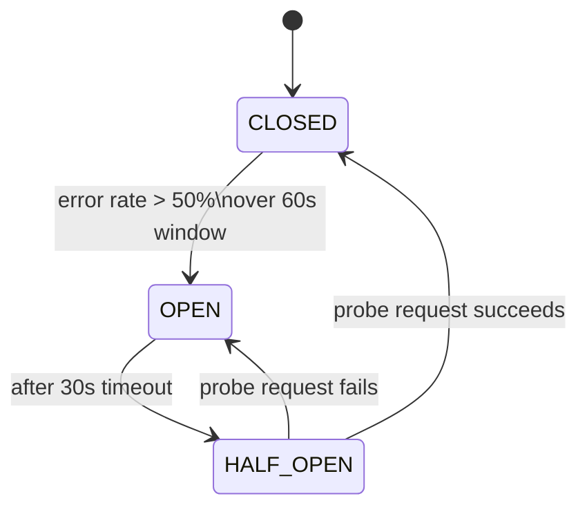

<!-- tldr -->
# Availability

Availability measures the fraction of time a system can successfully serve requests. It compounds multiplicatively across dependencies—five components at 99.9% yields only 99.5% combined. The two independent levers are MTBF (reduce failure frequency) and MTTR (reduce recovery time); mature teams invest disproportionately in MTTR because hardware will always fail eventually.



<!-- standard -->

## What It Is

Availability = uptime / (uptime + downtime), expressed as a percentage. Converting to real downtime makes the numbers meaningful:

| SLA | Downtime/Year | Downtime/Month | Typical Use |
|---|---|---|---|
| 99% | 3.65 days | 7.2 hours | Internal tools |
| 99.9% | 8.76 hours | 43.2 min | Standard web services |
| 99.95% | 4.38 hours | 21.6 min | User-facing APIs |
| 99.99% | 52.6 min | 4.32 min | Payment systems |
| 99.999% | 5.26 min | 25.9 sec | Telecoms, finance |

The gap between 99% and 99.9% is **3.5 days/year**. The gap between 99.99% and 99.999% is only 47 minutes—but requires a qualitative architecture leap.

## Why It Matters

- **Revenue**: 6-hour Facebook outage (2021) → ~$60–100M in lost ad revenue.
- **Trust**: Users who hit an outage often never return.
- **Cascading SLA credits**: contractual penalties compound across downstream customers.
- **Invisible costs**: on-call engineer hours, regulatory scrutiny, reputational damage.

## Primary Techniques

- **Eliminate SPOFs**: redundancy at every stack layer—DNS, CDN, load balancer, app tier, cache, database.
- **N+2 capacity**: deploy enough surplus that two simultaneous node failures cause zero degradation.
- **Deep health checks**: probe DB connectivity and downstream deps, not just HTTP process liveness.
- **Circuit breakers**: stop hammering a struggling dependency; return a fallback immediately.
- **Progressive deployment**: canary → partial → full rollout; catch bugs at 1% blast radius, not 100%.
- **Bulkheads**: separate connection pools per feature so one slow query can't drain shared resources.

## Key Tradeoffs

| Approach | Pro | Con |
|---|---|---|
| Active-Passive | Lower cost, simpler consistency | RTO 2–5 min, cold-start penalty |
| Active-Active | RTO ~30s, lower latency globally | 2× infra cost, write-conflict complexity |
| Sync replication | RPO = 0 | Higher write latency (wait for ack) |
| Async replication | Low write latency | RPO = seconds–minutes of data loss |



<!-- deep -->

## Deep Dive: Building for High Availability

### The MTBF/MTTR Formula

```
Availability = MTBF / (MTBF + MTTR)
```

**Example A** — MTBF 720h, MTTR 1h → **99.86%**  
**Example B** — Same MTBF, MTTR cut to 5 min → **99.988%** (+~1 nine)  
**Example C** — MTBF halved to 360h, MTTR still 1h → **99.72%** (worse than A)

Conclusion: halving recovery time does more for availability than halving failure rate. Design your systems to fail fast and recover automatically.

---

### Redundancy: Layered and Capacity-Planned

A fully redundant stack eliminates SPOFs at every tier:

```mermaid
flowchart TD
    Client --> DNS["Route 53\n(health checks, multi-region)"]
    DNS --> CDN["CloudFront\n(edge, global)"]
    CDN --> ALB["ALB\n(≥2 AZs)"]
    ALB --> ASG["App Servers\nAuto-scaling, min 3×3 AZs"]
    ASG --> Redis["Redis Cluster\n3 primary + 3 replica shards"]
    ASG --> DB["Aurora\n1 primary + 2 read replicas\nmulti-AZ, auto-failover"]
```



**N+2 capacity math** (50k QPS target, 5k QPS/server):
- N = 10 servers
- N+2 = 12 servers deployed
- Survive any 2 simultaneous failures at full load

---

### RPO and RTO for Data Tiers

| Strategy | RPO | RTO | Notes |
|---|---|---|---|
| Synchronous replica (Aurora) | 0 | 30–60s auto-failover | Higher write latency |
| Async replica | Seconds–minutes | 30–60s auto-failover | Lower write latency |
| Manual failover (Patroni) | Minutes | 15–30 min | Human in the loop |
| Cross-region backup restore | Hours | Hours | DR of last resort |

Define RPO and RTO **before** choosing replication strategy—not after.

---

### Health Checks Done Right

**Shallow** (process alive? → 200 OK): insufficient. App responds 200 but DB connection is broken → every routed user gets an error.

**Deep readiness probe**:
```
GET /health/ready
  ✓ SELECT 1 (PostgreSQL reachable?)
  ✓ PING (Redis reachable?)
  ✓ Auth service /health (deps healthy?)
→ 200 if ALL pass; 503 with JSON detail if any fail
```

**Liveness vs Readiness (Kubernetes)**:
- **Liveness**: shallow—process responsive? Failure → container killed + restarted.
- **Readiness**: deep—can it serve traffic? Failure → removed from LB pool, not killed.

**Cascading failure trap**: if your readiness probe calls Service B, and Service B is slow, your pod appears unhealthy → traffic redistributes → Service B gets even more load → cascade. Fix: health checks must not depend on downstream latency. Use a local timeout of ≤100ms; treat a slow dependency as a pass at the health-check level, handle it with a circuit breaker at the call level.

---

### Circuit Breaker States



- **CLOSED**: normal pass-through. Track error rate in a rolling window.
- **OPEN**: return fallback immediately (cached response, empty list, degraded feature). Dependency gets breathing room.
- **HALF-OPEN**: single probe. One success re-closes; one failure reopens.

Real-world implementations: **Netflix Hystrix** (deprecated → Resilience4j), **AWS SDK** (built-in retry+backoff), **Istio** (mesh-level circuit breaking without code changes).

---

### Progressive Deployment & Blast Radius

```
Stage 1 (Canary)   →  1% of fleet  →  monitor 15 min  →  at-risk: 1%
Stage 2 (Partial)  → 25% of fleet  →  monitor 1 hour  →  at-risk: 25%
Stage 3 (Full)     → 100% of fleet →  monitor 24 hours
```

Auto-rollback trigger: if P99 latency or error rate crosses threshold during any stage, roll back within 60–120 seconds. Manual rollback MTTR: 15–30 min. Automated rollback MTTR: **1–2 min**.

**Bulkhead example** (100 total DB connections):
```
70 → checkout / payment (critical path)
20 → background workers
10 → analytics / reporting
```
Slow analytics query exhausts its 10 slots. Checkout is unaffected.

---

### Error Budgets (Google SRE Model)

An **SLO** (Service Level Objective) like 99.9% implies an error budget of **0.1% of requests** (or 43.2 min/month) that can fail without violating the agreement.

**Budget accounting**:
- New feature deploys consume budget (they introduce risk).
- If budget is full → freeze non-critical deploys until the window resets.
- If budget is comfortable → ship faster.

This converts "reliability vs velocity" from a cultural conflict into a data-driven negotiation. Teams that have burned their budget must focus on reliability work first.

---

### Real-World Systems and Their Availability Patterns

| System | Strategy | Key Detail |
|---|---|---|
| **DynamoDB** | Multi-AZ active-active | 99.999% SLA; synchronous writes to ≥2 AZs |
| **Cassandra** | Leaderless, tunable quorum | Write to W nodes; read from R nodes; W+R > N for strong consistency |
| **Kafka** | Leader + ISR replicas | `min.insync.replicas=2`; producer `acks=all`; ~1–2ms P99 write latency |
| **Aurora** | 1 writer + up to 15 readers | 6-way storage replication across 3 AZs; auto-failover in 30s |
| **Spanner** | Active-active global | TrueTime for external consistency; RPO=0 globally; ~5ms single-region, ~100ms cross-continent |

---

### Chaos Engineering

Netflix's approach:
- **Chaos Monkey**: randomly kills VM instances in production during business hours.
- **Chaos Kong**: terminates entire AWS regions.
- **Latency injection**: adds artificial delay to service calls to surface timeout/retry bugs.

Philosophy: failure is inevitable—encounter it in a controlled, expected way rather than at 3am. Teams that practice failure regularly reduce MTTR because recovery becomes **routine**.

---

### Capacity & Latency Numbers to Know

- Aurora auto-failover: **30–60s** RTO
- Route 53 DNS TTL for failover: **60s** (clients cache; budget 60–90s for propagation)
- Redis Cluster failover: **~10s**
- Typical deep health check interval: **10s**, timeout **2s**
- P99 target for health check response: **< 100ms** (don't let your health check be your bottleneck)
- Canary stage minimum duration: **15 min** (enough for metrics to stabilize)

---

### Interview Pitfalls

1. **Forgetting the multiplicative rule.** Interviewers will probe: "your app is 99.9% and your DB is 99.9%—what's your system availability?" Answer: 99.8%, not 99.9%.
2. **Treating Active-Active as always better.** It's more expensive and introduces write-conflict complexity. Know when Active-Passive is the right call.
3. **Deep health checks that create cascades.** Know the fix: independent checks, local timeouts, never call downstream services from a health probe.
4. **Conflating RPO with RTO.** RPO = data loss tolerance. RTO = time-to-recovery tolerance. Different business owners care about each.
5. **Ignoring operational failures.** Certificates expiring, disks filling, connection pools exhausting—these cause more outages than hardware failures.

---

### Decision Rubric: When to Reach for What

| Scenario | Reach For |
|---|---|
| Single-region, cost-sensitive | Active-Passive with automated failover |
| Global user base, < 1s RTO required | Active-Active (accept consistency tradeoffs) |
| Write-heavy, zero data loss required | Synchronous replication, accept write latency |
| Read-heavy, tolerate seconds of staleness | Async replication + read replicas |
| Frequent deploys, risk-averse | Canary + automated rollback + error budgets |
| Noisy dependency (third-party API) | Circuit breaker + local fallback cache |
| Resource contention between features | Bulkheads (separate pools per criticality tier) |