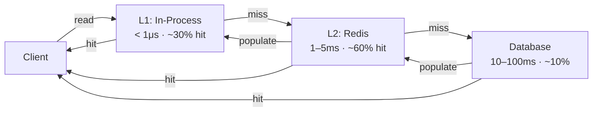
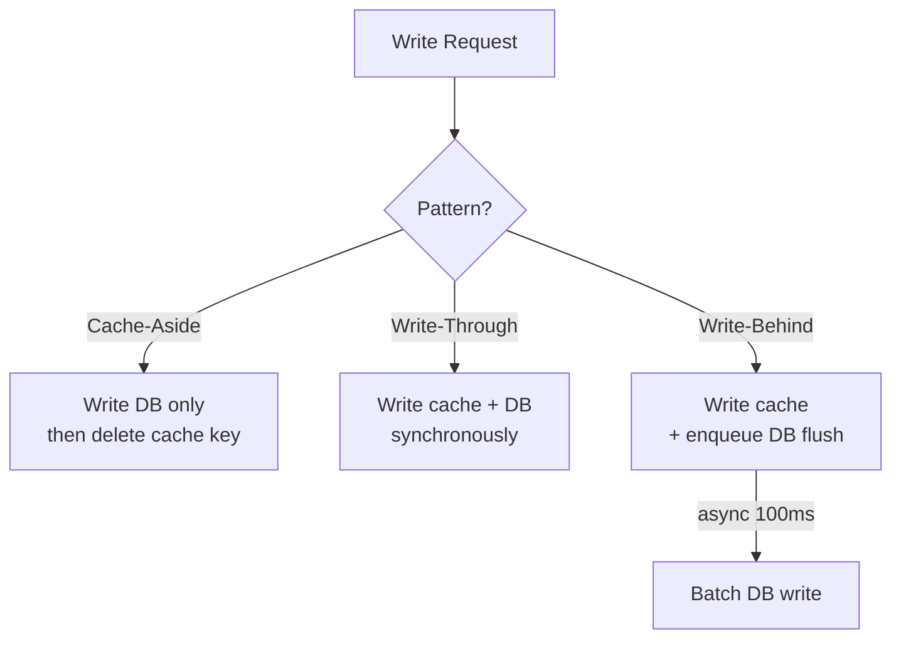
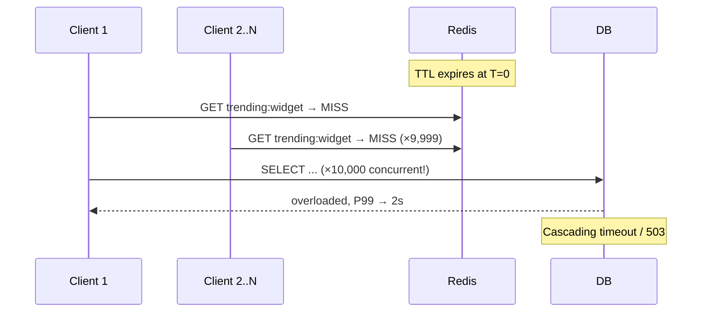
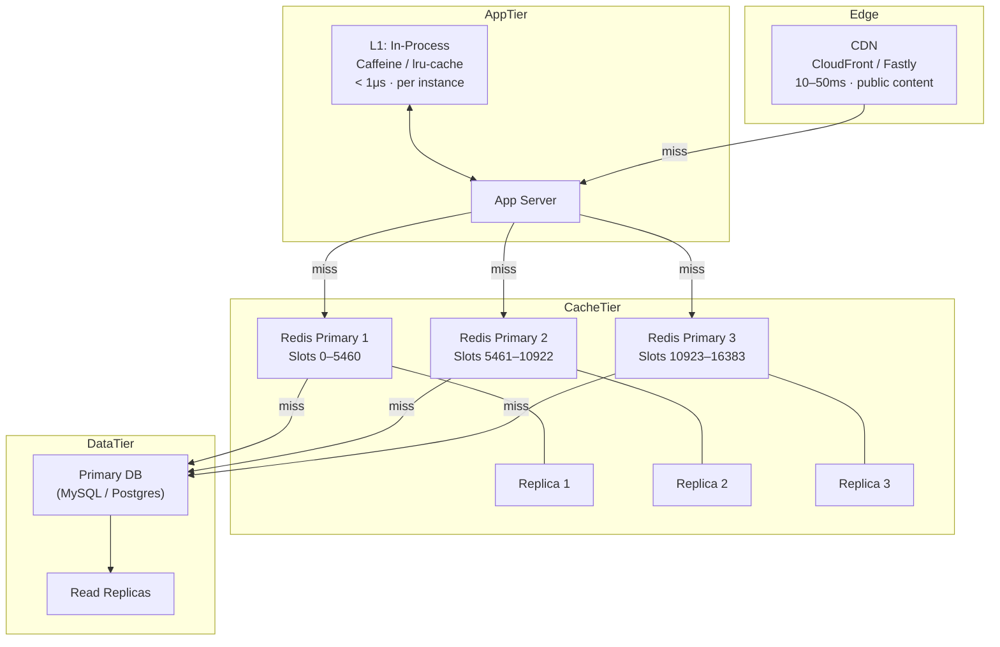

<!-- tldr -->
# Caching

A cache stores the result of an expensive computation or I/O operation so subsequent requests skip that cost entirely. At 90% hit rate, 10,000 req/s becomes 1,000 req/s on your database. The discipline is choosing the right write pattern, eviction policy, and invalidation strategy — and knowing when the tradeoffs aren't worth it.



<!-- standard -->

## What It Is

A cache is a fast, finite store placed in front of a slower, larger data source. Requests check the cache first; on a miss they fall through to the source of truth, then backfill the cache. Multiple layers stack: in-process heap (Caffeine, lru-cache) → distributed cluster (Redis, Memcached) → CDN edge (CloudFront, Fastly).

**The numbers that justify everything:**

| Tier | Latency | Relative cost |
|---|---|---|
| L1 CPU cache | ~1 ns | — |
| In-process heap | ~100 ns | — |
| Redis (LAN) | ~1 ms | 1× |
| SSD read | ~0.1 ms | — |
| Database query | 10–100 ms | 100–1,000× Redis |
| Cross-region | ~100 ms | — |

**Cost impact at 90% hit rate (10B req/month):** DynamoDB alone ≈ $2,500/month → Redis + remaining DB hits ≈ $350/month. ~88% savings.

## Primary Patterns

- **Cache-aside (lazy loading):** App checks cache, loads DB on miss, populates cache. Resilient — cache failure degrades to slower, not broken. Default choice.
- **Write-through:** Write to cache and DB synchronously before ACK. Always consistent; write latency is additive (cache + DB).
- **Write-behind (write-back):** Write to cache, queue async DB flush every ~100ms. Low write latency; data loss risk if cache crashes before flush. Use for gaming leaderboards, analytics counters.

| Pattern | Write Latency | Data Safety | Best For |
|---|---|---|---|
| Cache-aside | DB only | High | Read-heavy, large objects |
| Write-through | Cache + DB (additive) | High | Data read immediately after write |
| Write-behind | Cache only (fast) | Low | High-freq writes, eventual consistency OK |

## Eviction Policies

| Policy | Evicts | Best For |
|---|---|---|
| LRU | Least recently accessed | General purpose — correct 90% of the time |
| LFU | Lowest access frequency | Long-lived caches with Zipfian (80/20) access |
| TTL | Past expiration time | Correctness, preventing indefinite staleness |
| Random | Random key | ~80% as effective as LRU, zero overhead |

Redis defaults to sampled-approximate LRU (`allkeys-lru`). LFU handles one-hit-wonder scan pollution better but adds complexity.

## Key Tradeoffs

- **Staleness vs. freshness:** Every cache is eventually inconsistent. TTL is the floor; explicit invalidation on write reduces the window to near-zero.
- **Hit rate vs. memory:** A cache that is too small thrashes — eviction rate climbs, effective hit rate collapses. Alert at `eviction_rate > 1,000/sec`.
- **Resilience vs. consistency:** Cache-aside degrades gracefully. Write-through and write-behind have harder failure modes (split-brain, data loss).



<!-- deep -->

## Algorithms & Formulas

### Effective Average Latency

With a multi-layer cache:

```
E[latency] = P(L1 hit) × lat_L1 + P(L2 hit) × lat_L2 + P(miss) × lat_DB
           = 0.30 × 0.001ms + 0.60 × 2ms + 0.10 × 50ms
           = 6.2ms   vs   50ms baseline  →  8× improvement
```

### LRU Implementation

O(1) get and put via **doubly-linked list + hashmap**:
- Hashmap: key → list node pointer
- List: head = MRU, tail = LRU
- On get: unlink node, move to head
- On put: insert at head; if over capacity, evict tail

### LFU Implementation

**Frequency table + min-heap** (or O(1) with a doubly-linked list of frequency buckets). Complexity: O(log n) per operation with heap; O(1) with bucket approach (used in production caches).

### Probabilistic Early Expiration (XFetch)

```python
def get_with_early_expiry(key, ttl=600, beta=1.0):
    value, expiry_time = redis.get_with_expiry(key)
    remaining = expiry_time - time.now()
    # Refresh probability increases as expiry approaches
    if remaining < ttl * 0.1 * random.random() * beta:
        value = fetch_from_db(key)
        redis.set(key, value, ex=ttl)
    return value
```

Beta controls aggressiveness. At beta=1.0, refreshes begin probabilistically when < 10% of TTL remains. No lock, no thundering herd.

---

## Real-World Systems

### Redis
- Single instance: ~100K ops/sec, bounded by single-node RAM (typically 32–256GB).
- **Redis Cluster:** Shards key space into **16,384 hash slots** (`CRC16(key) % 16384`). Adding a node migrates ~1/N slots — only migrated keys become cold misses. Each primary has 1–2 replicas for HA + read scaling.
- **Redis Sentinel:** HA without sharding. Suitable for < 25GB datasets requiring simple failover.

| Feature | Redis Sentinel | Redis Cluster |
|---|---|---|
| Purpose | HA for single shard | Horizontal scale + HA |
| Max data | Single node RAM | Sum of all node RAM |
| Writes/sec | Single primary limit | N × primary limit |
| Complexity | Low | Medium |
| When to use | < 25GB, simple failover | > 25GB or > 100K ops/sec |

### Memcached
- Uses **client-side consistent hashing** (libketama). Keys and nodes both hashed onto a ring 0 → 2³². Adding a node remaps only ~1/N keys. 150+ virtual nodes per physical node ensures even load on heterogeneous hardware.

### CDN (CloudFront, Fastly, Cloudflare)
- L3 cache at edge PoPs, 10–50ms latency globally.
- Cache-Control headers drive TTL. Surrogate keys / cache tags enable bulk purge (e.g., purge all keys tagged `product:42` on a catalog update).
- Effective for static assets, public API responses, rendered HTML.

### Cassandra Row Cache
- Optional per-table row cache. Rarely enabled — Cassandra's OS page cache + SSTables are usually more efficient. Shows that caching is not always additive.

### Facebook Memcache (Scaling Memcache at Facebook, 2013)
- Lease tokens to prevent thundering herd: on miss, cache returns a lease token; only the holder may write back. Others wait or receive a "hot miss" stale value.
- Regional pools: "regional" Memcache filled from MySQL; "local" Memcache filled from regional.

---

## Cache Stampede & Thundering Herd



**Three mitigations ranked by complexity:**

1. **Mutex lock (simplest):** `SET lock:key 1 NX EX 10` — only one caller fetches; others spin-sleep 50ms and retry. Works well for low-to-medium traffic. Risk: lock holder crashes → 10s stall.
2. **Probabilistic early expiry (XFetch):** No lock. Spreads refresh load over the last ~10% of TTL window. Best for high-traffic, read-heavy keys.
3. **Stale-while-revalidate:** Serve stale immediately; trigger async background refresh when TTL < 10% remaining. User sees zero latency increase; brief staleness window (~60s).

---

## Cache Warming Strategies

| Strategy | How | Cold-start protection |
|---|---|---|
| Pre-warm on startup | Query top-N keys by access freq before accepting traffic | Strong; ~2–5 min delay |
| Gradual traffic ramp | Route 1% → 10% → 50% → 100% over ~30 min | Strong; no delay for most traffic |
| Redis persistence (RDB/AOF) | Load snapshot from disk on restart (1–3 min for 10GB) | Strong for stable key sets |
| Shadow traffic replay | Replay prod traffic copy against new instance | Strongest; complex to operate |

> Use access-frequency data (not `ORDER BY created_at`) to identify the top-N pre-warm keys. A simple recency query warms the wrong data.

---

## Failure Modes

| Failure | Symptom | Mitigation |
|---|---|---|
| Cache crash (cache-aside) | DB load spikes 10×; latency rises | Graceful degradation — DB still serves; pre-warm on restart |
| Cache crash (write-behind) | Unwritten data lost | Acceptable only for ephemeral data; use write-through for durability |
| Thundering herd | DB collapse on hot-key expiry | Mutex lock, XFetch, stale-while-revalidate |
| Cache poisoning (stale write) | Wrong data served for up to TTL | Explicit delete on write; short TTL for critical data |
| Memory exhaustion / thrashing | Hit rate collapses, eviction rate spikes | Increase `maxmemory`; audit key size; shorten TTL |
| Hot key (single slot overload) | One Redis node at 100% CPU | Key splitting (append random suffix 0–N, fan-out reads); local L1 cache |

---

## Capacity & Latency Numbers for Interviews

- Redis: **< 1ms P99** on LAN; **100K ops/sec** single node; **1M+ ops/sec** with cluster.
- In-process (Caffeine/lru-cache): **< 1μs**; limited to single JVM heap.
- Cache entry overhead: ~64–100 bytes per key in Redis (key + value + metadata + pointer).
- 10GB Redis dataset: RDB snapshot loads in ~1–3 min on restart.
- Typical target hit rates: > 80% for general workloads; > 95% for CDN static assets.
- Alert thresholds: hit rate < 70% for 15 min → investigate; P99 > 10ms → Redis overloaded or network issue.

---

## Architecture: Full Caching Stack



---

## Interview Pitfalls

1. **Forgetting write invalidation paths.** Every code path that writes must also invalidate or update the cache. One missed UPDATE statement → stale data for TTL duration.
2. **Assuming cache-aside is always right.** For data that is written and immediately read back (e.g., user settings), write-through eliminates the stale window entirely.
3. **No thundering herd mitigation.** Any popular key with a fixed TTL is a stampede waiting to happen. Always mention one of the three mitigations.
4. **Ignoring hot keys.** Sharding distributes load across nodes, but a single viral key still hammers one slot. Key splitting or L1 in-process caching is the answer.
5. **Cache for write-heavy workloads.** If read/write ratio < 50/50, cache churn exceeds benefit. State this tradeoff explicitly.
6. **No mention of monitoring.** Interviewers want to hear: hit rate target (> 80%), eviction rate alerts, P99 latency SLO.

---

## Decision Rubric: When to Reach for This

```
1. Read/write ratio > 4:1?             → YES: cache is likely worth it
2. Data is immutable or slow-changing? → YES: cache aggressively with long TTL
3. Staleness tolerable?                → YES: TTL-based eviction suffices
                                       → NO:  explicit delete on write + short TTL
4. Object size < 1MB?                  → YES: Redis
                                       → NO:  CDN / object store (S3 + CloudFront)
5. Single node insufficient?
   - > 25GB data or > 100K ops/sec     → Redis Cluster
   - < 25GB, need HA only              → Redis Sentinel
6. Write latency critical?             → Write-behind (accept data loss risk)
   Write correctness critical?         → Write-through
   Resilience first?                   → Cache-aside
7. Cache restart expected?             → Enable RDB/AOF persistence + gradual ramp
```

A well-designed cache is the highest-ROI single change you can make to a read-heavy distributed system. The miss strategy — stampede protection, warming, graceful degradation — is just as important as the hit strategy.