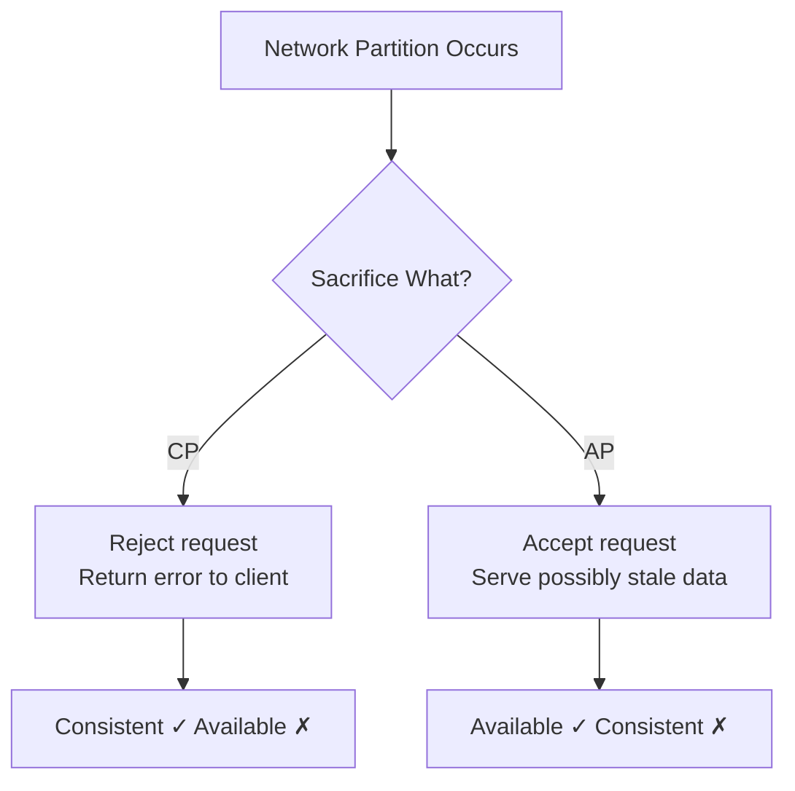
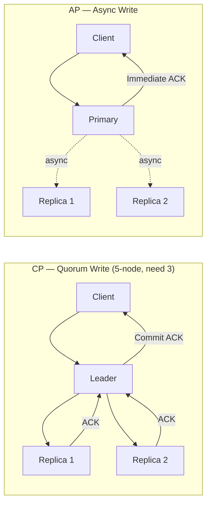
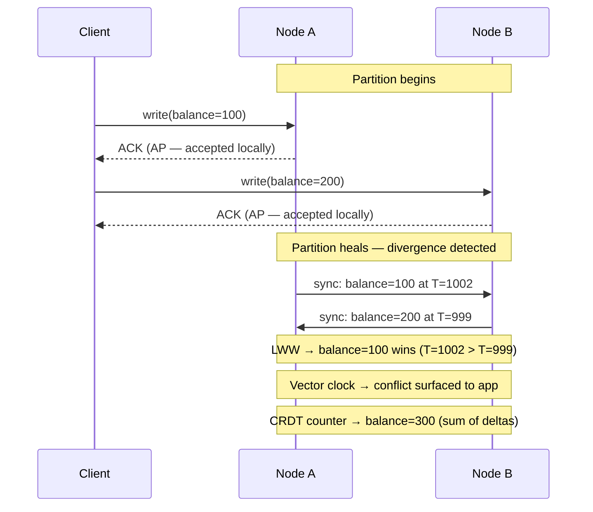
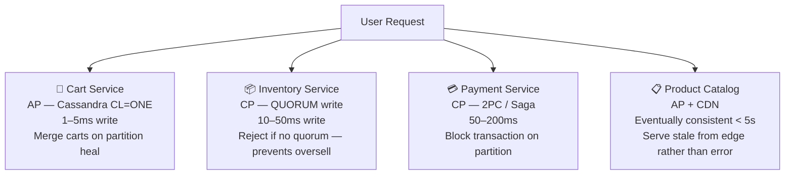

<!-- tldr -->
# CAP Theorem

Formally proved by Gilbert and Lynch in 2002, CAP states that any distributed system exposed to network partitions can guarantee at most two of: **Consistency** (every read returns the most recent write), **Availability** (every non-failing node returns a response), and **Partition Tolerance** (the system operates despite dropped messages). Because partitions are physically unavoidable in any multi-node deployment, the operative choice is always **CP vs AP** — not a free pick of any two. CAP's *C* means **linearizability** — not ACID consistency, not eventual consistency. That distinction costs candidates interviews.

<!-- standard -->

## What It Is

Three properties; one is always present in distributed systems, forcing a trade-off between the other two during failure windows.

- **Consistency (C):** Linearizability — every read reflects the most recently completed write, globally ordered, as if through a single log. Eventual consistency does not qualify.
- **Availability (A):** Every request to a non-failing node returns an actual response — not an error, not a timeout. The response may be stale.
- **Partition Tolerance (P):** The system continues operating when a subset of nodes cannot communicate with another subset.

**Why P is non-negotiable:** Partitions arise from misconfigured firewalls, NIC firmware bugs, switch failures, cloud AZ isolation events, and TCP timeout crossings. In any system spanning more than one machine, they cannot be eliminated — only made rare. A single Postgres node is CA but tolerates no failure and cannot scale. The instant you add a second node, P becomes the constraint you design around.

## CP vs AP — The Core Trade-off

| | CP System | AP System |
|---|---|---|
| Response during partition | Reject writes; return error | Accept writes; risk staleness |
| Write latency (normal ops) | 5–100ms (quorum round-trip) | 1–10ms (local ACK) |
| Data guarantee | Always linearizable | Eventually consistent |
| Examples | ZooKeeper, Spanner, etcd, HBase | Cassandra (CL=ONE), DynamoDB, Riak |

**CP via quorum:** In a 5-node cluster requiring 3 votes, the 2-node minority partition rejects all writes. No inconsistency is possible — the cost is hard unavailability for that side until the network heals.

**AP via async replication:** A write is ACKed after landing on one node; replicas catch up in the background within milliseconds to seconds. During a partition, both sides independently accept writes, creating divergent state requiring post-heal reconciliation.

**Tunable consistency** (Cassandra, DynamoDB) lets you set consistency level per-request. Cassandra with `QUORUM` reads + `QUORUM` writes on RF=3 behaves as CP. `ONE` on both is AP. The rule: `R + W > N` guarantees strong consistency.

**PACELC extends CAP** to normal operation: *Even without a Partition, systems trade Latency vs Consistency.* Google Spanner and ZooKeeper are **PC/EC** — always consistent, always slower. DynamoDB and Cassandra are **PA/EL** — available and low-latency first. Since partitions represent < 0.01% of uptime, PACELC describes the everyday reality more usefully than CAP.

<!-- deep -->

## Deep Dive

### Quorum Mathematics

For a cluster of N nodes, quorum Q = ⌊N/2⌋ + 1.

| Cluster Size | Quorum Needed | Faults Tolerated | Typical Use |
|---|---|---|---|
| 3 nodes | 2 | 1 | Small services, low cost |
| 5 nodes | 3 | 2 | Standard production |
| 7 nodes | 4 | 3 | Critical financial systems |

**Overlap rule for strong consistency:** `R + W > N` guarantees that at least one node in every read set witnessed the latest write. For RF=3: `QUORUM(2) + QUORUM(2) = 4 > 3` ✓. `ONE(1) + QUORUM(2) = 3`, which is *not* strictly greater than 3 — a common misconfiguration that silently breaks consistency guarantees.

### Conflict Resolution in AP Systems

AP systems allow concurrent writes to diverged replicas. Three reconciliation strategies exist:

#### Strategy 1: Last-Write-Wins (LWW)
Each write carries a timestamp; highest wins on merge. Simple and fast, but clock skew of even 600ms can silently discard the causally correct write with no error surfaced. **Mitigation:** Hybrid Logical Clocks (HLC) combine physical time with a per-node logical counter, bounding effective skew to < 1ms.

#### Strategy 2: Vector Clocks
Track causal history per replica. `[N1=1, N2=0]` vs `[N1=0, N2=1]` — neither dominates, so a true conflict is surfaced explicitly. The application (or user) resolves. Used in DynamoDB's original 2007 design. Adds storage overhead proportional to the number of replicas; Amazon later moved to simpler approaches at scale.

#### Strategy 3: CRDTs (Conflict-Free Replicated Data Types)
Data structures whose merge operation is commutative, associative, and idempotent — replicas always converge to the same state regardless of merge order.

- **G-Set (grow-only):** `{Alice, Bob} ∪ {Charlie} = {Alice, Bob, Charlie}` — always correct.
- **CRDT Counter:** Replica 1 adds +5, Replica 2 adds +3 → merged result is always 8.
- **OR-Set:** Supports removes without conflicts via unique tags per element.

Used by: Redis (CRDT enterprise mode), Riak DT, Automerge (collaborative editors). Limitation: not every data type has a clean CRDT formulation — arbitrary relational data does not.

### Real-World Systems at a Glance

| System | CAP | PACELC | Write Latency P99 | Mechanism |
|---|---|---|---|---|
| ZooKeeper / etcd | CP | PC/EC | 5–50ms | Zab / Raft quorum |
| Google Spanner | CP | PC/EC | 10–100ms | TrueTime + Paxos |
| HBase | CP | PC/EC | 5–20ms | HDFS + ZooKeeper |
| MongoDB (w=majority) | CP | PC/EC | 10–100ms | Raft-based replication |
| Cassandra (CL=ONE) | AP | PA/EL | 1–5ms | Gossip + async hinted handoff |
| DynamoDB (default) | AP | PA/EL | 5–20ms | Eventually consistent replication |
| Riak | AP | PA/EL | 1–10ms | Vector clocks + read-repair |
| Redis (with replicas) | AP | PA/EL | < 1ms | Async replication |

### Hybrid Architecture: CP and AP Side-by-Side

No large production system is uniformly CP or AP. The correct pattern assigns a consistency model per component, based on business consequence of failure.

**E-commerce breakdown:**
- **Cart (AP):** No financial harm from a 1-second stale item list; cart merges (union of items) are a valid CRDT-style resolution. Never block the user.
- **Inventory (CP):** Overselling is irreversible. Reject the reservation if quorum is unavailable — the user retries. A short error is far cheaper than a fulfillment crisis.
- **Payment (CP):** Double charges cannot be undone programmatically. Use distributed sagas or 2PC; block until all parties confirm. P99 of 200ms is acceptable.
- **Catalog (AP):** Prices propagate in < 5s. A 2-second stale price displayed to a browsing user is indistinguishable from a fresh one.

### Failure Modes to Know

- **CP minority partition stays hard-down.** A 5-node cluster where 2 nodes are isolated rejects all writes until quorum is restored. If quorum nodes co-locate in one AZ that goes offline for 20 minutes, your service is offline for 20 minutes.
- **AP split-brain with LWW causes silent data loss.** Both partitions accept writes; the one with the larger physical clock wins on merge. The other write disappears with no error logged.
- **Prolonged replication lag misread as consistency.** Cassandra's gossip-based repair works on a 10-second default cycle. Under heavy write load, replication lag can exceed 10s, widening the inconsistency window far beyond what operators expect.
- **Quorum misconfiguration.** Setting `W=ONE, R=QUORUM` on RF=3 gives `1 + 2 = 3`, which is not `> 3`. Reads will frequently miss the latest write. This failure is silent in staging and catastrophic in production.

### Capacity and Latency Numbers

| Scenario | Latency |
|---|---|
| Intra-DC quorum write (3-node Raft) | 5–20ms P99 |
| Cross-region quorum write (Spanner) | 10–100ms P99 |
| Single-node AP write (Cassandra CL=ONE) | 1–5ms P99 |
| Partition detection via heartbeat miss | 30s–5min |
| Intra-DC async replication lag | < 100ms typical |
| Cross-region async replication lag | 50–500ms typical |

### Interview Pitfalls

1. **"I'll design this as CA."** There is no CA distributed system. A single-node system is CA; it tolerates no failures and cannot scale. Any two-node system must handle P. This answer ends the interview.
2. **Confusing CAP-C with ACID-C.** CAP consistency = linearizability (ordering of reads and writes across nodes). ACID consistency = a transaction moves the database between valid states. Different properties, same letter, common trap.
3. **"AP means the system is inconsistent."** AP means *eventually consistent*. With sub-100ms replication and CRDTs, the practical inconsistency window is imperceptible. Frame it correctly.
4. **One consistency model for the entire system.** Saying "we use Cassandra so we're AP" for a payment service is an immediate red flag. Real designs are CP where correctness is non-negotiable and AP elsewhere.
5. **Not mentioning PACELC.** Partitions are rare. Bringing up PACELC — and the everyday latency vs. consistency trade-off — signals operational depth that separates senior from mid-level candidates.

### Decision Rubric: CP vs AP per Component

| Question | CP | AP |
|---|---|---|
| Can stale data cause irreversible financial harm? | Yes | No |
| Can conflicts be reconciled after the fact? | No | Yes — merge / CRDT |
| Is "service unavailable" acceptable? | Yes — user retries | No — must always respond |
| Write latency SLO? | < 50ms achievable | < 10ms requires async |
| Write-heavy, multi-region? | Low-write, few regions | High-write, global |

**When to reach for CP:** Financial ledgers, inventory reservations, distributed locks, leader election, counters where double-counting is unacceptable, any write whose incorrect duplication cannot be unwound.

**When to reach for AP:** Shopping carts, social feeds, view and like counts, session tokens, product catalogs, any data where a 1–5 second stale window is indistinguishable from fresh to the user or reconcilable by the system.

**The senior engineer's framing:** CAP is not a property of your database — it is a per-write-path decision. For each operation, answer explicitly: *"If this node cannot reach quorum right now, do I return an error or return my best current answer?"* That answer must be driven by business consequence, quantified and signed off by the product team — not defaulted to by whichever database was already in the stack.